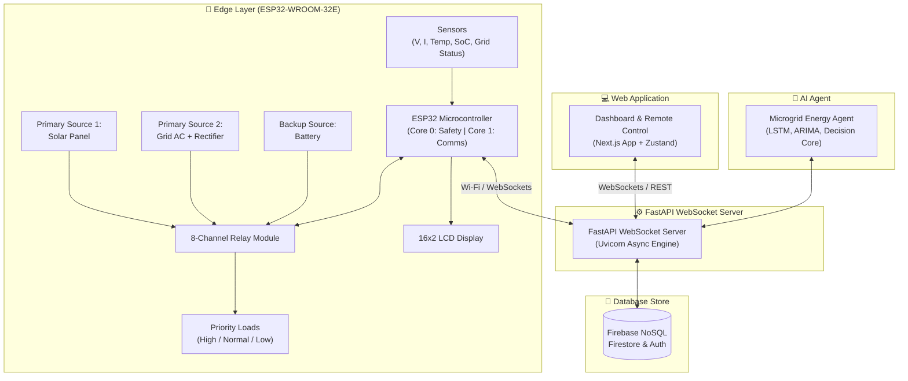

# ⚡ GridFlowX — Project Overview

## Smart AI-Driven Microgrid Management and Automation System

**Document ID:** `DOC-01`
**Version:** 2.0
**Last Updated:** June 2026
**Classification:** Product Requirements Document (PRD) · Executive Overview · Recruiter Portfolio
**Maintained By:** Platform Architecture Team

---

## 📋 Purpose

This document serves as the **primary Product Requirements Document (PRD)** and executive overview for the GridFlowX platform. It defines the problem domain, market gaps, engineering objectives, stakeholder personas, strategic sustainability alignment, and high-level architectural narrative.

## 🎯 Scope

This document covers:

- Vision, mission, and strategic objectives
- Problem–solution mapping for distributed energy resource (DER) management
- Target user personas and stakeholder benefit analysis
- High-level system architecture narrative
- UN Sustainable Development Goals (SDG) alignment
- Technical constraints, assumptions, and external dependencies

**Out of Scope:** Low-level implementation code, API schemas, database DDLs, firmware pin maps, and ML model hyperparameters. These are covered in their respective documents (`04_System_Architecture.md`, `05_Agentic_AI_Model.md`, `Hardware.md`, etc.).

## 🔗 Dependencies

| Dependency | Version | Purpose | Fallback |
| --- | --- | --- | --- |
| ESP32-WROOM-32E | Rev. 3+ | Edge controller | None (hardware) |
| Firebase SDK | v10.x | Real-time database & Authentication | Offline buffer (degraded) |
| FastAPI | >=0.111.0 | Core WebSocket server & backend API | Local backup service |
| Python | 3.11+ | AI Agent, LSTM, and ARIMA execution | Offline local rules |
| OpenWeatherMap API | v2.5 | Solar irradiance proxy | Historical average fallback |

## 📌 Assumptions

- Network connectivity is available for cloud features; edge fallback handles outages gracefully
- Solar irradiance data is supplemented by OpenWeatherMap API (cloud cover proxy)
- Firebase Firestore is the system of record for all user actions, configurations, and telemetry
- All operator actions require authentication via Firebase Auth (no anonymous control access)
- Browser clients support modern TLS 1.3 and WebSocket protocols
- The 12V DC bus architecture is used for prototyping scale; industrial scaling is documented in `Hardware_Spec.md`

## ⚠️ Constraints

- AI inference pipeline assumes a maximum 50ms round-trip budget for edge-to-decision latency
- Telemetry logging rate must match the database write limitations; buffered at edge if necessary
- ESP32 flash memory limits total firmware to <4MB
- WebSocket telemetry is throttled to 1Hz at the frontend to prevent DOM thrashing
- Hardware failsafe loop requires deterministic <10ms response time on FreeRTOS Core 0

---

## 🌟 Executive Summary & Recruiter Highlights

> **GridFlowX** is a production-grade, full-stack, cyber-physical AI platform that automates intelligent energy routing, renewable generation maximization, battery lifecycle protection, and predictive hardware maintenance across local microgrids. It represents a complete engineering transition from legacy static-rule energy management systems to self-healing, AI-driven, edge-cloud hybrid networks.

### 🚀 Key Engineering Highlights

| Highlight | Technical Detail |
| --- | --- |
| **Unified Microgrid Energy AI Agent** | Python-based intelligent agent using Rule-Based Decision Engine, LangGraph, or Reinforcement Learning. Incorporates Solar Forecast Tool (LSTM), Load Forecast Tool (ARIMA), Battery Analysis, Fault Detection, and Energy Optimization. |
| **FastAPI WebSocket Backend** | Single, unified FastAPI WebSocket Server acting as the central real-time routing hub between edge firmware, AI agent, database store, and the dashboard frontend. |
| **Sub-10ms Hardware Failsafe** | Dedicated FreeRTOS Core 0 task on ESP32 runs a 100Hz deterministic safety loop. Overcurrent and thermal cutoffs operate independently of cloud connectivity or server availability. |
| **Tri-Source Power Router** | Autonomously manages Solar PV, Battery storage, and municipal grid fallback across an 8-Channel Relay Module with 3-tier prioritized load shedding (High, Normal, Low priority loads). |
| **Full Security Stack** | Firebase Authentication for user credentials and role-based access controls, Firebase Security Rules protecting Firestore data, and secure token-based WebSocket connection handshakes. |
| **Production-Ready DevOps** | FastAPI microservice deployed on cloud containers, Next.js App hosted on Firebase App Hosting, and Firestore NoSQL database store with automatic scaling. |

---

## 🎯 Mission & Vision

### Mission Statement

> To build a resilient, decentralized microgrid controller that automates energy distribution by bridging high-speed edge hardware with cloud-based predictive AI — ensuring affordable, safe, and uninterrupted renewable power delivery.

### Vision Statement

> To enable smart buildings, industrial zones, and remote communities to operate **autonomous micro-utilities** that actively reduce carbon footprints, minimize grid strain, and maintain localized self-sufficiency during macro-grid failures.

---

## 📐 High-Level System Architecture



---

## 📋 Problem Statement & Market Gaps

Modern electrical grids and localized distributed energy resources (DERs) suffer from structural inefficiencies that compromise cost-efficiency and physical lifespan. GridFlowX directly solves five core problems:

### Problem–Solution Matrix

| # | Core Challenge | Industry Impact | GridFlowX Engineering Solution |
| --- | --- | --- | --- |
| 1 | **Solar Generation Volatility** | Voltage sags, frequency deviations, unstable DC bus | Multi-Task Transformer predicts 1-hour ahead solar yield; pre-positions battery charge before cloud transients |
| 2 | **Peak-Hour Utility Cost Inflation** | 300–400% tariff spikes 3PM–7PM | RL Decision Core discharges battery during peak-rate windows; tracks real-time tariff schedule |
| 3 | **Accelerated Battery Degradation** | Up to 40% lifespan reduction | SoC envelope enforcement (20%–90%), temperature-aware PWM current limits, low-voltage cutoff |
| 4 | **Rigid Load Shedding** | Critical infrastructure disconnected indiscriminately | 3-tier prioritized load matrix: Critical (never shed), Important (SoC-triggered), Flexible (multi-factor) |
| 5 | **Fragmented Telemetry & Cloud Dependency** | Complete failure during network outages | Edge FreeRTOS state machines + TFLite Micro fallback; unified operator console |

```
┌──────────────────────────────────────────────────────────────────────────┐
│                        LEGACY RIGID MICROGRID                            │
│  [Solar Variation] ──► [Unstable Bus] ──► [Deep Discharge] ──► [Decay]   │
│  [Grid Peak Hour]  ──► [Tariff Inflation] ──► [No Load Management]       │
└──────────────────────────────────┬───────────────────────────────────────┘
                                   │ GridFlowX REPLACES THIS
                                   ▼
┌──────────────────────────────────────────────────────────────────────────┐
│                       GridFlowX SELF-HEALING ROUTER                         │
│  [Transformer Forecast] ──► [Pre-charge Battery] ──► [Optimal Discharge] │
│  [Peak Tariff Hour]     ──► [Shed Tier 3 Load]   ──► [Sub-10ms Cutoff]   │
│  [Anomaly Detected]     ──► [Isolate Branch]     ──► [Notify Operator]   │
└──────────────────────────────────────────────────────────────────────────┘
```

---

## 🎯 Objectives

| # | Objective |
| --- | --- |
| 1 | **Build autonomous tri-source router:** ESP32 controller with 8-channel relay matrix routes solar PV, battery, and grid power to a common 12V DC bus with < 100ms failsafe latency. |
| 2 | **Implement predictive forecasting:** Multi-Task Transformer encoder produces 1-hour ahead solar irradiance (MAE ≤ 12%) and load demand predictions enabling proactive battery positioning and peak-hour cost avoidance. |
| 3 | **Enable intelligent load management:** 3-tier priority shedding system automatically disconnects low-priority loads during battery stress, preserving critical operations. |
| 4 | **Deploy ML-driven fault detection:** Anomaly detection head identifies incipient faults (e.g., capacitor degradation); triggers predictive maintenance alerts with 24–48 hour lead time. |
| 5 | **Deliver full-stack platform:** Next.js dashboard + FastAPI WebSocket server + AI Agent provides real-time monitoring, historical analytics, operator controls, and database sync. |
| 6 | **Guarantee edge resilience:** System operates autonomously when cloud disconnected; buffers telemetry; replays commands upon reconnection. |

### Expected Outcomes

| Metric | Target | Achievement Path |
| --- | --- | --- |
| **MPPT Conversion Efficiency** | 94–97% | Circuit-level optimization; real-time PWM duty adjustment |
| **Bidirectional DC-DC Efficiency** | 92–95% | Temperature-aware switching frequency; input current limiting |
| **Relay Failsafe Response Time** | < 100 ms | Hardware watchdog; GPIO interrupt pre-staging; debounce logic |
| **UAEO Solar Forecast MAE** | ≤ 12% | Encoder-decoder architecture; cloud cover sequence learning |
| **UAEO Load Forecast MAPE** | ≤ 8% | Seasonal decomposition; external regressor (time-of-day, day-of-week) |
| **Anomaly Detection Precision** | ≥ 92% | Isolation forest thresholding; domain-expert tuning |
| **UAEO Inference Latency** | < 50 ms | FastAPI WebSocket routing; model inference pipeline |
| **Dashboard Real-Time Latency** | < 200 ms | Direct WebSocket communication; Firestore cache optimization |
| **Edge Autonomy Duration** | ∞ (until SoC < 5%) | Local state machine; offline data buffering; graceful degradation |

---

## 👥 Target Users & Stakeholder Benefits

### User Personas

| Persona | Role | Primary Goals | Access Level |
| --- | --- | --- | --- |
| **Grid Operator** | Manages daily microgrid operations | Monitor live telemetry, execute manual overrides, respond to alerts | Operator |
| **System Administrator** | Configures safety thresholds and manages users | Edit setpoints, manage RBAC accounts, review audit trails | Admin |
| **Compliance Auditor** | Reviews system history for regulatory compliance | Query historical telemetry, export audit logs | Auditor |
| **Field Technician** | Maintains physical hardware | Read sensor diagnostics, verify calibration coefficients | Auditor / Operator |

### Stakeholder Segments

#### 1. Residential Microgrids (Homeowners)

- **Use Case:** Homes with rooftop solar + Li-ion backup battery packs
- **Benefit:** Automated bill minimization, critical appliance continuity during outages, 40% battery lifespan extension

#### 2. Smart Campus & Small Industrial Nodes

- **Use Case:** Academic institutions, research labs, small fabrication facilities
- **Benefit:** Multi-kW solar bank management, machine scheduling aligned to generation peaks, immutable safety audit trails

#### 3. Remote / Off-Grid Micro-Utilities

- **Use Case:** Agricultural pumps, communication relay towers, rural health clinics
- **Benefit:** Self-healing fault isolation without maintenance personnel; high uptime through local edge intelligence

---

## 🌍 UN SDG Alignment

| SDG | Goal | GridFlowX Contribution |
| --- | --- | --- |
| **SDG 7** | Affordable and Clean Energy | Maximizes solar self-consumption; reduces carbon-heavy grid imports |
| **SDG 9** | Industry, Innovation, Infrastructure | Decentralized intelligent edge router strengthens local energy infrastructure |
| **SDG 12** | Responsible Consumption | Extends battery lifespan; reduces e-waste through optimized charging profiles |
| **SDG 13** | Climate Action | Displaces fossil-fuel grid imports; tracks and reports carbon displacement metrics |

---

## 📐 Architecture Notes

- **Edge-Cloud Hybrid:** The system operates in a fully autonomous mode at the edge (ESP32 + FreeRTOS) while leveraging cloud intelligence (FastAPI WebSocket Server + AI Agent) when network connectivity is available. This ensures zero-downtime operation even during internet outages.
- **Unified FastAPI Backend:** A single, lightweight FastAPI WebSocket Server manages real-time, bi-directional telemetry and command distribution, minimizing overall platform complexity and latency.
- **Firebase Database Store:** Firebase NoSQL (Firestore) provides real-time data sync, document-based security, and zero-maintenance scaling for telemetry, config, user data, and system configurations.

## 👨‍💻 Developer Notes

- Start with `ProjectStructure.md` for repository layout and coding conventions
- The root `package.json` provides concurrent startup scripts for both Node.js and Python services
- All environment variables are documented in `.env.example` files per service
- The firmware requires Arduino IDE 2.0+ with ESP32 board support package installed

## 🏆 Recruiter & Portfolio Notes

> **For Engineering Recruiters:** GridFlowX demonstrates mastery across the full engineering stack — embedded C++ firmware, real-time WebSocket communication, FastAPI async routing, Next.js state management with Zustand, Firebase NoSQL and Auth integration, cloud-hosted microservice deployments, and robust security policies. The AI Agent features specific forecasting tools (LSTM/ARIMA), battery analysis, fault detection, and energy optimization logic — designed to handle microgrid energy routing autonomously.

**Key differentiators vs. typical portfolio projects:**

- Real cyber-physical hardware integration (not simulated)
- Direct real-time WebSocket streaming between ESP32 firmware and FastAPI backend
- Custom AI Agent integrating multiple analytical tools (LSTM, ARIMA) and decision strategies (Rule-Based, LangGraph, RL)
- Fully serverless database storage using Firebase Firestore with fine-grained Security Rules
- Clean cloud architecture separating hosting, API runtime, and edge controllers

---

## ✅ Best Practices

1. **Edge-First Design:** Always ensure the edge controller can operate autonomously. Cloud features enhance, not enable, core functionality.
2. **Defense in Depth:** Security is implemented at every layer — TLS on wire, Firebase ID Tokens for auth, RBAC for authorization, Firestore Security Rules for data access, immutable logs for audit.
3. **Graceful Degradation:** When components fail, the system sheds capabilities in priority order while maintaining critical safety functions.
4. **Observability by Default:** Every service exposes Prometheus metrics, structured logs, and health check endpoints.

## 🔮 Future Enhancements

- Multi-node mesh networking for campus-scale deployments
- Integration with utility-scale SCADA systems via Modbus TCP/IEC 61850
- Federated learning across multiple GridFlowX installations
- Mobile companion app (React Native) for field technicians
- Carbon credit tracking and automated reporting

## 🗺️ Related Documents

| Document | Purpose |
| --- | --- |
| `02_Features_and_Functionality.md` | Detailed feature specifications and operational scenarios |
| `03_Tech_Stack.md` | Complete technology stack with engineering justifications |
| `04_System_Architecture.md` | Detailed architecture diagrams and service communication flows |
| `05_Agentic_AI_Model.md` | UAEO architecture, AI tools, decision layer, output configurations |
| `Hardware_Spec.md` | ESP32 pin maps, sensor specs, 8-channel relay module configuration |
| `10_Authentication.md` | Firebase Authentication integration and role-based permissions |
| `20_Deployment.md` | Cloud service setup, Firebase Hosting, database deployment |
| `ProjectStructure.md` | Repository layout, coding conventions, module responsibilities |
