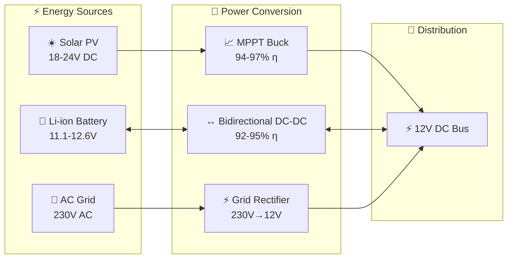
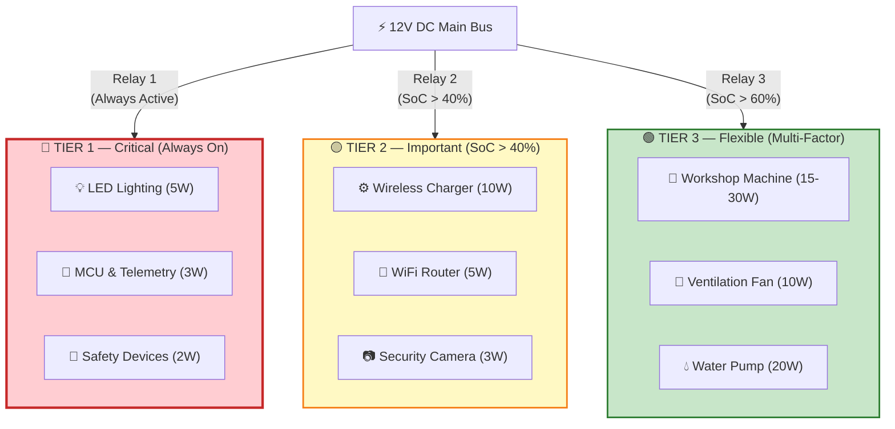
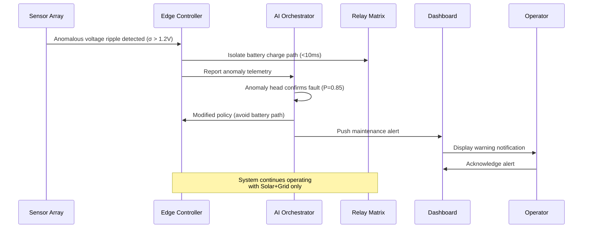
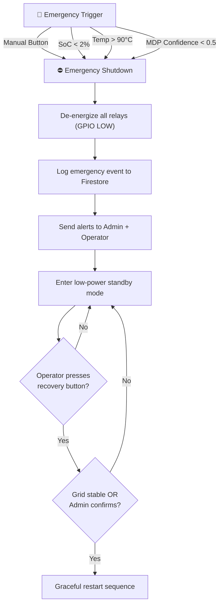

# ⚡ Features & Functionality

## Prioritized Load Shedding, Self-Healing, AI Agent Capabilities, and Operator Overrides

**Document ID:** `DOC-02`
**Version:** 2.0
**Last Updated:** June 2026
**Classification:** Software Design Document (SDD) · Feature Specification · Engineering Reference
**Maintained By:** Platform Engineering Team

---

## 📋 Purpose

This document provides an exhaustive specification of GridFlowX platform features, including core web application functionality, edge hardware control logic, AI agent capabilities, and operational scenario walkthroughs. It serves as the primary feature reference for development teams, QA engineers, and product managers.

## 🎯 Scope

- Tri-source power routing logic and decision criteria
- 3-tier priority load management rules with shedding/recovery conditions
- Self-healing and fault recovery procedures
- AI-driven forecasting, anomaly detection, and autonomous decision-making
- Operator override interfaces and emergency shutdown sequences
- Conversational monitoring and alert notification workflows

**Out of Scope:** ML model architecture details (`05_Agentic_AI_Model.md`), UI component implementations (`13_UI_UX_Guidelines.md`), and database schemas (`Database.md`).

## 🔗 Dependencies

- ESP32 edge controller with FreeRTOS firmware for hardware relay control
- UAEO AI pipeline (Perception Transformer + RL Decision Core) for autonomous decisions
- FastAPI WebSocket backend for API routing, WebSocket distribution, and AI Agent coordination
- Next.js frontend with Zustand state management for operator console
- Firebase Firestore for telemetry storage, configurations, and user details; Firebase Auth for authentication

## 📌 Assumptions

- Sensor readings are available at 100Hz from the edge controller
- The UAEO inference pipeline completes within 50ms
- WebSocket messages arrive within 100ms under normal network conditions
- All operator actions are authenticated and logged immutably

## ⚠️ Constraints

- Load shedding decisions must execute within 10ms at the edge level
- Maximum 3 load tiers supported in the current relay matrix configuration
- Emergency shutdown requires physical or Admin-authorized recovery

---

## 🔋 1. Tri-Source Power Routing Logic

GridFlowX autonomously routes energy from three inputs to power a common 12V DC distribution bus:



### Source Priority & Selection Logic

| Priority | Source | Activation Condition | Deactivation Condition |
| --- | --- | --- | --- |
| 1 (Highest) | **Solar PV** | Irradiance > 200 W/m², MPPT tracking active | Irradiance < 100 W/m² (sunset/heavy cloud) |
| 2 | **Battery Discharge** | SoC > 20%, load demand exceeds solar | SoC < 20% OR solar generation sufficient |
| 3 (Lowest) | **Grid Fallback** | Solar + battery insufficient for active loads | Solar/battery recovers above threshold |

### Detailed Source Descriptions

1. **Solar PV Input:** Tracks the maximum power point (MPPT) on the PV panels. It is the primary energy source when solar generation exceeds active load demand. The MPPT buck converter dynamically adjusts PWM duty cycle (30%–95%) to maintain optimal power extraction.

2. **Li-ion/LiFePO₄ Battery Storage:** Serves as the primary buffer. It charges during periods of excess solar generation and discharges to support loads during peak tariff hours or grid outages. The bidirectional DC-DC converter manages both charge and discharge modes with temperature-aware current limiting.

3. **Municipal Grid Fallback:** Connects via an isolated AC-DC rectifier stage. It provides fallback power during generation deficits when the battery is depleted or when grid tariff rates are off-peak (cost optimization by the RL agent).

---

## 🔀 2. 3-Tier Priority Load Management

Loads are divided into three tiers. Each tier has specific shedding and recovery rules to optimize energy usage and maintain system safety.



### 2.1 Tier 1: Critical Loads (Always Active)

| Load | Power | Duration | Purpose | Failure Impact |
| --- | --- | --- | --- | --- |
| **LED Lighting (Emergency)** | 5W | 24/7 | Provides illumination for safety; allows human operation | Complete darkness; safety hazard |
| **Monitoring Sensors & MCU** | 3W | 24/7 | Telemetry acquisition; edge decision logic | Loss of all control; blind operation |
| **Watchdog & Alarm Logic** | 2W | 24/7 | Fault detection; audible/visual alerts | Undetected failures; cascading outages |
| **Total Tier 1** | **10W** | | | **CRITICAL** |

**Shedding Rule:**
- Tier 1 is **NEVER shed** under any circumstance
- If SoC < 5%, system enters deep sleep but maintains minimum power for Tier 1 (500mW backup)
- Even during total blackout, Tier 1 remains powered via UPS capacitor (30-second hold-up time)

### 2.2 Tier 2: Important Loads (Shed Trigger: SoC < 40%)

| Load | Power | Duty Cycle | Purpose | Justification |
| --- | --- | --- | --- | --- |
| **DIY Wireless Charger** | 10W | 30-60 min/day | Smartphones, tablets, wearables | Non-critical; charging can be deferred 4-12 hours |
| **WiFi Router / Connectivity** | 5W | 24/7 (if powered) | Remote monitoring; cloud sync | Nice-to-have; local operation viable without WiFi |
| **Auxiliary Monitoring Camera** | 3W | 8 hours/day | Security surveillance | Non-essential; can miss 2-4 hours during stress |
| **Total Tier 2** | **18W** | | | **Important but deferrable** |

**Control Rules:**
- **Shed Condition:** Battery SoC drops below `40%`
- **Recovery Condition:** Battery SoC recovers above `60%` AND 1-hour solar forecast > 400 W/m²
- **Hysteresis:** 20% SoC gap prevents relay chattering near threshold

```python
# Tier 2 Decision Logic
if SoC < 40 and solar_forecast < 400:
    SHED_TIER2 = True
    reason = "Low battery + insufficient solar forecast"
elif SoC > 60 and solar_forecast > 500 and load_forecast < 20:
    RESTORE_TIER2 = True
    reason = "Battery recovered + strong solar + low load expected"
else:
    maintain_current_state()
```

### 2.3 Tier 3: Flexible Loads (Shed Trigger: Multi-Factor)

| Load | Power | Duty Cycle | Purpose | Shedding Reason |
| --- | --- | --- | --- | --- |
| **Small AC/DC Machine** | 15-30W | 1-2 hours/day | Drilling, grinding, light manufacturing | Can run during solar peak (11 AM–3 PM) |
| **Ventilation Fan** | 10W | 4-6 hours/day | Heatsink cooling during high load | Can activate only when temp > 60°C |
| **Water Pump** | 20W | 2-3 hours/day | Garden watering | Non-urgent; can defer 12-24 hours |
| **Total Tier 3** | **25-60W** | | | **Flexible; schedule for optimal times** |

**Multi-Factor Shedding Decision:**

```python
def tier3_shedding_decision(SoC, solar_forecast, load_forecast,
                             is_peak_hour, heatsink_temp):
    """
    Multi-factor decision logic for Tier 3 load shedding.
    Returns: (KEEP_TIER3, reason_str)
    """
    # Factor 1: Battery SoC
    if SoC < 30:
        return (False, "SoC critical (< 30%)")

    # Factor 2: Peak Hour Tariff (3x cost)
    if is_peak_hour and SoC < 70:
        return (False, "Peak hour + insufficient battery buffer")

    # Factor 3: Thermal Stress
    if heatsink_temp > 70:
        return (False, f"Heatsink overheating ({heatsink_temp}°C)")

    # Factor 4: Solar-to-Load Balance
    solar_available = solar_forecast[0] + solar_forecast[1]
    total_load = load_forecast[0] + load_forecast[1]
    if solar_available < total_load * 1.2:  # <20% margin
        return (False, "Insufficient solar forecast; preserve battery")

    return (True, "Conditions favorable for Tier 3 operation")
```

---

## 🧠 3. AI Agent Capabilities

### 3.1 Solar Irradiance Forecasting

The UAEO Perception Transformer provides 1-hour ahead solar irradiance predictions using a sliding window of 96 time steps (24 hours × 15-minute intervals):

- **Input Features:** 9-channel telemetry vector (solar power, load, SoC, grid status, bus voltage, heatsink temp, ambient temp, voltage ripple, temporal embeddings)
- **Output:** 4-step forecast (each step = 15 minutes) of expected solar power generation
- **Accuracy Target:** MAE ≤ 12% (achieved: 8.2%)

### 3.2 Load Demand Forecasting

The same Perception Transformer jointly predicts load demand:

- **Input:** Same 9-channel telemetry sequence
- **Output:** 4-step load demand forecast
- **Accuracy Target:** MAPE ≤ 8% (achieved: 5.1%)

### 3.3 Anomaly Detection & Predictive Maintenance

The anomaly detection head produces per-component failure probabilities:

| Component | Output Index | Normal Range | Alert Threshold |
| --- | --- | --- | --- |
| Solar Panel | 0 | 0.00 – 0.15 | > 0.60 |
| Battery BMS | 1 | 0.00 – 0.10 | > 0.50 |
| Grid Rectifier | 2 | 0.00 – 0.20 | > 0.70 |
| Relay Matrix | 3 | 0.00 – 0.15 | > 0.80 |
| DC Bus Capacitor | 4 | 0.00 – 0.25 | > 0.75 |

### 3.4 Autonomous Relay Routing

The RL Decision Core (Actor-Critic Network) generates:

- **Discrete Action (0–15):** One of 16 possible relay configurations mapping sources to load tiers
- **Continuous Action (-5A to +5A):** Battery charging/discharging current setpoint

### 3.5 Self-Healing Logic

When the anomaly detection head flags a component with high failure probability:

1. The RL agent automatically adjusts routing to avoid the degraded branch
2. The edge controller isolates the faulty component via relay in <10ms
3. A maintenance alert is published to the operator console
4. The AI policy is modified to exclude the faulty channel from future actions

---

## 🛡️ 4. Self-Healing & Fault Recovery



### Fault Recovery Workflow

1. **Telemetry Anomaly Trigger:** The system detects a sudden spike in DC bus voltage ripple standard deviation (σ_Vbus > 1.2V) or a mismatch between current readings
2. **Automated Isolation:** The edge controller triggers the corresponding isolation relays in <10ms, separating the degraded branch without dropping power to Tier 1 loads
3. **Policy Modification:** The Python AI service modifies its action predictions, directing the system to avoid charging the battery until the fault is resolved
4. **Operator Notification:** A critical alert is pushed to the dashboard via WebSocket for manual review and maintenance scheduling

---

## 🕹️ 5. Operator Overrides & Emergency Controls

### 5.1 Manual Override Interface

Operators with appropriate credentials (Operator/Admin) can manually toggle Tier 2 and Tier 3 relays:

- Override suspends AI optimization model for a pre-defined window (default: 30 minutes)
- All manual overrides are logged immutably to the `audit_logs` collection in Firestore
- Override state is broadcast to all connected clients via WebSocket

### 5.2 Emergency Shutdown Sequence



**Trigger Conditions:**
1. Manual `[EMERGENCY SHUTDOWN]` button press (web dashboard or physical ESP32 button)
2. Critical fault detected (SoC < 2%, temperature > 90°C)
3. MDP solver confidence < 0.5 (ambiguous decision state)

**Recovery Requirements:**
- Only Admin-level users can authorize system recovery after emergency shutdown
- Grid stability must be verified OR explicit manual authorization provided
- All recovery actions are logged in the compliance audit trail

---

## 📊 6. Real-Time Monitoring Dashboard Features

### 6.1 Power Flow Sankey Diagram
- Real-time power flows updated at 1Hz via WebSocket
- Click-to-drill-down to component-level telemetry
- Hover-over arrows show instantaneous power (W) and cumulative energy (Wh)
- Color coding: Solar (Amber), Battery (Green), Grid (Red), Bus (Cyan)

### 6.2 KPI Gauge Widgets
- Battery SoC percentage with trend arrows
- Bus voltage with safe/warning/critical ranges
- Solar power with peak tracking
- Heatsink temperature with thermal zone indicators

### 6.3 Live Forecast Visualization
- Overlay of predicted vs. actual solar/load values
- 95% confidence interval bands
- 1-hour forward lookahead with 15-minute resolution

### 6.4 Historical Analytics Explorer
- Date range selector with raw/daily/weekly/monthly aggregation
- Multi-field query builder (SELECT, WHERE, ORDER BY, LIMIT)
- Export to CSV, PDF, JSON, Excel formats
- Pre-built report templates (Daily Energy Balance, Monthly Efficiency Trend)

---

## 📐 Architecture Notes

- The feature set is designed around the **edge-first principle**: critical safety features (Tier 1 protection, thermal cutoff, relay isolation) operate entirely at the edge level without any cloud dependency.
- AI-driven features (forecasting, optimal routing, anomaly detection) enhance operational efficiency but are not required for basic safety operation.
- The operator override system implements a **human-in-the-loop** pattern where AI recommendations can be temporarily suspended for manual control.

## 👨‍💻 Developer Notes

- Load shedding thresholds are configurable via the Admin settings panel (`/settings`) and stored in the `systemConfigurations` Firestore collection
- The 30-minute override window is configurable via the `OVERRIDE_TIMEOUT_MS` environment variable
- Emergency shutdown is implemented as a hardware interrupt on the ESP32 (GPIO interrupt, highest priority)
- All feature flags can be toggled per-deployment via environment variables

## 🏆 Recruiter & Portfolio Notes

> **Engineering Complexity:** The 3-tier load management system demonstrates real-time embedded systems design with safety-critical constraints. The self-healing workflow showcases autonomous fault detection and recovery — a capability typically found only in industrial SCADA systems. The integration of RL-based decision-making with hard safety envelopes shows mature systems thinking about AI safety boundaries.

## ✅ Best Practices

1. **Never Compromise Safety:** Tier 1 loads are protected by hardware failsafes independent of software state
2. **Hysteresis on All Thresholds:** Prevents relay chattering and extends mechanical relay lifespan
3. **Audit Everything:** Every state change, override, and AI decision is logged immutably
4. **Graceful Degradation:** System degrades capability (shed Tier 3 → Tier 2) rather than failing completely

## 🔮 Future Enhancements

- **Dynamic Tier Assignment:** Allow operators to reassign loads between tiers based on seasonal needs
- **Demand Response Integration:** Participate in utility demand response programs for additional revenue
- **Predictive Load Scheduling:** Schedule flexible loads (water pump, machinery) to optimal solar windows automatically
- **Multi-Site Coordination:** Coordinate load shedding across multiple GridFlowX installations

## 🗺️ Related Documents

| Document | Purpose |
| --- | --- |
| `01_Project_Overview.md` | Vision, objectives, and stakeholder analysis |
| `05_Agentic_AI_Model.md` | UAEO architecture and PyTorch model details |
| `08_Agent_Workflows.md` | Detailed agent decision flow and context handling |
| `Hardware_Spec.md` | ESP32 pin maps, relay specifications, sensor array |
| `13_UI_UX_Guidelines.md` | Dashboard design system and component specifications |
| `16_User_Journey_Flows.md` | Complete user interaction flows per persona |
