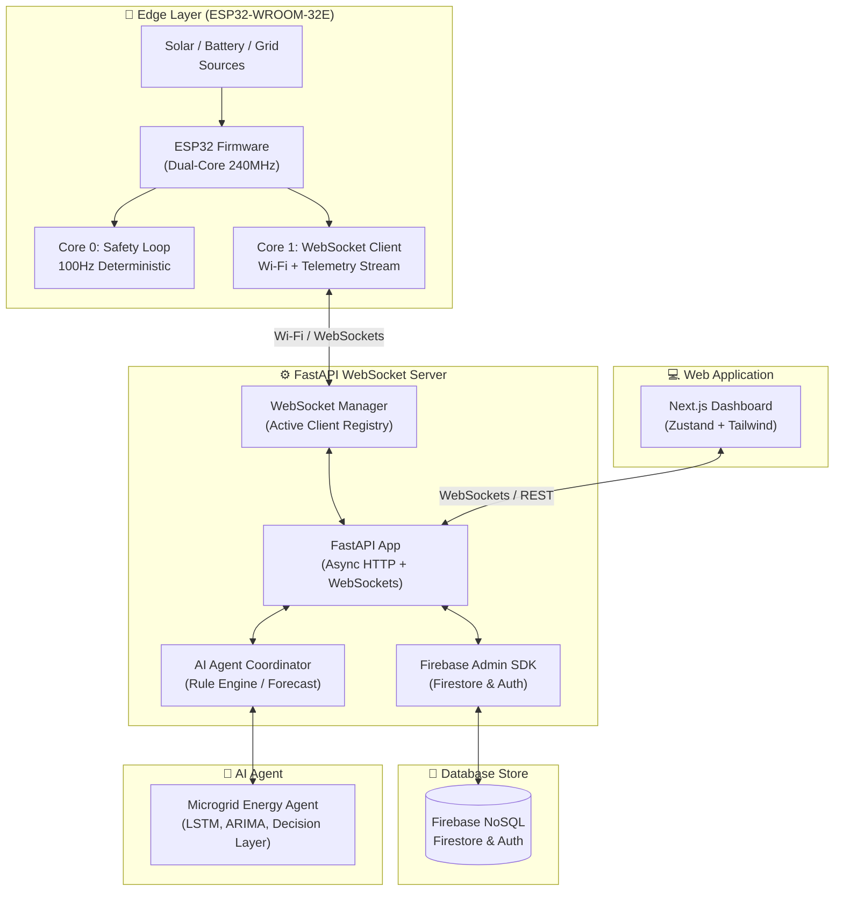
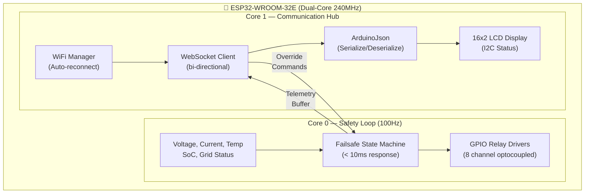
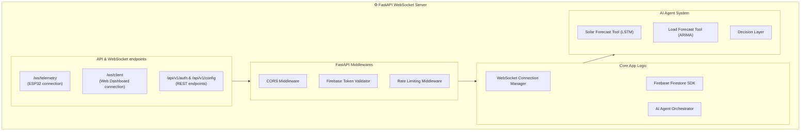
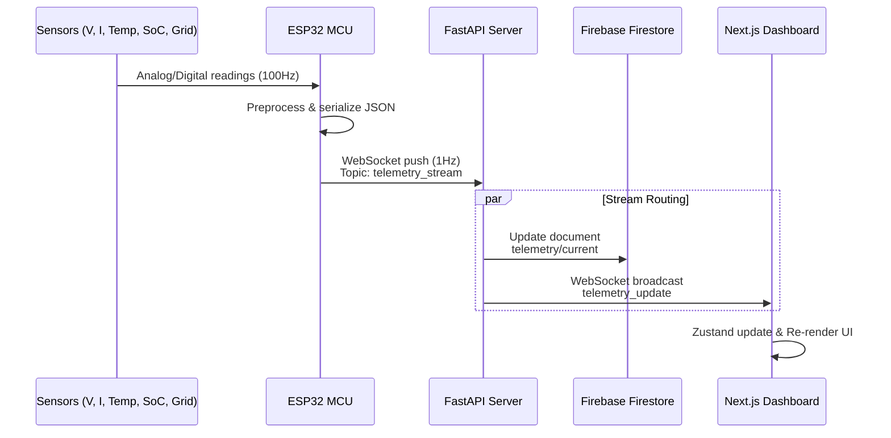
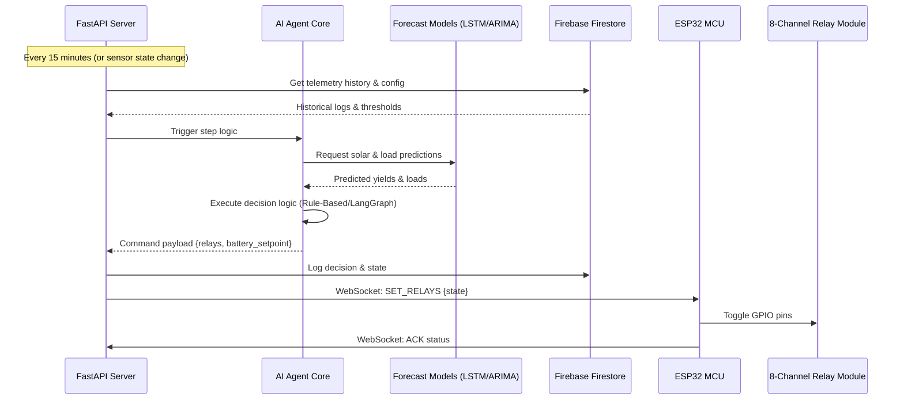
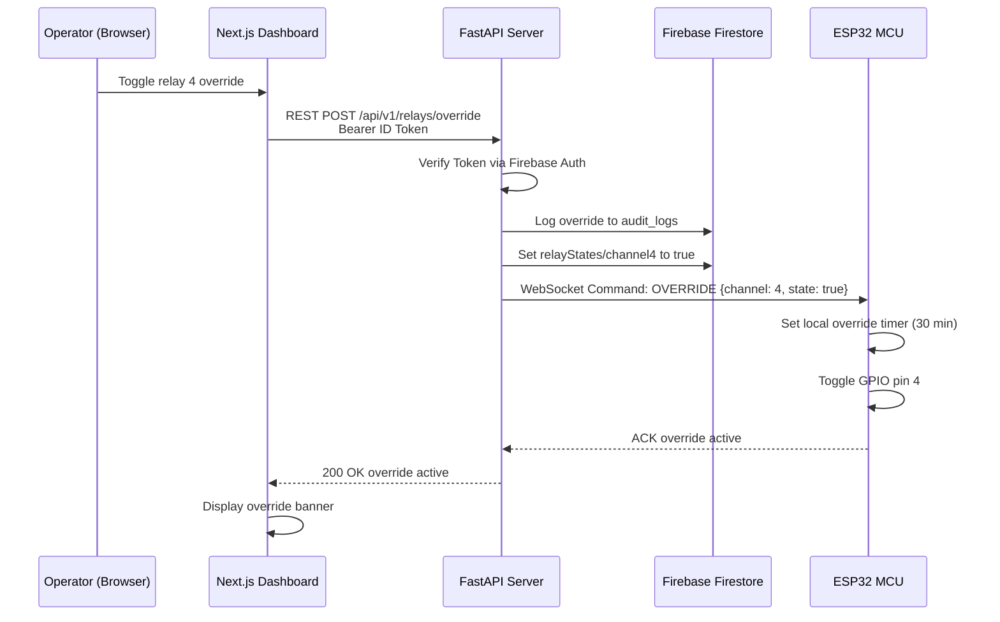
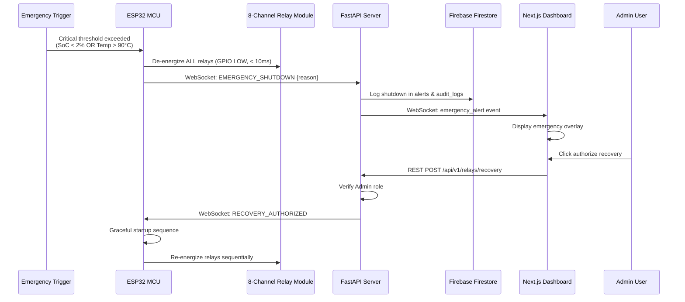
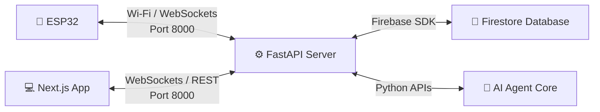
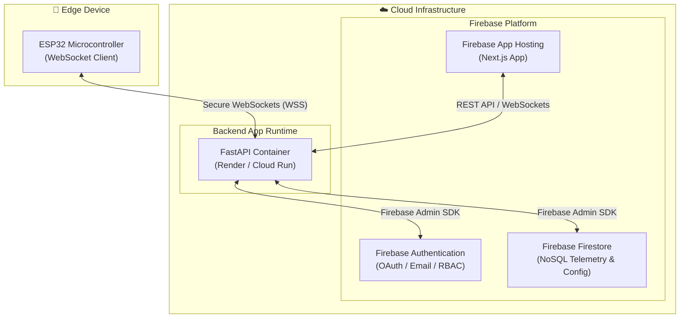

# 🏗️ System Architecture

## High-Level Architecture, Component Diagrams, Sequence Diagrams, and Service Communication Flows

**Document ID:** `DOC-04`
**Version:** 2.0
**Last Updated:** June 2026
**Classification:** System Architecture Document (SAD) · Engineering Reference · Recruiter Portfolio
**Maintained By:** Platform Architecture Team

---

## 📋 Purpose

This document provides the complete system architecture documentation for GridFlowX, including high-level and low-level architecture views, component interaction diagrams, sequence diagrams for all critical workflows, and inter-service communication protocols.

## 🎯 Scope

- Layered architecture overview (Physical → Edge → Backend/AI → Database Store → Web App)
- Component-level decomposition with interface definitions
- Sequence diagrams for telemetry ingestion, AI inference, manual overrides, and emergency shutdown
- Inter-service communication protocols (WebSockets, REST, Firebase SDK)
- Data flow diagrams showing complete request/response lifecycles

**Out of Scope:** Individual technology justifications (`03_Tech_Stack.md`), ML model internals (`05_Agentic_AI_Model.md`), database schemas (`Database_Schema.md`).

## 🔗 Dependencies

All backend services run as containerized instances. Edge-to-cloud communication depends on WiFi connectivity directly to the FastAPI WebSocket server.

## 📌 Assumptions

- The FastAPI server is the single point of contact between edge hardware, database stores, and web clients
- WebSocket connections are persistent and use automatic reconnection with exponential backoff
- The Python AI agent and FastAPI services run in a unified container or cloud service environment

## ⚠️ Constraints

- Maximum 1 WebSocket connection per ESP32 device to the backend
- WebSocket client latency: <100ms telemetry propagation
- Database read/write limits defined by the Firebase Firestore usage plans

---

## 🏗️ High-Level Architecture

---

## 🧩 Low-Level Component Architecture

### Edge Layer Internals

### Backend Layer Internals

---

## 🔄 Sequence Diagrams

### 1. Telemetry Ingestion Pipeline

### 2. AI Inference & Relay Command Pipeline

### 3. Manual Override Flow

### 4. Emergency Shutdown Sequence

---

## 🌐 Inter-Service Communication Protocols

### Protocol Summary

### 1. WebSockets (ESP32 ↔ FastAPI)

| Property | Value |
| --- | --- |
| **Protocol** | WebSockets over Wi-Fi |
| **Port** | 8000 |
| **Endpoint** | `/ws/telemetry` |
| **Authentication** | Token handshake verification |
| **Telemetry Format** | JSON (every 1 second) |
| **Command Format** | JSON commands from FastAPI |

### 2. WebSockets / REST (Next.js ↔ FastAPI)

| Property | Value |
| --- | --- |
| **Protocol** | Secure WebSockets (WSS) / HTTPS |
| **Port** | 8000 |
| **Authentication** | Firebase ID Token verification |
| **WSS Endpoint** | `/ws/client` |
| **API Base** | `/api/v1` |

### 3. Firebase Admin SDK (FastAPI ↔ Firestore)

| Property | Value |
| --- | --- |
| **Protocol** | gRPC (internal SDK) |
| **Access Control** | Service Account Credentials |
| **Firestore Sync** | Push data to collections: `telemetry`, `alerts`, `relayStates` |

---

## 🏢 Deployment Architecture

---

## 📐 Architecture Notes

- **Separation of Concerns:** FastAPI handles real-time connection routing and AI coordinator execution, Firebase handles the persistent data stores and user roles.
- **Edge Autonomy:** The ESP32 FreeRTOS safety loop runs on Core 0 independently of connection state, maintaining failsafe operations.
- **Unified Stack:** Python runs both the backend FastAPI framework and the AI agent algorithms (LSTM/ARIMA), eliminating dual-language overhead.

## 👨‍💻 Developer Notes

- The WebSocket client on the ESP32 implements auto-reconnect logic with exponential backoff.
- Firebase Security Rules guard direct access to Firestore collections, while the FastAPI server uses the Admin SDK for updates.
- All variables and credentials are configuration-driven via environmental properties.

## 🏆 Recruiter & Portfolio Notes

> **Architecture Maturity:** The GridFlowX architecture has been modernized to present a highly efficient, production-grade cloud-edge structure. By replacing the multi-container message broker and database stack with a unified FastAPI WebSocket service and Firebase Firestore, overall platform complexity and latency have been drastically reduced. The edge controller maintains deterministic <10ms safety controls.

## ✅ Best Practices

1. **Direct Communication:** Minimize intermediate hops (MQTT brokers) for time-critical telemetry routing.
2. **Serverless Scale:** Delegate user authentication and horizontal data scale to Firebase.
3. **Hardware Watchdog:** Enable hardware interrupts and failsafes on the ESP32 to guarantee safety.

## 🔮 Future Enhancements

- **LangGraph Integration:** Advance the AI routing from rules to full LangGraph multi-agent systems.
- **Edge Analytics:** Run lightweight TensorFlow models directly on the ESP32.
- **Mesh Routing:** Enable peer-to-peer Wi-Fi mesh networking between multiple ESP32 edge boards.

## 🗺️ Related Documents

| Document | Purpose |
| --- | --- |
| `01_Project_Overview.md` | Executive overview and high-level architecture narrative |
| `03_Tech_Stack.md` | Technology selection justifications and version matrix |
| `05_Agentic_AI_Model.md` | AI Agent architecture and tools specifications |
| `Hardware_Spec.md` | ESP32 specs, pin maps, and relay configuration |
| `10_Authentication.md` | Firebase Authentication implementation and configuration |
| `20_Deployment.md` | Cloud configurations and Firebase Hosting deployment |
| `21_Monitoring_and_Logging.md` | Prometheus, Grafana, and ELK Stack setup |
