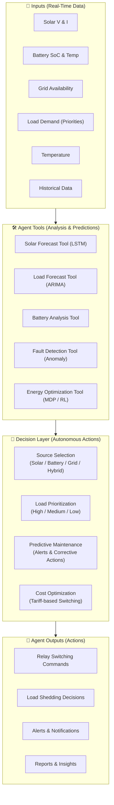

# 🧠 Agentic AI Model Design

## Unified Agentic Energy Orchestrator (UAEO) — Multi-Model Orchestration, Reasoning, and Decision Flow

**Document ID:** `DOC-05`
**Version:** 2.0
**Last Updated:** June 2026
**Classification:** Software Design Document (SDD) · AI Architecture Reference · Recruiter Portfolio
**Maintained By:** AI Systems Architecture Team

---

## 📋 Purpose

This document provides the complete AI system design for the GridFlowX Unified Agentic Energy Orchestrator (UAEO). It covers the multi-task perception engine, reinforcement learning decision core, reward formulations, ONNX deployment pipeline, and edge fallback strategy.

## 🎯 Scope

- UAEO architecture overview and design rationale
- PyTorch implementation of the Perception Transformer and Decision Core
- Multi-task learning with shared representations
- Reward function formulation and optimization objectives
- ONNX serialization and production deployment
- TFLite Micro edge fallback for offline operation

**Out of Scope:** Training data collection (`06_Data_Collection_and_Preprocessing.md`), hyperparameter tuning (`07_Model_Training_and_FineTuning.md`), ethical considerations (`09_AI_Ethics_and_Governance.md`).

## 🔗 Dependencies

| Dependency | Version | Purpose |
| --- | --- | --- |
| PyTorch | 2.0+ | Model definition, training, and ONNX export |
| Stable-Baselines3 | 2.0+ | PPO/SAC RL algorithm implementation |
| ONNX Runtime | 1.16+ | Optimized CPU inference in production |
| TensorFlow Lite Micro | 2.x | Edge inference on ESP32 |
| NumPy | 1.24+ | Tensor manipulation and preprocessing |
| MLflow | 2.x | Model versioning and experiment tracking |

## 📌 Assumptions

- Telemetry data is available as a continuous 96-step sliding window (24 hours × 15-minute intervals)
- The 9-feature input vector is pre-normalized using MinMaxScaler
- ONNX Runtime CPU is the primary inference target (GPU optional)
- The RL agent is trained in simulation before deployment to real hardware

## ⚠️ Constraints

- Total inference latency must be < 50ms (perception + decision)
- ESP32 TFLite model size must be < 500KB after int8 quantization
- The perception transformer must produce outputs for all 3 task heads in a single forward pass
- RL action space is fixed at 16 discrete configurations + 1 continuous setpoint

---

## 🔮 Microgrid Energy Agent Architecture

The AI Agent acts as the central brain of the microgrid system, managing real-time inputs and orchestrating automated control decisions.



### Agent Technology Options

GridFlowX supports three developmental options for the Microgrid Energy Agent:

#### Option 1 (Recommended): Rule-Based Agent
- **Stack:** Python, FastAPI, Decision Engine, LSTM, ARIMA
- **Description:** A deterministic rule-based switching engine utilizing LSTM for 1-hour solar yield prediction and ARIMA for load forecasting. Highly reliable, explainable, and suitable for production.

#### Option 2 (Advanced): LangGraph Agent
- **Stack:** ESP32, FastAPI, LangGraph, Firebase
- **Description:** An agentic workflow framework built on LangGraph. Organizes microgrid tasks into state graphs with specialized node agents, leveraging Firebase for real-time state sync.

#### Option 3 (Research-Level): Reinforcement Learning Agent
- **Stack:** Python, Stable-Baselines3, PyTorch, ONNX
- **State Space:** Solar + Battery + Load telemetry
- **Action Space:** Source Switching relays & charging currents
- **Reward Function:** Min Cost + Max Reliability + Min Emissions
- **Description:** An end-to-end actor-critic deep RL policy optimized for long-term energy savings and lifecycle preservation. The implementation details of this option are documented below.


## 🔢 PyTorch Implementations

### 1. Perception Transformer

The perception module processes a sequence of length T=96 (24 hours of telemetry in 15-minute intervals) with N=9 features:

1. **Solar Power (P_solar)**
2. **Load Power (P_load)**
3. **Battery State of Charge (SoC)**
4. **Grid Connection Status**
5. **Bus Voltage (V_bus)**
6. **Heatsink Temperature (T_heatsink)**
7. **Ambient Temperature (T_ambient)**
8. **Voltage Ripple Standard Deviation (σ_Vbus)**
9. **Temporal Embeddings (Hour of day, Day of week)**

```python
import torch
import torch.nn as nn

class UnifiedPerceptionTransformer(nn.Module):
    def __init__(self, input_dim=9, d_model=64, nhead=4, num_layers=3,
                 seq_len=96, forecast_horizon=4):
        """
        Unified Multi-Task Time-Series Transformer.
        Jointly forecasts solar irradiance, load consumption,
        and predicts hardware faults.

        Args:
            input_dim: Number of telemetry features per timestep
            d_model: Transformer hidden dimension
            nhead: Number of attention heads
            num_layers: Number of transformer encoder layers
            seq_len: Input sequence length (96 = 24h × 15min intervals)
            forecast_horizon: Output forecast steps (4 = 1 hour)
        """
        super().__init__()
        self.seq_len = seq_len
        self.d_model = d_model

        # Project telemetry features to transformer model dimension
        self.input_projection = nn.Linear(input_dim, d_model)

        # Learnable positional embeddings for sequence order
        self.pos_encoder = nn.Parameter(torch.zeros(1, seq_len, d_model))

        # Transformer encoder layers
        encoder_layer = nn.TransformerEncoderLayer(
            d_model=d_model,
            nhead=nhead,
            dim_feedforward=d_model * 4,
            dropout=0.1,
            batch_first=True
        )
        self.transformer_encoder = nn.TransformerEncoder(
            encoder_layer, num_layers=num_layers
        )

        # Task-Specific Heads
        # Head 1: Solar Irradiance Forecasting (next 1 hour / 4 steps)
        self.solar_head = nn.Sequential(
            nn.Linear(d_model * seq_len, 128),
            nn.LayerNorm(128),
            nn.ReLU(),
            nn.Linear(128, forecast_horizon)
        )

        # Head 2: Load Demand Forecasting (next 1 hour / 4 steps)
        self.load_head = nn.Sequential(
            nn.Linear(d_model * seq_len, 128),
            nn.LayerNorm(128),
            nn.ReLU(),
            nn.Linear(128, forecast_horizon)
        )

        # Head 3: Hardware Anomaly & Degradation
        # Components: [Solar Panel, Battery BMS, Grid Rectifier,
        #              Relay Matrix, DC Bus Capacitor]
        self.anomaly_head = nn.Sequential(
            nn.Linear(d_model * seq_len, 64),
            nn.LayerNorm(64),
            nn.ReLU(),
            nn.Linear(64, 5),
            nn.Sigmoid()  # Failure probabilities [0.0, 1.0]
        )

    def forward(self, telemetry_seq):
        """
        Forward pass through the perception engine.

        Args:
            telemetry_seq: [batch_size, seq_len, input_dim]

        Returns:
            solar_pred: [batch_size, forecast_horizon]
            load_pred: [batch_size, forecast_horizon]
            anomaly_scores: [batch_size, 5]
            flat_encoded: [batch_size, d_model * seq_len]
        """
        # 1. Project features and add positional encoding
        x = self.input_projection(telemetry_seq) + self.pos_encoder

        # 2. Extract shared temporal features
        encoded = self.transformer_encoder(x)
        flat_encoded = encoded.reshape(encoded.size(0), -1)

        # 3. Compute multi-task outputs
        solar_pred = self.solar_head(flat_encoded)
        load_pred = self.load_head(flat_encoded)
        anomaly_scores = self.anomaly_head(flat_encoded)

        return solar_pred, load_pred, anomaly_scores, flat_encoded
```

### 2. Reinforcement Learning Decision Core

```python
class AgenticDecisionCore(nn.Module):
    def __init__(self, encoder_dim=6144, state_dim=5,
                 action_dim_discrete=16, action_dim_continuous=1):
        """
        Actor-Critic Decision Core for Microgrid Control.

        Inputs:
            flat_encoded: representation tokens from perception
                         transformer (d_model * seq_len = 64 * 96)
            current_state: current physical values
                          [SoC, grid_status, heatsink_temp,
                           voltage, active_overrides]

        Outputs:
            relay_logits: logits for 16 routing configurations
            bat_mean: Gaussian mean for battery current setpoint
            bat_log_std: Gaussian log std for exploration
            state_value: critic state value V(s)
        """
        super().__init__()

        # Combines temporal feature tokens and current physical states
        self.feature_combiner = nn.Sequential(
            nn.Linear(encoder_dim + state_dim, 256),
            nn.LayerNorm(256),
            nn.ReLU()
        )

        # Policy Head: Discrete relay configurations
        self.actor_discrete = nn.Sequential(
            nn.Linear(256, 128),
            nn.ReLU(),
            nn.Linear(128, action_dim_discrete)
        )

        # Policy Head: Continuous battery charge/discharge setpoint
        self.actor_continuous = nn.Sequential(
            nn.Linear(256, 128),
            nn.ReLU(),
            nn.Linear(128, action_dim_continuous * 2)
        )

        # Value Head: Critic evaluates state value V(s)
        self.critic = nn.Sequential(
            nn.Linear(256, 128),
            nn.ReLU(),
            nn.Linear(128, 1)
        )

    def forward(self, flat_encoded, current_state):
        combined_features = torch.cat(
            [flat_encoded, current_state], dim=-1
        )
        shared_rep = self.feature_combiner(combined_features)

        # Compute policy outputs
        relay_logits = self.actor_discrete(shared_rep)

        battery_params = self.actor_continuous(shared_rep)
        bat_mean, bat_log_std = torch.chunk(battery_params, 2, dim=-1)
        bat_log_std = torch.clamp(bat_log_std, -20, 2)

        # Compute state value baseline
        state_value = self.critic(shared_rep)

        return relay_logits, bat_mean, bat_log_std, state_value
```

### 3. Model Parameter Summary

| Component | Parameters | Memory (FP32) | Memory (INT8) |
| --- | --- | --- | --- |
| Input Projection | 9 × 64 + 64 = 640 | 2.5 KB | 0.6 KB |
| Positional Encoding | 96 × 64 = 6,144 | 24 KB | 6 KB |
| Transformer Encoder (3 layers) | ~150,000 | 586 KB | 147 KB |
| Solar Head | ~789,000 | 3.0 MB | 770 KB |
| Load Head | ~789,000 | 3.0 MB | 770 KB |
| Anomaly Head | ~394,000 | 1.5 MB | 384 KB |
| Feature Combiner | ~1,576,000 | 6.0 MB | 1.5 MB |
| Actor Discrete | ~18,000 | 70 KB | 18 KB |
| Actor Continuous | ~16,500 | 64 KB | 16 KB |
| Critic | ~16,500 | 64 KB | 16 KB |
| **Total UAEO** | **~3.76M** | **~14.3 MB** | **~3.6 MB** |

---

## 📈 Reward Formulations

The RL agent optimizes control paths using a composite reward function R_t:

**R_t = w_cost × R_cost + w_health × R_health + w_load × R_load + w_safety × R_safety**

### 1. Cost Avoidance (R_cost)

**R_cost = −(P_grid × Tariff(t))**

Forces the agent to discharge the battery or shed load when grid electricity rates are peak. The tariff schedule is provided as an external signal (time-of-use pricing).

### 2. Battery Health (R_health)

**R_health = −w_deg × |I_battery| × 𝟙(SoC < 20% or SoC > 90%)**

Penalizes high current draws at extreme States of Charge to mitigate electrochemical degradation. This teaches the agent to avoid deep discharge cycles and overcharging.

### 3. Load Priority Satisfaction (R_load)

**R_load = Σ p_j × 𝟙(Load_j = ON)**

Where priority coefficients are:
- p₁ = 100.0 (Critical Load — Tier 1)
- p₂ = 10.0 (Important Load — Tier 2)
- p₃ = 1.0 (Flexible Load — Tier 3)

Shedding Tier 1 loads results in a severe penalty (-1000), creating a hard constraint in the policy.

### 4. Safety Constraints (R_safety)

Evaluates electrical and thermal bounds:
- Heatsink temperature > 85°C → penalty = -500
- Voltage ripple > 1.0V → penalty = -200
- SoC < 5% → penalty = -1000

### Weight Configuration

| Weight | Default Value | Tuning Range | Effect |
| --- | --- | --- | --- |
| w_cost | 1.0 | 0.5 – 2.0 | Higher = more aggressive cost avoidance |
| w_health | 2.0 | 1.0 – 5.0 | Higher = more conservative battery usage |
| w_load | 5.0 | 1.0 – 10.0 | Higher = prioritizes load satisfaction over cost |
| w_safety | 10.0 | 5.0 – 20.0 | Higher = more conservative safety margins |

---

## 🔄 Real-Time Execution Loop

```python
import numpy as np

class UAEORealTimeOrchestrator:
    def __init__(self, perception_model, decision_model, safety_thresholds):
        self.perception = perception_model
        self.decision = decision_model
        self.thresholds = safety_thresholds

    def step(self, telemetry_history, current_state):
        """
        Executes a single control and planning step in real time.
        Target latency: < 35ms
        """
        seq_tensor = torch.FloatTensor(telemetry_history).unsqueeze(0)
        state_tensor = torch.FloatTensor(current_state).unsqueeze(0)

        with torch.no_grad():
            # 1. Perception Step (12.5ms)
            solar_forecast, load_forecast, fault_probs, flat_encoded = \
                self.perception(seq_tensor)

            # 2. Decision Step (8.2ms)
            relay_logits, bat_mean, _, _ = \
                self.decision(flat_encoded, state_tensor)

            # 3. Action Selection
            discrete_action = torch.argmax(relay_logits, dim=-1).item()
            battery_current = torch.tanh(bat_mean).item() * 5.0

        relay_config = self.decode_relay_action(discrete_action)

        # 4. Failsafe Override Checks
        relay_config, battery_current = self.apply_failsafe_envelope(
            relay_config, battery_current,
            current_state, fault_probs.numpy()[0]
        )

        return {
            "relay_commands": relay_config,
            "battery_setpoint_amps": battery_current,
            "predictions": {
                "solar_forecast_w": solar_forecast.numpy()[0].tolist(),
                "load_forecast_w": load_forecast.numpy()[0].tolist(),
                "component_failure_probabilities":
                    fault_probs.numpy()[0].tolist()
            }
        }

    def apply_failsafe_envelope(self, relays, bat_current, state, fault_probs):
        """Hard safety envelope that overrides AI decisions."""
        heatsink_temp = state[2]
        if heatsink_temp > self.thresholds['temp_cutoff']:
            bat_current = 0.0
            relays['mppt_enable'] = False

        relay_fault_prob = fault_probs[3]
        if relay_fault_prob > 0.8:
            relays['tier3_relay'] = False

        return relays, bat_current

    def decode_relay_action(self, action_idx):
        """Decode action index (0-15) to relay configuration flags."""
        return {
            "tier1_relay": True,  # Always on
            "tier2_relay": bool((action_idx >> 0) & 1),
            "tier3_relay": bool((action_idx >> 1) & 1),
            "mppt_enable": bool((action_idx >> 2) & 1),
            "grid_fallback": bool((action_idx >> 3) & 1)
        }
```

---

## 🚀 ONNX Deployment & Edge Fallback

### 1. ONNX Export Pipeline

```python
# Export perception transformer to ONNX
dummy_input = torch.randn(1, 96, 9)
torch.onnx.export(
    perception_model,
    dummy_input,
    "perception_transformer.onnx",
    input_names=["telemetry_seq"],
    output_names=["solar_pred", "load_pred", "anomaly_scores", "encoded"],
    dynamic_axes={"telemetry_seq": {0: "batch_size"}},
    opset_version=13
)
```

### 2. ONNX Runtime Inference

```python
import onnxruntime as ort

session = ort.InferenceSession("perception_transformer.onnx")
outputs = session.run(None, {"telemetry_seq": input_array})
```

### 3. TFLite Micro Edge Fallback

For local edge execution when internet connectivity is lost:
1. PyTorch model → ONNX → TensorFlow (via onnx-tf) → TFLite → int8 quantized
2. The resulting `.tflite` model file is flashed to the ESP32 partition
3. TFLite Micro runtime processes states directly on the edge
4. Maintains priority load-shedding and basic safety loops autonomously

---

## 📐 Architecture Notes

- The transformer uses **learnable positional encodings** rather than sinusoidal because the time-series has fixed length (96 steps) and the model benefits from learning position-specific patterns (e.g., morning solar ramp-up consistently occurs at positions 24-36)
- The **flat encoding** approach (reshape to 6144-dim vector) trades memory efficiency for simplicity; future versions may use attention pooling for variable-length sequences
- The RL agent uses **hybrid action spaces** (discrete + continuous) which requires specialized policy gradient algorithms (PPO with action masking)

## 👨‍💻 Developer Notes

- Model checkpoints are stored in `ai-service/models/` and versioned via MLflow
- The ONNX export process should be run after every training cycle and validated with `onnxruntime.InferenceSession`
- For debugging, set `torch.set_grad_enabled(True)` and use gradient flow analysis to verify task head contributions
- The failsafe envelope is a **hard safety layer** that cannot be disabled by the AI agent

## 🏆 Recruiter & Portfolio Notes

> **AI Engineering Depth:** The UAEO demonstrates custom deep learning architecture design (not off-the-shelf model wrappers). It combines multi-task learning (shared transformer encoder with 3 specialized heads) with reinforcement learning (actor-critic with hybrid action spaces) — a pattern used in advanced robotics and autonomous systems. The ONNX deployment pipeline shows production ML engineering maturity, and the TFLite Micro fallback demonstrates edge AI expertise.

## ✅ Best Practices

1. **Always Maintain Failsafe Envelope:** AI decisions are always filtered through hard-coded safety checks
2. **Version Models:** Every trained model is tagged with training data hash, hyperparameters, and validation metrics
3. **Test Edge Fallback:** Regularly verify TFLite model produces consistent outputs with ONNX version
4. **Monitor Drift:** Track prediction accuracy over time and trigger retraining when drift exceeds thresholds

## 🔮 Future Enhancements

- **Attention Visualization:** Implement attention weight extraction for model interpretability
- **Multi-Agent RL:** Extend to multi-site coordination with cooperative agents
- **Transformer Decoder:** Add autoregressive decoder for longer forecast horizons (6-24 hours)
- **Online Learning:** Implement continual learning with replay buffers for real-time adaptation

## 🗺️ Related Documents

| Document | Purpose |
| --- | --- |
| `06_Data_Collection_and_Preprocessing.md` | Training data sources, feature engineering |
| `07_Model_Training_and_FineTuning.md` | Training algorithms, hyperparameters, loss functions |
| `08_Agent_Workflows.md` | Real-time execution flow, context handling |
| `09_AI_Ethics_and_Governance.md` | Bias mitigation, explainability, compliance |
| `19_Model_Drift_Monitoring.md` | Continuous evaluation and retraining triggers |
