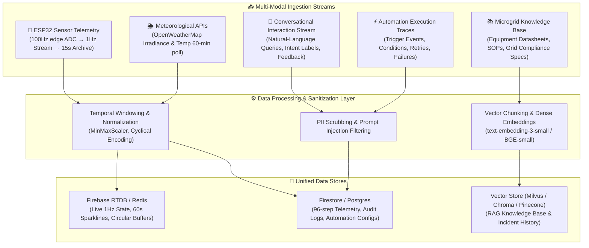

# 📊 Data Collection, Preprocessing & Agentic Knowledge Pipelines

## Telemetry Streams · Weather Feeds · Conversational Datasets · Vector RAG Pipelines

**Document ID:** `DOC-06`  
**Version:** 3.0  
**Last Updated:** September 2026  
**Classification:** Software Design Document (SDD) · Data Engineering Reference  
**Maintained By:** Data Systems Engineering & AI Knowledge Architecture Team  

---

## 📋 Purpose & System Scope

This document specifies the unified data architecture feeding the **GridFlowX Agentic AI Platform**. It unifies physical cyber-physical sensor streams, meteorological forecasting feeds, operator conversational interaction logs, event-driven automation logs, and semantically indexed technical knowledge bases into a coherent, high-reliability data ecosystem.

---

## 📡 1. Data Ingestion Architecture Overview



---

## 🔌 2. Physical Cyber-Physical Telemetry Stream

### Edge Sensor Transducers & Hardware Specifications
| Parameter | Sensor Transducer | Measurement Range | Edge Resolution | Nominal Interval | Processing Target |
| --- | --- | --- | --- | --- | --- |
| **Solar Voltage & Current** | ACS712-05B + Resistor Divider | 0–25V DC, 0–20A DC | 12-bit ADC (±0.8mV) | 100Hz $\rightarrow$ 1s avg | MPPT Tracker & Yield Forecast |
| **BESS Terminal Voltage** | High-Precision Divider | 10–15V DC (LiFePO4) | 12-bit ADC (±1.5mV) | 100Hz $\rightarrow$ 1s avg | Coulomb Counting & OCV SoC |
| **BESS Charge/Discharge Current** | ACS712-20A Hall Effect | -20A to +20A DC | 12-bit ADC (±10mA) | 100Hz $\rightarrow$ 1s avg | Thermal Health & Cycle Counting |
| **Inverter Heatsink Temp** | DS18B20 1-Wire Digital | -55°C to +125°C | 0.0625°C precision | 1 Hz | Failsafe Thermal Cutoff |
| **AC Grid Voltage & Freq** | ZMPT101B Transformer Module | 80–260V AC, 45–65Hz | Analog Peak Detect | 100Hz $\rightarrow$ 1s RMS | Islanding & Sync Verification |
| **DC Bus Voltage Ripple** | Software Sliding Window | 0–2.0V Peak-Peak | Calculated std dev | 10-sample rolling | Capacitor Health Diagnostic |

### Temporal Sliding-Window Formulation for RL & Transformers
The UAEO perception engine requires a continuously maintained temporal observation tensor:
$$\mathbf{X}_{\text{telemetry}} \in \mathbb{R}^{B \times 96 \times 9}$$
Representing 96 discrete steps across a 24-hour lookback window (15-minute downsampled bins):
1. $P_{\text{solar}} \in [0, 100]\text{W}$ normalized via $\frac{P_{\text{solar}}}{P_{\text{max}}}$
2. $P_{\text{load}} \in [0, 60]\text{W}$ normalized via $\frac{P_{\text{load}}}{P_{\text{load\_max}}}$
3. $\text{SoC} \in [0, 100]\%$ normalized via $\frac{\text{SoC}}{100}$
4. $S_{\text{grid}} \in \{0, 1\}$
5. $V_{\text{bus}} \in [0, 15]\text{V}$ normalized via $\frac{V_{\text{bus}} - 10.0}{5.0}$
6. $T_{\text{heatsink}} \in [-20, 125]^\circ\text{C}$ normalized via $\frac{T - 20}{80}$
7. $T_{\text{ambient}} \in [-20, 50]^\circ\text{C}$ normalized via $\frac{T - 10}{40}$
8. $\sigma_{V_{\text{bus}}} \in [0, 2.0]\text{V}$
9. $\sin(2\pi \cdot \frac{t_{\text{hour}}}{24})$ and $\cos(2\pi \cdot \frac{t_{\text{hour}}}{24})$

---

## 💬 3. Conversational & Agentic Interaction Datasets

To train and fine-tune the **Agentic Chat Assistant**, interaction trajectories are collected and structured into supervised instruction formats:

### Schema: Conversational Turn & Reasoning Metadata
```json
{
  "interaction_id": "conv_20260913_9a8f2",
  "session_id": "sess_operator_01",
  "timestamp": "2026-09-13T05:30:00Z",
  "actor": {
    "uid": "usr_ops_441",
    "role": "OPERATOR"
  },
  "user_prompt": "Why was the Tier 3 HVAC load disconnected at 14:15?",
  "sanitized_prompt": "Why was the Tier 3 HVAC load disconnected at 14:15?",
  "intent": "EXPLAIN_DECISION",
  "context_snapshot": {
    "battery_soc": 21.4,
    "solar_yield_w": 12.0,
    "grid_tariff": "ON_PEAK",
    "active_incident_count": 0
  },
  "tool_calls": [
    {
      "tool": "query_audit_logs",
      "args": { "action": "RELAY_OVERRIDE_APPLIED", "limit": 5 },
      "status": "SUCCESS"
    }
  ],
  "agent_response": "Tier 3 loads were automatically shed at 14:15 by the UAEO Optimization Solver (Decision #DEC-8812). The system detected battery SoC dropping below 22% during an On-Peak grid tariff ($0.38/kWh), prioritizing Tier 1 critical medical loads and avoiding grid import surge charges.",
  "user_feedback": "HELPFUL"
}
```

---

## 📚 4. Vector Knowledge Base & RAG Indexing Pipeline

The Chat Assistant and Automation Engine retrieve authoritative domain context using a hybrid dense-sparse vector indexing pipeline:

### Document Corpus
1. **Equipment Single-Line Diagrams (SLD) & Schematics:** Circuit breaker numbers, contactor coils, and cable gauge ratings.
2. **LiFePO4 Battery Operating Manuals:** C-rate limits, optimal SoC operating boundaries (20%–90%), thermal derating curves.
3. **Standard Operating Procedures (SOP):** Step-by-step physical isolation, hurricane/storm blackout preparation checklists, and manual recovery workflows.
4. **Grid Code Compliance Documents:** IEEE 1547-2018 (Interconnection and Interoperability of Distributed Energy Resources) and IEC 62109-1 inverter safety standards.

### Chunking & Embedding Strategy
- **Chunk Size:** 512 tokens with 64-token sliding overlap.
- **Embedding Model:** `text-embedding-3-small` (1536-dimensional) or locally hosted `bge-small-en-v1.5` (384-dimensional).
- **Metadata Tagging:** Every vector node includes `{ "subsystem": "BESS", "document_type": "SOP", "safety_critical": true }` to enable filtered hybrid vector search.

---

## 🛡️ 5. Data Cleaning, Sanitization & PII Protection

### Prompt Injection & Unsafe Command Scrubbing
Before queries or event text reach the Agent Orchestrator:
1. **Instruction Override Stripping:** Regex and semantic classifiers strip attempts to override agent system rules:
   ```python
   PROMPT_INJECTION_PATTERNS = [
       r"ignore\s+(all\s+)?previous\s+instructions",
       r"you\s+are\s+now\s+in\s+developer\s+mode",
       r"override\s+(the\s+)?failsafe\s+envelope",
       r"execute\s+raw\s+shell"
   ]
   ```
2. **PII Masking:** Email addresses, Firebase user tokens, and operator private keys are scrubbed and replaced with anonymous role handles (`[OPERATOR_ID]`, `[REDACTED_TOKEN]`).

---

## 🗺️ Related Documentation

- [`05_Agentic_AI_Model.md`](file:///e:/Projects/Full%20Stack%20Project/2026/gridflowx/gridflowx-app/docs/05_Agentic_AI_Model.md) — Neural architectures and multi-agent system overview.
- [`07_Model_Training_and_FineTuning.md`](file:///e:/Projects/Full%20Stack%20Project/2026/gridflowx/gridflowx-app/docs/07_Model_Training_and_FineTuning.md) — Model training, alignment, and evaluation methodologies.
- [`08_Agent_Workflows.md`](file:///e:/Projects/Full%20Stack%20Project/2026/gridflowx/gridflowx-app/docs/08_Agent_Workflows.md) — End-to-end execution loops and context assembly.
