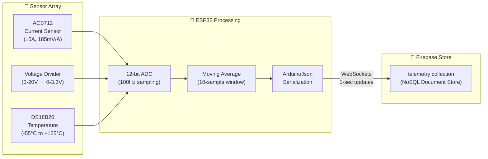
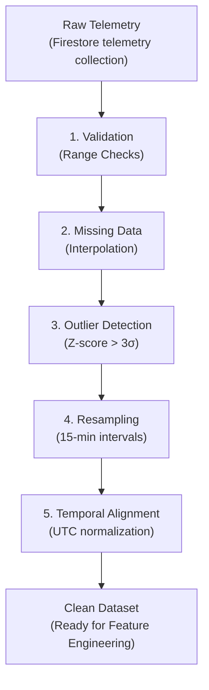

# 📊 Data Collection & Preprocessing

## Sources, Cleaning, Augmentation, Labeling, and Feature Engineering Pipeline

**Document ID:** `DOC-06`
**Version:** 2.0
**Last Updated:** June 2026
**Classification:** Software Design Document (SDD) · Data Engineering Reference
**Maintained By:** AI Systems Architecture Team

---

## 📋 Purpose

This document defines the data collection strategy, preprocessing pipelines, feature engineering methods, and data quality assurance processes that feed the UAEO AI system. It ensures that training data is consistent, correctly normalized, and representative of real-world operating conditions.

## 🎯 Scope

- Data sources (sensor telemetry, external APIs, synthetic generation)
- Data cleaning and validation rules
- Feature engineering and sliding window construction
- Normalization and scaling strategies
- Data augmentation techniques for rare events
- Labeling methodology for supervised and RL training

**Out of Scope:** Model architecture (`05_Agentic_AI_Model.md`), training procedures (`07_Model_Training_and_FineTuning.md`).

## 🔗 Dependencies

- Firebase Firestore for telemetry storage and query execution
- OpenWeatherMap API v2.5 for solar irradiance proxies
- NumPy / Pandas for data manipulation
- Scikit-learn for scaling and validation splitting

## 📌 Assumptions

- Telemetry data is sampled at 15-minute intervals (downsampled from 100Hz edge readings)
- A minimum of 90 days of continuous telemetry is required before initial model training
- Weather API data has < 2-hour lag; historical backfill is available
- Sensor calibration is verified monthly; drift is within ±2% of reference

## ⚠️ Constraints

- Firestore collections scaling and data retention configurations
- OpenWeatherMap free tier limits API calls to 60/minute
- ESP32 ADC resolution is 12-bit (4096 levels), introducing ±0.8mV quantization noise
- Missing data gaps > 4 hours invalidate the training window

---

## 📡 Data Sources

### 1. Edge Sensor Telemetry (Primary)



| Feature | Sensor | Unit | Range | Resolution | Sampling Rate |
| --- | --- | --- | --- | --- | --- |
| `solar_power` | ACS712 × Voltage Divider | W | 0 – 100 | 0.1W | 15 sec |
| `load_power` | ACS712 × Voltage Divider | W | 0 – 60 | 0.1W | 15 sec |
| `battery_soc` | Coulomb counting + OCV | % | 0 – 100 | 0.1% | 15 sec |
| `grid_status` | Relay state + voltage detect | Binary | 0 / 1 | 1 | 15 sec |
| `bus_voltage` | Voltage divider | V | 0 – 15 | 0.01V | 15 sec |
| `heatsink_temp` | DS18B20 | °C | -20 – 125 | 0.0625°C | 15 sec |
| `ambient_temp` | DS18B20 | °C | -20 – 50 | 0.0625°C | 15 sec |
| `voltage_ripple` | Computed (std dev of bus_voltage) | V | 0 – 2 | 0.01V | 15 sec |

### 2. External Weather API (Supplementary)

- **Source:** OpenWeatherMap API v2.5 (`/forecast`)
- **Polling Interval:** Every 60 minutes
- **Fields Ingested:**
  - `clouds.all` (cloud cover %, 0–100)
  - `main.temp` (ambient temperature, °C)
  - `main.humidity` (relative humidity, %)
  - `wind.speed` (wind speed, m/s)
- **Transformation:** Cloud cover and temperature are converted to solar irradiance indicators using a physics-informed regression model

### 3. Synthetic Data (Augmentation)

For rare event training (faults, extreme weather, deep discharge):
- **Gaussian Noise Injection:** ±5% random noise on sensor readings
- **Temporal Shifting:** Shift time-of-day features by ±2 hours to simulate seasonal variation
- **Fault Simulation:** Inject synthetic anomaly signatures (voltage spikes, temperature ramps, current transients) with known labels

---

## 🧹 Data Cleaning Pipeline



### Step 1: Range Validation

| Feature | Valid Range | Invalid Action |
| --- | --- | --- |
| `solar_power` | 0 – 100 W | Clamp to range; flag if > 120W |
| `battery_soc` | 0 – 100 % | Clamp; alert if < 0 or > 100 |
| `bus_voltage` | 8 – 16 V | Flag as sensor fault if outside |
| `heatsink_temp` | -20 – 125 °C | Flag as sensor fault if > 130°C |
| `voltage_ripple` | 0 – 5 V | Clamp; flag if sustained > 2V |

### Step 2: Missing Data Handling

```python
import pandas as pd

def handle_missing_data(df, max_gap_minutes=60):
    """
    Interpolate small gaps; discard windows with large gaps.
    """
    # Forward-fill gaps up to 4 samples (1 hour at 15-min intervals)
    df = df.fillna(method='ffill', limit=4)

    # Linear interpolation for remaining small gaps
    df = df.interpolate(method='linear', limit=4)

    # Mark windows with gaps > max_gap_minutes as invalid
    gap_mask = df.isna().any(axis=1)
    if gap_mask.sum() > 0:
        logging.warning(f"Discarding {gap_mask.sum()} rows with large gaps")
        df = df.dropna()

    return df
```

### Step 3: Outlier Detection

- **Method:** Z-score filtering with a 3σ threshold
- **Window:** Rolling 96-sample (24-hour) window for local statistics
- **Action:** Replace outliers with rolling median value

### Step 4: Resampling

- Raw data arrives at irregular intervals (15 sec ± network jitter)
- Resample to exact 15-minute intervals using mean aggregation
- Ensures consistent input shape for the transformer (T=96)

### Step 5: Temporal Alignment

- All timestamps are normalized to UTC
- Temporal embeddings (hour-of-day, day-of-week) are computed from UTC + local timezone offset

---

## 🔧 Feature Engineering

### Sliding Window Construction

```python
import numpy as np

def create_sliding_windows(data, seq_len=96, forecast_horizon=4):
    """
    Create input-output pairs for transformer training.
    
    Args:
        data: DataFrame with 9 feature columns
        seq_len: Input sequence length (96 = 24 hours)
        forecast_horizon: Output prediction steps (4 = 1 hour)
    
    Returns:
        X: [num_windows, seq_len, 9] input sequences
        y_solar: [num_windows, forecast_horizon] solar targets
        y_load: [num_windows, forecast_horizon] load targets
    """
    X, y_solar, y_load = [], [], []
    
    for i in range(len(data) - seq_len - forecast_horizon):
        window = data.iloc[i : i + seq_len].values
        solar_target = data['solar_power'].iloc[
            i + seq_len : i + seq_len + forecast_horizon
        ].values
        load_target = data['load_power'].iloc[
            i + seq_len : i + seq_len + forecast_horizon
        ].values
        
        X.append(window)
        y_solar.append(solar_target)
        y_load.append(load_target)
    
    return np.array(X), np.array(y_solar), np.array(y_load)
```

### Normalization Strategy

| Feature | Scaler | Fit Range | Rationale |
| --- | --- | --- | --- |
| `solar_power` | MinMaxScaler | [0, 100] W | Bounded physical range |
| `load_power` | MinMaxScaler | [0, 60] W | Bounded by relay capacity |
| `battery_soc` | MinMaxScaler | [0, 100] % | Already a percentage |
| `grid_status` | None | {0, 1} | Binary feature |
| `bus_voltage` | StandardScaler | μ=12, σ=1.5 | Gaussian-distributed |
| `heatsink_temp` | StandardScaler | μ=45, σ=15 | Gaussian-distributed |
| `ambient_temp` | StandardScaler | μ=25, σ=10 | Gaussian-distributed |
| `voltage_ripple` | MinMaxScaler | [0, 2] V | Bounded physical range |
| `temporal` | Cyclical encoding | sin/cos | Preserves cyclical nature |

### Temporal Feature Encoding

```python
def encode_temporal_features(timestamps):
    """
    Convert timestamps to cyclical sin/cos embeddings.
    Preserves the cyclical nature of time-of-day and day-of-week.
    """
    hours = timestamps.hour + timestamps.minute / 60.0
    day_of_week = timestamps.dayofweek

    hour_sin = np.sin(2 * np.pi * hours / 24.0)
    hour_cos = np.cos(2 * np.pi * hours / 24.0)
    dow_sin = np.sin(2 * np.pi * day_of_week / 7.0)
    dow_cos = np.cos(2 * np.pi * day_of_week / 7.0)

    return np.column_stack([hour_sin, hour_cos, dow_sin, dow_cos])
```

---

## 🏷️ Labeling Methodology

### Supervised Labels (Perception Heads)

- **Solar Forecast:** Ground truth is the actual solar power readings at t+1 to t+4 (next hour)
- **Load Forecast:** Ground truth is the actual load power readings at t+1 to t+4
- **Anomaly Labels:** Generated from maintenance logs and known fault events:
  - `0` = Normal operation
  - `1` = Confirmed fault (from maintenance records)
  - Weak labels generated via isolation forest on historical data for pre-training

### Reinforcement Learning Labels

- The RL agent does not use explicit labels — it learns from the reward signal
- Training environments are constructed from historical telemetry sequences
- The environment simulates battery SoC dynamics, solar generation, and load patterns
- Reward function provides continuous feedback (see `05_Agentic_AI_Model.md`)

---

## 🔄 Data Augmentation Techniques

| Technique | Application | Magnitude | Purpose |
| --- | --- | --- | --- |
| **Gaussian Noise** | All continuous features | ±5% | Regularization, sensor noise robustness |
| **Temporal Jitter** | Sliding window start | ±2 samples | Robustness to alignment errors |
| **Cloud Event Injection** | Solar power sequence | 0–100% drop | Rare cloud transient training |
| **Fault Signature Injection** | Voltage ripple + current | Spike patterns | Anomaly detection training |
| **Season Simulation** | Temporal embeddings | ±2 hour shift | Cross-season generalization |

---

## 📐 Architecture Notes

- The 9-feature input vector is designed to capture both electrical state (voltage, current, power) and environmental context (temperature, time). This multi-modal input enables the transformer to learn cross-domain dependencies.
- Cyclical temporal encoding (sin/cos) is preferred over one-hot encoding because it preserves the continuous, periodic nature of time — 23:00 is close to 00:00 in the embedding space.
- The downsampling pipeline (100Hz → 15-min averages) is implemented via FastAPI backend scheduled tasks or Firebase functions to avoid blocking real-time telemetry ingestion.

## 👨‍💻 Developer Notes

- The preprocessing pipeline is implemented in `backend/app/utils/preprocessors.py`
- Scaler objects (fitted MinMaxScaler/StandardScaler) must be saved alongside model checkpoints using joblib
- The sliding window function creates overlapping windows — for a 180-day dataset at 15-min resolution, this produces ~17,000 training samples
- Weather API responses should be cached in-memory (1-hour TTL) to avoid hitting rate limits during batch preprocessing

## 🏆 Recruiter & Portfolio Notes

> **Data Engineering Maturity:** The preprocessing pipeline demonstrates production-grade data engineering practices — range validation, outlier detection, temporal alignment, and domain-specific feature engineering. The cyclical temporal encoding and physics-informed weather-to-irradiance conversion show deep domain knowledge. The data augmentation strategy for rare fault events addresses a common challenge in industrial ML applications.

## ✅ Best Practices

1. **Validate Before Training:** Always run the full cleaning pipeline before model training
2. **Version Data Alongside Models:** Record the data hash, date range, and preprocessing parameters with every model checkpoint
3. **Monitor Sensor Drift:** Track sensor calibration coefficients and alert when readings deviate from reference
4. **Preserve Raw Data:** Never modify raw Firestore telemetry data; all transformations are applied in the preprocessing pipeline

## 🔮 Future Enhancements

- **Automated Data Quality Dashboards:** Real-time data quality metrics in Grafana
- **Active Learning:** Use model uncertainty to identify and request labels for ambiguous samples
- **Multi-Site Data Fusion:** Combine telemetry from multiple GridFlowX installations for broader training distributions
- **Satellite Imagery Integration:** Use satellite cloud cover imagery for higher-resolution solar forecasting

## 🗺️ Related Documents

| Document | Purpose |
| --- | --- |
| `05_Agentic_AI_Model.md` | Model architecture that consumes preprocessed data |
| `07_Model_Training_and_FineTuning.md` | Training procedures using prepared datasets |
| `19_Model_Drift_Monitoring.md` | Monitoring data distribution shifts |
| `Hardware.md` | Sensor specifications and calibration procedures |
