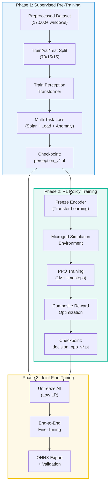

# 🎓 Model Training & Fine-Tuning

## Algorithms, Hyperparameters, Loss Functions, Training Setup, and Optimization Strategy

**Document ID:** `DOC-07`
**Version:** 2.0
**Last Updated:** June 2026
**Classification:** Software Design Document (SDD) · ML Engineering Reference
**Maintained By:** AI Systems Architecture Team

---

## 📋 Purpose

This document specifies the complete training pipeline for the UAEO models, including multi-task loss formulation, RL training configuration, hyperparameter schedules, curriculum learning strategy, and model validation procedures.

## 🎯 Scope

- Multi-task loss function design and weighting strategy
- Perception Transformer supervised training procedure
- RL Decision Core training with PPO/SAC
- Hyperparameter configuration and tuning ranges
- Curriculum learning for progressive difficulty
- Transfer learning and fine-tuning strategy
- Training infrastructure and compute requirements

**Out of Scope:** Model architecture (`05_Agentic_AI_Model.md`), data preparation (`06_Data_Collection_and_Preprocessing.md`).

## 🔗 Dependencies

| Dependency | Purpose |
| --- | --- |
| PyTorch 2.0+ | Training framework |
| Stable-Baselines3 2.0+ | PPO/SAC RL training |
| MLflow 2.x | Experiment tracking and model registry |
| Weights & Biases (optional) | Hyperparameter sweep visualization |
| NVIDIA GPU (RTX 3060+) | Training acceleration |

## 📌 Assumptions

- Minimum 90 days of preprocessed telemetry data is available for initial training
- Training runs on a single GPU (multi-GPU training is not currently required)
- RL environment simulation accurately represents real-world microgrid dynamics
- Weekly automated retraining cycles are sufficient to maintain model freshness

## ⚠️ Constraints

- Training must complete within 8 hours for the weekly retraining cycle
- Model checkpoint size must remain under 50MB for practical storage
- RL training requires a calibrated simulation environment; direct real-world training is not permitted for safety reasons

---

## 📐 Training Architecture Overview



---

## 📊 Phase 1: Supervised Pre-Training (Perception Transformer)

### Multi-Task Loss Function

```python
class MultiTaskLoss(nn.Module):
    def __init__(self, w_solar=1.0, w_load=1.0, w_anomaly=0.5):
        """
        Combined loss for joint training of all perception heads.
        Uses uncertainty-based automatic weighting (Kendall et al., 2018).
        """
        super().__init__()
        # Learnable log-variance parameters for automatic weighting
        self.log_var_solar = nn.Parameter(torch.zeros(1))
        self.log_var_load = nn.Parameter(torch.zeros(1))
        self.log_var_anomaly = nn.Parameter(torch.zeros(1))

        self.mse_loss = nn.MSELoss()
        self.bce_loss = nn.BCELoss()

    def forward(self, solar_pred, solar_true, load_pred, load_true,
                anomaly_pred, anomaly_true):
        # Forecast losses (MSE for regression tasks)
        loss_solar = self.mse_loss(solar_pred, solar_true)
        loss_load = self.mse_loss(load_pred, load_true)

        # Anomaly loss (BCE for binary classification per component)
        loss_anomaly = self.bce_loss(anomaly_pred, anomaly_true)

        # Uncertainty-weighted combination
        # L = (1/2σ²) * L_task + log(σ)
        weighted_solar = (0.5 * torch.exp(-self.log_var_solar) * loss_solar
                          + 0.5 * self.log_var_solar)
        weighted_load = (0.5 * torch.exp(-self.log_var_load) * loss_load
                         + 0.5 * self.log_var_load)
        weighted_anomaly = (0.5 * torch.exp(-self.log_var_anomaly) * loss_anomaly
                            + 0.5 * self.log_var_anomaly)

        total_loss = weighted_solar + weighted_load + weighted_anomaly
        return total_loss, {
            'solar_loss': loss_solar.item(),
            'load_loss': loss_load.item(),
            'anomaly_loss': loss_anomaly.item(),
            'total_loss': total_loss.item()
        }
```

### Training Hyperparameters

| Parameter | Value | Tuning Range | Notes |
| --- | --- | --- | --- |
| **Optimizer** | AdamW | — | Weight decay regularization |
| **Learning Rate** | 1e-4 | 1e-5 – 1e-3 | Cosine annealing schedule |
| **Weight Decay** | 1e-5 | 1e-6 – 1e-4 | L2 regularization |
| **Batch Size** | 64 | 32 – 128 | GPU memory dependent |
| **Epochs** | 100 | — | Early stopping (patience=10) |
| **Dropout** | 0.1 | 0.05 – 0.2 | Transformer encoder layers |
| **Gradient Clipping** | 1.0 | — | Prevents gradient explosion |
| **LR Scheduler** | CosineAnnealingWarmRestarts | — | T_0=10, T_mult=2 |

### Training Loop

```python
def train_perception(model, train_loader, val_loader, epochs=100):
    optimizer = torch.optim.AdamW(model.parameters(), lr=1e-4, weight_decay=1e-5)
    scheduler = torch.optim.lr_scheduler.CosineAnnealingWarmRestarts(
        optimizer, T_0=10, T_mult=2
    )
    criterion = MultiTaskLoss()
    best_val_loss = float('inf')
    patience_counter = 0

    for epoch in range(epochs):
        model.train()
        train_metrics = {'solar_loss': 0, 'load_loss': 0, 'anomaly_loss': 0}

        for batch in train_loader:
            telemetry, solar_true, load_true, anomaly_true = batch
            optimizer.zero_grad()

            solar_pred, load_pred, anomaly_pred, _ = model(telemetry)
            loss, metrics = criterion(
                solar_pred, solar_true,
                load_pred, load_true,
                anomaly_pred, anomaly_true
            )

            loss.backward()
            torch.nn.utils.clip_grad_norm_(model.parameters(), 1.0)
            optimizer.step()

            for k, v in metrics.items():
                train_metrics[k] = train_metrics.get(k, 0) + v

        scheduler.step()

        # Validation
        val_loss = validate_perception(model, val_loader, criterion)

        # Early stopping
        if val_loss < best_val_loss:
            best_val_loss = val_loss
            torch.save(model.state_dict(), f'perception_best.pt')
            patience_counter = 0
        else:
            patience_counter += 1
            if patience_counter >= 10:
                print(f"Early stopping at epoch {epoch}")
                break

        # MLflow logging
        mlflow.log_metrics(train_metrics, step=epoch)
```

### Data Split Strategy

| Split | Percentage | Size (~180 days) | Purpose |
| --- | --- | --- | --- |
| **Training** | 70% | ~126 days (~12,000 windows) | Model parameter optimization |
| **Validation** | 15% | ~27 days (~2,500 windows) | Hyperparameter tuning, early stopping |
| **Test** | 15% | ~27 days (~2,500 windows) | Final evaluation (never used during training) |

**Important:** Splits are **temporal** (not random) to prevent data leakage. Training uses the earliest data, validation uses middle data, and test uses the most recent data.

---

## 🎮 Phase 2: RL Policy Training (Decision Core)

### Simulation Environment

```python
import gym
import numpy as np

class MicrogridEnv(gym.Env):
    """
    OpenAI Gym-compatible microgrid simulation environment.
    Uses historical telemetry sequences as the basis for state transitions.
    """
    def __init__(self, telemetry_data, perception_model):
        super().__init__()
        self.data = telemetry_data
        self.perception = perception_model
        self.perception.eval()

        # Action space: Discrete(16) + Box([-1,1])
        self.action_space = gym.spaces.Dict({
            'discrete': gym.spaces.Discrete(16),
            'continuous': gym.spaces.Box(-1.0, 1.0, shape=(1,))
        })

        # Observation space: encoded features + physical state
        self.observation_space = gym.spaces.Box(
            low=-np.inf, high=np.inf, shape=(6149,)
        )

    def step(self, action):
        # Apply action to simulated microgrid
        discrete_action = action['discrete']
        battery_setpoint = action['continuous'][0] * 5.0

        # Simulate state transition
        next_state = self._simulate_transition(
            discrete_action, battery_setpoint
        )

        # Compute reward
        reward = self._compute_reward(next_state, action)

        # Check termination
        done = self.step_count >= self.max_steps

        return next_state, reward, done, {}
```

### PPO Training Configuration

| Parameter | Value | Notes |
| --- | --- | --- |
| **Algorithm** | PPO (Proximal Policy Optimization) | Stable, well-suited for hybrid action spaces |
| **Total Timesteps** | 1,000,000 | ~40 simulated days of operation |
| **Learning Rate** | 3e-4 | Linear decay to 0 over training |
| **n_steps** | 2048 | Rollout buffer size |
| **Batch Size** | 64 | Mini-batch for gradient updates |
| **n_epochs** | 10 | PPO update epochs per rollout |
| **Gamma (γ)** | 0.99 | Discount factor (long-horizon optimization) |
| **GAE Lambda (λ)** | 0.95 | Generalized Advantage Estimation |
| **Clip Range** | 0.2 | PPO clipping parameter |
| **Value Loss Coeff** | 0.5 | Critic loss weight |
| **Entropy Coeff** | 0.01 | Exploration bonus (decays over training) |
| **Max Grad Norm** | 0.5 | Gradient clipping |

---

## 🎯 Phase 3: Joint Fine-Tuning

After separate pre-training, both models are fine-tuned end-to-end:

1. **Load Pre-Trained Weights:** Perception Transformer from Phase 1, Decision Core from Phase 2
2. **Unfreeze All Parameters:** Enable gradient flow through the entire pipeline
3. **Reduced Learning Rate:** Use 1/10th of the original LR (1e-5) to avoid catastrophic forgetting
4. **Short Duration:** 10-20 epochs of joint fine-tuning
5. **Combined Loss:** Perception loss + RL policy gradient loss

---

## 📊 Curriculum Learning Strategy

Training difficulty is increased progressively:

| Stage | Duration | Conditions | Purpose |
| --- | --- | --- | --- |
| **Stage 1** | 200K steps | Stable solar, no faults, mild temps | Learn basic routing |
| **Stage 2** | 300K steps | Variable cloud cover, temp variation | Learn forecasting value |
| **Stage 3** | 300K steps | Peak tariff hours, SoC constraints | Learn cost optimization |
| **Stage 4** | 200K steps | Fault injection, emergency scenarios | Learn self-healing |

---

## 🔄 Transfer Learning Strategy

### Scenario: New Installation Deployment

1. **Pre-Trained Base:** Use a model trained on existing GridFlowX installation data
2. **Freeze Encoder:** Lock the transformer encoder weights (shared temporal patterns)
3. **Fine-Tune Heads:** Retrain only the task heads and decision core with local data
4. **Minimum Data:** Requires only 14 days of local telemetry for effective transfer

### Scenario: Seasonal Adaptation

1. **Detect Season Change:** Monitor forecast MAE; if consistently > 15%, trigger adaptation
2. **Partial Retraining:** Unfreeze last transformer layer + all heads
3. **Mixed Dataset:** Use 70% recent data + 30% historical same-season data
4. **Duration:** 20 epochs with reduced LR (1e-5)

---

## 📐 Architecture Notes

- **Uncertainty-based loss weighting** (Kendall et al., 2018) automatically balances the contribution of each task head, eliminating the need for manual loss weight tuning
- **Temporal data splits** prevent the model from seeing future data during training, which would create unrealistically optimistic performance estimates
- **Curriculum learning** mirrors how human operators learn — starting with simple scenarios and progressively handling edge cases

## 👨‍💻 Developer Notes

- Training scripts are located in `ai-service/training/`
- Use `mlflow ui` to visualize training runs and compare experiments
- Model checkpoints are saved with the naming convention: `{model_type}_v{version}_{date}.pt`
- Always validate ONNX export produces identical outputs to PyTorch model before deployment

## 🏆 Recruiter & Portfolio Notes

> **ML Engineering Rigor:** The training pipeline demonstrates advanced ML engineering practices — uncertainty-weighted multi-task loss, curriculum learning, transfer learning for deployment adaptation, and temporal validation splits. The PPO configuration shows understanding of modern RL algorithms and their hyperparameter sensitivities. The 3-phase training approach (supervised → RL → joint) is a pattern used in state-of-the-art robotics and autonomous systems research.

## ✅ Best Practices

1. **Never Use Random Splits for Time Series:** Always use temporal splits to prevent data leakage
2. **Log Everything:** Record all hyperparameters, metrics, and data hashes with MLflow
3. **Validate ONNX Parity:** Check that ONNX model outputs match PyTorch within 1e-5 tolerance
4. **Monitor Training Stability:** Watch for gradient explosion, loss divergence, or RL reward collapse

## 🔮 Future Enhancements

- **Population-Based Training (PBT):** Automated hyperparameter optimization during training
- **Self-Play:** Train multiple RL agents to compete/cooperate for multi-site optimization
- **Federated Learning:** Train on data from multiple installations without centralizing raw telemetry
- **Neural Architecture Search (NAS):** Automatically discover optimal transformer configurations

## 🗺️ Related Documents

| Document | Purpose |
| --- | --- |
| `05_Agentic_AI_Model.md` | Model architecture definitions |
| `06_Data_Collection_and_Preprocessing.md` | Training data preparation |
| `08_Agent_Workflows.md` | How trained models execute in production |
| `19_Model_Drift_Monitoring.md` | When and how to trigger retraining |
