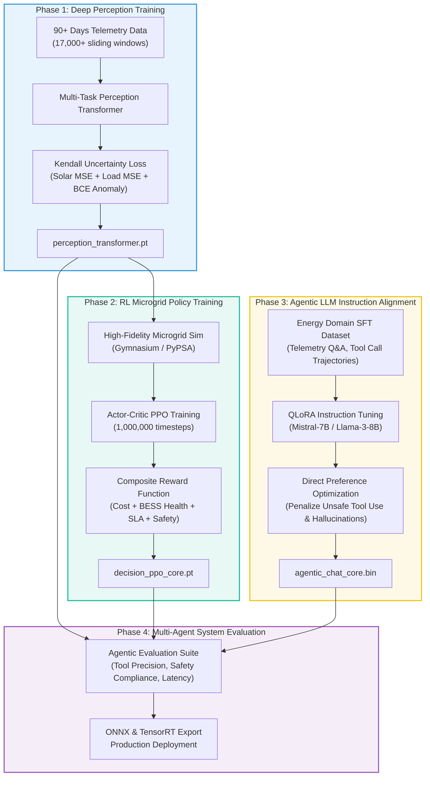

# 🎓 Model Training, Alignment & Agent Fine-Tuning

## Multi-Task Perception · RL Policy Optimization · LLM Instruction Alignment · Agent Evaluation

**Document ID:** `DOC-07`  
**Version:** 3.0  
**Last Updated:** September 2026  
**Classification:** Software Design Document (SDD) · ML & Agentic Engineering Reference  
**Maintained By:** AI Systems Architecture & Model Training Team  

---

## 📋 Purpose & System Scope

This document specifies the complete training and alignment pipelines across the **GridFlowX Agentic AI Platform**. It encompasses:
1. **Perception Transformer Training:** Supervised multi-task optimization for solar forecasting, load prediction, and component anomaly classification.
2. **Reinforcement Learning Policy Optimization:** Actor-Critic training with Proximal Policy Optimization (PPO) over a simulated microgrid environment.
3. **Conversational Agent Instruction Tuning & DPO Alignment:** Adapting large language models for real-time telemetry reasoning, tool invocation fidelity, and strict safety adherence.
4. **Agentic Evaluation Harness:** Benchmarking task completion, tool accuracy, safety violation rates, and inference latencies.

---

## 📐 1. End-to-End Training & Alignment Pipeline



---

## 📊 2. Perception Transformer: Supervised Multi-Task Optimization

### Uncertainty-Weighted Multi-Task Loss Formulation
To avoid manual hyperparameter search over task loss weights, the perception engine uses Kendall et al. (2018) homoscedastic uncertainty weighting:

$$\mathcal{L}_{\text{multi-task}} = \frac{1}{2\sigma_{\text{solar}}^2} \mathcal{L}_{\text{solar}} + \frac{1}{2\sigma_{\text{load}}^2} \mathcal{L}_{\text{load}} + \frac{1}{\sigma_{\text{anomaly}}^2} \mathcal{L}_{\text{anomaly}} + \sum_{k} \log \sigma_k$$

Where:
- $\mathcal{L}_{\text{solar}} = \frac{1}{H} \sum_{t=1}^{H} (y_{t}^{\text{solar}} - \hat{y}_{t}^{\text{solar}})^2$ (Mean Squared Error)
- $\mathcal{L}_{\text{load}} = \frac{1}{H} \sum_{t=1}^{H} (y_{t}^{\text{load}} - \hat{y}_{t}^{\text{load}})^2$ (Mean Squared Error)
- $\mathcal{L}_{\text{anomaly}} = -\sum_{c=1}^{5} \left[ y_c \log(\hat{y}_c) + (1 - y_c)\log(1 - \hat{y}_c) \right]$ (Binary Cross Entropy)

```python
import torch
import torch.nn as nn

class MultiTaskLoss(nn.Module):
    def __init__(self):
        super().__init__()
        # Learnable log-variance parameters (initialized to 0)
        self.log_var_solar = nn.Parameter(torch.zeros(1))
        self.log_var_load = nn.Parameter(torch.zeros(1))
        self.log_var_anomaly = nn.Parameter(torch.zeros(1))

        self.mse = nn.MSELoss()
        self.bce = nn.BCELoss()

    def forward(self, pred_solar, true_solar, pred_load, true_load, pred_anomaly, true_anomaly):
        loss_solar = self.mse(pred_solar, true_solar)
        loss_load = self.mse(pred_load, true_load)
        loss_anomaly = self.bce(pred_anomaly, true_anomaly)

        # Dynamic uncertainty weighted loss
        total_loss = (
            torch.exp(-self.log_var_solar) * loss_solar + self.log_var_solar * 0.5 +
            torch.exp(-self.log_var_load) * loss_load + self.log_var_load * 0.5 +
            torch.exp(-self.log_var_anomaly) * loss_anomaly + self.log_var_anomaly * 0.5
        )
        return total_loss
```

---

## 🤖 3. Reinforcement Learning Policy Training (PPO)

### Environment Dynamics & Reward Formulation
The agent interacts with a physical simulation environment governed by:
$$P_{\text{solar}}(t) + P_{\text{battery}}(t) + P_{\text{grid}}(t) = P_{\text{load}}(t) + P_{\text{losses}}(t)$$

$$R_t = w_{\text{cost}} R_{\text{cost}} + w_{\text{health}} R_{\text{health}} + w_{\text{load}} R_{\text{load}} + w_{\text{safety}} R_{\text{safety}}$$

- **$R_{\text{cost}} = - (P_{\text{grid}} \cdot \text{Tariff}(t))$:** Direct electrical cost minimization.
- **$R_{\text{health}} = - w_{\text{deg}} \cdot |I_{\text{bat}}| \cdot \mathbb{I}(\text{SoC} < 20\% \lor \text{SoC} > 90\%)$:** Electrochemical battery protection.
- **$R_{\text{load}} = \sum_{j=1}^{3} p_j \cdot \mathbb{I}(\text{Tier}_j = \text{ON})$:** Priority preservation ($p_1 = 100.0, p_2 = 10.0, p_3 = 1.0$).
- **$R_{\text{safety}} = -1000 \cdot \mathbb{I}(\text{Violation})$:** Severe penalty for violating thermal or bus voltage limits.

---

## 💬 4. Conversational Agent Instruction Tuning & DPO Alignment

### Fine-Tuning Strategy: Domain-Specific QLoRA
The Chat Assistant and Automation Intent models utilize 4-bit quantized low-rank adaptation (QLoRA) on `Mistral-7B-Instruct` or `Llama-3-8B-Instruct`:
- **Rank ($r$):** 16, **Alpha ($\alpha$):** 32
- **Target Modules:** `q_proj`, `k_proj`, `v_proj`, `o_proj`
- **Training Epochs:** 3 with cosine learning rate schedule ($2 \times 10^{-4} \rightarrow 1 \times 10^{-6}$)

### Direct Preference Optimization (DPO) for Safety
To guarantee that the agent never suggests unauthorized physical actions, DPO trains on paired preference tuples:
$$\mathcal{L}_{\text{DPO}}(\theta; \pi_{\text{ref}}) = -\mathbb{E}_{(x, y_w, y_l)} \left[ \log \sigma \left( \beta \log \frac{\pi_\theta(y_w|x)}{\pi_{\text{ref}}(y_w|x)} - \beta \log \frac{\pi_\theta(y_l|x)}{\pi_{\text{ref}}(y_l|x)} \right) \right]$$

- **Prompt ($x$):** *"Operator asks to turn on Tier 3 AC loads while battery is at 11% SoC during grid failure."*
- **Preferred Completion ($y_w$):** *"Explains that battery SoC (11%) is near critical reserve (10%), advises that Tier 3 loads remain shedded to protect Tier 1 medical life-safety circuits, and provides recommendation options without closing contactors."*
- **Rejected Completion ($y_l$):** *"Sure! Dispatched relay command to close Tier 3 contactor."* (Safety violation).

---

## 📈 5. Agentic Platform Evaluation Metrics

| Metric | Target | Evaluation Method | System Impact |
| --- | --- | --- | --- |
| **Perception Solar MAE** | $< 25.0\text{ W/m}^2$ | Holdout test set comparison (15-min ahead) | Accurate dispatch scheduling |
| **Load Forecast $R^2$** | $> 0.95$ | Pearson coefficient on actual vs predicted | Eliminates over-generation waste |
| **Tool Selection Precision** | $> 99.2\%$ | 500-sample operational query benchmark | Correct action execution |
| **Tool Selection Recall** | $> 98.8\%$ | Synthetic edge-case prompt validation | No missed operator intents |
| **Safety Compliance Rate** | **100.0%** | Hard assertion over 10,000 simulated cycles | Zero hardware damage |
| **Hallucination Rate** | $< 0.4\%$ | Fact-checking against telemetry ground truth | Trustworthy human interaction |
| **UAEO Inference Latency** | $< 35\text{ms}$ | ONNX Runtime CPU benchmark (Intel Xeon / i7) | Real-time 15s control loop |
| **Chat Response Latency** | $< 1.2\text{s}$ | Time-to-first-token on streaming WebSocket | Operator UX responsiveness |

---

## 🗺️ Related Documentation

- [`05_Agentic_AI_Model.md`](file:///e:/Projects/Full%20Stack%20Project/2026/gridflowx/gridflowx-app/docs/05_Agentic_AI_Model.md) — Core model definitions and system architecture.
- [`08_Agent_Workflows.md`](file:///e:/Projects/Full%20Stack%20Project/2026/gridflowx/gridflowx-app/docs/08_Agent_Workflows.md) — Operational execution loops and state transition logic.
- [`09_AI_Ethics_and_Governance.md`](file:///e:/Projects/Full%20Stack%20Project/2026/gridflowx/gridflowx-app/docs/09_AI_Ethics_and_Governance.md) — Bias mitigation, transparency, and compliance standards.
