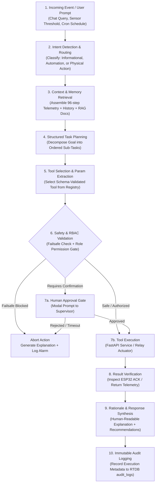
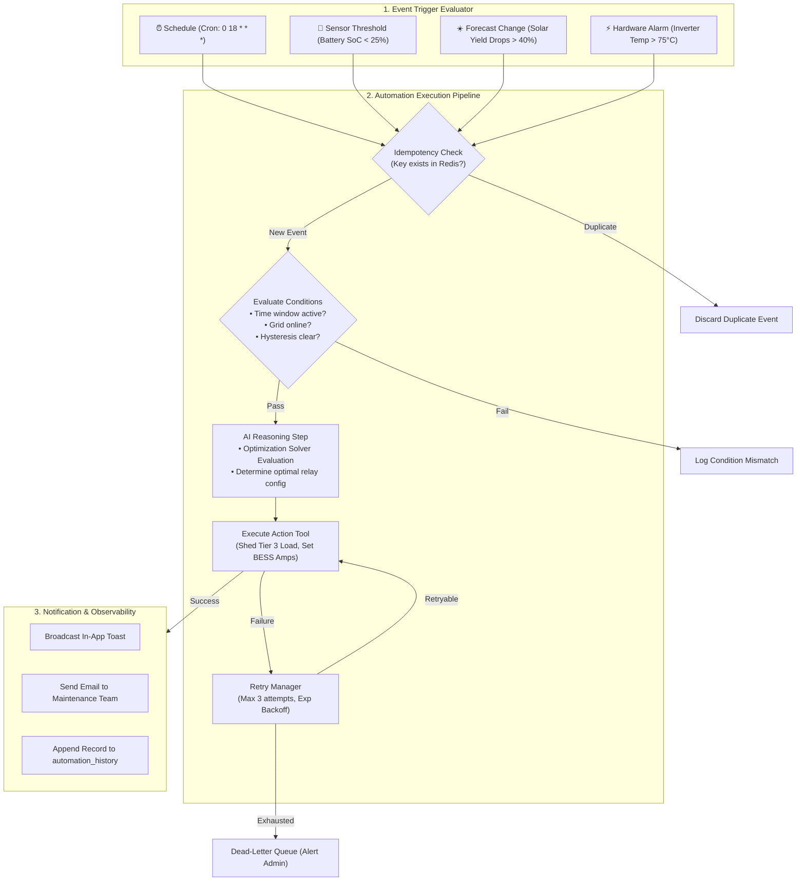

# 🔄 Agent Workflows & Multi-Agent Orchestration

## Task Planning · Interactive Reasoning · Event-Driven Automation · Safety Interlocks · HITL Protocol

**Document ID:** `DOC-08`  
**Version:** 3.0  
**Last Updated:** September 2026  
**Classification:** Software Design Document (SDD) · AI Operations & Execution Reference  
**Maintained By:** AI Systems Architecture & Autonomous Systems Engineering Team  

---

## 📋 Purpose & System Scope

This document details the runtime execution loops, task planning state graphs, tool invocation protocols, memory lifecycle management, and human-in-the-loop (HITL) approval workflows for the **GridFlowX Agentic AI Platform**.

It defines how the three primary agent runtimes—the **Agentic Chat Assistant**, the **Automation Engine**, and the **UAEO Energy Agent**—cooperate safely under the central **Agent Orchestration Layer**.

---

## 🔄 1. Global Multi-Agent Task Orchestration Flow

Every operational request, natural-language query, or automation event flows through a 10-step structured execution pipeline:



---

## 💬 2. Agentic Chat Assistant Interactive Workflow

The Chat Assistant operates as an interactive, streaming agent that translates natural-language inquiries into grounded operational intelligence:

```mermaid
sequenceDiagram
    autonumber
    actor Operator as Plant Operator
    participant UI as Dashboard Chat Interface
    participant Orchestrator as Agent Orchestrator
    participant ContextMgr as Context & Memory Manager
    participant ToolRegistry as Controlled Tool Registry
    participant Backend as FastAPI Backend / ESP32
    participant AuditDB as RTDB Audit Logs

    Operator->>UI: "What caused the grid disconnection at 08:30?"
    UI->>Orchestrator: Stream User Query (WebSocket)
    Orchestrator->>ContextMgr: Assemble Context (Telemetry + Recent Alarms + Audit)
    ContextMgr-->>Orchestrator: Context Payload (Safe, Sanitized)
    
    Orchestrator->>Orchestrator: Intent: EXPLAIN_FAULT; Plan: Query Incident Log
    Orchestrator->>ToolRegistry: Execute Tool: query_audit_logs(action='GRID_ISLANDED')
    ToolRegistry->>Backend: Fetch Incident Records
    Backend-->>ToolRegistry: Return Incident #INC-441 (Voltage sag to 184V)
    ToolRegistry-->>Orchestrator: Tool Result Data
    
    Orchestrator->>Orchestrator: Synthesize Rationale (No hidden CoT exposed)
    Orchestrator->>AuditDB: Append Turn Audit Record
    Orchestrator-->>UI: Stream Markdown Response + Cited Telemetry Metrics
    UI-->>Operator: Display Explanation & Interactive Telemetry Chart
```

### Structured Reasoning Metadata (No Hidden CoT)
To maintain security, privacy, and regulatory auditability without exposing raw internal thoughts, all conversational responses return structured metadata alongside the public response:
```json
{
  "traceId": "trace_20260913_c018a",
  "intent": "EXPLAIN_SYSTEM_FAULT",
  "selectedTools": ["query_audit_logs", "get_telemetry"],
  "safetyChecks": {
    "failsafeInterventionRequired": false,
    "rbacRoleVerified": "OPERATOR",
    "permissionGranted": true
  },
  "executionStatus": "SUCCESS",
  "rationale": "Identified grid undervoltage trip (<190V) at 08:30:14 triggering automatic islanding relay isolation.",
  "responseCategory": "INFORMATION"
}
```

---

## ⚡ 3. Event-Driven Automation Engine Workflow

The Automation Engine continuously evaluates operational conditions, executing proactive microgrid management workflows:



---

## 🛡️ 4. Human-in-the-Loop (HITL) Safety & Approval Protocol

Physical actions are partitioned into four risk categories to balance autonomy with operator accountability:

```
                          ACTION RISK TAXONOMY
 ┌─────────────────────────────────────────────────────────────────────────┐
 │ TIER 0: INFORMATIONAL (No physical state modification)                  │
 │ • Querying live telemetry, inspecting BESS health, viewing forecasts    │
 │ • Execution: Fully autonomous, zero operator friction                   │
 ├─────────────────────────────────────────────────────────────────────────┤
 │ TIER 1: RECOMMENDATIONS (AI-generated operational suggestions)         │
 │ • Recommending scheduled maintenance, suggested tariff charge window    │
 │ • Execution: Displayed in UI; operator must click "Accept" to trigger   │
 ├─────────────────────────────────────────────────────────────────────────┤
 │ TIER 2: LOW-RISK ACTIONS (Non-critical automated adjustments)           │
 │ • Shedding Tier 3 flexible HVAC loads during peak demand                │
 │ • Execution: Autonomous if rule pre-approved; log to audit trail        │
 ├─────────────────────────────────────────────────────────────────────────┤
 │ TIER 3: HIGH-RISK ACTIONS (Safety-critical physical operations)         │
 │ • Contactor manual overrides, BESS setpoint modifications               │
 │ • Emergency Stop Recovery, grid reconnection after fault                │
 │ • Execution: MANDATORY modal confirmation + re-auth password + timeout  │
 └─────────────────────────────────────────────────────────────────────────┘
```

### High-Risk Action Approval Modal Protocol
1. **Modal Presentation:** When a Tier 3 action is generated (either by Chat Assistant or an Automation workflow), an interactive modal is locked to the operator's display:
   - Target Device & Actuator (`GFX-ESP32-MASTER-01` / `Ch 7 - BESS Contactor`)
   - Proposed Action (`OPEN -> CLOSED`)
   - AI Rationale (*"Grid voltage restored to 230V, phase-angle synchronized within 2 degrees"*)
   - Risk Assessment (*"High-current inrush potential"*)
2. **Timeout Auto-Cancel:** If no response is received within **300 seconds (5 minutes)**, the action is cancelled automatically and logged as `APPROVAL_TIMEOUT`.
3. **Manual Hardware Override Supremacy:** If an operator toggles a physical control switch on the cabinet, all automated agent dispatches are instantly blocked for that channel.

---

## 🧹 5. Unified Memory Retention & Cleanup Lifecycle

| Memory Store | Storage Technology | Retention Policy | Eviction / Pruning Mechanism |
| --- | --- | --- | --- |
| **Conversational STM** | Session State (Zustand / Redis) | Active user session (max 4h idle) | FIFO sliding window (max 20 turns) |
| **Telemetry History** | Firebase RTDB / Local Memory | 60 seconds (1Hz) + 24 hours (15m) | Bounded circular array (`length >= 60`) |
| **Episodic Decision Logs** | Firestore `decisions` collection | 90 days rolling | Automated daily TTL index eviction |
| **Audit Logs** | Firebase RTDB `audit_logs` | Permanent (7 years compliance) | Immutable append-only; zero deletions |
| **Vector Knowledge Base** | Vector Store (Chroma / Milvus) | Permanent (versioned with docs) | Re-indexed upon equipment firmware updates |

---

## 🗺️ Related Documentation

- [`05_Agentic_AI_Model.md`](file:///e:/Projects/Full%20Stack%20Project/2026/gridflowx/gridflowx-app/docs/05_Agentic_AI_Model.md) — Multi-agent system architecture and tool registry.
- [`06_Data_Collection_and_Preprocessing.md`](file:///e:/Projects/Full%20Stack%20Project/2026/gridflowx/gridflowx-app/docs/06_Data_Collection_and_Preprocessing.md) — Data pipelines and RAG vector store architecture.
- [`07_Model_Training_and_FineTuning.md`](file:///e:/Projects/Full%20Stack%20Project/2026/gridflowx/gridflowx-app/docs/07_Model_Training_and_FineTuning.md) — Training pipelines and DPO safety alignment.
- [`09_AI_Ethics_and_Governance.md`](file:///e:/Projects/Full%20Stack%20Project/2026/gridflowx/gridflowx-app/docs/09_AI_Ethics_and_Governance.md) — Safety constraints, bias mitigation, and regulatory compliance.
