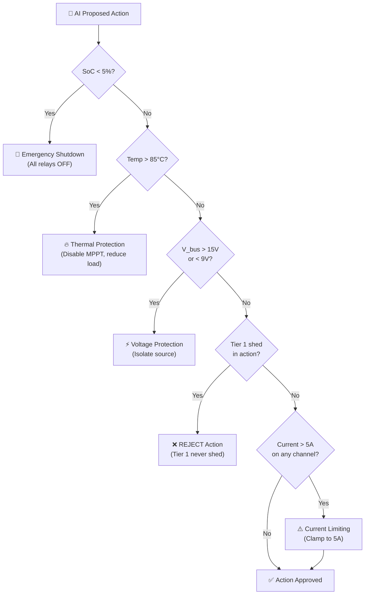

# 🔄 Agent Workflows

## Task Planning, Tool Use, Memory, Context Handling, and Decision Flow

**Document ID:** `DOC-08`
**Version:** 2.0
**Last Updated:** June 2026
**Classification:** Software Design Document (SDD) · AI Operations Reference
**Maintained By:** AI Systems Architecture Team

---

## 📋 Purpose

This document details the real-time agent workflows, decision flow logic, task planning, tool invocation patterns, memory management, context handling, and failsafe envelope enforcement for the UAEO in production operation.

## 🎯 Scope

- Real-time execution loop (15-minute inference cycles)
- Task planning and prioritization
- Tool use (relay control, battery setpoint, alert generation)
- Memory management (sliding window, episodic buffers)
- Context handling and state representation
- Failsafe envelope and safety constraints
- Multi-agent coordination patterns (future)

**Out of Scope:** Model architecture (`05_Agentic_AI_Model.md`), training procedures (`07_Model_Training_and_FineTuning.md`).

## 📌 Assumptions

- The agent operates on a 15-minute inference cycle (96 steps per day)
- All sensor data is available and preprocessed before each inference step
- The failsafe envelope has absolute authority over AI decisions
- Manual overrides temporarily suspend agent actions

## ⚠️ Constraints

- Single inference cycle must complete within 50ms
- Agent cannot modify its own failsafe envelope parameters
- Agent actions are limited to the defined action space (16 discrete + 1 continuous)

---

## 🔄 Core Execution Loop

```mermaid
flowchart TD
    START["⏰ 15-Minute Timer Fires"] --> CHECK_OVERRIDE{"Manual Override\nActive?"}
    CHECK_OVERRIDE -->|Yes| SKIP["Skip Inference\n(Operator in control)"]
    CHECK_OVERRIDE -->|No| COLLECT["📡 Collect Context"]
    
    COLLECT --> FIRESTORE["Query Firestore\n(96 × 9 telemetry window)"]
    COLLECT --> STATE["Read Current State\n[SoC, Grid, Temp, V, Override]"]
    COLLECT --> WEATHER["Fetch Weather Forecast\n(API cache)"]
    
    FIRESTORE & STATE & WEATHER --> PREPROCESS["🔧 Preprocess & Normalize"]
    PREPROCESS --> INFER["🧠 Agent Inference"]
    
    INFER --> PERCEPTION["Perception Step\n→ Solar/Load Forecast\n→ Anomaly Scores"]
    PERCEPTION --> DECISION["Decision Step\n→ Relay Config\n→ Battery Setpoint"]
    
    DECISION --> ENVELOPE{"🛡️ Failsafe\nEnvelope Check"}
    ENVELOPE -->|Pass| EXECUTE["✅ Execute Actions"]
    ENVELOPE -->|Override| MODIFY["⚠️ Modify Actions\n(Safety Priority)"]
    MODIFY --> EXECUTE
    
    EXECUTE --> RELAY_CMD["📡 Send Relay Commands\n(WebSocket)"]
    EXECUTE --> BAT_CMD["🔋 Send Battery Setpoint\n(WebSocket)"]
    EXECUTE --> LOG["📝 Log Decision\n(Firestore audit_logs)"]
    EXECUTE --> BROADCAST["📺 Broadcast to Dashboard\n(WebSocket / client)"]
    
    RELAY_CMD & BAT_CMD --> ACK{"ESP32\nACK Received?"}
    ACK -->|Yes| SUCCESS["✓ Cycle Complete"]
    ACK -->|No (5s timeout)| RETRY["Retry Command (3x)\nthen Alert Operator"]
```

---

## 🧠 Context Assembly

### Context Window Structure

The agent operates on a **contextual state representation** assembled from multiple sources:

```python
class AgentContext:
    """
    Complete context assembled for each inference cycle.
    """
    def __init__(self):
        # Temporal Memory: 24-hour sliding window
        self.telemetry_history = None  # Shape: [96, 9]

        # Current Physical State
        self.current_state = {
            'battery_soc': 0.0,       # 0-100%
            'grid_status': 0,          # 0=offline, 1=online
            'heatsink_temp': 0.0,      # °C
            'bus_voltage': 0.0,        # V
            'active_overrides': 0      # Bitmask of manual overrides
        }

        # External Context
        self.weather_forecast = {
            'cloud_cover': [],         # Next 4 hours (%)
            'ambient_temp': [],        # Next 4 hours (°C)
            'humidity': []             # Next 4 hours (%)
        }

        # System State
        self.last_action = None        # Previous action for consistency
        self.override_timer = 0        # Remaining override seconds
        self.fault_history = []        # Recent fault events
```

### Memory Management

| Memory Type | Implementation | Capacity | Retention |
| --- | --- | --- | --- |
| **Sliding Window** | NumPy circular buffer | 96 steps (24h) | Rolling (FIFO) |
| **Episodic Buffer** | Python deque | 100 events | LRU eviction |
| **Action History** | Firestore collection | 1000 actions | Permanent |
| **Fault Memory** | Firestore alerts collection | Unlimited | Permanent |
| **Weather Cache** | FastAPI memory cache | Current + 4h forecast | 1-hour TTL |

---

## 🔧 Tool Invocation Patterns

The agent "uses tools" by generating actions that are translated into physical actuations:

### Tool 1: Relay Control

```python
async def execute_relay_action(relay_config, websocket_manager, device_id):
    """
    Translate AI relay configuration to WebSocket commands.
    
    Args:
        relay_config: dict with keys relay1 to relay8
        websocket_manager: FastAPI WebSocket connection manager
        device_id: target ESP32 identifier
    """
    command = {
        "type": "RELAY_CONFIG",
        "timestamp": datetime.utcnow().isoformat(),
        "source": "MICROGRID_AGENT",
        "payload": relay_config,
        "confidence": 0.95  # AI decision confidence
    }
    await websocket_manager.send_json_to_device(device_id, command)
```

### Tool 2: Battery Setpoint

```python
async def execute_battery_setpoint(setpoint_amps, websocket_manager, device_id):
    """
    Send battery charge/discharge current setpoint via WebSocket.
    Positive = charge, Negative = discharge.
    """
    command = {
        "type": "BATTERY_SETPOINT",
        "timestamp": datetime.utcnow().isoformat(),
        "source": "MICROGRID_AGENT",
        "payload": {
            "setpoint_amps": round(setpoint_amps, 2),
            "mode": "charge" if setpoint_amps > 0 else "discharge"
        }
    }
    await websocket_manager.send_json_to_device(device_id, command)
```

### Tool 3: Alert Generation

```python
def generate_alert(alert_type, severity, message, details):
    """
    Create and publish a system alert to operators.
    """
    alert = {
        "type": "SYSTEM_ALERT",
        "alert_type": alert_type,  # ANOMALY, THRESHOLD, FORECAST
        "severity": severity,      # INFO, WARNING, CRITICAL
        "message": message,
        "details": details,
        "timestamp": datetime.utcnow().isoformat(),
        "source": "UAEO_AGENT",
        "requires_ack": severity == "CRITICAL"
    }
    # Store in Firestore
    db.collection("alerts").add(alert)
    # Broadcast to dashboard via WebSocket Manager
    await websocket_manager.broadcast_to_clients("alert_notification", alert)
```

---

## 🛡️ Failsafe Envelope

The failsafe envelope is a **hard safety layer** that has absolute authority over AI decisions. It cannot be disabled or modified by the AI agent.



### Envelope Rules (Priority Order)

| # | Rule | Condition | Override Action | Priority |
| --- | --- | --- | --- | --- |
| 1 | **Emergency Shutdown** | SoC < 2% OR Temp > 90°C | All relays OFF | CRITICAL |
| 2 | **Thermal Protection** | Temp > 85°C | Disable MPPT, limit current | HIGH |
| 3 | **Voltage Protection** | V_bus > 15V or < 9V | Isolate anomalous source | HIGH |
| 4 | **Tier 1 Protection** | AI proposes Tier 1 shed | Reject action entirely | ABSOLUTE |
| 5 | **Current Limiting** | I_channel > 5A | Clamp setpoint to ±5A | MEDIUM |
| 6 | **SoC Floor** | SoC < 20% | Disable battery discharge | MEDIUM |
| 7 | **SoC Ceiling** | SoC > 90% | Disable battery charge | LOW |

---

## 📊 Decision Logging & Audit Trail

Every agent decision is logged with full context for audit and debugging:

```python
def log_agent_decision(context, action, modified_action, confidence):
    """
    Immutable audit log entry for every AI decision.
    """
    audit_entry = {
        "timestamp": datetime.utcnow(),
        "decision_type": "UAEO_INFERENCE",
        "input_summary": {
            "soc": context.current_state['battery_soc'],
            "temp": context.current_state['heatsink_temp'],
            "solar_forecast": action['predictions']['solar_forecast_w'],
            "anomaly_scores": action['predictions']['component_failure_probabilities']
        },
        "proposed_action": action['relay_commands'],
        "final_action": modified_action,  # After failsafe envelope
        "was_modified": action != modified_action,
        "modification_reason": "failsafe_override" if action != modified_action else None,
        "confidence": confidence,
        "inference_latency_ms": 22.8
    }
    # Insert into immutable audit_logs table (no UPDATE/DELETE privileges)
    db.execute("INSERT INTO audit_logs (...) VALUES (...)", audit_entry)
```

---

## 📐 Architecture Notes

- The 15-minute inference cycle is chosen to match the sliding window resolution. More frequent inference would not add information (telemetry is aggregated at 15-min intervals).
- The failsafe envelope operates as a **declarative rule set** rather than a learned policy. This ensures that safety constraints are never violated, even if the RL agent is miscalibrated or encounters out-of-distribution states.
- Command retries (3x) handle transient WebSocket delivery failures. If all retries fail, the system falls back to the edge controller's local state machine.

## 👨‍💻 Developer Notes

- The execution loop is implemented in `backend/app/server.py` as a FastAPI background task
- The failsafe envelope is implemented in `backend/app/utils/safety_envelope.py`
- Command acknowledgments are tracked in memory via a temporary acknowledgment set
- Manual overrides set a flag in the local app state that the execution loop checks before inference

## 🏆 Recruiter & Portfolio Notes

> **Agentic Systems Design:** The agent workflow demonstrates mature agentic AI design — structured context assembly, tool use patterns, memory management, and critically, a layered safety architecture where hard constraints override learned policies. This is the same pattern used in autonomous vehicle and robotics systems where AI decisions must be bounded by physical safety limits.

## ✅ Best Practices

1. **Never Trust AI for Safety:** The failsafe envelope is the final authority; AI recommendations are suggestions
2. **Log Everything:** Full decision context enables debugging, compliance auditing, and model improvement
3. **Graceful Degradation:** If AI inference fails, the system falls back to edge state machine rules
4. **Idempotent Commands:** Relay commands are idempotent — sending the same state twice is harmless

## 🔮 Future Enhancements

- **Hierarchical Planning:** Add a long-horizon planner (6-24h) that sets strategic goals for the 15-minute tactical agent
- **Multi-Agent Coordination:** Coordinate multiple GridFlowX agents for campus-scale optimization
- **Natural Language Explanations:** Generate human-readable explanations for each decision
- **Adaptive Inference Frequency:** Increase inference frequency during fault events or rapid weather changes

## 🗺️ Related Documents

| Document | Purpose |
| --- | --- |
| `05_Agentic_AI_Model.md` | Model architecture underlying the agent |
| `02_Features_and_Functionality.md` | Feature requirements the agent fulfills |
| `09_AI_Ethics_and_Governance.md` | Ethical constraints on agent behavior |
| `21_Monitoring_and_Logging.md` | How agent decisions are monitored in production |
