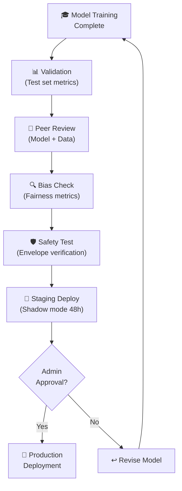

# ⚖️ AI Ethics & Governance

## Bias Mitigation, Explainability, Compliance, Transparency, and Responsible AI

**Document ID:** `DOC-09`
**Version:** 2.0
**Last Updated:** June 2026
**Classification:** Governance Document · Compliance Reference · Recruiter Portfolio
**Maintained By:** AI Ethics & Compliance Team

---

## 📋 Purpose

This document defines the ethical framework, bias mitigation strategies, explainability methods, regulatory compliance mapping, and governance procedures for the GridFlowX UAEO AI system. It ensures that AI-driven decisions are transparent, fair, auditable, and aligned with international standards.

## 🎯 Scope

- Ethical principles governing AI-driven energy management decisions
- Bias identification and mitigation in forecasting and load management
- Explainability methods (SHAP, LIME, attention visualization)
- Regulatory compliance mapping (IEC, IEEE, GDPR where applicable)
- Transparency requirements and audit trail integration
- Human oversight and override mechanisms
- Responsible AI development lifecycle

**Out of Scope:** Model architecture (`05_Agentic_AI_Model.md`), security implementations (`11_SecurityRules.md`).

## 📌 Assumptions

- All AI decisions are logged immutably for audit purposes
- Operators always have the ability to override AI decisions
- The system operates within residential and small-commercial energy regulations
- No personally identifiable information (PII) is used in AI model training

## ⚠️ Constraints

- AI must never violate electrical safety codes (IEC 62109, IEC 61850)
- The failsafe envelope is not modifiable by the AI system
- All model versions must be traceable to their training data and hyperparameters

---

## 🏛️ Ethical Principles

### Core Principles

| Principle | Description | GridFlowX Implementation |
| --- | --- | --- |
| **Safety First** | AI decisions must never compromise physical safety | Hardware failsafe envelope operates independently of AI; Tier 1 loads never shed |
| **Transparency** | All AI decisions must be explainable and auditable | Every inference cycle is logged with full context, inputs, outputs, and modifications |
| **Fairness** | Energy distribution must not discriminate against any load tier unfairly | Load shedding follows documented priority rules; no hidden biases in routing |
| **Accountability** | Clear chain of responsibility for AI actions | Immutable audit logs; human operators can override; Admin authorization for recovery |
| **Privacy** | User data is minimized and protected | No PII in training data; telemetry is anonymized at the sensor level |
| **Reliability** | AI must degrade gracefully when uncertain | Confidence thresholds trigger fallback to deterministic rules |

---

## 🔍 Bias Identification & Mitigation

### Potential Bias Sources

| Bias Type | Source | Impact | Mitigation |
| --- | --- | --- | --- |
| **Temporal Bias** | Training on one season's data | Poor performance in other seasons | Multi-season training data; seasonal fine-tuning |
| **Weather Bias** | Cloud cover proxy limitations | Underestimation of solar in partly cloudy conditions | Physics-informed irradiance model; satellite data (future) |
| **Load Pattern Bias** | Training on specific usage patterns | Suboptimal routing for different occupancy schedules | Data augmentation with varied load profiles |
| **Tariff Bias** | Training on one tariff schedule | Incorrect cost optimization with new rates | Tariff schedule as external input (not learned) |
| **Hardware Drift** | Sensor degradation over time | Inaccurate state estimation | Monthly calibration checks; drift monitoring |

### Bias Monitoring Dashboard

```python
class BiasMonitor:
    """
    Monitors AI decisions for systematic biases.
    Alerts when bias metrics exceed acceptable thresholds.
    """
    def check_load_fairness(self, decisions_log, period_days=30):
        """
        Verify that load shedding follows documented priority rules.
        Detect if Tier 2 is shed more often than expected given SoC levels.
        """
        tier2_sheds = sum(1 for d in decisions_log
                        if not d['tier2_relay'])
        tier3_sheds = sum(1 for d in decisions_log
                        if not d['tier3_relay'])

        # Tier 3 should always be shed before Tier 2
        if tier2_sheds > 0:
            t2_without_t3 = sum(1 for d in decisions_log
                               if not d['tier2_relay'] and d['tier3_relay'])
            if t2_without_t3 > 0:
                alert("BIAS_ALERT: Tier 2 shed while Tier 3 active "
                      f"({t2_without_t3} occurrences in {period_days} days)")

    def check_temporal_fairness(self, decisions_log):
        """
        Verify AI performance doesn't degrade for specific time periods.
        """
        hourly_errors = defaultdict(list)
        for d in decisions_log:
            hour = d['timestamp'].hour
            hourly_errors[hour].append(d['forecast_error'])

        for hour, errors in hourly_errors.items():
            mean_error = np.mean(errors)
            if mean_error > 0.15:  # 15% MAE threshold
                alert(f"BIAS_ALERT: Degraded forecast accuracy at hour "
                      f"{hour} (MAE: {mean_error:.2%})")
```

---

## 🔬 Explainability Methods

### 1. SHAP (SHapley Additive exPlanations)

Used to explain which input features most influenced a specific prediction:

```python
import shap

def explain_prediction(model, input_sequence, feature_names):
    """
    Generate SHAP explanations for a single AI prediction.
    
    Returns:
        feature_importances: dict mapping feature names to
                            their contribution values
    """
    explainer = shap.DeepExplainer(
        model, background_data=reference_dataset[:100]
    )
    shap_values = explainer.shap_values(input_sequence)

    # Aggregate across time steps for overall feature importance
    feature_importance = {}
    for i, name in enumerate(feature_names):
        feature_importance[name] = float(
            np.abs(shap_values[0][:, :, i]).mean()
        )

    return feature_importance
```

### 2. Attention Weight Visualization

The transformer's attention weights reveal which time steps the model focuses on:

```python
def extract_attention_weights(model, input_sequence):
    """
    Extract and visualize self-attention patterns.
    Helps operators understand which historical patterns
    influenced the current decision.
    """
    model.eval()
    with torch.no_grad():
        # Hook into attention layers
        attention_weights = []
        def attention_hook(module, input, output):
            attention_weights.append(output[1])

        for layer in model.transformer_encoder.layers:
            layer.self_attn.register_forward_hook(attention_hook)

        _ = model(input_sequence)

    return attention_weights  # [num_layers, num_heads, seq_len, seq_len]
```

### 3. Decision Explanations for Operators

Every AI decision is accompanied by a human-readable explanation:

```python
def generate_decision_explanation(action, context, predictions):
    """
    Generate natural language explanation for operator dashboard.
    """
    explanations = []

    if action['grid_fallback']:
        explanations.append(
            f"Grid fallback activated because solar forecast is "
            f"{predictions['solar_forecast_w'][0]:.0f}W (below load "
            f"demand of {predictions['load_forecast_w'][0]:.0f}W)"
        )

    if not action['tier3_relay']:
        if context['battery_soc'] < 30:
            explanations.append(
                f"Tier 3 loads shed due to low battery "
                f"({context['battery_soc']:.0f}% SoC)"
            )
        elif context['heatsink_temp'] > 70:
            explanations.append(
                f"Tier 3 loads shed due to heatsink temperature "
                f"({context['heatsink_temp']:.1f}°C exceeds 70°C limit)"
            )

    if action['battery_setpoint_amps'] > 0:
        explanations.append(
            f"Charging battery at {action['battery_setpoint_amps']:.1f}A "
            f"(excess solar generation detected)"
        )
    elif action['battery_setpoint_amps'] < 0:
        explanations.append(
            f"Discharging battery at "
            f"{abs(action['battery_setpoint_amps']):.1f}A "
            f"(peak tariff hour — cost optimization)"
        )

    return " | ".join(explanations) if explanations else "Normal operation"
```

---

## 📋 Regulatory Compliance

### Applicable Standards

| Standard | Scope | GridFlowX Compliance |
| --- | --- | --- |
| **IEC 62109** | Safety of power converters for PV | Hardware failsafe meets isolation and protection requirements |
| **IEC 61850** | Communication networks for power | WebSocket protocol with structured data objects (future Modbus TCP for industrial) |
| **IEEE 2030** | Smart grid interoperability | Standardized telemetry format; documented API contracts |
| **GDPR** | Data protection (if EU deployment) | No PII in training data; telemetry is device-level only |
| **ISO/IEC 27001** | Information security | TLS 1.3, RBAC, immutable audit logs, encryption at rest |
| **EU AI Act** | AI system classification | GridFlowX classified as "limited risk" (energy management, not safety-critical for human life) |

### EU AI Act Compliance Matrix

| Requirement | Implementation |
| --- | --- |
| **Transparency** | All AI decisions logged; SHAP explanations available |
| **Human Oversight** | Manual override capability; Admin-authorized recovery |
| **Data Governance** | Documented data sources; temporal validation splits |
| **Robustness** | Failsafe envelope; graceful degradation; edge fallback |
| **Record Keeping** | MLflow model registry; immutable audit logs; data versioning |

---

## 🔒 Governance Procedures

### Model Approval Workflow



### Model Change Log

Every model deployment must be accompanied by:
1. **Training Data Summary:** Date range, sample count, data hash
2. **Validation Metrics:** Solar MAE, Load MAPE, Anomaly F1, RL cumulative reward
3. **Bias Report:** Load fairness metrics, temporal performance distribution
4. **Safety Verification:** Failsafe envelope test results (all scenarios pass)
5. **Approval Record:** Admin username, timestamp, approval notes

---

## 📐 Architecture Notes

- Explainability is implemented as a **post-hoc analysis layer** — SHAP explanations are computed on demand (not during real-time inference) to avoid latency overhead
- The bias monitoring system runs as a **daily batch job** analyzing the previous 30 days of decisions
- Regulatory compliance is documented but not enforced by software — it relies on operational procedures and governance workflows

## 👨‍💻 Developer Notes

- SHAP explanations require a reference dataset (100 random samples from the training set) to be cached in memory
- Attention weight extraction requires model hooks that should be disabled during production inference
- Decision explanation templates are stored in `ai-service/app/utils/explanations.py`
- Bias monitoring scripts are in `ai-service/monitoring/bias_checks.py`

## 🏆 Recruiter & Portfolio Notes

> **Responsible AI Engineering:** This document demonstrates understanding of the complete AI governance lifecycle — from bias identification and mitigation through explainability methods (SHAP, attention visualization) to regulatory compliance mapping (EU AI Act, IEC standards). The layered safety architecture (AI decisions → failsafe envelope → human override) shows mature thinking about AI safety boundaries. This is a critical differentiator for roles in regulated industries (energy, healthcare, finance).

## ✅ Best Practices

1. **Assume AI is Wrong:** Always maintain fallback mechanisms for AI failures
2. **Explain Before Deploying:** No model goes to production without documented explainability
3. **Monitor Continuously:** Bias checks run daily; performance metrics tracked hourly
4. **Document Everything:** Every model change includes a governance-approved change log

## 🔮 Future Enhancements

- **Counterfactual Explanations:** "What would have happened if the AI chose differently?"
- **Federated Governance:** Multi-site governance coordination for campus deployments
- **Automated Bias Detection:** ML-based bias detection with automatic retraining triggers
- **Stakeholder Reporting:** Monthly AI governance reports for facility managers and regulators

## 🗺️ Related Documents

| Document | Purpose |
| --- | --- |
| `05_Agentic_AI_Model.md` | Model architecture subject to governance |
| `08_Agent_Workflows.md` | Runtime behavior governed by these policies |
| `11_SecurityRules.md` | Security controls supporting compliance |
| `19_Model_Drift_Monitoring.md` | Continuous monitoring supporting governance |
| `Agentic_AI_Prompt_Design.md` | Safety constraints in agent prompts |
