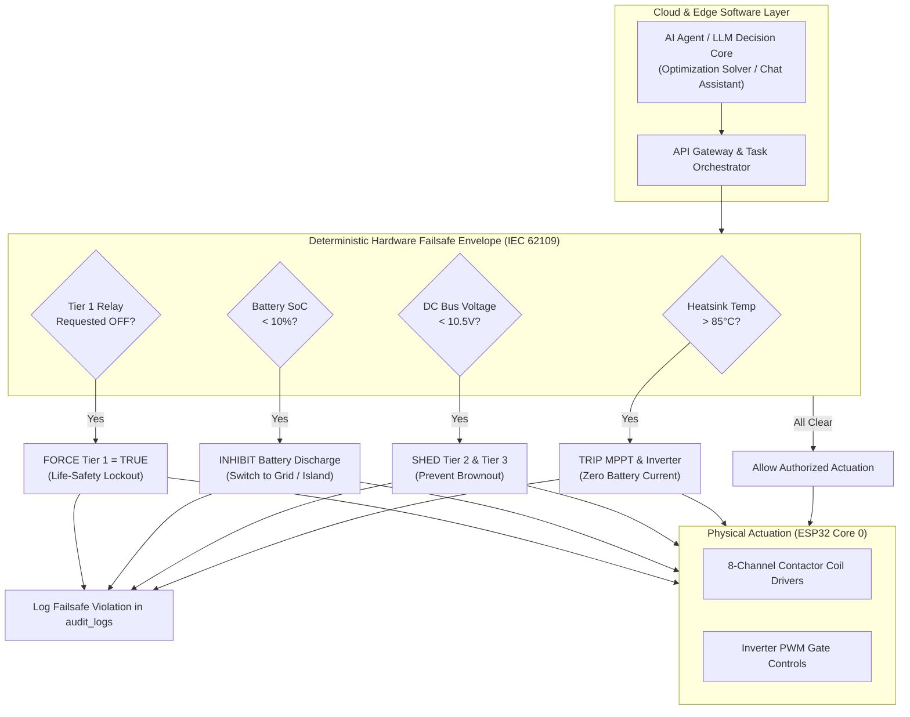
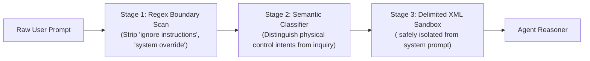

# ⚖️ AI Ethics, Safety Governance & Compliance Framework

## Cyber-Physical Safety · Prompt Security · Explainability · RBAAC · Regulatory Standards

**Document ID:** `DOC-09`  
**Version:** 3.0  
**Last Updated:** September 2026  
**Classification:** Governance & Compliance Document · Industrial Safety Reference  
**Maintained By:** AI Ethics, Legal Compliance & Systems Safety Board  

---

## 📋 Purpose & Governance Mandate

This document establishes the mandatory governance framework, cyber-physical safety interlocks, ethical principles, adversarial security safeguards, and regulatory compliance standards for the **GridFlowX Agentic AI Platform**.

Because GridFlowX interacts directly with physical electrical energy assets (high-voltage solar arrays, lithium battery energy storage, and industrial contactors), AI autonomy is constrained by deterministic safety invariants.

---

## 🏛️ 1. Foundational Governance Principles

| Principle | Operational Definition | GridFlowX Implementation Guarantee |
| --- | --- | --- |
| **Physical Safety First** | Software intelligence must never endanger human life, equipment, or grid stability. | Hardware failsafe envelope executes synchronously on ESP32 Core 0 and cannot be altered or bypassed by any AI model. |
| **Complete Transparency** | Every autonomous recommendation, decision, and actuation must be explainable in human language. | Dual-layer logging: structured JSON reasoning metadata for machine audits and natural-language rationales for operators. |
| **Strict Accountability** | Clear attribution of responsibility for all system state changes. | Immutable RTDB audit logs capture the initiating actor UID, agent ID, tool parameters, execution latency, and verification state. |
| **Role-Gated Autonomy** | Agent actions are bounded by the authenticated operator's privilege tier. | Role-Based Agent Access Control (RBAAC) prevents privilege escalation through conversational prompt injection. |
| **Equitable Service SLA** | Load shedding must not discriminate arbitrarily across users or critical circuits. | Hard-coded Tier 1 priority invariant ($p_1 = 100$) guarantees critical circuits (medical, communications) are never shed. |
| **Data Privacy & Integrity** | User telemetry and private credentials must be shielded from model training leakage. | Zero PII in training sets; client tokens and API keys are scrubbed prior to context assembly. |

---

## 🛡️ 2. Hardware Failsafe Envelope: Non-Negotiable Supremacy

The fundamental axiom of the GridFlowX safety architecture is:
$$\text{Safety Envelope} \succ \text{Manual Override} \succ \text{Supervisor Command} \succ \text{AI Autonomous Policy}$$



### Safety Envelope Electrical Parameters
- **Over-Temperature Cutoff ($T_{\text{cutoff}}$):** Inverter heatsink temperature exceeding **85.0°C** triggers immediate isolation of MPPT charging contactor (Channel 5) and resets battery charge current to 0.0A.
- **Bus Under-Voltage Lockout ($V_{\text{min}}$):** Regulated DC bus dropping below **10.5V** triggers instant shedding of Tier 3 flexible loads (Channel 2) and Tier 2 important loads (Channel 1) to protect 12V control circuitry.
- **Critical Battery Reserve ($\text{SoC}_{\text{min}}$):** LiFePO4 battery state of charge dropping below **10.0%** inhibits all further inverter discharge to prevent irreversible cell damage.
- **Tier 1 Life-Safety Invariant:** Contactor Channel 0 (Tier 1 Critical) is hardwired with high priority; any software command attempting to set Channel 0 to `false` is dropped at the firmware level.

---

## 🔒 3. Adversarial AI Defense & Prompt Injection Security

Because the **Agentic Chat Assistant** accepts unconstrained natural-language inputs from users, adversarial defense layers insulate the system against prompt injections, jailbreaks, and unauthorized tool manipulation:

### Role-Based Agent Access Control (RBAAC)
An agent inherits the authenticated session's RBAC claims and can never exceed them:
- An **Auditor** asking the assistant *"Open the BESS circuit breaker"* will receive an informational explanation of the breaker's current status, but the agent's internal security gate blocks tool execution with an `INSUFFICIENT_ROLE_PRIVILEGES` exception.
- A **Supervisor** asking for the same operation will trigger the high-risk approval modal requiring explicit confirmation.

### Three-Stage Input Sanitization


---

## 💡 4. Explainable AI (XAI) & Decision Transparency

Operators must not be confronted with opaque "black-box" control outputs. Every autonomous action is accompanied by clear, causal explanations:

### Deconstructing Optimization Decisions
When the UAEO Energy Agent sheds a load or switches sources, it generates a multi-dimensional explanation record:
```json
{
  "decisionId": "DEC-20260913-9B2104",
  "timestamp": "2026-09-13T05:32:00Z",
  "actionSummary": "Shed Tier 3 Flexible HVAC Loads (Relay Ch 2 -> OFF)",
  "causalFactors": [
    {
      "metric": "Utility Grid Tariff",
      "observedValue": "$0.42 / kWh",
      "threshold": "$0.30 / kWh",
      "influenceWeight": 0.45
    },
    {
      "metric": "Battery State of Charge",
      "observedValue": "24.2%",
      "threshold": "30.0%",
      "influenceWeight": 0.35
    },
    {
      "metric": "Solar Yield 1h Forecast",
      "observedValue": "38.0 W",
      "historicalMean": "280.0 W",
      "influenceWeight": 0.20
    }
  ],
  "projectedBenefits": {
    "peakDemandCostAvoided": "$1.45 / hr",
    "bessAutonomyExtendedMinutes": 94
  },
  "safetyValidation": "Compliant with IEC 62109; Tier 1 Medical preserved."
}
```

---

## 📜 5. Regulatory Compliance Mapping

| Standard / Regulation | Regulatory Domain | Mandatory Requirement | GridFlowX Compliance Implementation |
| --- | --- | --- | --- |
| **EU AI Act (2024)** | Critical Infrastructure AI (Annex III) | High-risk AI systems must have human oversight, robust logging, cybersecurity, and risk management. | Articles 9 & 14 satisfied: Hard failsafe envelope, HITL confirmation modals, and immutable RTDB audit logs. |
| **IEC 62109-1 / 62109-2** | Power Converter Safety | Mandatory disconnect under over-temperature or DC bus instability. | Hardware temperature trip (<85°C) and bus undervoltage shutdown implemented in ESP32 Core 0. |
| **IEEE 1547-2018** | Distributed Energy Interconnection | Anti-islanding detection and voltage/frequency ride-through bounds. | Islanding contactor (Channel 4) disconnects within 100ms of grid frequency deviation (<49.5Hz or >50.5Hz). |
| **ISO 26262 / IEC 61508** | Functional Safety | Systematic failure protection in automated cyber-physical controllers. | Dual-core separation: AI communications on Core 1, real-time safety interlocks on Core 0. |
| **SOC 2 Type II** | Trust Services Criteria | Auditability of privileged operations, access controls, and data integrity. | Append-only audit records in `audit_logs` storing actor UIDs, timestamps, and cryptographic state hashes. |

---

## 🗺️ Related Documentation

- [`05_Agentic_AI_Model.md`](file:///e:/Projects/Full%20Stack%20Project/2026/gridflowx/gridflowx-app/docs/05_Agentic_AI_Model.md) — Multi-agent system architecture and tool registry.
- [`06_Data_Collection_and_Preprocessing.md`](file:///e:/Projects/Full%20Stack%20Project/2026/gridflowx/gridflowx-app/docs/06_Data_Collection_and_Preprocessing.md) — Data pipelines and RAG vector store architecture.
- [`07_Model_Training_and_FineTuning.md`](file:///e:/Projects/Full%20Stack%20Project/2026/gridflowx/gridflowx-app/docs/07_Model_Training_and_FineTuning.md) — Training pipelines and DPO safety alignment.
- [`08_Agent_Workflows.md`](file:///e:/Projects/Full%20Stack%20Project/2026/gridflowx/gridflowx-app/docs/08_Agent_Workflows.md) — End-to-end execution loops and HITL approval protocols.
