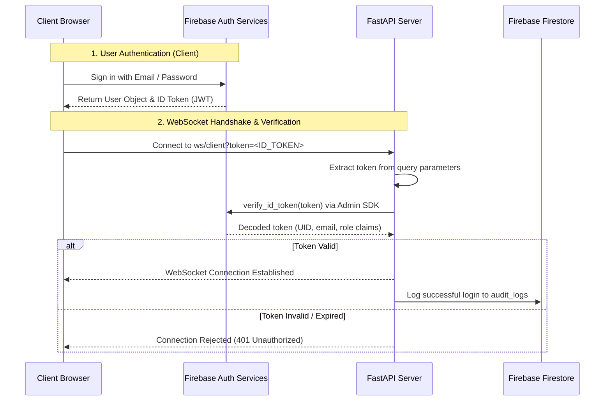

# 🔐 Authentication & Authorization

## Firebase Authentication, Token Validation, Custom Claims, and Backend Session Handling

**Document ID:** `DOC-10`
**Version:** 3.0
**Last Updated:** June 2026
**Classification:** Security Design Document · Engineering Reference
**Maintained By:** Security Engineering Team

---

## 📋 Purpose

This document defines the authentication and authorization design for the GridFlowX platform. The legacy password hashing (bcrypt), token rotation (JWT), and session tracking (Redis) have been replaced by **Firebase Authentication** and **Firebase Admin SDK**.

This document outlines the authentication lifecycle, backend verification protocols, custom claims setup, and role-based permissions.

---

## 🎯 Scope

- Firebase Auth client-side login and authentication lifecycle
- ID Token verification on the FastAPI WebSocket Server
- User roles map (Admin, Supervisor, Operator, Auditor)
- Session handshakes and WebSocket channel validation
- Token expiration and token refresh handling

**Out of Scope:** Firestore security rules (`11_SecurityRules.md`), access control policy details (`12_Access_Control.md`).

---

## 🔗 Dependencies

| Dependency | Version | Purpose |
| --- | --- | --- |
| `firebase-admin` (Python) | Latest | Server-side token validation and Custom Claims |
| `firebase` (Web SDK) | Latest | Client-side user login, signup, and state tracking |

---

## 🔑 Authentication Flow



---

## 🔒 Session & Token Validation

GridFlowX offloads credentials storage, password validation, and token rotation to Firebase Auth.

### 1. Client-Side Token Management
- The Next.js application utilizes the Firebase Web SDK to listen to authentication state changes.
- For server-rendered routing and API protection, Next.js middleware (`src/middleware.ts`) can intercept requests to verify authorization before page load or component rendering.
- Access tokens expire after **1 hour** and are automatically refreshed by the Firebase Client SDK in the background.
- Upon token rotation, the client updates the WebSocket connection parameters or re-authenticates to prevent connection loss.

### 2. FastAPI Token Verification Middleware
For REST endpoints, the FastAPI server validates the client's credentials in a dependency function:

```python
from firebase_admin import auth
from fastapi import Depends, HTTPException, status
from fastapi.security import HTTPBearer, HTTPAuthorizationCredentials

security = HTTPBearer()

async def get_current_user(credentials: HTTPAuthorizationCredentials = Depends(security)):
    token = credentials.credentials
    try:
        # Decodes the token and checks signature/expiration
        decoded_token = auth.verify_id_token(token)
        return decoded_token
    except Exception as e:
        raise HTTPException(
            status_code=status.HTTP_401_UNAUTHORIZED,
            detail="Invalid or expired ID token",
            headers={"WWW-Authenticate": "Bearer"},
        )
```

---

## 👥 Role-Based Access Control (RBAC)

User privileges are controlled using **Firebase Custom Claims** embedded directly within the ID Token. This ensures that user roles are cryptographically signed and tamper-proof.

### Role Hierarchy & Permissions

| Role | Permissions | Use Case |
| --- | --- | --- |
| **Auditor** | Read-only access to telemetry and logs | Compliance reviews, auditing |
| **Operator** | Read telemetry; Write relay manual overrides | Active microgrid routing controls |
| **Supervisor**| Same as Operator + Write alert acknowledgements | Alert resolution and operation oversight |
| **Admin** | Read/Write system configurations; User provisioning | System setup, calibrating sensors, editing rules |

### Setting Custom Claims (Backend Script)
Administrators assign roles using the Admin SDK:

```python
# Set custom user claims for role mapping
auth.set_custom_user_claims(uid, {
    "role": "Operator"
})
```

These claims are verified in FastAPI using custom dependencies to restrict route access:

```python
def require_role(allowed_roles: list[str]):
    async def dependency(current_user: dict = Depends(get_current_user)):
        user_role = current_user.get("role")
        if user_role not in allowed_roles:
            raise HTTPException(
                status_code=status.HTTP_403_FORBIDDEN,
                detail="Insufficient permissions"
            )
        return current_user
    return dependency
```

---

## 📐 Architecture Notes

- Offloading auth to Firebase eliminates the need for database salting, password hashing, and token blacklisting scripts.
- Security boundary is cryptographic; ID Tokens are signed using Google's private keys and validated against the public certificates.
