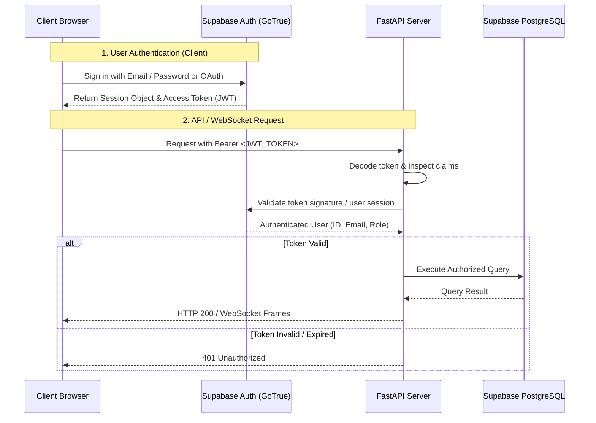

# 🔐 Authentication & Authorization (Supabase Auth)

## Supabase Auth, JWT Validation, Role Claims, and Server-Side Verification

**Document ID:** `DOC-10`  
**Version:** 3.2  
**Classification:** Security Design Document · Engineering Reference  
**Maintained By:** Security Engineering Team  

---

## 📋 Purpose

This document defines the authentication and authorization design for the GridFlowX platform. Identity management, registration, session persistence, and token verification are driven by **Supabase Auth** (`@supabase/supabase-js`, `@supabase/ssr`, and backend GoTrue JWT verification).

---

## 🔑 Authentication Flow

---

## 👥 Role-Based Access Control (RBAC)

User privileges are enforced at two layers:
1. **Application Layer (FastAPI Dependencies):** `require_operator_or_above`, `require_supervisor_or_above`, `require_admin_only`.
2. **Database Layer (Supabase PostgreSQL RLS):** Policies validating `auth.uid()` and `(auth.jwt() ->> 'role')`.

| Role | Hierarchy Weight | Permissions |
| --- | --- | --- |
| **User** | 1 | Basic user view |
| **Auditor** | 2 | Read-only access to telemetry, logs, and compliance records |
| **Operator** | 3 | Real-time telemetry monitoring; Manual relay overrides and load shedding |
| **Supervisor** | 4 | Operator controls + Alert resolution, emergency recovery authorization |
| **Admin** | 5 | Full system configuration, hardware calibration, user management |
