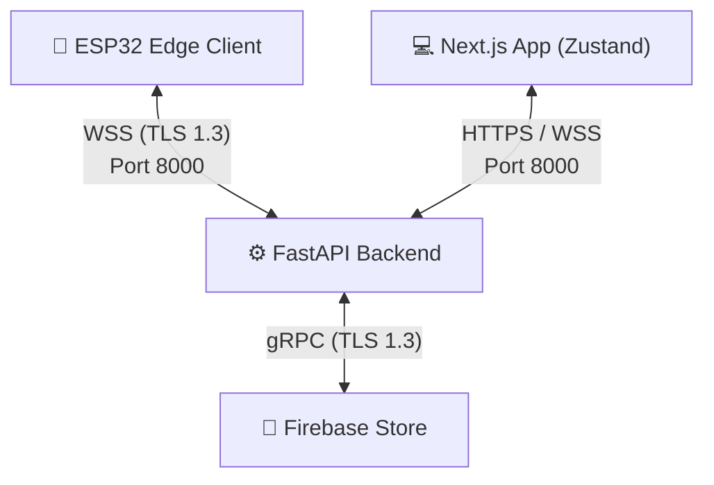

# 🛡️ Security Rules & Compliance

## TLS 1.3, FastAPI CORS, Firestore Security Rules, Rate Limiting, and Secrets Management

**Document ID:** `DOC-11`
**Version:** 3.0
**Last Updated:** June 2026
**Classification:** Security Design Document · Compliance Reference
**Maintained By:** Security Engineering Team

---

## 📋 Purpose

This document defines the security controls, transit encryption, Firestore Security Rules, input validation rules, and secrets management procedures for the GridFlowX platform. With the transition to a serverless, real-time architecture, this design focuses on securing the **FastAPI WebSocket Server** and **Firebase Firestore Database** endpoints.

---

## 🎯 Scope

- Transport Layer Security (TLS) for WebSockets and API communication
- CORS and rate-limiting configurations on the FastAPI backend
- Firebase Firestore Security Rules (role-based read/write checks)
- Pydantic input validation on the backend
- Service Account secrets management

**Out of Scope:** Authentication flow details (`10_Authentication.md`), access control role definitions (`12_Access_Control.md`).

---

## 📌 Assumptions & Constraints

- All production API and WebSocket traffic is served over HTTPS/WSS (TLS 1.3).
- Direct access to Firestore is constrained by Firebase Security Rules.
- The FastAPI backend accesses Firestore via a privileged Firebase Service Account Key stored securely as an environment variable.

---

## 🔒 Transit Encryption

All communication channels traverse secure pathways:



### 1. WebSockets & API Encryption
- All client-to-backend REST API calls use HTTPS with TLS 1.3.
- ESP32 edge telemetry and command messages use secure WebSockets (`wss://`).
- Let's Encrypt certificates are automatically renewed via container routing proxies.

### 2. Firestore Sync Encryption
- Communication between the FastAPI backend and Firebase Firestore is handled via gRPC over TLS 1.3, managed internally by the Firebase Admin SDK.

---

## 🛡️ FastAPI Application Security

### 1. CORS Configuration
In FastAPI, Cross-Origin Resource Sharing is controlled via middleware:

```python
from fastapi.middleware.cors import CORSMiddleware

app.add_middleware(
    CORSMiddleware,
    allow_origins=["https://gridflowx-dashboard.web.app", "http://localhost:3000"],
    allow_credentials=True,
    allow_methods=["GET", "POST", "PUT", "PATCH"],
    allow_headers=["Content-Type", "Authorization"],
)
```

### 2. Rate Limiting
FastAPI limits incoming HTTP and WebSocket requests (e.g., using `slowapi` or custom middleware) to protect against denial-of-service (DDoS) and brute force:
- General REST routes: Max 100 requests per 15-minute window.
- Login and Authentication routes: Max 5 attempts per 15-minute window.

### 3. Pydantic Input Validation
All request payloads are strictly parsed and validated using Pydantic schemas before processing:

```python
from pydantic import BaseModel, Field

class OverridePayload(BaseModel):
    relayIndex: int = Field(..., ge=0, le=7, description="Relay channel index (0-7)")
    newState: bool = Field(..., description="Target state of the relay")
    reason: str = Field(..., min_length=3, max_length=150)
```

---

## 💾 Firebase Firestore Security Rules

To secure direct database reads and writes from the client Next.js web application, the following Firestore Security Rules are deployed:

```javascript
rules_version = '2';
service cloud.firestore {
  match /databases/{database}/documents {

    // Helper: Check if user is authenticated
    function isAuthenticated() {
      return request.auth != null;
    }

    // Helper: Get user role claim
    function getRole() {
      return request.auth.token.role;
    }

    // Collection: Users
    match /users/{userId} {
      allow read: if isAuthenticated();
      allow write: if isAuthenticated() && getRole() == 'Admin';
    }

    // Collection: Telemetry
    match /telemetry/{docId} {
      allow read: if isAuthenticated();
      allow write: if false; // Only FastAPI Admin SDK can write telemetry
    }

    // Collection: Alerts
    match /alerts/{docId} {
      allow read: if isAuthenticated();
      allow update: if isAuthenticated() && (getRole() == 'Supervisor' || getRole() == 'Admin');
      allow create, delete: if false; // Only FastAPI Admin SDK writes/deletes alerts
    }

    // Collection: System Configurations
    match /systemConfigurations/{docId} {
      allow read: if isAuthenticated();
      allow write: if isAuthenticated() && getRole() == 'Admin';
    }

    // Collection: Relay States
    match /relayStates/{docId} {
      allow read: if isAuthenticated();
      allow write: if isAuthenticated() && (getRole() == 'Operator' || getRole() == 'Supervisor' || getRole() == 'Admin');
    }

    // Collection: Audit Logs
    match /audit_logs/{docId} {
      allow read: if isAuthenticated() && (getRole() == 'Auditor' || getRole() == 'Admin');
      allow write: if false; // Only FastAPI Admin SDK writes audit logs
    }
  }
}
```

---

## 🔑 Secrets Management

### Development Environment (`.env`)
```bash
# Environment configurations (local templates only)
FIREBASE_SERVICE_ACCOUNT_JSON=path_to_local_service_account_key.json
OPENWEATHER_API_KEY=your_openweathermap_key
DEVICE_WS_TOKEN=secure_handshake_token_for_esp32
```

### Production Environment
All environment variables are stored in encrypted cloud container secrets. The FastAPI Service Account credentials are provided as an encrypted JSON environment variable, avoiding filesystem keys in containers.
