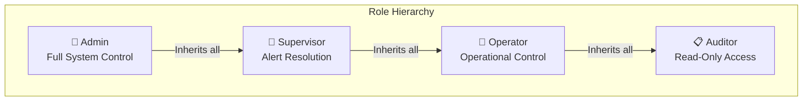

# 🔐 Access Control

## RBAC Policies, API Permissions, Agentic Boundaries, and Firestore Security Mapping

**Document ID:** `DOC-12`
**Version:** 3.0
**Last Updated:** June 2026
**Classification:** Security Design Document · Policy Reference
**Maintained By:** Security Engineering Team

---

## 📋 Purpose

This document defines the access control policies for GridFlowX, covering Role-Based Access Control (RBAC), API endpoint permissions on the FastAPI backend, WebSocket connection channels, database security boundaries in Firebase Firestore, and the operational boundaries of the AI Agent.

---

## 🎯 Scope

- Hierarchical role definitions mapping to Firebase Custom Claims
- FastAPI API and WebSocket channel permissions matrix
- Firebase Firestore Security Rules mapping
- AI Agent execution boundaries and failsafes

**Out of Scope:** Authentication flow (`10_Authentication.md`), network security (`11_SecurityRules.md`).

---

## 📌 Assumptions & Constraints

- All REST API and WebSocket clients include a valid Firebase ID Token (JWT).
- User roles are defined within the token's Custom Claims (`role`).
- Role changes are applied immediately upon client-side token refresh.

---

## 👥 Role Definitions

### Role Specifications

| Role | Description | Access Level | MFA Required |
| --- | --- | --- | --- |
| **Admin** | Full system administration, threshold configurations, user role assignment | Write Configurations, Manage Users | Yes (via Firebase MFA) |
| **Supervisor** | Acknowledges active alerts, monitors system states | Write Alert Acknowledgements | No |
| **Operator** | Performs manual overrides on the 8 relay channels | Write Relay Overrides | No |
| **Auditor** | Moniters live metrics, generates reports and audit trails | Read-Only Access | No |

---

## 🗺️ API & WebSocket Permission Matrix

All endpoints require validation of the Firebase token claims:

### REST API Endpoints

| Method | Endpoint | Allowed Roles | Description |
| --- | --- | --- | --- |
| POST | `/api/v1/auth/claims` | Admin | Set custom role claims for a user UID |
| GET | `/api/v1/telemetry/history` | Auditor, Operator, Supervisor, Admin | Fetch historical telemetry logs |
| POST | `/api/v1/relays/override` | Operator, Supervisor, Admin | Manually toggle one of the 8 relay channels |
| POST | `/api/v1/relays/recovery` | Admin | Authorize system recovery after emergency shutdown |
| PUT | `/api/v1/config/thresholds`| Admin | Update safety limits and thresholds |
| GET | `/api/v1/audit/logs` | Auditor, Admin | Fetch system audit trails |

### WebSocket Channel Permissions

| WebSocket Endpoint | Handshake Auth | Allowed Roles | Type |
| --- | --- | --- | --- |
| `/ws/telemetry` | Token handshake verification | None (ESP32 Edge client only) | Data Ingestion |
| `/ws/client` | Firebase ID Token verification | Auditor, Operator, Supervisor, Admin | State Sync & Overrides |

---

## 🤖 AI Agent Boundaries

The Microgrid Energy Agent executes as a component of the FastAPI runtime. Its privileges are restricted to protect physical hardware:

### Allowed Actions
- Read real-time telemetry from memory buffers and Firestore.
- Generate automated relay switching commands.
- Publish battery charging setpoints to the WebSocket connection manager.
- Create anomaly alerts in the Firestore `alerts` collection.

### Prohibited Actions
- **No modification of safety thresholds:** Failsafe envelopes (stored in `systemConfigurations`) are read-only to the AI Agent.
- **No direct user modifications:** AI cannot alter authentication tables or assign Custom Claims.
- **No failsafe overrides:** The local FreeRTOS firmware safety loop has final authority over any command received from the AI.

---

## 💾 Database-Level Access Control (Firestore Rules)

Database security is enforced directly at the Firebase storage layer using Firestore Security Rules. User access to collections is governed by the `request.auth.token.role` Custom Claim.

- **`users` collection:** Write restricted to `Admin`.
- **`telemetry` collection:** Read-only for authenticated roles. Write restricted to FastAPI Backend Admin SDK.
- **`alerts` collection:** Read for all. Update (`acknowledged` status) allowed for `Supervisor` and `Admin`.
- **`systemConfigurations` collection:** Read for all. Write restricted to `Admin`.
- **`relayStates` collection:** Write allowed for `Operator`, `Supervisor`, and `Admin`.
- **`audit_logs` collection:** Read-only for `Auditor` and `Admin`. Write disabled for client SDKs.
