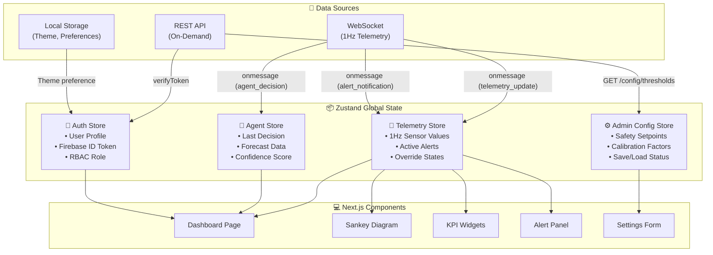

# 📦 State Management

## Zustand Stores, WebSocket Bindings, Agent State, and Caching Strategy

**Document ID:** `DOC-14`
**Version:** 2.0
**Last Updated:** June 2026
**Classification:** Software Design Document (SDD) · Frontend Engineering Reference
**Maintained By:** Frontend Engineering Team

---

## 📋 Purpose

This document specifies the global state management architecture for the GridFlowX Next.js frontend, detailing Zustand store implementations, real-time WebSocket telemetry bindings, agent state handling, and client-side caching strategies.

## 🎯 Scope

- Client state architecture overview
- Zustand store implementations (Auth, Telemetry, Admin Config)
- WebSocket connection management and room subscriptions
- Agent state representation in the frontend
- Caching strategy for historical data queries
- State flow diagrams and data lifecycle

**Out of Scope:** UI component design (`13_UI_UX_Guidelines.md`), CSS styling (`15_Styling.md`).

## 🔗 Dependencies

| Dependency | Version | Purpose |
| ---------- | ------- | ------- |
| `next`     | 15.x    | React framework for production |
| `react`    | 19.x    | UI library |

## 📌 Assumptions

- WebSocket connections are persistent during authenticated sessions
- Telemetry updates arrive at exactly 1Hz from the backend
- Historical data queries are cached for the session duration
- Store updates trigger minimal component re-renders via selector patterns

## ⚠️ Constraints

- Maximum 1 WebSocket connection per browser tab
- Zustand stores must be accessible from non-component contexts (WebSocket callbacks)
- Historical data cache is limited to browser memory (no IndexedDB)

---

## 🏗️ Client State Architecture



---

## 💻 Store Implementations

### 1. Authentication Store

```javascript
import { create } from 'zustand';
import { getAuth, signInWithEmailAndPassword, signOut as fbSignOut } from 'firebase/auth';

export const useAuthStore = create((set, get) => ({
  // State
  user: null,
  idToken: null,
  isAuthenticated: false,
  role: 'Auditor',
  theme: 'dark',
  isLoading: true,

  // Actions
  login: async (email, password) => {
    set({ isLoading: true });
    try {
      const auth = getAuth();
      const userCredential = await signInWithEmailAndPassword(auth, email, password);
      const token = await userCredential.user.getIdToken();
      
      // Parse custom claims for role
      const idTokenResult = await userCredential.user.getIdTokenResult();
      const role = idTokenResult.claims.role || 'Auditor';

      set({
        user: userCredential.user,
        idToken: token,
        isAuthenticated: true,
        role,
        isLoading: false
      });
      
      // Initialize telemetry websocket
      initializeWebSocket(token);
    } catch (err) {
      console.error('Login failed:', err);
      set({ isLoading: false });
      throw err;
    }
  },

  logout: async () => {
    disconnectWebSocket();
    const auth = getAuth();
    await fbSignOut(auth);
    set({
      user: null,
      idToken: null,
      isAuthenticated: false,
      role: 'Auditor'
    });
  },

  setTheme: (theme) => set({ theme }),

  // Selectors
  isAdmin: () => get().role === 'Admin',
  isOperator: () => ['Admin', 'Operator', 'Supervisor'].includes(get().role),
  canOverride: () => ['Admin', 'Operator', 'Supervisor'].includes(get().role)
}));
```

### 2. Telemetry Store

```javascript
import { create } from 'zustand';

export const useTelemetryStore = create((set, get) => ({
  // Real-time metrics (updated at 1Hz)
  metrics: {
    solar_power_w: 0.0,
    load_power_w: 0.0,
    battery_soc_percent: 0.0,
    bus_voltage_v: 0.0,
    heatsink_temp_c: 0.0,
    ambient_temp_c: 0.0,
    grid_power_w: 0.0,
    voltage_ripple_v: 0.0
  },

  // Relay states
  relays: {
    tier1_relay: true,
    tier2_relay: false,
    tier3_relay: false,
    mppt_enable: false,
    grid_fallback: true
  },

  // Active alerts
  alerts: [],
  unreadAlertCount: 0,

  // Override state
  overrideActive: false,
  overrideExpiresAt: null,

  // Connection status
  isConnected: false,
  lastUpdateTimestamp: null,

  // Actions
  updateTelemetry: (payload) => set({
    metrics: payload.metrics,
    relays: payload.relays,
    alerts: payload.alerts || get().alerts,
    lastUpdateTimestamp: Date.now(),
    isConnected: true
  }),

  addAlert: (alert) => set((state) => ({
    alerts: [alert, ...state.alerts].slice(0, 100), // Keep last 100
    unreadAlertCount: state.unreadAlertCount + 1
  })),

  acknowledgeAlert: (alertId) => set((state) => ({
    alerts: state.alerts.map(a =>
      a.id === alertId ? { ...a, acknowledged: true } : a
    ),
    unreadAlertCount: Math.max(0, state.unreadAlertCount - 1)
  })),

  setOverrideState: (isActive, expiresAt) => set({
    overrideActive: isActive,
    overrideExpiresAt: expiresAt
  }),

  setConnectionStatus: (connected) => set({ isConnected: connected })
}));
```

### 3. Admin Config Store

```javascript
import { create } from 'zustand';
import axios from 'axios';

export const useConfigStore = create((set, get) => ({
  // Safety thresholds
  thresholds: {
    soc_tier2_shed: 40,
    soc_tier3_shed: 30,
    temp_warning: 70,
    temp_shutdown: 85,
    voltage_ripple_max: 1.2
  },

  // Calibration coefficients
  calibration: {
    acs712_offset: 2.500,
    acs712_scale: 0.185,
    divider_ratio: 3.703
  },

  // UI state
  isLoading: false,
  isSaving: false,
  hasUnsavedChanges: false,
  lastSaved: null,

  // Actions
  loadConfig: async () => {
    set({ isLoading: true });
    try {
      const token = useAuthStore.getState().idToken;
      const res = await axios.get('/api/v1/config/thresholds', {
        headers: { Authorization: `Bearer ${token}` }
      });
      set({
        thresholds: res.data.thresholds,
        calibration: res.data.calibration,
        isLoading: false,
        hasUnsavedChanges: false
      });
    } catch (err) {
      console.error('Config load failed:', err);
      set({ isLoading: false });
    }
  },

  updateThreshold: (key, value) => set((state) => ({
    thresholds: { ...state.thresholds, [key]: value },
    hasUnsavedChanges: true
  })),

  saveConfig: async () => {
    set({ isSaving: true });
    try {
      const token = useAuthStore.getState().idToken;
      const { thresholds, calibration } = get();
      await axios.put('/api/v1/config/thresholds',
        { thresholds, calibration },
        { headers: { Authorization: `Bearer ${token}` } }
      );
      set({ isSaving: false, hasUnsavedChanges: false, lastSaved: Date.now() });
    } catch (err) {
      console.error('Config save failed:', err);
      set({ isSaving: false });
    }
  },

  restoreDefaults: async () => {
    const token = useAuthStore.getState().idToken;
    await axios.post('/api/v1/config/restore-defaults',
      {}, { headers: { Authorization: `Bearer ${token}` } }
    );
    await get().loadConfig();
  }
}));
```

### 4. Agent State Store

```javascript
import { create } from 'zustand';

export const useAgentStore = create((set) => ({
  // Last AI decision
  lastDecision: null,
  decisionTimestamp: null,
  confidence: 0,

  // Forecast data
  solarForecast: [],  // 4-step, 1-hour ahead
  loadForecast: [],   // 4-step, 1-hour ahead

  // Anomaly scores
  anomalyScores: {
    solar_panel: 0,
    battery_bms: 0,
    grid_rectifier: 0,
    relay_matrix: 0,
    dc_bus_capacitor: 0
  },

  // Agent explanation
  explanation: '',

  // Actions
  updateAgentState: (decision) => set({
    lastDecision: decision.relay_commands,
    decisionTimestamp: Date.now(),
    confidence: decision.confidence,
    solarForecast: decision.predictions.solar_forecast_w,
    loadForecast: decision.predictions.load_forecast_w,
    anomalyScores: decision.predictions.component_failure_probabilities,
    explanation: decision.explanation || ''
  })
}));
```

---

## 🔌 WebSocket Connection Management

```javascript
let socket = null;

export function initializeWebSocket(token) {
  if (socket && socket.readyState === WebSocket.OPEN) return;

  const wsUrl = `${process.env.NEXT_PUBLIC_WS_URL || 'ws://localhost:8000'}/ws/client?token=${token}`;
  socket = new WebSocket(wsUrl);

  socket.onopen = () => {
    console.log('[WS] Connected to GridFlowX telemetry stream');
    useTelemetryStore.getState().setConnectionStatus(true);
  };

  socket.onmessage = (event) => {
    try {
      const data = JSON.parse(event.data);
      const { type, payload } = data;

      switch (type) {
        case 'telemetry_update':
          useTelemetryStore.getState().updateTelemetry(payload);
          break;
        case 'alert_notification':
          useTelemetryStore.getState().addAlert(payload);
          break;
        case 'agent_decision':
          useAgentStore.getState().updateAgentState(payload);
          break;
        default:
          console.warn('[WS] Unknown event type:', type);
      }
    } catch (err) {
      console.error('[WS] Failed to parse message:', err);
    }
  };

  socket.onclose = (event) => {
    console.log(`[WS] Disconnected: Code ${event.code}, Reason: ${event.reason}`);
    useTelemetryStore.getState().setConnectionStatus(false);
  };

  socket.onerror = (error) => {
    console.error('[WS] Connection error:', error);
    useTelemetryStore.getState().setConnectionStatus(false);
  };
}

export function disconnectWebSocket() {
  if (socket) {
    socket.close();
    socket = null;
  }
}
```

---

## 💾 Caching Strategy

### Historical Data Cache

```javascript
const queryCache = new Map();
const CACHE_MAX_SIZE = 50; // Max cached queries

export async function fetchHistoricalData(params) {
  const cacheKey = JSON.stringify(params);

  // Check cache first
  if (queryCache.has(cacheKey)) {
    console.log('[Cache] Hit:', cacheKey);
    return queryCache.get(cacheKey);
  }

  // Cache miss — fetch from API
  const token = useAuthStore.getState().idToken;
  const response = await axios.get('/api/v1/telemetry/historical', {
    params,
    headers: { Authorization: `Bearer ${token}` }
  });

  // Store in cache (LRU eviction)
  if (queryCache.size >= CACHE_MAX_SIZE) {
    const oldestKey = queryCache.keys().next().value;
    queryCache.delete(oldestKey);
  }
  queryCache.set(cacheKey, response.data);

  return response.data;
}
```

### Cache Invalidation

| Event | Action | Reason |
| --- | --- | --- |
| User logout | Clear all caches | Security: prevent stale data access |
| Config save | Clear config cache | Ensure fresh thresholds |
| Tab visibility change | Refresh telemetry connection | Stale data after background |
| 30-minute idle | Clear historical cache | Memory management |

---

## 📐 Architecture Notes

- Zustand is chosen over Redux because WebSocket event handlers need to update state **outside React/Next.js component lifecycles**. Zustand's `getState()` API enables this without middleware.
- To prevent SSR hydration mismatches in Next.js, Zustand stores containing client-only persisted state are wrapped in custom client-side mounting checks or loaded dynamically with SSR disabled.
- The Auth store uses `persist` middleware with `partialize` to only persist the refresh token and theme preference — never the access token (short-lived, regenerated on each session).
- The Telemetry store limits alert history to 100 items to prevent memory leaks in long-running sessions.

## 👨‍💻 Developer Notes

- Use **selectors** to prevent unnecessary re-renders: `useTelemetryStore(state => state.metrics.solar_power_w)`
- The WebSocket manager is a standalone module (not a Next.js/React hook) so it can be initialized once and shared
- Store files are located in `src/store/`
- For debugging, install the Zustand DevTools browser extension

## 🏆 Recruiter & Portfolio Notes

> **Frontend Architecture:** The state management design demonstrates advanced Next.js patterns — Zustand for minimal boilerplate, non-component state access for WebSocket callbacks, persisted auth state, LRU caching for expensive queries, and selective re-rendering via store selectors. The separation of stores by domain (Auth, Telemetry, Config, Agent) follows single-responsibility principles while enabling cross-store communication.

## ✅ Best Practices

1. **Use Selectors:** Always subscribe to specific state slices, not entire stores
2. **Immutable Updates:** Use spread operators or `immer` middleware for nested state updates
3. **Cache with Limits:** Historical data cache has size limits and automatic eviction
4. **Clean Disconnect:** Always disconnect WebSocket on logout to prevent stale connections

## 🔮 Future Enhancements

- **Offline Support:** IndexedDB-backed persistence for offline dashboard viewing
- **Optimistic Updates:** Immediately reflect override actions before server confirmation
- **Time-Travel Debugging:** Record and replay state changes for debugging
- **Server-Sent Events (SSE):** Alternative to WebSocket for one-way telemetry streams

## 🗺️ Related Documents

| Document | Purpose |
| --- | --- |
| `13_UI_UX_Guidelines.md` | How state drives component rendering |
| `15_Styling.md` | CSS integration with state-driven classes |
| `04_System_Architecture.md` | WebSocket protocol specifications |
| `08_Agent_Workflows.md` | Agent state updates from the backend |
