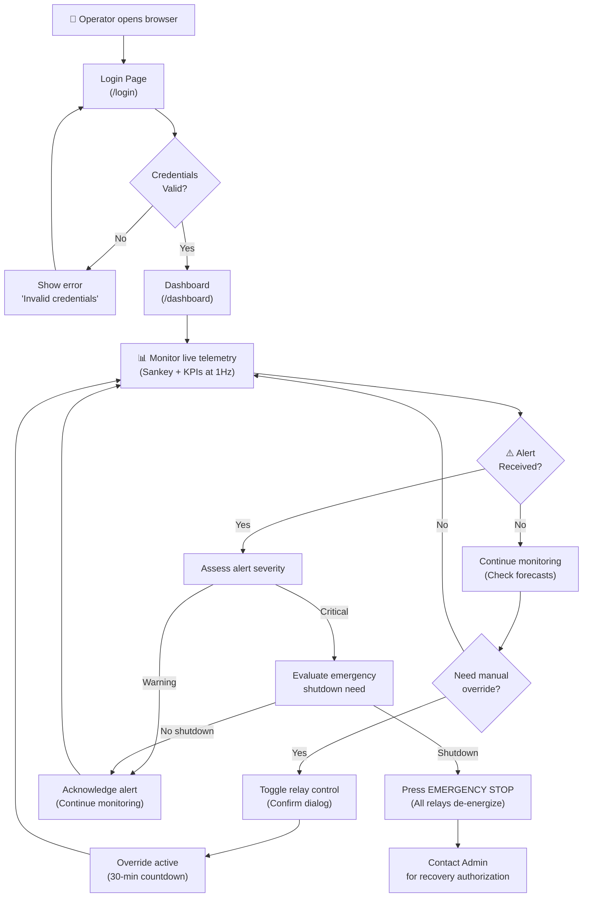
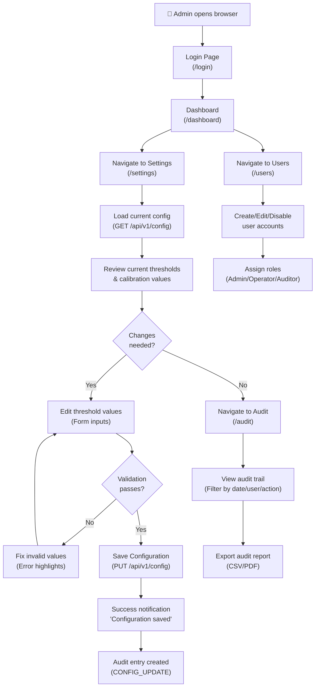
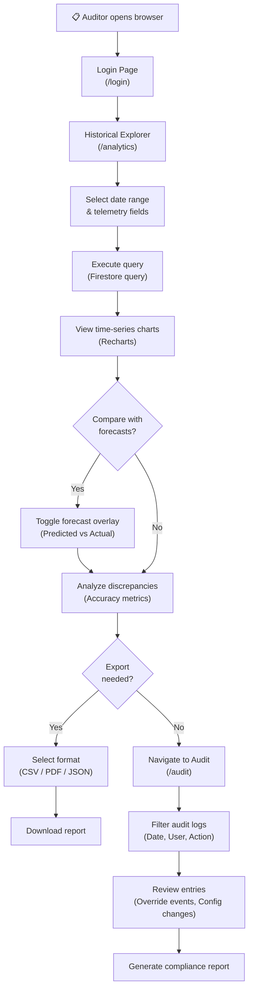
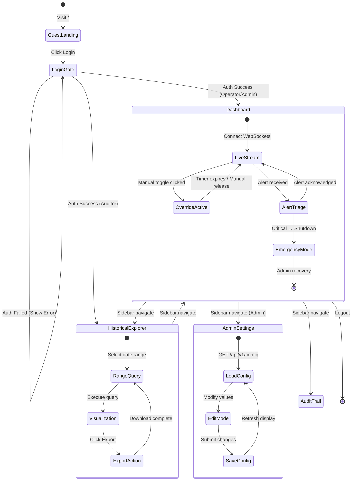

# 🗺️ User Journey Flows

## Persona-Based Interaction Flows, Navigation Patterns, and AI-Driven Interactions

**Document ID:** `DOC-16`
**Version:** 2.0
**Last Updated:** June 2026
**Classification:** UX Design Document · Product Specification
**Maintained By:** UI/UX Architecture Team

---

## 📋 Purpose

This document maps the complete user journey flows for each persona, defining navigation patterns, page transitions, AI-driven interaction patterns, and task completion workflows across the GridFlowX web application.

## 🎯 Scope

- User journey maps for Operator, Admin, and Auditor personas
- Page routing and access control per role
- Dashboard interaction flows (real-time monitoring, overrides, alerts)
- AI-driven interaction patterns (decision explanations, forecast displays)
- Navigation state transitions

**Out of Scope:** UI component specifications (`13_UI_UX_Guidelines.md`), state management (`14_StateManagement.md`).

---

## 🗺️ Page Routing & Access

| Route | Page Title | Public | Auditor | Operator | Admin |
| --- | --- | --- | --- | --- | --- |
| `/` | System Overview | ✅ | ✅ | ✅ | ✅ |
| `/login` | Authentication Gate | ✅ | — | — | — |
| `/dashboard` | Operations Console | ❌ | ✅ | ✅ | ✅ |
| `/analytics` | Historical Explorer | ❌ | ✅ | ✅ | ✅ |
| `/settings` | System Settings | ❌ | ❌ | ❌ | ✅ |
| `/audit` | Audit Trail | ❌ | ✅ | ✅ | ✅ |
| `/users` | User Management | ❌ | ❌ | ❌ | ✅ |

---

## 🔧 Journey 1: Grid Operator — Daily Monitoring



### Key Interaction Points

1. **Dashboard Load:** WebSocket connects → joins `telemetry_live` room → KPI widgets populate
2. **Alert Handling:** Alert badge increments → click notification bell → alert detail panel slides in
3. **Override Flow:** Click relay toggle → confirmation modal → enter reason → submit → countdown starts
4. **Forecast Check:** Scroll to forecast panel → hover over chart → see predicted vs. actual overlay

---

## 👑 Journey 2: System Administrator — Configuration Management



### Key Interaction Points

1. **Settings Form:** Load existing values → edit inline → unsaved changes indicator → save button
2. **Restore Defaults:** Click "Restore Factory Defaults" → double-confirmation modal → config reset
3. **User Management:** View user list → click user row → edit role dropdown → save → audit logged
4. **Audit Review:** Date range picker → filter by action type → paginated results → export button

---

## 📋 Journey 3: Compliance Auditor — Report Generation



---

## 🔀 Page Navigation State Machine



---

## 🤖 AI-Driven Interaction Patterns

### Decision Explanation Display

When the UAEO agent makes a routing decision, the dashboard displays:

```
┌─────────────────────────────────────────────────────────────┐
│  🧠 AI Decision (2 minutes ago)                    [Details] │
│                                                               │
│  "Discharging battery at 3.2A — peak tariff hour detected.  │
│   Tier 3 loads maintained. Solar forecast: 420W (strong)."   │
│                                                               │
│  Confidence: ████████░░ 82%    Latency: 22.8ms               │
└─────────────────────────────────────────────────────────────┘
```

### Forecast Overlay Interaction

```
┌─────────────────────────────────────────────────────────────┐
│  ☀️ Solar Forecast vs Actual                                  │
│                                                               │
│  Power (W)                                                    │
│   800 │           ╱─╲  ← Forecast (dashed)                   │
│   600 │         ╱    ╲                                        │
│   400 │   ────╱        ╲── ← Actual (solid)                  │
│   200 │  ╱                ╲                                   │
│     0 ┼──────────────────────                                 │
│       Now    +15m    +30m    +45m    +60m                     │
│                                                               │
│  95% Confidence Band: [shaded region]                         │
└─────────────────────────────────────────────────────────────┘
```

### Anomaly Alert Interaction

When the anomaly detection head flags a component:

1. **Alert Toast:** Red notification slides in from top-right
2. **Component Highlight:** The affected component pulses red in the Sankey diagram
3. **Detail Panel:** Click alert → side panel shows failure probability, recommended action, historical trend
4. **Acknowledge Flow:** Operator reviews → clicks "Acknowledge" → enters notes → alert status updates

---

## 📐 Architecture Notes

- User journey flows are implemented via Next.js App Router with automatic code splitting and server rendering per page
- The sidebar navigation persists across all authenticated pages (no full page reloads)
- WebSocket connections persist across page navigation within the authenticated session
- The AI decision display updates independently of telemetry updates (event-driven)

## 👨‍💻 Developer Notes

- Route guards are implemented in `src/middleware.ts` for edge redirects, alongside role validation checks
- Page routes are automatically split and pre-fetched using Next.js Link component and folder-based routing
- Navigation state is managed by Next.js Navigation (`next/navigation`); authenticated state by Zustand Auth store
- The alert notification bell uses a badge counter from `useTelemetryStore.unreadAlertCount`

## 🏆 Recruiter & Portfolio Notes

> **UX Engineering:** The user journey flows demonstrate deep understanding of role-based UX design — each persona has tailored navigation paths, appropriate permission boundaries, and task-specific workflows. The AI-driven interaction patterns (decision explanations, forecast overlays, anomaly alerts) show how AI outputs are communicated to human operators in a clear, actionable manner.

## ✅ Best Practices

1. **Role-Appropriate Defaults:** Each role lands on the most relevant page after login
2. **Progressive Disclosure:** Show summary first, details on demand
3. **Confirm Destructive Actions:** Emergency shutdown, configuration changes, and user deletion require confirmation
4. **Persistent Navigation:** Sidebar stays visible; page transitions don't lose WebSocket context

## 🔮 Future Enhancements

- **Onboarding Tour:** First-time user guided tour with tooltips
- **Keyboard Shortcuts:** Power user shortcuts (e.g., `Ctrl+E` for emergency stop)
- **Voice Commands:** "Alexa, what's the battery status?" via voice API integration
- **Mobile App:** React Native companion app for field technicians

## 🗺️ Related Documents

| Document | Purpose |
| --- | --- |
| `13_UI_UX_Guidelines.md` | Visual design system driving these flows |
| `14_StateManagement.md` | State management powering UI interactions |
| `02_Features_and_Functionality.md` | Feature requirements these flows implement |
| `12_Access_Control.md` | Permission rules enforcing role boundaries |
