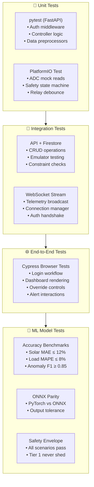

# 🧪 Testing Strategies & Quality Assurance

## Unit Testing, Integration Testing, E2E, ML Model Testing, and CI Pipeline

**Document ID:** `DOC-17`
**Version:** 2.0
**Last Updated:** June 2026
**Classification:** Quality Assurance Document · Engineering Reference
**Maintained By:** QA Engineering Team

---

## 📋 Purpose

This document outlines the comprehensive testing methodology for GridFlowX, covering unit tests, integration tests, end-to-end (E2E) tests, ML model validation, firmware mock tests, and continuous integration pipeline configuration.

## 🎯 Scope

- Testing architecture and methodology across all system layers
- Unit test implementations (pytest)
- Integration test implementations (API + Firestore + WebSockets)
- End-to-end test implementations (Cypress)
- ML model validation and accuracy benchmarking
- Coverage targets and quality gates
- CI pipeline test automation

**Out of Scope:** Performance benchmarking (`18_Performance_Benchmarking.md`), model drift monitoring (`19_Model_Drift_Monitoring.md`).

## 🔗 Dependencies

| Tool | Version | Layer |
| --- | --- | --- |
| pytest | 7.x | Python FastAPI backend unit/integration |
| httpx | Latest | Async HTTP API client |
| Cypress | 13.x | Frontend E2E testing |
| PlatformIO Test | Latest | Firmware mock testing |
| GitHub Actions | Latest | CI/CD pipeline |

## 📌 Assumptions

- All tests run in isolated environments (Firebase Emulators, mocked WebSocket channels)
- Test data fixtures are version-controlled alongside test code
- CI pipeline blocks merges if any test fails
- Code coverage reports are generated and tracked per PR

## ⚠️ Constraints

- Integration tests require Firebase Emulators or mocked Firestore references
- E2E tests require a running frontend dev server
- ML model tests must use deterministic seeds for reproducibility
- Total CI pipeline time target: < 10 minutes

---

## 🏗️ Testing Architecture



---

## 💻 Unit Test Implementations

### 1. Backend API & AI Tests (pytest)

```python
import pytest
from httpx import AsyncClient
from app.main import app
from unittest.mock import patch, AsyncMock

@pytest.mark.asyncio
async def test_require_role_decorator_auditor_denied():
    """Verify that Auditor role cannot execute relay overrides."""
    async with AsyncClient(app=app, base_url="http://test") as ac:
        # Mock ID Token verification to return Auditor role
        with patch("app.core.auth.verify_id_token", return_value={"uid": "user1", "role": "Auditor"}):
            headers = {"Authorization": "Bearer MOCK_TOKEN"}
            response = await ac.post("/api/v1/relays/override", 
                                     json={"relayIndex": 2, "newState": True, "reason": "Test"},
                                     headers=headers)
            assert response.status_code == 403

@pytest.mark.asyncio
async def test_require_role_operator_allowed():
    """Verify that Operator role can execute relay overrides."""
    async with AsyncClient(app=app, base_url="http://test") as ac:
        with patch("app.core.auth.verify_id_token", return_value={"uid": "user2", "role": "Operator"}):
            headers = {"Authorization": "Bearer MOCK_TOKEN"}
            # Mock the connection manager broadcast
            with patch("app.services.connection_manager.broadcast_to_clients", new_callable=AsyncMock):
                response = await ac.post("/api/v1/relays/override", 
                                         json={"relayIndex": 2, "newState": True, "reason": "Test"},
                                         headers=headers)
                assert response.status_code == 200
```
```

### 3. Dashboard E2E Tests (Cypress)

```javascript
describe('GridFlowX Dashboard E2E Workflow', () => {
  beforeEach(() => {
    cy.visit('/login');
    cy.get('input[name="username"]').type('operator01');
    cy.get('input[name="password"]').type('securepassword');
    cy.get('button[type="submit"]').click();
    cy.url().should('include', '/dashboard');
  });

  it('should load real-time telemetry metrics', () => {
    cy.get('[data-testid="kpi-soc"]').should('be.visible');
    cy.get('[data-testid="kpi-voltage"]').should('be.visible');
    cy.get('[data-testid="sankey-diagram"]').should('be.visible');
  });

  it('should display connection status indicator', () => {
    cy.get('[data-testid="connection-status"]')
      .should('contain', 'ONLINE');
  });

  it('should allow relay override and show warning banner', () => {
    cy.get('[data-testid="relay-override-t3"]').click();
    cy.get('[data-testid="confirm-override-btn"]').click();
    cy.get('[data-testid="override-alert-banner"]').should('be.visible');
    
    // Verify override can be deactivated
    cy.get('[data-testid="relay-override-t3"]').click();
    cy.get('[data-testid="override-alert-banner"]').should('not.exist');
  });

  it('should restrict settings access for Operator role', () => {
    cy.visit('/settings');
    cy.get('[data-testid="access-denied"]').should('be.visible');
  });
});
```

---

## 📊 Coverage Targets & Quality Gates

| Layer | Tool | Coverage Target | Quality Gate |
| --- | --- | --- | --- |
| **Backend (FastAPI)** | pytest + Coverage.py | ≥ 85% line coverage | PR blocks below 80% |
| **Frontend (Next.js)** | Vitest + React Testing Library | ≥ 70% component coverage | PR blocks below 65% |
| **E2E** | Cypress | 100% critical paths | All critical flows pass |
| **ML Models** | Custom benchmark suite | All accuracy targets met | MAE/MAPE within bounds |

---

## 🔁 CI Pipeline Integration

```yaml
name: GridFlowX Test Pipeline

on:
  pull_request:
    branches: [main, develop]

jobs:
  test-backend:
    runs-on: ubuntu-latest
    steps:
      - uses: actions/checkout@v3
      - uses: actions/setup-python@v4
        with: { python-version: '3.11' }
      - run: cd backend && pip install -r requirements.txt pytest coverage httpx
      - run: cd backend && coverage run -m pytest && coverage report

  test-e2e:
    runs-on: ubuntu-latest
    needs: [test-backend]
    steps:
      - uses: actions/checkout@v3
      - uses: actions/setup-node@v3
        with: { node-version: 18 }
      - run: cd frontend && npm ci
      - run: cd frontend && npm run test:e2e
```

---

## 📐 Architecture Notes

- Tests use **isolated environments** — each test suite spins up its own database schema and tears it down after
- ML model tests use **deterministic seeds** (`torch.manual_seed(42)`, `np.random.seed(42)`) for reproducible results
- E2E tests use **API interception** (Cypress `cy.intercept()`) for stable, network-independent testing

## 👨‍💻 Developer Notes

- Run backend tests: `cd backend && pytest`
- Run E2E tests: `cd frontend && npm run test:e2e`
- Coverage reports are auto-generated in `coverage/` directories

## 🏆 Recruiter & Portfolio Notes

> **Testing Maturity:** The testing strategy covers all layers — unit (Jest/Pytest), integration (API+DB), E2E (Cypress), and ML-specific testing (accuracy benchmarks, ONNX parity, safety envelope verification). The CI pipeline automates all tests on every PR with coverage tracking and quality gates. This demonstrates production-grade QA engineering practices.

## ✅ Best Practices

1. **Test in Isolation:** Each test is independent; no shared mutable state
2. **Mock External Dependencies:** WebSocket channels, weather API, and Firestore are mocked in tests
3. **Deterministic Seeds:** All ML tests use fixed random seeds for reproducibility
4. **Fast Feedback:** Unit tests complete in < 30 seconds; total CI < 10 minutes

## 🔮 Future Enhancements

- **Visual Regression Testing:** Percy or Chromatic for UI screenshot comparison
- **Chaos Engineering:** Inject failures (network drops, service crashes) to test resilience
- **Property-Based Testing:** Hypothesis (Python) for generative test case discovery
- **Contract Testing:** Pact for API contract verification between services

## 🗺️ Related Documents

| Document | Purpose |
| --- | --- |
| `18_Performance_Benchmarking.md` | Performance and load testing |
| `19_Model_Drift_Monitoring.md` | Continuous model validation |
| `20_Deployment.md` | CI/CD pipeline configuration |
| `17_Testing.md` | This document |
