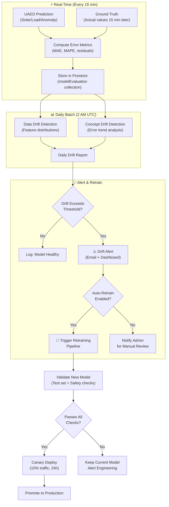
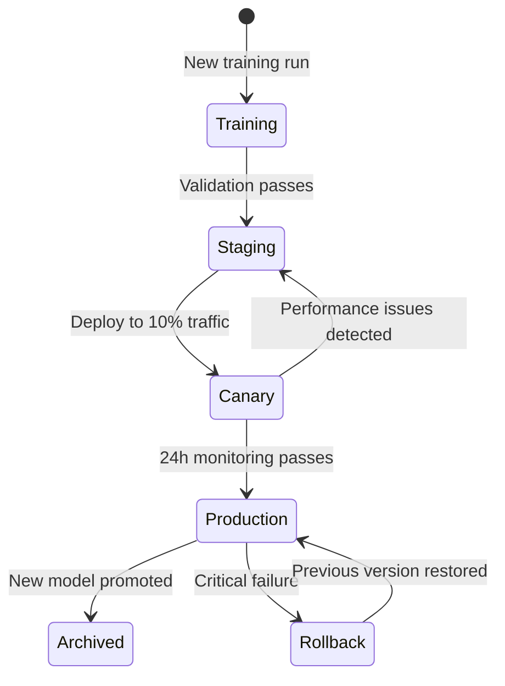

# 📉 Model Drift Monitoring

## Continuous Evaluation, Drift Detection, Retraining Triggers, and Model Versioning

**Document ID:** `DOC-19`
**Version:** 2.0
**Last Updated:** June 2026
**Classification:** MLOps Document · Engineering Reference
**Maintained By:** AI Systems Architecture Team

---

## 📋 Purpose

This document defines the continuous model evaluation pipeline, data distribution drift detection algorithms, performance degradation alerts, automated retraining triggers, and model versioning strategy for the UAEO AI system.

## 🎯 Scope

- Continuous evaluation pipeline architecture
- Data drift detection (covariate shift, concept drift)
- Model performance degradation monitoring
- Automated retraining triggers and workflows
- Model versioning with MLflow
- A/B testing and canary deployment for new models
- Rollback procedures for failing models

**Out of Scope:** Model architecture (`05_Agentic_AI_Model.md`), training procedures (`07_Model_Training_and_FineTuning.md`).

## 📌 Assumptions

- Ground truth labels (actual solar/load values) are available within 15 minutes of prediction
- The MLflow model registry is running and accessible
- Drift detection runs as a daily batch job
- Retraining uses the most recent 180 days of data

## ⚠️ Constraints

- Drift detection must not impact real-time inference latency
- Retraining pipeline must complete within 8 hours (weekend window)
- Only one model version can be active in production at a time
- Rollback must be possible within 5 minutes

---

## 🏗️ Monitoring Pipeline Architecture



---

## 📊 Drift Detection Algorithms

### 1. Data Drift (Covariate Shift)

Detects when input feature distributions change significantly from training data.

```python
from scipy import stats

class DataDriftDetector:
    def __init__(self, reference_data, feature_names):
        self.reference = reference_data
        self.features = feature_names
        self.thresholds = {
            'ks_pvalue': 0.01,    # KS test p-value
            'psi_threshold': 0.2  # Population Stability Index
        }

    def detect_drift(self, current_data):
        """
        Run drift detection on current data vs. reference.
        Returns: dict of feature -> drift_result
        """
        results = {}
        for i, feature in enumerate(self.features):
            ref = self.reference[:, i]
            cur = current_data[:, i]

            # Kolmogorov-Smirnov test
            ks_stat, ks_pvalue = stats.ks_2samp(ref, cur)

            # Population Stability Index
            psi = self._compute_psi(ref, cur, bins=10)

            drifted = (ks_pvalue < self.thresholds['ks_pvalue'] or
                      psi > self.thresholds['psi_threshold'])

            results[feature] = {
                'ks_statistic': ks_stat,
                'ks_pvalue': ks_pvalue,
                'psi': psi,
                'drifted': drifted
            }

        return results

    def _compute_psi(self, reference, current, bins=10):
        """Population Stability Index."""
        ref_hist, edges = np.histogram(reference, bins=bins)
        cur_hist, _ = np.histogram(current, bins=edges)

        ref_pct = (ref_hist + 1) / (len(reference) + bins)
        cur_pct = (cur_hist + 1) / (len(current) + bins)

        psi = np.sum((cur_pct - ref_pct) * np.log(cur_pct / ref_pct))
        return psi
```

### 2. Concept Drift (Performance Degradation)

Detects when model accuracy degrades over time, even if input distributions remain stable.

```python
class ConceptDriftDetector:
    def __init__(self, window_size=96*7):  # 7 days of 15-min intervals
        self.window_size = window_size
        self.thresholds = {
            'solar_mae': 0.15,      # 15% MAE trigger
            'load_mape': 0.10,      # 10% MAPE trigger
            'anomaly_f1': 0.80,     # F1 drop below 0.80
            'trend_slope': 0.001    # Rising error trend
        }

    def detect_drift(self, error_history):
        """
        Analyze error trends over the monitoring window.
        """
        recent = error_history[-self.window_size:]

        # Rolling average check
        solar_mae = np.mean(np.abs(recent['solar_error']))
        load_mape = np.mean(np.abs(recent['load_error'] / recent['load_actual']))

        # Trend analysis (linear regression on error)
        x = np.arange(len(recent))
        slope, _, _, _, _ = stats.linregress(x, np.abs(recent['solar_error']))

        alerts = []
        if solar_mae > self.thresholds['solar_mae']:
            alerts.append(f"Solar MAE={solar_mae:.2%} exceeds {self.thresholds['solar_mae']:.0%}")
        if load_mape > self.thresholds['load_mape']:
            alerts.append(f"Load MAPE={load_mape:.2%} exceeds {self.thresholds['load_mape']:.0%}")
        if slope > self.thresholds['trend_slope']:
            alerts.append(f"Rising error trend detected (slope={slope:.4f})")

        return {
            'solar_mae': solar_mae,
            'load_mape': load_mape,
            'error_trend_slope': slope,
            'drifted': len(alerts) > 0,
            'alerts': alerts
        }
```

---

## 🔄 Retraining Triggers

| Trigger | Condition | Action | Automatic |
| --- | --- | --- | --- |
| **Accuracy Degradation** | Solar MAE > 15% for 7 days | Full retraining | Yes |
| **Data Drift** | PSI > 0.2 on ≥ 2 features | Retrain perception heads | Yes |
| **Concept Drift** | Rising error trend for 14 days | Full retraining + hyperparameter tune | No (Admin review) |
| **Scheduled** | Weekly (Sunday 2 AM) | Incremental update with new data | Yes |
| **Manual** | Admin triggers via dashboard | Custom training configuration | No |
| **Seasonal** | Quarterly (equinox/solstice) | Full retraining with seasonal data | Yes |

---

## 📦 Model Versioning (MLflow)

### Version Naming Convention

```
{model_type}_v{major}.{minor}.{patch}_{date}
Example: perception_v2.1.3_20260615
```

### MLflow Model Registry

```python
import mlflow

def register_model(model, metrics, training_config):
    with mlflow.start_run(run_name=f"uaeo_training_{date_str}"):
        # Log parameters
        mlflow.log_params({
            'learning_rate': training_config['lr'],
            'epochs': training_config['epochs'],
            'batch_size': training_config['batch_size'],
            'data_date_range': training_config['data_range'],
            'data_hash': training_config['data_hash']
        })

        # Log metrics
        mlflow.log_metrics({
            'solar_mae': metrics['solar_mae'],
            'load_mape': metrics['load_mape'],
            'anomaly_f1': metrics['anomaly_f1'],
            'inference_latency_ms': metrics['latency_ms']
        })

        # Log model
        mlflow.pytorch.log_model(model, "uaeo_model")

        # Register in model registry
        mlflow.register_model(
            f"runs:/{mlflow.active_run().info.run_id}/uaeo_model",
            "UAEO_Production"
        )
```

### Model Lifecycle Stages



---

## 🚀 Canary Deployment Strategy

1. **Deploy new model** to shadow mode (receives requests but doesn't control relays)
2. **Compare predictions** between canary and production models for 24 hours
3. **Promote** if canary accuracy is equal or better across all metrics
4. **Rollback** immediately if canary shows degradation > 5% on any metric

---

## 📐 Architecture Notes

- Drift detection runs as a **daily batch job** separate from the real-time inference pipeline, ensuring zero latency impact
- Ground truth data (actual solar/load readings) becomes available 15 minutes after prediction, enabling continuous accuracy tracking
- The MLflow model registry acts as the **single source of truth** for model versions, training data, and deployment history

## 🏆 Recruiter & Portfolio Notes

> **MLOps Maturity:** The model monitoring pipeline demonstrates production MLOps engineering — automated drift detection (KS test + PSI), concept drift analysis, automated retraining triggers, model versioning (MLflow), canary deployment, and rollback procedures. This complete ML lifecycle management is typically only found in mature ML platform teams at large companies.

## ✅ Best Practices

1. **Monitor Before Retraining:** Always understand why the model degraded before blindly retraining
2. **Version Everything:** Models, data, hyperparameters, and training scripts are all versioned together
3. **Canary Before Promote:** Never deploy a new model directly to 100% traffic
4. **Rollback Plan:** Always have a tested rollback procedure for model deployment

## 🔮 Future Enhancements

- **Online Learning:** Continuously update model weights with streaming data (requires careful validation)
- **Multi-Armed Bandit:** Replace A/B testing with adaptive traffic allocation
- **Automated Hyperparameter Optimization:** Use Optuna or Ray Tune for automated tuning on retraining
- **Data Quality Monitoring:** Detect and alert on sensor failures that affect model inputs

## 🗺️ Related Documents

| Document | Purpose |
| --- | --- |
| `05_Agentic_AI_Model.md` | Model architecture being monitored |
| `07_Model_Training_and_FineTuning.md` | Retraining procedures triggered by drift |
| `18_Performance_Benchmarking.md` | Performance KPI targets for comparison |
| `21_Monitoring_and_Logging.md` | Infrastructure monitoring complementing model monitoring |
