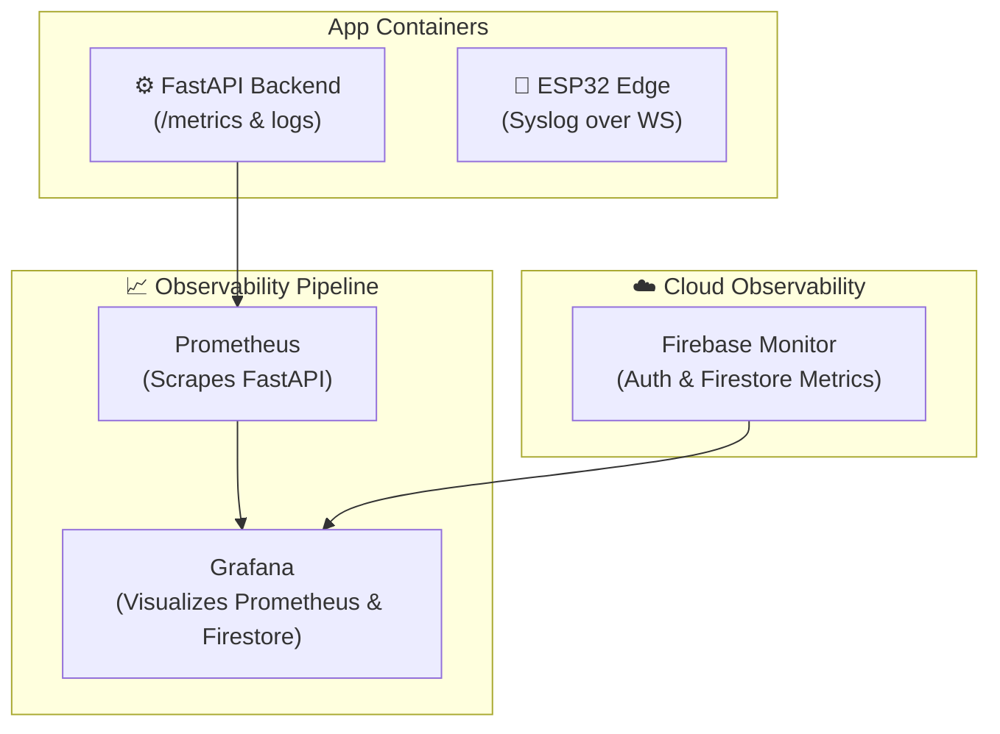

# 📊 Monitoring & Logging

## Observability, Python FastAPI Logs, Prometheus Metrics, and Firestore Performance Audits

**Document ID:** `DOC-21`
**Version:** 3.0
**Last Updated:** June 2026
**Classification:** DevOps Engineering Document · Operations Reference
**Maintained By:** Site Reliability Engineering Team

---

## 📋 Purpose

This document defines the observability design for the GridFlowX platform, covering metrics scraping (Prometheus), logging configurations on the FastAPI backend, and audit-trail monitoring on Firebase Firestore.

---

## 🎯 Scope

- Prometheus telemetry scrape endpoints on FastAPI
- Structured logging on the Python backend
- Firestore database reads/writes performance audits
- Alert escalation procedures

---

## 🏗️ Observability Architecture



---

## 📈 Prometheus Configuration

Prometheus monitors backend execution states, HTTP latency, and active WebSocket channels.

### `prometheus.yml`
```yaml
global:
  scrape_interval: 15s
  evaluation_interval: 15s

scrape_configs:
  - job_name: 'fastapi-backend'
    static_configs:
      - targets: ['fastapi-backend:8000']
    metrics_path: '/metrics'
```

### Key Alert Rules
- **HighAPILatency:** p95 latency on `/api` routes > 1.5s for 5 minutes.
- **WebSocketDisconnected:** Active WebSocket connection count to client namespace == 0 for 5 minutes (indicates client UI issues).
- **InferenceLatency:** AI forecast/orchestration execution duration > 100ms.

---

## 📊 Grafana Dashboards

### Dashboard: System Overview

| Panel | Visualization | Data Source |
| --- | --- | --- |
| HTTP Request Rates | Line Chart | Prometheus |
| p95/p99 Endpoint Latency | Line Chart | Prometheus |
| Active WebSocket Clients | Stat | Prometheus |
| Active ESP32 Clients | Stat | Prometheus |
| CPU / Memory Usage | Area Chart | Prometheus |

### Dashboard: Microgrid Operations (Firestore Source)

| Panel | Visualization | Data Source |
| --- | --- | --- |
| Real-Time Solar vs. Load | Line Chart | Firestore `telemetry` |
| Battery State of Charge (SoC) | Gauge | Firestore `telemetry` |
| Relay State Log | Table | Firestore `relayStates` |
| Critical Alert Feed | List | Firestore `alerts` |

---

## 📝 Structured Logging

The FastAPI server writes JSON-formatted logs to standard output. This structure allows cloud collectors (like Filebeat, Logstash, or Cloud Logging) to parse keys without regex patterns.

### Python Structured Logging Configuration (FastAPI)

```python
import logging
import json
from datetime import datetime

class JSONFormatter(logging.Formatter):
    def format(self, record):
        log_entry = {
            "timestamp": datetime.utcnow().isoformat(),
            "level": record.levelname,
            "message": record.getMessage(),
            "service": "fastapi-backend",
            "module": record.module
        }
        if hasattr(record, "details"):
            log_entry["details"] = record.details
        return json.dumps(log_entry)

# Logger setup
logger = logging.getLogger("gridflowx")
handler = logging.StreamHandler()
handler.setFormatter(JSONFormatter())
logger.addHandler(handler)
logger.setLevel(logging.INFO)
```

### Example Log Emission
```python
logger.info("Relay override executed", extra={
    "details": {
        "userId": "auth_uid_12345",
        "action": "MANUAL_OVERRIDE",
        "relayIndex": 2,
        "newState": True
    }
})
```
