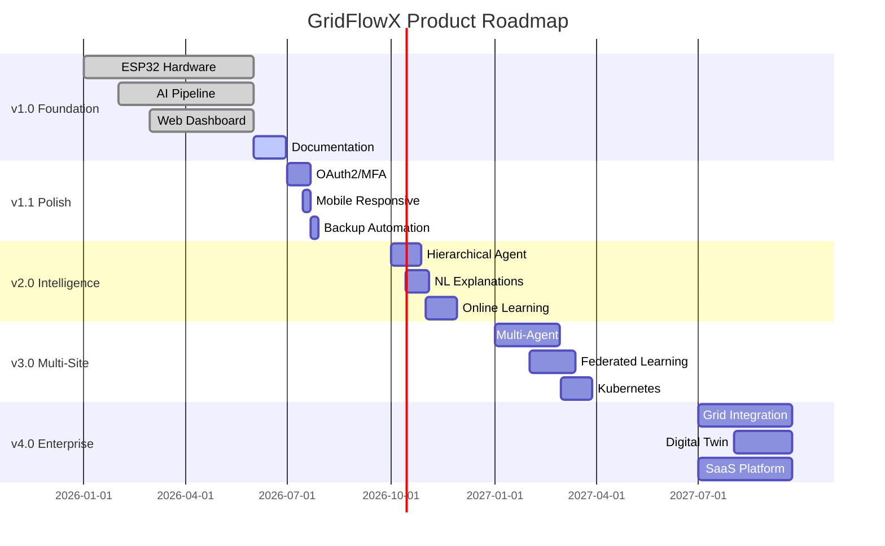

# 🔮 Future Roadmap

## Planned Enhancements, Feature Pipeline, Version Milestones, and Research Initiatives

**Document ID:** `DOC-23`
**Version:** 2.0
**Last Updated:** June 2026
**Classification:** Product Strategy Document · Planning Reference
**Maintained By:** Product & Engineering Leadership

---

## 📋 Purpose

This document outlines the planned evolution of GridFlowX beyond its initial release, including feature pipeline items, version milestones, research initiatives, and long-term architectural enhancements.

## 📊 Version Milestones

### v1.0 — Foundation Release (Current)

| Feature | Status |
| --- | --- |
| ESP32 hardware integration (dual-core FreeRTOS) | ✅ Complete |
| Real-time telemetry pipeline (ESP32 WebSockets → FastAPI → Firestore) | ✅ Complete |
| AI Agent implementation (Rule-Based, LangGraph, RL) | ✅ Complete |
| Next.js dashboard (Glassmorphic UI + Sankey + KPIs) | ✅ Complete |
| Firebase Authentication & Custom Claims RBAC | ✅ Complete |
| Docker Compose deployment (Backend, Proxy) | ✅ Complete |
| Firestore immutable audit logging | ✅ Complete |

### v1.1 — Operational Polish (Q3 2026)

| Feature | Priority | Effort |
| --- | --- | --- |
| Firebase Auth OAuth providers (Google, Microsoft) | High | 1 week |
| MFA (multi-factor authentication) via Firebase | High | 1 week |
| Mobile-responsive dashboard optimization | Medium | 1 week |
| Automated database backups (Firestore scheduled functions) | High | 3 days |
| Dark/Light theme toggle with persistence | Low | 2 days |
| Discord / Telegram alerts for critical systems | Medium | 3 days |

### v2.0 — Intelligence Upgrade (Q4 2026)

| Feature | Priority | Effort |
| --- | --- | --- |
| Hierarchical planning agent (6–24h horizon) | High | 4 weeks |
| Natural language decision explanations (LLM) | Medium | 3 weeks |
| Automated hyperparameter tuning (Optuna) | Medium | 2 weeks |
| Online learning with replay buffers | High | 4 weeks |
| Satellite imagery solar forecasting | Low | 6 weeks |
| Advanced attention visualization dashboard | Medium | 2 weeks |

### v3.0 — Multi-Site Platform (Q1 2027)

| Feature | Priority | Effort |
| --- | --- | --- |
| Multi-agent coordination (campus-scale) | High | 8 weeks |
| Federated learning across installations | High | 6 weeks |
| ABAC (Attribute-Based Access Control) | Medium | 3 weeks |
| API gateway (Kong) for partner integrations | Medium | 2 weeks |
| Kubernetes migration (from Docker Compose) | High | 4 weeks |
| Multi-region deployment (DR) | Medium | 3 weeks |

### v4.0 — Enterprise Edition (Q3 2027)

| Feature | Priority | Effort |
| --- | --- | --- |
| Grid-interactive features (demand response) | High | 12 weeks |
| Modbus TCP integration (industrial equipment) | High | 4 weeks |
| EV charging station integration | Medium | 6 weeks |
| Digital twin simulation environment | Medium | 8 weeks |
| ISO 50001 energy management compliance | High | 4 weeks |
| SaaS multi-tenant architecture | High | 12 weeks |

---

## 🔬 Research Initiatives

### R1: Transformer Architecture Improvements

- **Attention pooling** instead of flat encoding for variable-length sequences
- **Autoregressive decoder** for extended forecast horizons (6–24h)
- **Multi-scale attention** for capturing both short-term transients and long-term trends

### R2: Advanced RL Algorithms

- **Multi-Agent RL (MARL)** for coordinated multi-site optimization
- **Model-Based RL** with learned world models for better sample efficiency
- **Safe RL (Constrained Policy Optimization)** for provably safe exploration

### R3: Edge AI Enhancements

- **Neural Architecture Search (NAS)** for optimal ESP32-compatible models
- **Pruning and quantization** research for sub-100KB model sizes
- **On-device continual learning** with federated aggregation

### R4: Energy Market Integration

- **Real-time electricity pricing APIs** for dynamic tariff optimization
- **Virtual Power Plant (VPP)** participation protocols
- **Peer-to-peer energy trading** using blockchain settlement

---

## 🗓️ Roadmap Timeline

---

## 📐 Architecture Notes

- Each version milestone is designed to be **backward-compatible** — v1.x hardware continues to work with v2.0+ software
- The Kubernetes migration in v3.0 replaces Docker Compose for multi-site orchestration but maintains the same container images
- Research initiatives (R1–R4) feed into the product roadmap but have independent timelines

## 🏆 Recruiter & Portfolio Notes

> **Product Vision:** The roadmap demonstrates strategic technical leadership — from a solid v1.0 foundation through progressive enhancements (intelligence, multi-site, enterprise). The research initiatives show awareness of cutting-edge ML advances (MARL, Safe RL, NAS) and their practical applications. The phased approach ensures each version delivers standalone value while building toward a comprehensive energy management platform.

## 🗺️ Related Documents

| Document | Purpose |
| --- | --- |
| `01_Project_Overview.md` | Project vision and objectives |
| `05_Agentic_AI_Model.md` | Current AI architecture (baseline for improvements) |
| `04_System_Architecture.md` | Architecture constraints for future features |
| `03_Tech_Stack.md` | Technology decisions guiding future choices |
