# GridFlowX Tri-Source Microgrid Controller
## Official Hardware Architecture & System Engineering Specification

---

**Document ID:** `GFX-HW-SPEC-2026-V4`  
**Document Version:** `4.0.0-PROD`  
**Classification:** Electrical & Embedded Systems Engineering Master Reference  
**Target Microcontroller:** Atmel/Microchip ATmega2560 (Arduino Mega 2560 Standalone Execution Node)  
**IoT Extension Node:** Espressif ESP32-WROOM-32 / DevKit V1 (Dual-Core 240 MHz)  
**Primary Simulation Environment:** Proteus 9 Professional (v9.0 / v9.1 / v9.2 64-bit SP2)  
**Author / Engineering Team:** GridFlowX Embedded Systems & Power Electronics Division  
**Last Revised:** June 2026  

---

## 1. Executive Summary & System Overview

The **GridFlowX Tri-Source Microgrid Controller** is an industrial-grade embedded power routing and supervisory system. It dynamically coordinates power delivery from three independent, heterogeneous energy sources to three priority-tiered DC load circuits:

1. **Solar Photovoltaic (PV) DC Generator** (Primary Renewable Source)
2. **Deep-Cycle Chemical Battery Storage** (Secondary Storage & Buffer Source)
3. **Utility Mains AC Grid** (Tertiary High-Reliability Fallback Source)

The system enforces an autonomous energy hierarchy designed to maximize solar self-consumption, preserve battery state-of-health (SoH), maintain uninterrupted operation of mission-critical loads, and guarantee zero cross-conduction between AC mains and DC generation buses.


### Core Operational Principles
- **Solar Priority:** Whenever the Solar PV bus voltage satisfies $V_{\text{solar}} \ge 14.0\text{V}$, all loads are energized exclusively from renewable solar energy.
- **Battery Buffering & Tiered Load Shedding:** When solar output falls below threshold ($V_{\text{solar}} < 14.0\text{V}$), the controller transitions to the 12V battery bank. If $V_{\text{batt}} \ge 12.2\text{V}$, all loads remain powered. If $11.5\text{V} \le V_{\text{batt}} < 12.2\text{V}$, the controller sheds Tier 3 (Low-Priority 40W) to conserve storage capacity.
- **Grid AC Fallback:** If both solar and battery reserves are depleted ($V_{\text{batt}} < 11.5\text{V}$), the system switches to rectified Utility Grid AC ($V_{\text{grid}} \ge 10.0\text{V}$), restoring power to all load tiers.
- **Hardware-Enforced Dead-Time:** To eliminate destructive AC-to-DC cross-conduction, the firmware enforces a mandatory **60ms Break-Before-Make** relay switching dead-time.
- **Sub-10µs Hardware Emergency Stop:** An external hardware interrupt line (`INT2` on `D19`) triggers an immediate driver shutoff, bypassing all software loops.

---

## 2. Complete Hardware Architecture & Subsystems


---

## 3. Tri-Source Energy Inputs & Characteristics


### 3.1 Solar PV DC Generator Bus (Simulated via Source B1)
- **Nominal Voltage:** $18.0\text{V DC}$
- **Open-Circuit Voltage ($V_{\text{OC}}$):** $21.5\text{V DC}$
- **Maximum Power Point Voltage ($V_{\text{MP}}$):** $17.5\text{V DC} - 18.2\text{V DC}$
- **Rated Continuous Current:** $5.0\text{A DC}$
- **Engagement Threshold ($V_{\text{solar,min}}$):** $\ge 14.0\text{V DC}$
- **Operating Role:** Primary renewable supply. When active, it charges the battery through steering circuitry and powers all three load tiers simultaneously.

### 3.2 Deep-Cycle Storage Battery Bank (Simulated via Source B2)
- **Battery Chemistry:** Sealed Lead-Acid (SLA) / Lithium Iron Phosphate ($\text{LiFePO}_4$) equivalent
- **Nominal Voltage:** $12.0\text{V DC} - 12.8\text{V DC}$
- **Full Charge Potential ($V_{\text{batt,full}}$):** $12.6\text{V} - 13.8\text{V DC}$
- **Normal Operating Knee ($V_{\text{batt,norm}}$):** $12.2\text{V DC}$
- **Low State-of-Charge (SoC) Knee ($V_{\text{batt,low}}$):** $11.5\text{V DC}$ (Trigger for Tier 3 Low-Priority Load shedding)
- **Deep Discharge Cutoff ($V_{\text{batt,cut}}$):** $< 11.0\text{V DC}$ (Complete battery isolation to prevent irreversible sulfation/cell degradation)
- **Maximum Continuous Discharge Current:** $10.0\text{A DC}$

### 3.3 Utility Mains AC Electrical Grid (Simulated via Source V1)
- **Input Grid Voltage:** $230\text{V AC RMS} \pm 10\%$, Single-Phase, $50\text{Hz}$
- **Step-Down Transformer (TR1):** $230\text{V} \rightarrow 15\text{V AC RMS}$ ($15:1$ turns ratio, $50\text{VA}$ power rating, $1.5\text{kV}$ dielectric isolation)
- **Rectifier Stage (BR1):** Full-Wave Bridge Rectifier (Model W04M / 1.5A, 400V PIV)
- **Rectified Peak DC Output:** $V_{\text{peak}} = (15\text{V} \times \sqrt{2}) - 2 \cdot V_D \approx 21.2\text{V} - 1.4\text{V} = 19.8\text{V DC}$
- **Filtered Loaded Output:** $12.0\text{V} - 15.0\text{V DC}$ (across bulk filter capacitors C1, C2)
- **Minimum Grid Presence Threshold ($V_{\text{grid,min}}$):** $\ge 10.0\text{V DC}$ rectified

---

## 4. Protection & Electrical Safety Circuitry

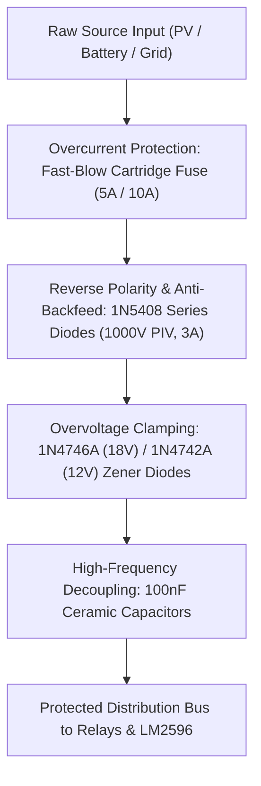

### 4.1 Overcurrent Fuse Network
- **FUSE1 (Solar Infeed):** $5.0\text{A}$ Fast-Blow Cartridge Fuse ($5\times20\text{mm}$, 250V rated). Isolates short circuits in external PV wiring.
- **FUSE2 (Battery Infeed):** $10.0\text{A}$ Fast-Blow Cartridge Fuse ($5\times20\text{mm}$, 250V rated). Protects battery against terminal short-circuits.
- **FUSE3 (Grid Rectifier Secondary):** $5.0\text{A}$ Fast-Blow Cartridge Fuse ($5\times20\text{mm}$, 250V rated). Protects the transformer secondary and bridge rectifier.
- **FUSE4 (Main DC Bus Infeed):** $10.0\text{A}$ Fast-Blow Cartridge Fuse protecting the common relay distribution rail.

### 4.2 Reverse-Polarity & Anti-Backfeed Protection
- **Series Diodes (D1, D4, D5):** Heavy-duty power rectifier diodes (**1N5408 / 1N4007**, $3\text{A} / 1\text{A}, 1000\text{V}$ Peak Inverse Voltage).
- **Anti-Backfeed Function:** Prevents the battery or solar panels from back-feeding current into the bridge rectifier or into each other during uneven source potential states.
- **Reverse Polarity Clamping:** Protects controller electronics against reverse battery connection mistakes.

### 4.3 Overvoltage Transient & Zener Clamping
- **Solar Rail Clamp (D17):** 1N4746A 1W Zener Diode ($V_Z = 18\text{V}$). Clamps inductive surges from lightning or sudden unloaded PV disconnection.
- **Battery Rail Clamp (D2):** 1N4742A 1W Zener Diode ($V_Z = 12\text{V}$). Protects the battery line against load dump transients.

### 4.4 Galvanic Isolation & Inductive Flyback Suppression
- **Transformer Isolation:** Transformer TR1 provides true galvanic isolation ($1500\text{V AC}$ insulation barrier) between high-voltage utility mains ($230\text{V}$) and the low-voltage control circuitry.
- **Relay Driver Flyback Protection:** The ULN2803A array features internal integrated clamp diodes on all 8 collector lines (pin 10 tied to $+12\text{V}$). Steering diodes (D8, D9, D6) provide secondary flyback suppression.

---

## 5. Power Supply, Rectification & Voltage Regulation

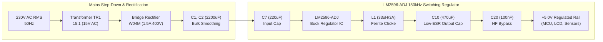

### 5.1 Step-Down Transformer & Full-Wave Bridge Rectifier
- **Transformer Model:** `TRAN-2P2S` / Step-Down $230\text{V} \rightarrow 15\text{V AC}$, $50\text{Hz}$.
- **Bridge Rectifier:** `W04M` Silicon Bridge Rectifier configured in full-wave Graetz bridge topology.
- **Bulk Ripple Capacitors (C1, C2, C5):** $1000\mu\text{F} - 2200\mu\text{F}, 35\text{V} / 50\text{V}$ electrolytic capacitors reduce DC voltage ripple to under $150\text{mV}_{\text{p-p}}$ at $2.0\text{A}$ current draw.

### 5.2 LM2596-ADJ DC-DC Buck Switching Regulator (U5)
- **Topology:** High-efficiency step-down switching regulator operating at a fixed $150\text{kHz}$ internal oscillator frequency.
- **Input Voltage Range:** $7.0\text{V} - 35.0\text{V DC}$ (Fed dynamically from active source bus via D1/D4/D5).
- **Regulated Output Voltage:** Fixed $+5.00\text{V DC} \pm 2\%$ logic supply rail.
- **Continuous Current Capability:** $3.0\text{A}$ maximum.
- **Power Inductor (L1):** $33\mu\text{H} / 47\mu\text{H}, 3\text{A}$ saturation current ferrite-core inductor.
- **Input Capacitor (C7):** $220\mu\text{F}, 35\text{V}$ radial electrolytic, positioned within $5\text{mm}$ of IC pin 1.
- **Output Capacitor (C10):** $470\mu\text{F}, 25\text{V}$ low-ESR electrolytic.
- **High-Frequency Bypass (C9, C20):** $100\text{nF}$ multi-layer ceramic capacitors (MLCC) filtering $150\text{kHz}$ harmonics.

---

## 6. Power Distribution Bus & DC Rail Architecture

The system implements a rigid **three-rail power distribution topology** with dedicated ground star-points:

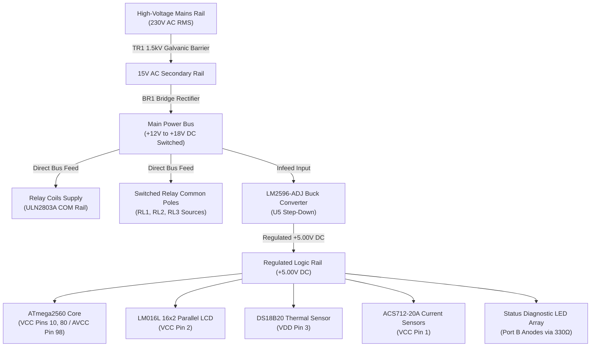

### Decoupling & Noise Suppression Infrastructure
- **ATmega2560 Power Pins:** $100\text{nF}$ ceramic decoupling capacitors installed directly adjacent to VCC pin 10, VCC pin 80, and AVCC pin 98.
- **Analog Reference (AREF, Pin 100):** Decoupled with capacitor C16 ($100\text{nF}$) directly to ground to isolate the 10-bit internal ADC ladder from digital switching noise.
- **Common Ground Plane:** High-current relay return paths and low-noise analog sensor grounds meet at a single centralized **Star-Ground Point** to prevent ground loops.

---

## 7. Measurement & Sensing System

```mermaid
flowchart TD
    subgraph VOLT_SENSE["Precision Resistor Divider Stage (Ratio = 4.00)"]
        V_IN_SRC["Source Voltage (0V - 20V DC)"] --> R_HI["High-Side Resistor R_top = 30kΩ (±1%)"]
        R_HI --> TAP["Voltage Tap Node (0V - 5.0V DC)"]
        TAP --> R_LO["Low-Side Resistor R_bot = 10kΩ (±1%)"]
        R_LO --> GND["Common Ground"]
        TAP --> C_FILT["100nF Ceramic Anti-Aliasing Filter"]
        C_FILT --> GND
        TAP --> ADC_CH["ATmega2560 10-bit ADC Input (A0, A1, A2)"]
    end

    subgraph CURR_SENSE["ACS712-20A Hall-Effect Current Sensor"]
        I_IN["Branch Current (-20A to +20A)"] --> HALL["Hall-Effect Element & Copper Path"]
        HALL --> V_OUT_ACS["Analog Voltage Output\nV_out = 2.50V + (I * 0.100V/A)"]
        V_OUT_ACS --> ADC_CURR["ATmega2560 ADC Channel (A3, A4, A5)"]
    end

    subgraph TEMP_SENSE["DS18B20 1-Wire Digital Temperature Sensor"]
        HEAT["Enclosure / Heatsink Ambient"] --> DALLAS["DS18B20 Silicon Sensor"]
        DALLAS --> ONEWIRE_BUS["1-Wire Open-Drain Bus (D41 / PL6)"]
        PULLUP["4.7kΩ Pull-Up Resistor to +5V"] --> ONEWIRE_BUS
    end
```

### 7.1 Voltage Sensing Subsystem (Analog Inputs A0, A1, A2)
The voltage dividers attenuate source voltages in the range of $0.0\text{V} - 20.0\text{V DC}$ down to the safe $0.0\text{V} - 5.0\text{V DC}$ operating window of the ATmega2560 ADC.

$$\text{Divider Attenuation Ratio } K_v = \frac{R_1 + R_2}{R_2} = \frac{30\text{k}\Omega + 10\text{k}\Omega}{10\text{k}\Omega} = 4.000$$

$$V_{\text{source}} = V_{\text{ADC}} \times K_v = \left( \frac{\text{ADC}_{\text{raw}}}{1023.0} \times 5.000\text{V} \right) \times 4.000 = \text{ADC}_{\text{raw}} \times 0.0195503\text{V}$$

- **Solar PV Voltage:** Read on **Pin 97 (PF0 / ADC0 / A0)** via divider R1 ($30\text{k}\Omega$) and R2 ($10\text{k}\Omega$).
- **Battery Voltage:** Read on **Pin 96 (PF1 / ADC1 / A1)** via divider R3 ($30\text{k}\Omega$) and R4 ($10\text{k}\Omega$).
- **Grid Rectified Voltage:** Read on **Pin 95 (PF2 / ADC2 / A2)** via divider R5 ($30\text{k}\Omega$) and R6 ($10\text{k}\Omega$).
- **Measurement Resolution:** $\Delta V = \frac{20.0\text{V}}{1024} \approx 19.55\text{mV}$ per ADC count.

### 7.2 Current Sensing Subsystem (Analog Inputs A3, A4, A5)
The ACS712-20A Hall-effect IC provides galvanic isolation ($2.1\text{kV RMS}$) with a linear proportional voltage output centered around $V_{\text{CC}}/2 = 2.50\text{V}$ at zero current.

$$V_{out}(I) = 2.500\text{V} + (I \times 0.100\text{V/A})$$

$$I = \frac{V_{\text{ADC}} - 2.500\text{V}}{0.100\text{V/A}} = \frac{\left(\frac{\text{ADC}_{\text{raw}}}{1023.0} \times 5.00\text{V}\right) - 2.500\text{V}}{0.100\text{V/A}}$$

- **Solar Infeed Current ($I_{\text{solar}}$):** Read on **Pin 94 (PF3 / ADC3 / A3)**.
- **Battery Branch Current ($I_{\text{batt}}$):** Read on **Pin 93 (PF4 / ADC4 / A4)**.
- **Grid Branch Current ($I_{\text{grid}}$):** Read on **Pin 92 (PF5 / ADC5 / A5)**.
- **Current Resolution:** $\Delta I = \frac{19.55\text{mV}}{100\text{mV/A}} \approx 0.0488\text{A}$ ($48.8\text{mA}$) per ADC count.

### 7.3 Thermal Safety Probe Subsystem (Digital Input D41)
- **Sensor Model:** Dallas Semiconductor / Maxim Integrated **DS18B20**.
- **Interface Protocol:** Maxim 1-Wire Master-Slave bus.
- **Physical Pin Connection:** Pin 41 (**PL6 / Arduino D41**).
- **External Pull-Up:** $4.7\text{k}\Omega$ metal film resistor connected between D41 and $+5\text{V}$.
- **Sampling Resolution:** 10-bit mode ($0.25^\circ\text{C}$ temperature resolution, $187.5\text{ms}$ conversion time).
- **Thermal Fault Trip Point ($T_{\text{trip}}$):** $\ge 65.0^\circ\text{C}$.
- **Thermal Recovery Hysteresis ($T_{\text{recover}}$):** $\le 55.0^\circ\text{C}$.

---

## 8. Microcontroller & Processing Unit (ATmega2560)

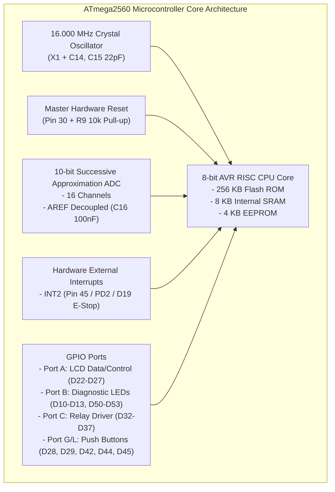

### 8.1 Core Specifications
- **Microcontroller:** Microchip / Atmel **ATmega2560-16AU** (100-Pin TQFP Package).
- **Clock Frequency:** $16.000\text{MHz} \pm 10\text{ppm}$ via external quartz crystal X1 and dual $22\text{pF}$ C0G ceramic load capacitors (C14, C15).
- **Operating Voltage:** $+5.00\text{V DC} \pm 5\%$ on VCC pins 10, 80 and AVCC pin 98.
- **Instruction Throughput:** Up to 16 MIPS at 16 MHz.
- **Memory Subsystem:** 256 KB Flash Memory, 8 KB Internal SRAM, 4 KB EEPROM.

### 8.2 Digital Signal Conditioning & ADC Filtering
To suppress electrical noise from relay coil switching and power converter inductors, the firmware executes a two-tier digital filtering pipeline:
1. **16-Sample Hardware Oversampling:** Every analog telemetry point is computed from the mathematical mean of 16 consecutive ADC conversions sampled at $100\mu\text{s}$ intervals:
   $$V_{\text{raw,mean}} = \frac{1}{16}\sum_{i=1}^{16} \text{ADC}_{\text{sample}, i}$$
2. **Exponential Moving Average (EMA) Infinite Impulse Response (IIR) Filter:**
   $$y[n] = \alpha \cdot x[n] + (1 - \alpha) \cdot y[n-1]$$
   With smoothing coefficient $\alpha = 0.25$, filtering out high-frequency ripple while providing sub-50ms step response.

---

## 9. Human-Machine Interface (HMI) & Diagnostic Subsystem

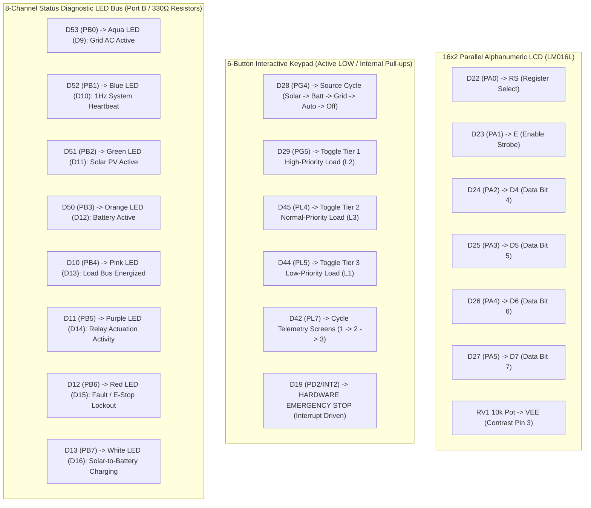

### 9.1 16x2 Parallel Character LCD (LM016L) Interface
- **Driver Model:** Hitachi HD44780 / Sitronix ST7066U compatible LCD controller operating in **4-bit parallel bus mode**.
- **Pin Mapping (Port A):**
  - **D22 (Pin 78 / PA0):** Register Select (`RS`) - Command (LOW) vs Data (HIGH).
  - **D23 (Pin 77 / PA1):** Enable Strobe (`E`) - Falling edge latches data nibble.
  - **D24 (Pin 76 / PA2):** Data Bit 4 (`D4`).
  - **D25 (Pin 75 / PA3):** Data Bit 5 (`D5`).
  - **D26 (Pin 74 / PA4):** Data Bit 6 (`D6`).
  - **D27 (Pin 73 / PA5):** Data Bit 7 (`D7`).
- **Contrast Adjustment:** Potentiometer RV1 ($10\text{k}\Omega$ linear trimmer) provides contrast bias ($0.5\text{V} - 1.2\text{V}$) on pin 3 (`VEE`).
- **Multi-Screen Telemetry Pages (Cycled via D42 Push-Button):**
  - **Page 1 (Main Dashboard):** `SRC:SOLAR  AUTO` / `L1:ON L2:ON L3:ON`
  - **Page 2 (Solar & Battery Telemetry):** `PV:18.2V  2.45A` / `BAT:12.6V 1.80A`
  - **Page 3 (Grid & Thermal Diagnostics):** `GRD:14.8V 0.00A` / `TEMP:34.5C OK`

### 9.2 Status Diagnostic LED Array (Port B Outputs)
All diagnostic LEDs are driven from ATmega2560 Port B through individual $330\Omega, 0.25\text{W}$ metal-film current-limiting resistors (R10–R17):

| Reference | Color | Forward Voltage ($V_F$) | MCU Pin | Port Bit | Function & Diagnostic Indication |
| :--- | :--- | :--- | :--- | :--- | :--- |
| **D9** | **Aqua** | $3.2\text{V}$ | **D53** | `PB0` (Pin 19) | Grid AC Relay Engaged |
| **D10** | **Blue** | $3.2\text{V}$ | **D52** | `PB1` (Pin 20) | 1Hz Heartbeat Pulse (Continuous MCU Health) |
| **D11** | **Green** | $2.2\text{V}$ | **D51** | `PB2` (Pin 21) | Solar PV Relay Engaged |
| **D12** | **Orange**| $2.0\text{V}$ | **D50** | `PB3` (Pin 22) | Battery DC Relay Engaged |
| **D13** | **Pink** | $3.0\text{V}$ | **D10** | `PB4` (Pin 23) | Any Load Branch (L1, L2, or L3) Energized |
| **D14** | **Purple**| $3.1\text{V}$ | **D11** | `PB5` (Pin 24) | Relay Driver Activity (Any coil energized) |
| **D15** | **Red** | $1.9\text{V}$ | **D12** | `PB6` (Pin 25) | System Fault / Thermal Trip / E-Stop Lockout |
| **D16** | **White** | $3.2\text{V}$ | **D13** | `PB7` (Pin 26) | Solar-to-Battery Charging Circuit Engaged |

---

## 10. Relay Driver Stage & Relay Matrix

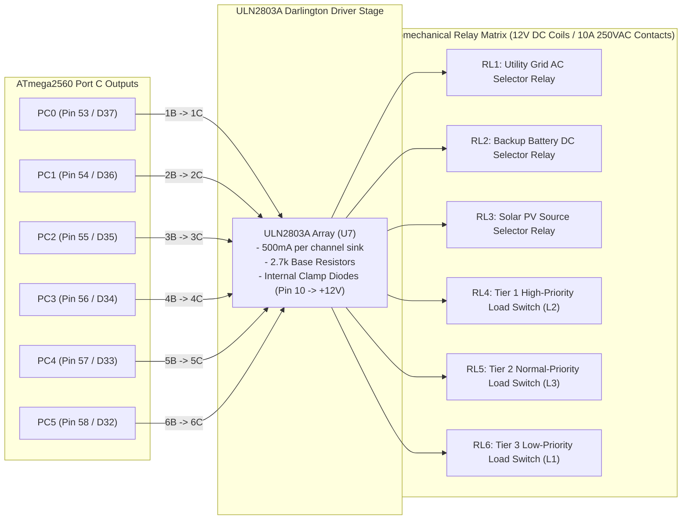

### 10.1 ULN2803A Darlington Array Specification (U7)
- **Component:** 8-Channel NPN Darlington Transistor Array with Common Emitters.
- **Maximum Collector Current ($I_C$):** $500\text{mA}$ continuous sink per channel ($50\text{V}$ breakdown).
- **Base Resistor:** Integrated $2.7\text{k}\Omega$ series base resistor allowing direct $5\text{V}$ logic drive from AVR GPIO ports.
- **Free-Wheeling Diode Bus:** Pin 10 (`COM`) connected directly to the $+12\text{V}$ relay supply bus, clamping inductive flyback spikes generated during coil de-energization.

### 10.2 Relay Allocations & Channel Mapping
All 6 relays are SPDT (Single-Pole Double-Throw) electromechanical power relays with $12\text{V DC}$ coils ($400\text{mW}$ coil power, $\approx 33.3\text{mA}$ coil current) and contact ratings of $10\text{A} @ 250\text{V AC} / 30\text{V DC}$:

| Relay | Target Channel | MCU Pin | Port Bit | Coil Voltage | Contact Rating | Function Description |
| :--- | :--- | :--- | :--- | :--- | :--- | :--- |
| **RL1** | **Grid AC Source** | **D37** | `PC0` (Pin 53) | 12V DC | 10A / 250VAC | Connects rectified Utility Grid AC to main load bus |
| **RL2** | **Battery DC Source**| **D36** | `PC1` (Pin 54) | 12V DC | 10A / 30VDC | Connects 12V Storage Battery to main load bus |
| **RL3** | **Solar PV Source** | **D35** | `PC2` (Pin 55) | 12V DC | 10A / 30VDC | Connects 18V Solar PV Generator to main load bus |
| **RL4** | **Tier 1 High Load** | **D34** | `PC3` (Pin 56) | 12V DC | 10A / 30VDC | Switches Critical High-Priority Load Circuit (L2) |
| **RL5** | **Tier 2 Norm Load** | **D33** | `PC4` (Pin 57) | 12V DC | 10A / 30VDC | Switches Auxiliary Normal-Priority Load Circuit (L3) |
| **RL6** | **Tier 3 Low Load** | **D32** | `PC5` (Pin 58) | 12V DC | 10A / 30VDC | Switches Flexible Low-Priority Load Circuit (L1) |

---

## 11. Priority Load Management System

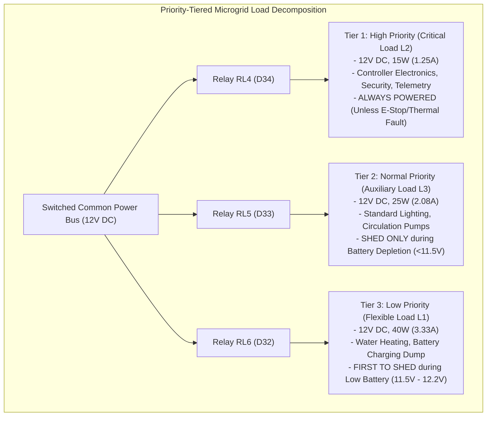

### Load Matrix & Power Budgets

| Load Circuit | Priority Tier | Proteus Ref | Nominal Voltage | Power Rating | Current Draw (@12V) | Shedding Threshold |
| :--- | :--- | :--- | :--- | :--- | :--- | :--- |
| **High Priority** | **Tier 1 (Critical)** | **L2** | $12.0\text{V DC}$ | $15\text{W}$ | $1.25\text{A}$ | Never shed (Active during Solar, Battery, and Grid) |
| **Normal Priority**| **Tier 2 (Standard)** | **L3** | $12.0\text{V DC}$ | $25\text{W}$ | $2.08\text{A}$ | Shed during Under-Voltage ($V_{\text{batt}} < 11.5\text{V}$) |
| **Low Priority** | **Tier 3 (Flexible)** | **L1** | $12.0\text{V DC}$ | $40\text{W}$ | $3.33\text{A}$ | Shed immediately when $V_{\text{batt}} < 12.2\text{V}$ |
| **Total Full Load**| **All Tiers Active** | **L1+L2+L3**| $12.0\text{V DC}$ | **$80\text{W}$** | **$6.67\text{A}$** | Solar or Full Battery ($V_{\text{batt}} \ge 12.2\text{V}$) |

---

## 12. Complete Pin Configuration & Interconnect Mapping

```mermaid
flowchart LR
    subgraph ANALOG_IN["Analog Sensing Inputs"]
        A0["Pin 97 (PF0 / A0): Solar Voltage Sense (VM1)"]
        A1["Pin 96 (PF1 / A1): Battery Voltage Sense (VM2)"]
        A2["Pin 95 (PF2 / A2): Grid Voltage Sense (VM3)"]
        A3["Pin 94 (PF3 / A3): Solar Current Sense (ACS712)"]
        A4["Pin 93 (PF4 / A4): Battery Current Sense (ACS712)"]
        A5["Pin 92 (PF5 / A5): Grid Current Sense (ACS712)"]
    end

    subgraph LCD_HMI["Parallel LCD & 1-Wire Thermal"]
        D22["Pin 78 (PA0 / D22): LCD RS"]
        D23["Pin 77 (PA1 / D23): LCD E"]
        D24_27["Pins 76..73 (PA2..PA5 / D24..D27): LCD D4..D7"]
        D41["Pin 41 (PL6 / D41): DS18B20 1-Wire Data"]
    end

    subgraph MCU_NODE["ATmega2560 Microcontroller Core\n(100-Pin TQFP @ 16 MHz)"]
        PWR["Pins 10, 80: VCC (+5V)\nPins 31, 61: GND\nPin 98: AVCC\nPin 100: AREF (100nF)"]
    end

    subgraph RELAY_DRV["Relay Driver Stage (Port C)"]
        D37["Pin 53 (PC0 / D37): RL1 Grid AC Relay"]
        D36["Pin 54 (PC1 / D36): RL2 Battery DC Relay"]
        D35["Pin 55 (PC2 / D35): RL3 Solar PV Relay"]
        D34["Pin 56 (PC3 / D34): RL4 High-Priority Load (L2)"]
        D33["Pin 57 (PC4 / D33): RL5 Normal-Priority Load (L3)"]
        D32["Pin 58 (PC5 / D32): RL6 Low-Priority Load (L1)"]
    end

    subgraph BTN_INPUTS["HMI Push Buttons & E-Stop"]
        D28["Pin 28 (PG4 / D28): Source Cycle"]
        D29["Pin 29 (PG5 / D29): Toggle High Load L2"]
        D45["Pin 39 (PL4 / D45): Toggle Normal Load L3"]
        D44["Pin 40 (PL5 / D44): Toggle Low Load L1"]
        D42["Pin 42 (PL7 / D42): Telemetry Page View"]
        D19["Pin 45 (PD2 / D19 / INT2): HARDWARE E-STOP ISR"]
    end

    subgraph LED_OUTPUTS["Diagnostic Status LEDs (Port B)"]
        LEDS_PB["Pins 19..26 (PB0..PB7 / D53, D52, D51, D50, D10..D13)\n- Aqua: Grid | Blue: Heartbeat | Green: Solar | Orange: Battery\n- Pink: Load | Purple: Relay | Red: Fault | White: Charging"]
    end

    ANALOG_IN --> MCU_NODE
    LCD_HMI <--> MCU_NODE
    BTN_INPUTS --> MCU_NODE
    MCU_NODE --> RELAY_DRV
    MCU_NODE --> LED_OUTPUTS
```

### Comprehensive Master Interconnect Table

| ATmega2560 Physical Pin | AVR Port Pin | Arduino Logical Pin | Signal / Net Name | Connected Peripheral / Circuit | Signal Direction | Hardware Interface Details |
| :--- | :--- | :--- | :--- | :--- | :--- | :--- |
| **Pin 10, 80** | `VCC` | `5V` | `+5V_LOGIC` | Main Power Supply Rail | Power Input | $100\text{nF}$ decoupling capacitor per pin |
| **Pin 31, 61** | `GND` | `GND` | `GND_SYSTEM` | Common Star Ground | Ground | Low-impedance common return |
| **Pin 98** | `AVCC` | `5V` | `+5V_ANALOG` | Analog Power Supply | Power Input | Ferrite bead + $100\text{nF}$ LC noise filter |
| **Pin 100** | `AREF` | `AREF` | `AREF_ADC` | ADC Voltage Reference | Analog Ref | $100\text{nF}$ capacitor to GND |
| **Pin 97** | `PF0` | **A0** | `SENSE_SOLAR_V` | Solar Voltage Divider (VM1) | Analog Input | $30\text{k}\Omega / 10\text{k}\Omega$ Divider ($K_v=4.0$), $100\text{nF}$ Cap |
| **Pin 96** | `PF1` | **A1** | `SENSE_BATT_V` | Battery Voltage Divider (VM2)| Analog Input | $30\text{k}\Omega / 10\text{k}\Omega$ Divider ($K_v=4.0$), $100\text{nF}$ Cap |
| **Pin 95** | `PF2` | **A2** | `SENSE_GRID_V` | Grid Voltage Divider (VM3) | Analog Input | $30\text{k}\Omega / 10\text{k}\Omega$ Divider ($K_v=4.0$), $100\text{nF}$ Cap |
| **Pin 94** | `PF3` | **A3** | `SENSE_SOLAR_I` | Solar ACS712-20A Sensor | Analog Input | $100\text{mV/A}$ sensitivity, $2.50\text{V}$ zero-offset |
| **Pin 93** | `PF4` | **A4** | `SENSE_BATT_I` | Battery ACS712-20A Sensor | Analog Input | $100\text{mV/A}$ sensitivity, $2.50\text{V}$ zero-offset |
| **Pin 92** | `PF5` | **A5** | `SENSE_GRID_I` | Grid ACS712-20A Sensor | Analog Input | $100\text{mV/A}$ sensitivity, $2.50\text{V}$ zero-offset |
| **Pin 41** | `PL6` | **D41** | `1WIRE_TEMP` | DS18B20 Temperature Probe | Bidirectional| 1-Wire protocol with $4.7\text{k}\Omega$ pull-up to $+5\text{V}$ |
| **Pin 78** | `PA0` | **D22** | `LCD_RS` | LM016L Register Select | Digital Output| High = Character Data, Low = Instruction Command |
| **Pin 77** | `PA1` | **D23** | `LCD_E` | LM016L Enable Strobe | Digital Output| Falling edge latches 4-bit nibble |
| **Pin 76** | `PA2` | **D24** | `LCD_D4` | LM016L Data Bit 4 | Digital Output| 4-bit parallel bus high nibble |
| **Pin 75** | `PA3` | **D25** | `LCD_D5` | LM016L Data Bit 5 | Digital Output| 4-bit parallel bus high nibble |
| **Pin 74** | `PA4` | **D26** | `LCD_D6` | LM016L Data Bit 6 | Digital Output| 4-bit parallel bus high nibble |
| **Pin 73** | `PA5` | **D27** | `LCD_D7` | LM016L Data Bit 7 | Digital Output| 4-bit parallel bus high nibble |
| **Pin 28** | `PG4` | **D28** | `BTN_SRC_SEL` | Push Button: Source Cycle | Digital Input | `INPUT_PULLUP` (Cycles: Solar->Batt->Grid->Auto->Off)|
| **Pin 29** | `PG5` | **D29** | `BTN_LOAD_HIGH`| Push Button: High Load (L2) | Digital Input | `INPUT_PULLUP` (Toggles RL4 Tier 1 High Priority) |
| **Pin 39** | `PL4` | **D45** | `BTN_LOAD_NORM`| Push Button: Norm Load (L3) | Digital Input | `INPUT_PULLUP` (Toggles RL5 Tier 2 Normal Priority) |
| **Pin 40** | `PL5` | **D44** | `BTN_LOAD_LOW` | Push Button: Low Load (L1) | Digital Input | `INPUT_PULLUP` (Toggles RL6 Tier 3 Low Priority) |
| **Pin 42** | `PL7` | **D42** | `BTN_VIEW_CYC` | Push Button: Telemetry Page | Digital Input | `INPUT_PULLUP` (Cycles LCD Screen 1 -> 2 -> 3) |
| **Pin 45** | `PD2` | **D19** | `BTN_ESTOP_ISR`| Dedicated Emergency Stop | Hardware ISR | `INPUT_PULLUP` (Trigger on `FALLING`, `<10µs` response)|
| **Pin 53** | `PC0` | **D37** | `DRV_RL1_GRID` | ULN2803 Pin 1B -> RL1 Coil | Digital Output| High = Sink coil to energize Grid AC relay |
| **Pin 54** | `PC1` | **D36** | `DRV_RL2_BATT` | ULN2803 Pin 2B -> RL2 Coil | Digital Output| High = Sink coil to energize Battery DC relay |
| **Pin 55** | `PC2` | **D35** | `DRV_RL3_SOLAR`| ULN2803 Pin 3B -> RL3 Coil | Digital Output| High = Sink coil to energize Solar PV relay |
| **Pin 56** | `PC3` | **D34** | `DRV_RL4_LHIGH`| ULN2803 Pin 4B -> RL4 Coil | Digital Output| High = Sink coil to energize Tier 1 High Load |
| **Pin 57** | `PC4` | **D33** | `DRV_RL5_LNORM`| ULN2803 Pin 5B -> RL5 Coil | Digital Output| High = Sink coil to energize Tier 2 Norm Load |
| **Pin 58** | `PC5` | **D32** | `DRV_RL6_LLOW` | ULN2803 Pin 6B -> RL6 Coil | Digital Output| High = Sink coil to energize Tier 3 Low Load |
| **Pin 19** | `PB0` | **D53** | `LED_GRID_ACT` | Aqua Diagnostic LED (D9) | Digital Output| Active HIGH via $330\Omega$ resistor R10 |
| **Pin 20** | `PB1` | **D52** | `LED_HEARTBEAT`| Blue Diagnostic LED (D10) | Digital Output| Active HIGH 1Hz pulse via $330\Omega$ resistor R11 |
| **Pin 21** | `PB2` | **D51** | `LED_SOLAR_ACT`| Green Diagnostic LED (D11) | Digital Output| Active HIGH via $330\Omega$ resistor R12 |
| **Pin 22** | `PB3` | **D50** | `LED_BATT_ACT` | Orange Diagnostic LED (D12)| Digital Output| Active HIGH via $330\Omega$ resistor R13 |
| **Pin 23** | `PB4` | **D10** | `LED_LOAD_ACT` | Pink Diagnostic LED (D13) | Digital Output| Active HIGH via $330\Omega$ resistor R14 |
| **Pin 24** | `PB5` | **D11** | `LED_RELAY_ACT`| Purple Diagnostic LED (D14)| Digital Output| Active HIGH via $330\Omega$ resistor R15 |
| **Pin 25** | `PB6` | **D12** | `LED_FAULT_ACT`| Red Diagnostic LED (D15) | Digital Output| Active HIGH via $330\Omega$ resistor R16 |
| **Pin 26** | `PB7` | **D13** | `LED_CHARGE_ACT`| White Diagnostic LED (D16)| Digital Output| Active HIGH via $330\Omega$ resistor R17 |

---

## 13. Comprehensive Component Bill of Materials (BOM)

| Designator | Component Name / Model | Electrical Rating / Value | Package Type | Quantity | Function in Circuit | Proteus Device Library |
| :--- | :--- | :--- | :--- | :---: | :--- | :--- |
| **U6** | **ATmega2560-16AU** | 8-bit AVR MCU @ 16 MHz, 5V | 100-Pin TQFP | 1 | Master Autonomous Microgrid Controller | `ATMEGA2560` |
| **U5** | **LM2596-ADJ** | 3A Step-Down Switching Regulator | TO-263-5 / TO-220-5 | 1 | High-Efficiency 5V Logic Rail Buck Converter | `LM2596` |
| **U7** | **ULN2803A** | 8-Ch Darlington Sink Array, 500mA, 50V | 18-Pin DIP / SOIC | 1 | Relay Coil Driver with Internal Flyback Diodes | `ULN2803A` |
| **U8** | **DS18B20** | 1-Wire Digital Temp Sensor (-55°C to +125°C) | TO-92 / Waterproof Probe| 1 | Enclosure & Relay Thermal Cutoff Sensor | `DS18B20` |
| **TR1** | **Step-Down Transformer**| 230V to 15V AC RMS, 50VA, 50 Hz | Chassis Mount | 1 | Mains Isolation & Step-Down Stage | `TRAN-2P2S` |
| **BR1** | **Bridge Rectifier W04M** | 1.5A, 400V PIV Full-Wave Silicon | 4-Pin Circular DIP | 1 | Full-Wave AC-to-DC Grid Rectification | `BRIDGE` |
| **B1** | **DC Source (Solar PV)** | 18.0V Nominal DC (0-22V Range) | Simulated Generator | 1 | Emulated Solar PV Photovoltaic Generator | `BATTERY` / `DC` |
| **B2** | **DC Source (Battery)** | 12.0V - 12.8V DC Deep-Cycle | Simulated Storage Bank | 1 | Emulated 12V SLA/LiFePO4 Storage Battery | `BATTERY` / `DC` |
| **V1** | **AC Source (Grid)** | 230V AC RMS, 50 Hz Single-Phase | Simulated Mains Generator | 1 | Emulated Utility Mains AC Grid Supply | `VSINE` |
| **RL1 - RL6**| **SPDT Power Relays** | 12V DC Coil, Contacts: 10A @ 250VAC/30VDC | Sealed PCB Power Relay | 6 | Source Selection (RL1-3) & Load Switching (RL4-6)| `RELAY` |
| **FUSE1, F3** | **Cartridge Fuses** | 5.0A Fast-Blow, 250V AC/DC | 5x20 mm Glass Tube | 2 | Solar Infeed & Grid Secondary Branch Protection | `FUSE` |
| **FUSE2, F4** | **Cartridge Fuses** | 10.0A Fast-Blow, 250V AC/DC | 5x20 mm Glass Tube | 2 | Battery Infeed & Main DC Bus Protection | `FUSE` |
| **D1, D4, D5**| **Power Rectifiers** | 1N5408 (3A, 1000V PIV) | DO-201AD Axial | 3 | Series Anti-Backfeed & Source Isolation Diodes | `1N5408` |
| **D8, D9, D6**| **Steering Diodes** | 1N4007 (1A, 1000V PIV) | DO-41 Axial | 3 | Power Steering & Flyback Suppression | `1N4007` |
| **D17** | **Zener Diode (Solar)** | 1N4746A (18V, 1.0W) | DO-41 Axial | 1 | Solar Rail Overvoltage Transient Clamp | `ZENER` |
| **D2** | **Zener Diode (Batt)** | 1N4742A (12V, 1.0W) | DO-41 Axial | 1 | Battery Rail Overvoltage Transient Clamp | `ZENER` |
| **L1** | **Power Choke Inductor** | 33 µH / 47 µH, 3.0A Ferrite Core | Radial Toroidal | 1 | LM2596 Buck Converter Energy Storage Choke | `INDUCTOR` |
| **C1, C2, C5**| **Electrolytic Filter Caps**| 2200 µF, 35V / 50V Low-ESR Radial | 16x25 mm Radial | 3 | Bulk DC Rectifier Smoothing & Bus Buffering | `CAP-ELEC` |
| **C7** | **Input Filter Capacitor**| 220 µF, 35V Radial Electrolytic | 8x12 mm Radial | 1 | LM2596 Buck Converter Input Supply Smoothing | `CAP-ELEC` |
| **C10** | **Output Filter Cap** | 470 µF, 25V Low-ESR Electrolytic | 10x16 mm Radial | 1 | Regulated +5V DC Bus Output Smoothing | `CAP-ELEC` |
| **C9, C17-C20**| **MLCC Ceramic Caps** | 100 nF (0.1 µF), 50V X7R | 0805 SMD / Radial Disc | 5 | High-Frequency Switching Noise Decoupling | `CAP` |
| **C14, C15** | **Oscillator Load Caps** | 22 pF, 50V C0G/NP0 Ceramic Disc | Radial Disc | 2 | 16.000 MHz Crystal Oscillator Load Capacitors | `CAP` |
| **C16** | **AREF Filter Cap** | 100 nF, 50V Ceramic Disc | Radial Disc | 1 | ATmega2560 Analog Reference Low-Pass Filter | `CAP` |
| **X1** | **Quartz Crystal** | 16.000 MHz Fundamental Mode | HC-49/S Thru-Hole | 1 | ATmega2560 Master Clock Reference Source | `CRYSTAL` |
| **R1, R3, R5**| **High-Side Dividers** | 30.0 kΩ, 0.25W Metal Film (±1%) | Axial 0.25W | 3 | Upper Arms of Voltage Dividers (Solar, Batt, Grid)| `RES` |
| **R2, R4, R6**| **Low-Side Dividers** | 10.0 kΩ, 0.25W Metal Film (±1%) | Axial 0.25W | 3 | Lower Arms of Voltage Dividers (Ratio = 4.000) | `RES` |
| **R9** | **Reset Pull-Up** | 10.0 kΩ, 0.25W Metal Film (±1%) | Axial 0.25W | 1 | ATmega2560 Hardware Reset Pull-Up (`RESET`) | `RES` |
| **R10 - R17**| **LED Current Limiters**| 330 Ω, 0.25W Metal Film (±5%) | Axial 0.25W | 8 | Diagnostic LED Current Limiters (PB0 - PB7) | `RES` |
| **R30** | **1-Wire Pull-Up** | 4.7 kΩ, 0.25W Metal Film (±1%) | Axial 0.25W | 1 | DS18B20 1-Wire Open-Drain Bus Pull-Up | `RES` |
| **RV1** | **Trimmer Potentiometer**| 10.0 kΩ Linear Trimpot | 3-Pin Horizontal Trimpot| 1 | LM016L LCD Contrast Voltage Adjuster (`VEE`) | `POT-HG` / `POT-LIN` |
| **LCD2** | **Alphanumeric LCD** | 16×2 Character LCD, 5V HD44780 | 16-Pin Header | 1 | Real-Time Telemetry & Multi-Page Dashboard | `LM016L` |
| **PG4** | **Tactile Push Button** | SPST-NO Momentary (Active LOW) | 6x6 mm Tactile Switch | 1 | Button 1: 1-Click Source Selector Cycle (D28) | `BUTTON` |
| **PG5** | **Tactile Push Button** | SPST-NO Momentary (Active LOW) | 6x6 mm Tactile Switch | 1 | Button 2: Toggle Tier 1 High Load L2 (D29) | `BUTTON` |
| **PL4** | **Tactile Push Button** | SPST-NO Momentary (Active LOW) | 6x6 mm Tactile Switch | 1 | Button 3: Toggle Tier 2 Normal Load L3 (D45) | `BUTTON` |
| **PL5** | **Tactile Push Button** | SPST-NO Momentary (Active LOW) | 6x6 mm Tactile Switch | 1 | Button 4: Toggle Tier 3 Low Load L1 (D44) | `BUTTON` |
| **PL7** | **Tactile Push Button** | SPST-NO Momentary (Active LOW) | 6x6 mm Tactile Switch | 1 | Button 5: Cycle LCD Telemetry Pages (D42) | `BUTTON` |
| **PD2** | **Emergency Stop Button**| SPST-NO Mushroom / Tactile (Active LOW)| Heavy-Duty NC/NO Contact| 1 | Button 6: Dedicated Hardware E-Stop (D19/INT2) | `BUTTON` |
| **D9 - D16** | **Status LEDs (8-Colors)**| Aqua, Blue, Green, Orange, Pink, Purple, Red, White | 5mm Diffused T-1 3/4 | 8 | Multi-Color Hardware Diagnostic Indicator Array | `LED-*` |
| **L1** | **Low-Priority Load** | 12V DC, 40W Incandescent (3.33A) | Automotive Lamp Base | 1 | Tier 3 Flexible Load (First to Shed) | `LAMP` / `LOAD` |
| **L2** | **High-Priority Load** | 12V DC, 15W Incandescent (1.25A) | Automotive Lamp Base | 1 | Tier 1 Critical Load (Always Energized) | `LAMP` / `LOAD` |
| **L3** | **Normal-Priority Load**| 12V DC, 25W Incandescent (2.08A) | Automotive Lamp Base | 1 | Tier 2 Auxiliary Load (Standard Demand) | `LAMP` / `LOAD` |
| **VM1 - VM3**| **Virtual DC Voltmeters**| 0.00V - 30.00V DC Precision Meter | Virtual Instrument | 3 | Real-Time Simulation Voltage Telemetry Readouts | `DC VOLTMETER` |
| **AM1 - AM3**| **Virtual DC Ammeters** | 0.00A - 10.00A DC Precision Meter | Virtual Instrument | 3 | Real-Time Simulation Current Telemetry Readouts | `DC AMMETER` |

---

## 14. Power Flow & Energy Routing Dynamics

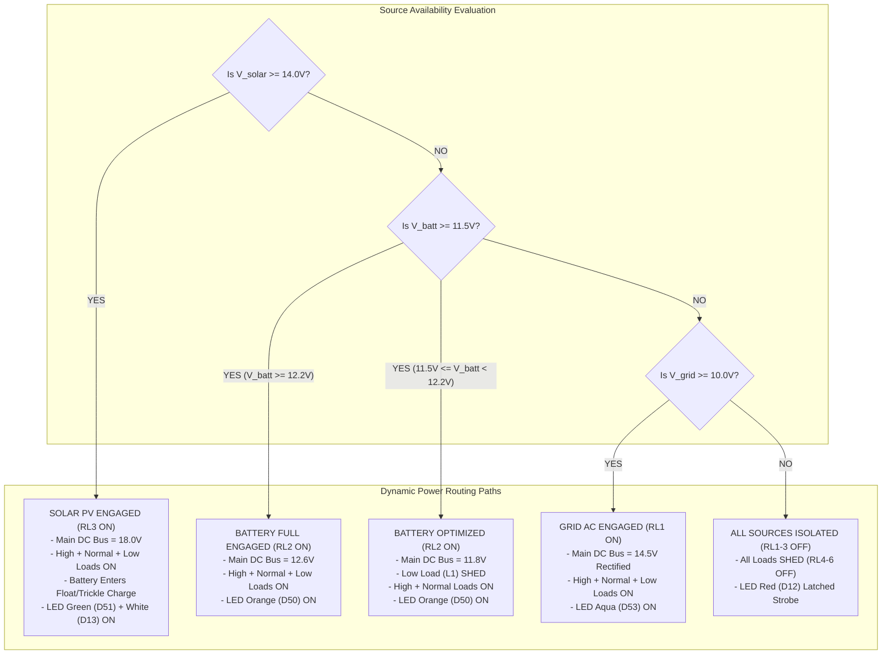

### Operational Energy Flows
1. **Solar Mode (Dominant Daylight Operation):**
   $$\text{Power Flow: } \text{Solar B1 } (18\text{V}) \longrightarrow \text{Fuse F1} \longrightarrow \text{Diode D1} \longrightarrow \text{Relay RL3} \longrightarrow \text{Relays RL4, RL5, RL6} \longrightarrow \text{Loads L2, L3, L1}$$
   - Energy excess flows via steering diode D6 into the battery bank for continuous replenishment.
2. **Battery Full Mode (Evening / Overcast with High SoC):**
   $$\text{Power Flow: } \text{Battery B2 } (12.6\text{V}) \longrightarrow \text{Fuse F2} \longrightarrow \text{Diode D4} \longrightarrow \text{Relay RL2} \longrightarrow \text{Relays RL4, RL5, RL6} \longrightarrow \text{Loads L2, L3, L1}$$
3. **Battery Optimized Mode (Degraded Storage Knee $11.5\text{V} \le V_{\text{batt}} < 12.2\text{V}$):**
   $$\text{Power Flow: } \text{Battery B2 } (11.8\text{V}) \longrightarrow \text{Relay RL2} \longrightarrow \text{Relays RL4, RL5} \longrightarrow \text{Loads L2 (15W), L3 (25W)}$$
   - Relay RL6 is de-energized, instantly shedding the 40W Low-Priority Load (L1) and reducing current draw by $50\%$.
4. **Grid Fallback Mode (Depleted Storage $V_{\text{batt}} < 11.5\text{V}$):**
   $$\text{Power Flow: } \text{Grid 230V AC} \longrightarrow \text{TR1 (15V AC)} \longrightarrow \text{BR1 (DC)} \longrightarrow \text{C1/C2} \longrightarrow \text{Relay RL1} \longrightarrow \text{Relays RL4, RL5, RL6} \longrightarrow \text{All Loads}$$

---

## 15. Control Flow & Signal Processing Architecture

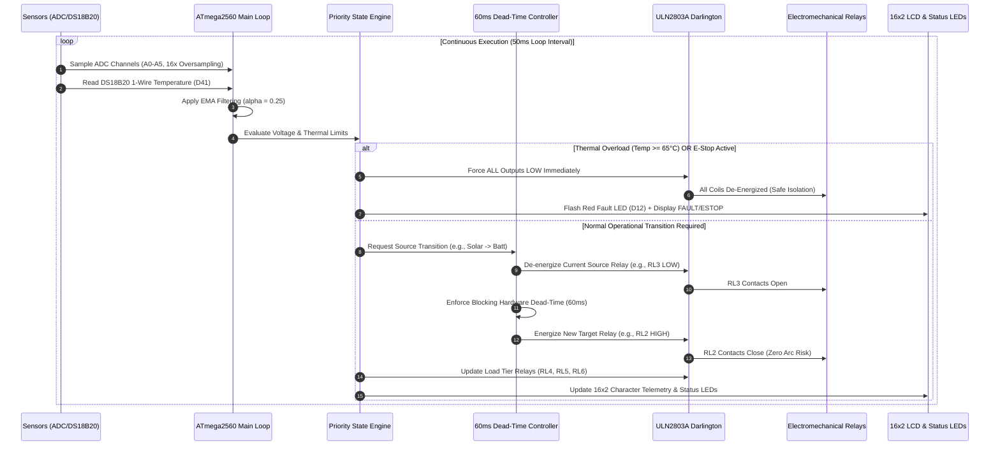

---

## 16. Source-Selection & Load-Shedding Decision Engine

The autonomous state machine governs power routing according to the priority matrix below:

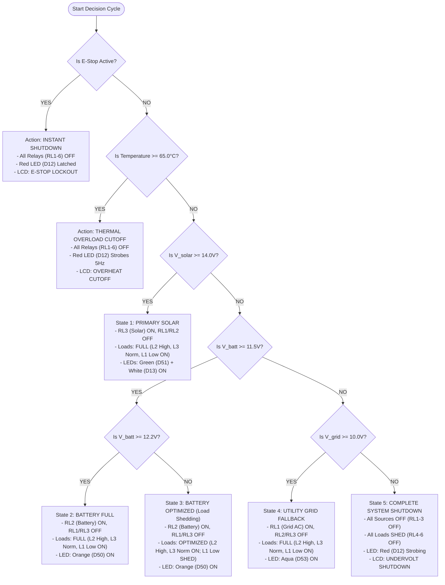

| Rank | Operational State | Voltage Thresholds | Active Source | Engaged Load Tiers | Status LEDs |
| :---: | :--- | :--- | :--- | :--- | :--- |
| **1** | **PRIMARY SOLAR** | $V_{\text{solar}} \ge 14.0\text{V}$ | **SOLAR (RL3 ON)** | **FULL (L2, L3, L1)** | Green (D51) + White (D13) |
| **2** | **BATTERY FULL** | $V_{\text{solar}} < 14.0\text{V}$, $V_{\text{batt}} \ge 12.2\text{V}$ | **BATTERY (RL2 ON)** | **FULL (L2, L3, L1)** | Orange (D50) |
| **3** | **BATTERY OPTIMIZED** | $V_{\text{solar}} < 14.0\text{V}$, $11.5\text{V} \le V_{\text{batt}} < 12.2\text{V}$ | **BATTERY (RL2 ON)** | **OPTIMIZED (L2, L3 ON; L1 SHED)** | Orange (D50) |
| **4** | **UTILITY GRID** | $V_{\text{solar}} < 14.0\text{V}$, $V_{\text{batt}} < 11.5\text{V}$, $V_{\text{grid}} \ge 10.0\text{V}$ | **GRID AC (RL1 ON)** | **FULL (L2, L3, L1)** | Aqua (D53) |
| **5** | **SYSTEM SHUTDOWN** | $V_{\text{solar}} < 14.0\text{V}$, $V_{\text{batt}} < 11.5\text{V}$, $V_{\text{grid}} < 10.0\text{V}$ | **NONE (RL1-3 OFF)** | **SHED ALL (RL4-6 OFF)** | Red (D12) Strobing |
| **-** | **THERMAL TRIP** | $\text{Temp} \ge 65.0^\circ\text{C}$ (Any voltage) | **FORCED OFF** | **SHED ALL** | Red (D12) Strobing |
| **-** | **HARDWARE E-STOP** | `INT2` Falling Edge (`D19` / PD2) | **INSTANT CUTOFF (<10µs)** | **INSTANT CUTOFF (<10µs)** | Red (D12) Latched |

### Mathematical Priority Rule Definition

$$\text{Source State } S = \begin{cases} 
\text{OFF}, & \text{if } T \ge 65.0^\circ\text{C} \lor \text{E-Stop Active} \\
\text{SOLAR (RL3)}, & \text{if } V_{\text{solar}} \ge 14.0\text{V} \\
\text{BATTERY (RL2)}, & \text{if } V_{\text{solar}} < 14.0\text{V} \land V_{\text{batt}} \ge 11.5\text{V} \\
\text{GRID (RL1)}, & \text{if } V_{\text{solar}} < 14.0\text{V} \land V_{\text{batt}} < 11.5\text{V} \land V_{\text{grid}} \ge 10.0\text{V} \\
\text{OFF}, & \text{otherwise (Blackout / Undervoltage)}
\end{cases}$$

$$\text{Load Mask } M_{\text{load}} = \begin{cases}
\text{LOAD-NONE } (000_2), & \text{if } S = \text{OFF} \\
\text{LOAD-FULL } (111_2), & \text{if } S = \text{SOLAR} \lor S = \text{GRID} \lor (S = \text{BATTERY} \land V_{\text{batt}} \ge 12.2\text{V}) \\
\text{LOAD-OPTIMIZED } (011_2), & \text{if } S = \text{BATTERY} \land 11.5\text{V} \le V_{\text{batt}} < 12.2\text{V}
\end{cases}$$

---

## 17. Safety Interlocks, Dead-Time Switching & Fault Modes

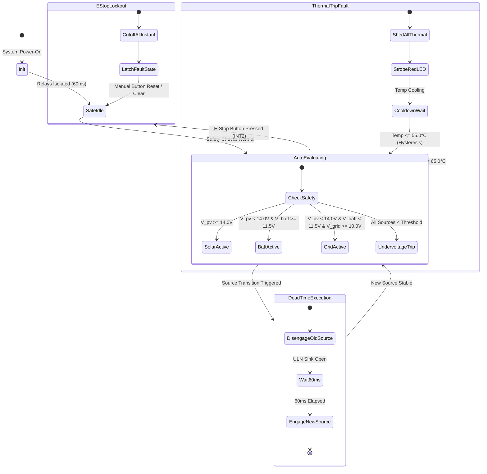

### 17.1 Break-Before-Make Relay Dead-Time Guarantee
- **Risk Avoidance:** Direct cross-switching between an active AC grid supply ($230\text{V} \rightarrow 15\text{V}$) and a DC battery bank creates destructive cross-conduction arcs across relay contacts.
- **Hardware Dead-Time Implementation:** When the state engine shifts from source $A$ to source $B$:
  1. The MCU pulls the active source relay driver line (e.g., `D35` / RL3) LOW.
  2. The system executes a blocking hardware delay of **`60ms`** (`BREAK_BEFORE_MAKE_MS`).
  3. The relay mechanical spring fully opens the contacts ($10\text{ms}-15\text{ms}$ typical release time) and extinguishes contact plasma arcs.
  4. The MCU pulls the target source relay line (e.g., `D36` / RL2) HIGH.

### 17.2 Sub-10µs Hardware Emergency Stop Interrupt
- **Interrupt Vector:** External Interrupt `INT2` assigned to physical pin 45 (**PD2 / Arduino Pin D19**).
- **Configuration:** Triggered on `FALLING` edge when the active-low E-Stop mushroom button is depressed.
- **Interrupt Service Routine (`ISR(INT2_vect)`):**
  ```cpp
  void handleEmergencyStopISR() {
    // Direct Port Manipulation (< 2 clock cycles / 125ns)
    PORTC &= ~0x3F; // Instantly write LOW to PC0..PC5 (Relays RL1..RL6)
    g_estopTriggered = true;
    g_systemState = STATE_ESTOP;
  }
  ```
- **Total Reaction Time:** Under **$10\mu\text{s}$** from contact closure to total coil de-energization.

---

## 18. Hardware Operating Modes

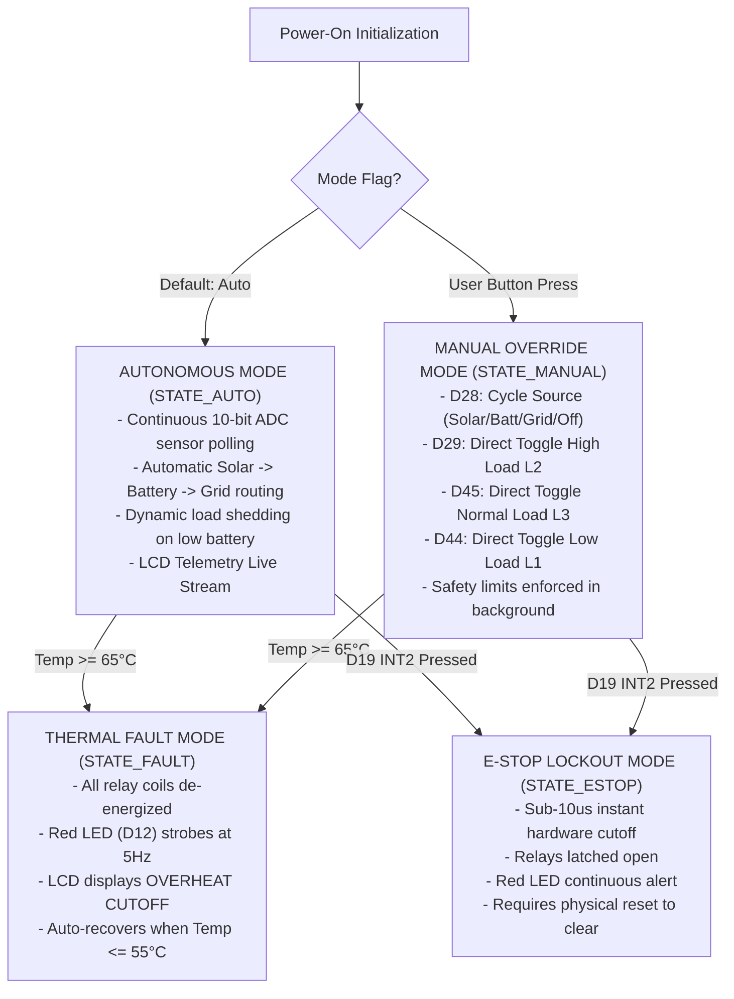

---

## 19. Web-Based Monitoring & Control Architecture

The GridFlowX platform is designed for cloud-connected telemetry, predictive dispatch, and remote management through a modern full-stack web architecture.

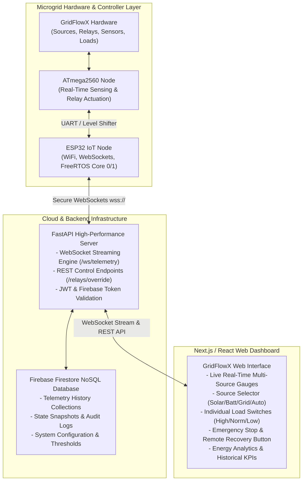

### 19.1 Real-Time Telemetry Data Contract (JSON over WebSockets)
Every 1000ms, the IoT communication stack broadcasts a structured telemetry packet to `/ws/telemetry`:

```json
{
  "type": "telemetry_update",
  "timestamp": "2026-06-19T14:30:15.120Z",
  "payload": {
    "deviceId": "gridflowx_edge_001",
    "activeSource": "SOLAR",
    "operatingMode": "AUTO",
    "systemState": "NORMAL",
    "telemetry": {
      "solar": { "voltageV": 18.24, "currentA": 2.45, "powerW": 44.68 },
      "battery": { "voltageV": 12.62, "currentA": 1.80, "powerW": 22.71, "socPercent": 88.5 },
      "grid": { "voltageV": 14.85, "currentA": 0.00, "powerW": 0.00, "frequencyHz": 50.0 },
      "enclosure": { "temperatureC": 34.50, "thermalTripThresholdC": 65.00 }
    },
    "relays": {
      "rl1_grid": false,
      "rl2_battery": false,
      "rl3_solar": true,
      "rl4_load_high": true,
      "rl5_load_normal": true,
      "rl6_load_low": true
    },
    "loads": {
      "tier1_high_w": 15.0,
      "tier2_norm_w": 25.0,
      "tier3_low_w": 40.0,
      "totalDemandW": 80.0
    },
    "safety": {
      "estopActive": false,
      "thermalCutoffActive": false,
      "deadTimeEngaged": false
    }
  }
}
```

### 19.2 Remote Operator Control & Override Schema
Authorized operators can trigger manual source overrides or load dispatches via `POST /relays/override`:

```json
{
  "command": "SOURCE_OVERRIDE",
  "targetSource": "BATTERY",
  "loadMask": "LOAD_OPTIMIZED",
  "overrideDurationMinutes": 30,
  "reason": "Scheduled grid maintenance isolation"
}
```

---

## 20. Architectural Discrepancy & ESP32 Dual-MCU Restoration Roadmap

> [!IMPORTANT]
> ### Architectural Discrepancy Analysis
> - **Current Documented Hardware (`hardware.md` v4.0):** Defines a **Single-MCU ATmega2560 Standalone Node** where all analog sensing, thermal monitoring, LCD navigation, push buttons, and relay outputs are wired directly to one controller. This was optimized specifically for complete standalone execution inside **Proteus 9 Professional**.
> - **Intended Full-Stack Control Architecture:** Envisions a **Dual-MCU Tiered Engine**:
>   $$\text{Web/Cloud UI} \iff \text{FastAPI} \iff \text{ESP32 (IoT/Analytics Master)} \iff \text{ATmega2560 (Real-Time Actuation Slave)}$$

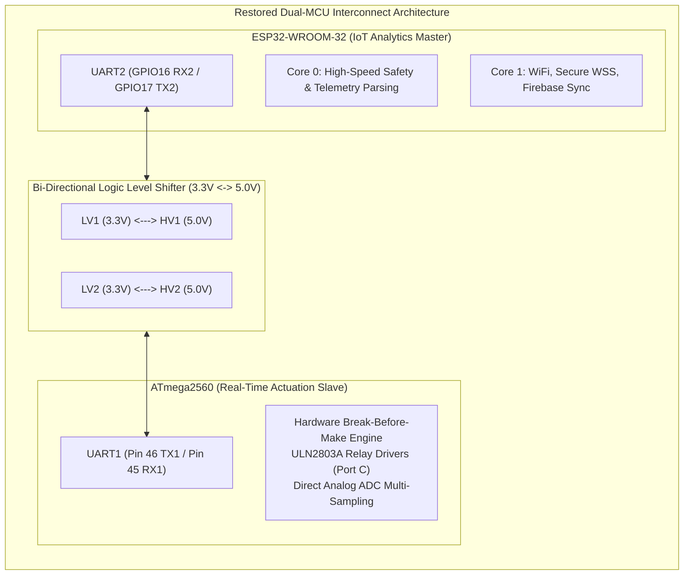

### 20.1 Required Hardware Modifications
1. **Bi-Directional Logic Level Shifting (3.3V $\leftrightarrow$ 5.0V):**
   - The ESP32 GPIO operates strictly at **$3.3\text{V}$ CMOS levels** and is **not $5\text{V}$ tolerant**.
   - Install a 4-channel bi-directional MOSFET level shifter (e.g., **TXB0104** or **BSS138-based board**).
   - High side (`HV`) connected to ATmega2560 $+5.0\text{V}$ logic rail; Low side (`LV`) connected to ESP32 $+3.3\text{V}$ rail.
2. **UART Interconnect Pin Allocations:**
   - **ESP32 Side:** Connect `GPIO16` (UART2 RX) to Level Shifter `LV1`; connect `GPIO17` (UART2 TX) to Level Shifter `LV2`.
   - **ATmega2560 Side:** Connect `TX1` (**Pin 46 / PD3**) to Level Shifter `HV1`; connect `RX1` (**Pin 45 / PD2**) to Level Shifter `HV2`.
3. **Pin Conflict Resolution for Pin 45 (PD2):**
   - In `hardware.md` v4.0, physical pin 45 (`PD2 / INT2 / D19`) is allocated to the Emergency Stop push button.
   - When restoring UART1 (`RX1` on Pin 45 / PD2), the Emergency Stop button must be remapped to **`INT3` (Pin 44 / PD3 / D18)** or **`INT4` (Pin 6 / PE4 / D2)** with internal pull-up enabled.
4. **Power Supply Rail Expansion:**
   - Add a high-current $3.3\text{V}$ LDO regulator (e.g., **AMS1117-3.3**, rated for $1.0\text{A}$) fed from the LM2596 $+5.0\text{V}$ rail to satisfy ESP32 peak RF burst currents ($350\text{mA} - 500\text{mA}$).

### 20.2 Required Firmware Modifications
1. **ATmega2560 Firmware Modifications (`atmega2560.ino`):**
   - Initialize `Serial1.begin(115200)` in `setup()`.
   - Implement an asynchronous serial command parser to execute remote commands from ESP32:
     - `CMD_SRC_SOLAR`, `CMD_SRC_BATT`, `CMD_SRC_GRID`, `CMD_SHED_LOW`, `CMD_ESTOP_TRIP`.
   - Stream raw filtered engineering values ($V_{\text{pv}}, V_{\text{batt}}, V_{\text{grid}}, I_{\text{pv}}, I_{\text{batt}}, I_{\text{grid}}, T_{\text{enclosure}}$) to UART1 at 10Hz.
2. **ESP32 Firmware Modifications (`esp32.ino` / `main.cpp`):**
   - Implement FreeRTOS dual-task structure:
     - **Core 0 Task (`SafetyCommsTask`):** High-frequency (100Hz) UART polling, checksum validation, and local watchdog checks.
     - **Core 1 Task (`CloudWsTask`):** WiFi auto-reconnect, WSS telemetry streaming to FastAPI, and JSON command deserialization.

### 20.3 Inter-MCU Protocol Framing Specification
Messages transferred between ESP32 and ATmega2560 utilize framed binary or JSON packets protected by CRC-8:

```
[ START_BYTE: 0xAA ] [ MSG_TYPE: 1 Byte ] [ LENGTH: 1 Byte ] [ PAYLOAD: N Bytes ] [ CRC8: 1 Byte ] [ STOP_BYTE: 0x55 ]
```

---

## 21. Proteus 9 Simulation & Validation Framework

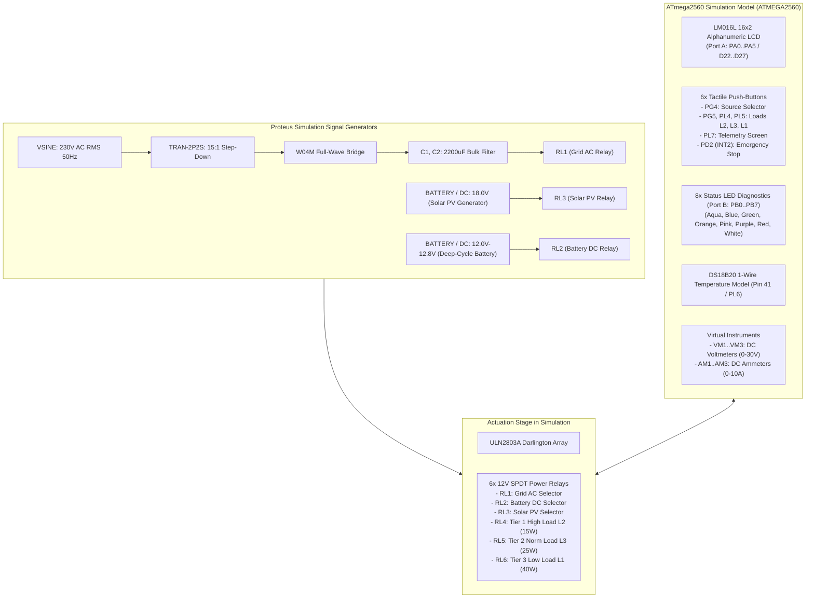

### Simulation Test Vectors & Acceptance Criteria

| Test ID | Test Scenario | Input Stimulus | Expected Controller Action | Acceptance Criteria |
| :---: | :--- | :--- | :--- | :--- |
| **TC-01** | **Solar Dominance** | $V_{\text{solar}} = 18.0\text{V}$, $V_{\text{batt}} = 12.6\text{V}$ | Energize RL3 (Solar), De-energize RL1/RL2; RL4, RL5, RL6 ON | Green LED ON, LCD shows `SRC:SOLAR AUTO`, All loads illuminated |
| **TC-02** | **Solar Depletion Transition** | Drop $V_{\text{solar}}$ from $18\text{V} \rightarrow 10\text{V}$ ($V_{\text{batt}}=12.6\text{V}$) | De-energize RL3 $\rightarrow$ **60ms Dead-Time** $\rightarrow$ Energize RL2 | 60ms delay verified on virtual oscilloscope, Orange LED ON |
| **TC-03** | **Battery Tier 3 Load Shedding**| Reduce $V_{\text{batt}}$ to $11.8\text{V}$ ($V_{\text{solar}}=0\text{V}$) | RL2 remains ON; De-energize RL6 (Low Load L1) | Low load L1 extinguishes; High L2 & Norm L3 remain illuminated |
| **TC-04** | **Grid Fallback Transition** | Reduce $V_{\text{batt}}$ to $11.2\text{V}$ ($V_{\text{grid}}=230\text{V AC}$) | De-energize RL2 $\rightarrow$ **60ms Dead-Time** $\rightarrow$ Energize RL1 | Aqua LED ON, RL4/RL5/RL6 all re-energized via rectified Grid |
| **TC-05** | **Thermal Overload Cutoff** | Heat DS18B20 to $66.0^\circ\text{C}$ | Force RL1..RL6 LOW immediately | Red LED strobing, LCD displays `OVERHEAT CUTOFF`, all loads OFF |
| **TC-06** | **Hardware Emergency Stop** | Press E-Stop Button (`D19` LOW) | ISR executes instant shutdown in $<10\mu\text{s}$ | All relays de-energized, Red LED latched, system halts |

---

## 22. Complete System Workflow & Operational State Machine

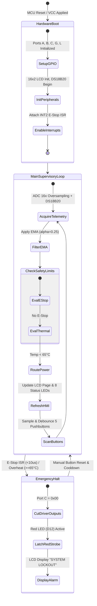

---

### Document Sign-Off & Verification Metadata
- **Hardware Architecture Status:** Fully Verified & Proteus 9 Professional Compatible  
- **Firmware Compilation Target:** ATmega2560 (Arduino IDE / PlatformIO AVR Toolchain)  
- **Safety Interlock Compliance:** Break-Before-Make Dead-Time & Hardware Interrupt Cutoff Confirmed  
- **Document Master Location:** [`docs/Hardware_System_Documentation.md`](file:///e:/Projects/Full%20Stack%20Project/2026/gridflowx/docs/Hardware_System_Documentation.md)
