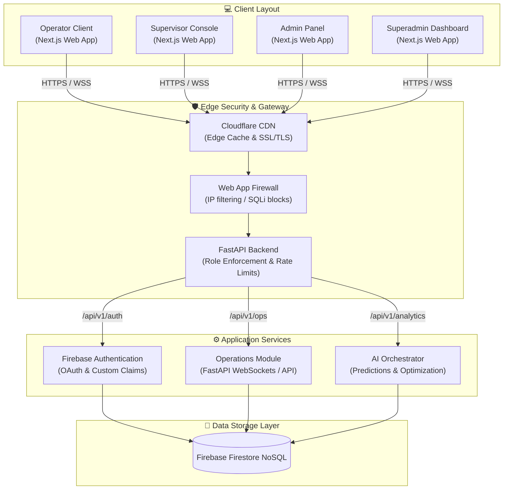
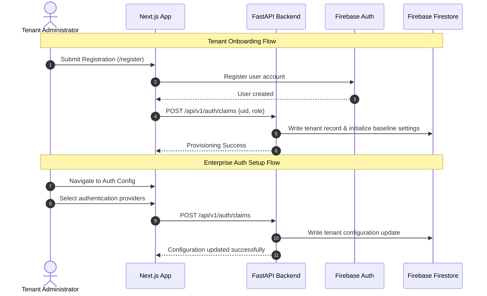
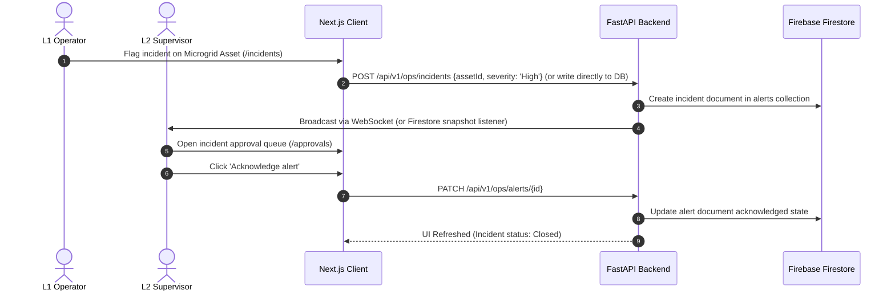

# 💻 GridFlowX Enterprise SaaS Platform — Complete Role-Based Pages & RBAC Structure

## 🗺️ Role Hierarchy

The GridFlowX (Smart AI-Driven Microgrid Management and Automation System) platform employs a multi-tenant, hierarchical Role-Based Access Control (RBAC) model to enforce security boundaries across distributed energy resources (DERs).

| Level | Role | Description |
| :--- | :--- | :--- |
| **L1** | **Operator** | Executes daily operational tasks on assigned microgrids, monitors site telemetry, toggles manual overrides, and logs hardware incidents. |
| **L2** | **Supervisor** | Manages operators, monitors multi-site performance KPIs, handles manual override approvals, tracks forecast accuracies, and monitors fleet node health. |
| **L3** | **Admin** | Manages tenant-specific configuration, safety limits, user provisioning, circuit-to-tier mappings, billing, and automation workflows. |
| **L4** | **Superadmin** | Controls global platform configurations, manages multiple tenant microgrid systems, regulates cloud infrastructure, and governs compliance. |

---

## 🌐 Public Pages

These routes are accessible to unauthenticated visitors, guests, and prospective enterprise clients.

| Route | Page | Access | Features |
| :--- | :--- | :--- | :--- |
| `/` | Landing Page | Public | GridFlowX platform overview, AI-driven energy savings calculations, client case studies, Call-to-Action (CTA) demo scheduling forms. |
| `/about` | Company | Public | Platform background, microgrid research alignment, founder portfolio, and executive team profile. |
| `/features` | Features | Public | Interactive product modules: AI solar/load forecasting, 3-tier prioritized load shedding, self-healing anomaly detection. |
| `/pricing` | Pricing | Public | Subscription packages categorized by managed node counts, data resolution frequencies, and access to premium ML models. |
| `/contact` | Contact | Public | Inquiries for custom physical hardware deployments, hardware pilot requests, and enterprise quotes. |
| `/support` | Help Center | Public + Authenticated | Knowledge base search (ESP32 schematics, relay wiring, calibration logs), user tickets, live chatbot. |
| `/status` | System Status | Public | Public uptime tracker for platform services, WebSockets, and cloud API latency. |
| `/privacy` | Privacy Policy | Public | GDPR compliance, cookie consent settings, and data retention policies for telemetry logs. |
| `/terms` | Terms of Service | Public | End-user license agreements, legal terms for edge data collection and automation overrides. |

---

## 🔑 Authentication Pages

Authentication pages handle initial authorization, password recoveries, multi-tenant onboarding, and secure edge configuration.

| Route | Page | Access | Features |
| :--- | :--- | :--- | :--- |
| `/login` | Login | Public | Standard credential inputs, enterprise OIDC Single Sign-On (SSO) links, social OAuth integrations. |
| `/register` | Registration | Public | Multi-tenant organization onboarding and primary tenant admin registration. |
| `/forgot-password` | Reset Password | Public | Secure recovery link generation via verified email address. |
| `/verify-email` | Verify Email | Public | Action handler for verifying operator or administrator registration. |
| `/mfa` | Multi-Factor Authentication | Authenticated | Setup and verification for TOTP (Google Authenticator, Duo) and hardware keys (YubiKey). |
| `/sso` | SSO Configuration | Admin+ | SAML 2.0 / OIDC integrations management for enterprise domains. |

---

## 🤝 Shared User Pages

These layouts are generic shells shared across all authenticated user roles, adapting content panels based on context.

| Route | Page | Access | Primary Contents |
| :--- | :--- | :--- | :--- |
| `/dashboard` | Dashboard | Operator, Supervisor | Live operational widgets, Sankey power flow visualizer, battery state-of-charge (SoC) gauges, live override controllers. |
| `/notifications` | Notifications | All Roles | Real-time system alarms (e.g., overcurrent, thermal warning, model drift indicators). |
| `/profile` | User Profile | All Roles | Personal preferences, password management, and MFA security settings. |
| `/activity` | Activity Center | All Roles | Personal session audits, recent page visits, and override action history. |
| `/documents` | Documents | All Roles | Microgrid schematics, site wiring guides, and firmware calibration templates. |
| `/support` | Support Portal | All Roles | Ticket tracker, chat support widget, user feedback submissions. |

---

## 🔧 Operator Module (L1)

### Purpose
Execution of daily field operations, microgrid node monitoring, override management, and manual anomaly reporting.

| Route | Page | Features |
| :--- | :--- | :--- |
| `/operations` | Operations Console | Live telemetry stream, real-time alert logs, and quick manual toggle buttons. |
| `/fleet` | Microgrid Nodes | Status of solar PV arrays, battery packs, and inverter/rectifier hardware units. |
| `/sites` | Site Management | Location metrics, environmental sensors, and site layout telemetry. |
| `/jobs` | Load Scheduling | Flexible load schedules, priority runtime settings (e.g., water pump triggers). |
| `/incidents` | Incident Reporting | Manual logging of hardware faults, voltage ripples, and thermal cutoffs. |
| `/maintenance` | Maintenance Requests | ACS712 sensor calibration forms, mechanical relay repair requests. |
| `/checklists` | Operational Checklists | SOP check-offs for physical system start/stops and edge sanity checklists. |
| `/tasks` | Task Management | Operator personal work list, safety checks schedules. |
| `/calendar` | Schedule | Shift planners, sensor calibration scheduling calendars. |
| `/reports/my` | Personal Reports | Personal override response times, telemetry logs accuracy stats. |

### Operator Permissions
*   View assigned microgrid node metrics and site telemetry
*   Update active work order status (e.g., offline check, calibration complete)
*   Bypass active AI recommendations via temporary manual relay overrides (30-minute default)
*   Log incident flags and upload sensor fault data
*   Submit maintenance requests for degraded equipment
*   View personal dashboard performance metrics

#### Cannot:
*   Provision, delete, or modify user accounts
*   Edit tenant-wide safety limits or system configuration thresholds
*   Access billing details, subscription packages, or invoices
*   Configure tenant integrations or global API settings

---

## 📈 Supervisor Module (L2)

### Purpose
Microgrid network oversight, load balance coordination, model metrics review, and override approvals.

| Route | Page | Features |
| :--- | :--- | :--- |
| `/dashboard/supervisor` | Supervisor Dashboard | Combined team KPIs, active incident maps, alerts panel. |
| `/analytics` | Analytics Center | Multi-site performance statistics, forecasting accuracy charts (MAE/MAPE). |
| `/fleet/control` | Microgrid Array Control | Asset health tracker, thermal limits control. |
| `/sites/overview` | Site Overview | Real-time telemetry monitoring for multiple sites. |
| `/team/operations` | Team Operations | Active roster lists, task allocations dashboard. |
| `/approvals` | Approval Center | Extended manual override approvals, threshold override authorizations. |
| `/performance` | Performance Reports | Carbon displacement metrics, overall efficiency tracking. |
| `/workflows` | Workflow Tracking | Model retraining progress, automated shedding sequence tracking. |
| `/reports` | Operational Reports | Interactive query builder, export to CSV/PDF/Excel. |

### Supervisor Permissions
*   Inherits all baseline Operator permissions
*   Approve extended manual relay overrides (longer than the standard 30-minute window)
*   Access aggregate team performance and site energy balance reports
*   Monitor AI forecasting model accuracy (irradiance/load metrics)
*   Generate and export custom energy efficiency PDF/CSV reports
*   Triage and resolve reported hardware incidents

#### Cannot:
*   Access billing, payment details, or subscription configurations
*   Change tenant-wide configuration settings or schema fields
*   Modify system infrastructure or manage other enterprise tenants

---

## 👑 Admin Module (L3)

### Purpose
Tenant-level system administrative control, safety threshold settings, integration bindings, and data backups.

| Route | Page | Features |
| :--- | :--- | :--- |
| `/team` | User Management | Tenant user CRUD, password resets, role overrides. |
| `/roles` | Role Management | Tenant RBAC customization, permission assignment. |
| `/departments` | Circuit Configuration | Map physical relays to load tiers (Critical Tier 1, Important Tier 2, Flexible Tier 3). |
| `/settings` | Tenant Settings | System safety threshold editor (SoC limits, warning temperatures). |
| `/billing` | Billing Center | Invoicing history, payment details, seat allocations. |
| `/subscriptions` | Plans & Usage | Subscription plans, API usage limits, storage tracking. |
| `/integrations` | Integrations Hub | Setup configurations for CRM, HRMS, ATS, and Weather API platforms. |
| `/api-keys` | API Management | Platform developer credentials lifecycle management. |
| `/automation` | Workflow Automation | Visual rules engine for event-driven system triggers. |
| `/reports/admin` | Business Reports | Tenant billing analytics, seat utilization insights. |
| `/audit` | Audit Logs | Immutable security logs mapping user actions. |

### Admin Permissions
*   Manage user lifecycle (Create, Read, Update, Delete)
*   Assign specific platform roles (L1, L2, L3)
*   Configure tenant-wide options, safety cutoffs, and calibration coefficients
*   Create and customize automated workflow triggers (e.g. dynamic load shedding rules)
*   Manage payment card integrations, plans, and subscription changes
*   Enable integration connectors to third-party endpoints (HubSpot, Workday, OpenWeatherMap)
*   Export full tenant compliance audit logs

#### Cannot:
*   Manage other tenants within the multi-tenant architecture
*   Access underlying server infrastructure or modify global platform feature flags

---

## 🔮 Superadmin Module (L4)

### Purpose
Global platform administration, multi-tenant lifecycle control, server resource monitoring, and overall system governance.

| Route | Page | Features |
| :--- | :--- | :--- |
| `/system` | System Dashboard | Cross-tenant metrics, global API latency, server load. |
| `/tenants` | Tenant Management | Tenant provisioning, suspension logs, custom limits. |
| `/security` | Security Center | Global firewall rules, brute-force limits, encryption keys. |
| `/compliance` | Compliance Center | Compliance audits (GDPR, SOC2, ISO verification tools). |
| `/feature-flags` | Feature Management | Dynamic feature flags console, canary release toggles. |
| `/infrastructure` | Infrastructure Control | Server cluster health, database connection pools. |
| `/platform-settings` | Global Settings | Global platform styling, support settings, legal URLs. |
| `/monitoring` | Observability Center | Datadog/Prometheus metric integrations, error tracking. |
| `/incident-center` | Incident Response | Platform down alert handlers, network logs. |
| `/backup-recovery` | Backup & DR | S3 backups dashboard, database restoration triggers. |
| `/audit/global` | Global Audit Logs | Cross-tenant search queries, admin audits. |
| `/system-health` | Health Monitoring | Microservices status charts, container logs. |

### Superadmin Permissions
*   Complete infrastructure, container, and database deployment control
*   Provision new tenants and adjust billing limits
*   Enable global security configuration rules and compliance checkers
*   Configure observability targets and monitor platform telemetry
*   Manage rollout of system features using dynamic toggles
*   Access global audit trail tracking
*   **Restrictions:** None.

---

## ⚙️ Enterprise SaaS Utility Pages

These auxiliary modules support key utility actions accessible across various page layouts.

| Route | Page | Access | Key Features |
| :--- | :--- | :--- | :--- |
| `/search` | Global Search | All Roles | Elasticsearch queries indexing profiles, sites, and documents. |
| `/notifications` | Notification Center | All Roles | Configurable categories, alert read/unread flags, Slack hooks. |
| `/exports` | Export Center | Supervisor+ | Queue status for CSV/PDF report building. |
| `/imports` | Import Center | Admin+ | Bulk upload CSV parsing tool (e.g., users, fleet lists). |
| `/webhooks` | Webhooks | Admin+ | Event subscription builder, target URL verifier. |
| `/logs` | Activity Logs | Admin+ | Live system event debugging stream. |
| `/feedback` | Feedback Portal | All Roles | Direct customer comment routing, user rating submissions. |
| `/release-notes` | Release Notes | All Roles | Dynamic markdown feed displaying recent platform updates. |

---

## 📊 RBAC Matrix

Permissions are evaluated dynamically on each API route and page route activation.

| Module | Operator (L1) | Supervisor (L2) | Admin (L3) | Superadmin (L4) |
| :--- | :--- | :--- | :--- | :--- |
| **Dashboard** | ✅ | ✅ | ✅ | ✅ |
| **Operations** | ✅ | ✅ | ✅ | ✅ |
| **Microgrids (Fleet)** | ✅ | ✅ | ✅ | ✅ |
| **Analytics** | ❌ | ✅ | ✅ | ✅ |
| **Reports** | ⚠️ Limited (Own Only) | ✅ | ✅ | ✅ |
| **User Management**| ❌ | ❌ | ✅ | ✅ |
| **Role Management**| ❌ | ❌ | ✅ | ✅ |
| **Billing** | ❌ | ❌ | ✅ | ✅ |
| **Integrations** | ❌ | ❌ | ✅ | ✅ |
| **Audit Logs** | ❌ | ⚠️ Limited (Team) | ✅ | ✅ |
| **Tenant Control** | ❌ | ❌ | ❌ | ✅ |
| **Infrastructure** | ❌ | ❌ | ❌ | ✅ |
| **Compliance** | ❌ | ❌ | ⚠️ Limited (Tenant) | ✅ |
| **Security Center**| ❌ | ❌ | ⚠️ Limited (Tenant) | ✅ |

---

## 🗂️ Recommended Sidebar Navigation Layouts

The application Shell adapts sidebar menus dynamically to reflect user access rights.

### 1. Operator Navigation (L1)
*   📊 `Dashboard` `/dashboard`
*   ⚙️ `Operations` `/operations`
*   🔋 `Microgrid Nodes` `/fleet`
*   📍 `Sites` `/sites`
*   📝 `Tasks` `/tasks`
*   ⚠️ `Incidents` `/incidents`
*   🔧 `Maintenance` `/maintenance`
*   📞 `Support` `/support`

### 2. Supervisor Navigation (L2)
*   📊 `Dashboard` `/dashboard/supervisor`
*   📈 `Analytics` `/analytics`
*   🔋 `Microgrid Control` `/fleet/control`
*   👥 `Team Operations` `/team/operations`
*   📄 `Reports` `/reports`
*   ✅ `Approvals` `/approvals`
*   🔄 `Workflows` `/workflows`
*   📞 `Support` `/support`

### 3. Admin Navigation (L3)
*   📊 `Dashboard` `/dashboard`
*   👥 `Team` `/team`
*   🔐 `Roles` `/roles`
*   💳 `Billing` `/billing`
*   🔌 `Integrations` `/integrations`
*   🤖 `Automation` `/automation`
*   📋 `Audit Logs` `/audit`
*   ⚙️ `Settings` `/settings`

### 4. Superadmin Navigation (L4)
*   💻 `System` `/system`
*   🏢 `Tenants` `/tenants`
*   🛡️ `Security` `/security`
*   ⚖️ `Compliance` `/compliance`
*   📦 `Infrastructure` `/infrastructure`
*   📈 `Monitoring` `/monitoring`
*   📋 `Audit` `/audit/global`
*   ⚙️ `Global Settings` `/platform-settings`

---

## 📐 Platform System Architecture

---

## 🔄 Core Platform Workflows

### Tenant Onboarding & Admin SSO Configuration

### Operational Incident Escalation

