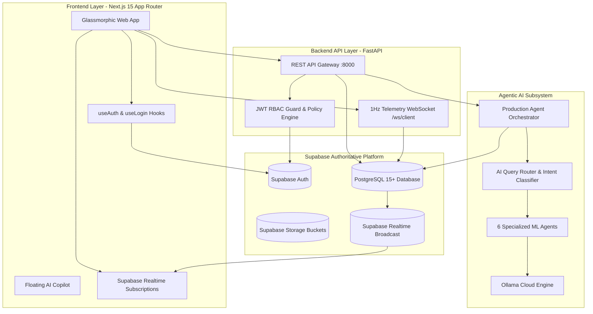

# ⚡ GridFlowX — Supabase Architecture & Data Platform Specification

**Document ID:** `DOC-SUPABASE-ARCH-v3`  
**Version:** 3.0.0 (Production Migration)  
**Author:** GridFlowX Platform Architecture & Systems Engineering Team  
**Status:** Canonical Reference (Production-Approved)

---

## 1. Executive Summary & Architecture Overview

GridFlowX has transitioned completely from a legacy Firebase setup to a unified, production-grade **Supabase + PostgreSQL** enterprise platform. Supabase serves as the single authoritative data and identity platform across:

1. **Relational Data & Time-Series Engine (PostgreSQL 15+)**
2. **Identity, Authentication & Zero-Trust RBAC (Supabase Auth)**
3. **Hardware & Substation Audit Trail & State Storage**
4. **Agentic AI Context & Conversation Persistence (`ai_conversations`, `ai_messages`, `ai_memory`)**
5. **Real-time Event Broadcasting (Supabase Realtime / PostgreSQL WAL Changes)**
6. **Encrypted Storage for System Diagnostics, Firmware, & Datasets (Supabase Storage)**



---

## 2. Supabase PostgreSQL Relational Schema

All database schema migrations are version-controlled in `supabase/migrations/`:
- `20261001000000_gridflowx_schema.sql` (Core Schema & Initial Tables)
- `20261001000002_supplement_schema.sql` (Complete Table Set, Foreign Keys & RLS)

### 2.1 Domain Tables & Entity Relationships

```
auth.users (Supabase Auth Identity)
   │
   ├── (1:1) public.user_profiles / public.users
   │
   ├── (1:N) public.devices (Microgrid Edge Gateways & Nodes)
   │           └── (1:N) public.telemetry (1Hz Sensor Time-Series)
   │
   ├── (1:N) public.relay_audit (Contactor Switching History & Latches)
   ├── (1:N) public.alerts & public.alert_rules
   ├── (1:N) public.audit_logs (Tamper-evident Immutable Security Trail)
   ├── (1:N) public.system_configurations (Safety Thresholds & Calibrations)
   ├── (1:N) public.support_tickets (Level-2 Dispatch)
   ├── (1:N) public.api_keys (Machine-to-Machine Credentials)
   ├── (1:N) public.work_orders & public.reports
   │
   └── (1:N) Agentic AI Persistence:
               ├── public.ai_conversations (Session Contexts)
               ├── public.ai_messages (Multi-turn History & Citations)
               ├── public.agent_tasks & public.agent_task_queue
               └── public.ai_memory (Episodic & Semantic Knowledge)
```

---

## 3. Database Table Specifications

### `user_profiles` / `users`
- **Primary Key:** `id` (UUID, references `auth.users(id)` with `ON DELETE CASCADE`)
- **Fields:** `email`, `role` (`'admin' | 'supervisor' | 'operator' | 'auditor' | 'user'`), `display_name`, `first_name`, `last_name`, `phone_number`, `avatar_url`, `is_active`, `last_login`, `created_at`, `updated_at`.
- **Security:** RLS enabled. Users can view and update their own profiles; Admins have full access.

### `telemetry`
- **Primary Key:** `id` (UUID / BIGSERIAL)
- **Fields:** `device_id` (TEXT), `timestamp` (TIMESTAMPTZ), `solar_power_w`, `solar_voltage_v`, `solar_current_a`, `load_power_w`, `grid_power_w`, `grid_voltage_v`, `grid_frequency_hz`, `battery_soc_pct`, `battery_voltage_v`, `battery_current_a`, `battery_temp_c`, `battery_soh_pct`, `relay_states` (BOOLEAN[]), `core0_failsafe_active` (BOOLEAN), `metrics` (JSONB).
- **Indexes:** `idx_telemetry_device_time (device_id, timestamp DESC)`.

### `relay_audit`
- **Fields:** `id`, `timestamp`, `device_id`, `relay_channel`, `target_tier`, `action`, `actor_uid`, `actor_role`, `safety_verified`, `reason`, `meta`.

### `alerts`
- **Fields:** `id`, `created_at`, `device_id`, `severity` (`'INFO' | 'WARNING' | 'CRITICAL'`), `category` (`'ELECTRICAL' | 'THERMAL' | 'AI_ANOMALY' | 'INTERLOCK'`), `message`, `details` (JSONB), `acknowledged`, `acknowledged_by`, `acknowledged_at`.

### `audit_logs`
- **Fields:** `id`, `timestamp`, `actor_uid`, `actor_email`, `actor_role`, `action`, `severity`, `status`, `resource`, `details` (JSONB), `hash`.
- **Properties:** Append-only, tamper-evident security logging.

### `ai_conversations` & `ai_messages`
- **Fields `ai_conversations`:** `id`, `user_id`, `title`, `created_at`, `updated_at`, `metadata`.
- **Fields `ai_messages`:** `id`, `conversation_id`, `sender` (`'user' | 'agent' | 'system'`), `content`, `model_used`, `telemetry_snippet` (JSONB), `tools_used` (TEXT[]), `created_at`.

---

## 4. Row Level Security (RLS) Policies

All tables in the `public` schema have Row Level Security enabled:

```sql
-- Enable RLS across application tables
ALTER TABLE public.user_profiles ENABLE ROW LEVEL SECURITY;
ALTER TABLE public.telemetry ENABLE ROW LEVEL SECURITY;
ALTER TABLE public.relay_audit ENABLE ROW LEVEL SECURITY;
ALTER TABLE public.alerts ENABLE ROW LEVEL SECURITY;
ALTER TABLE public.audit_logs ENABLE ROW LEVEL SECURITY;
ALTER TABLE public.ai_conversations ENABLE ROW LEVEL SECURITY;
ALTER TABLE public.ai_messages ENABLE ROW LEVEL SECURITY;

-- User Profile Policies
CREATE POLICY "Users can read own profile"
  ON public.user_profiles FOR SELECT
  USING (auth.uid() = id OR (auth.jwt() ->> 'role') = 'admin');

CREATE POLICY "Users can update own profile"
  ON public.user_profiles FOR UPDATE
  USING (auth.uid() = id);

-- Telemetry & Realtime Access
CREATE POLICY "Authenticated operators can read telemetry"
  ON public.telemetry FOR SELECT
  TO authenticated
  USING (true);

-- AI Conversation Isolation
CREATE POLICY "Users access own AI conversations"
  ON public.ai_conversations FOR ALL
  USING (auth.uid() = user_id);

CREATE POLICY "Users access own AI messages"
  ON public.ai_messages FOR ALL
  USING (
    EXISTS (
      SELECT 1 FROM public.ai_conversations
      WHERE ai_conversations.id = ai_messages.conversation_id
        AND ai_conversations.user_id = auth.uid()
    )
  );
```

---

## 5. Supabase Auth & JWT Validation

1. **Frontend Authentication Flow:**
   - Registration, email confirmation, password login, and OAuth (Google) operate through `@supabase/supabase-js` and `@supabase/ssr`.
   - On successful authentication, tokens are managed via secure cookies and bearer headers.

2. **Backend Fast-Path Token Verification (`agentic-ai/utils/auth.py` & `backend/integrations/supabase_integration.py`):**
   - FastAPI inspects `Authorization: Bearer <TOKEN>`.
   - The token is verified against the Supabase GoTrue endpoint with claims inspection.
   - For offline developer environments, role-tagged tokens (`dev-admin`, `dev-supervisor`, `dev-operator`) provide zero-friction local simulation.

---

## 6. AI Agentic Integration with Supabase

The Agentic AI subsystem directly interfaces with Supabase for multi-tier intelligence:
- **Conversation State:** Stored in `ai_conversations` and `ai_messages` for persistent chat sessions across page reloads.
- **Working Memory & Context Assembler:** Queries Supabase `telemetry`, `alerts`, and `system_configurations` before invoking Ollama Cloud inference (`gemma4:31b-cloud` and `gpt-oss:120b-cloud`).
- **HITL Overrides & Audit Trail:** AI-proposed relay operations write pending action cards and require cryptographic token elevation before dispatching to hardware.
