# GridflowX Tri-Source Microgrid Controller - Hardware Design Documentation

This document serves as the single source of truth and complete hardware description for the **GridflowX Tri-Source Microgrid Controller**. It contains all specifications, schematics connection lists, signal flows, design assumptions, and the complete Python SKiDL source code necessary to recreate the hardware design and netlist.

---

## 1. Circuit Overview

The **GridflowX** is an ESP32-based hardware prototype designed to manage power routing from three distinct sources (Utility Grid, Solar PV, and Backup Battery) to three priority-tiered loads (High, Normal, and Low priority). 

Key high-level capabilities of the hardware:
1. **Tri-Source DC Bus:** Combines rectified Grid AC, Solar PV, and Battery DC into a shared 12V power bus.
2. **Voltage Sensing & Analytics:** Divider circuits step down the voltage of each source for real-time monitoring via the ESP32's ADC channels.
3. **Opto-Isolated Relay Switching:** Control lines from the ESP32 are electrically isolated using PC817 optocouplers before triggering a ULN2803A Darlington array to switch 5V power relays.
4. **Thermal Monitoring:** DS18B20 digital thermometer monitors temperature over a 1-Wire interface.
5. **Human-Machine Interface:** Interactive override buttons, status LEDs, and an I2C-based 16x2 character display.

---

## 2. Power Distribution & Regulation

The microgrid operates on a multi-stage power system:
* **Common 12V Bus (`BUS_12V`):** 
  * **Utility Grid AC:** Tapped from an AC terminal block, passed through a fuse (`F1`), and rectified using a bridge rectifier (`U5`). Stabalized using a 1000µF electrolytic reservoir capacitor (`C1`).
  * **Solar PV & Battery DC:** Fed through independent fuses (`F2`, `F3`) and Schottky blocking diodes (`D9`, `D10` - 1N5819) to prevent back-feeding.
* **5V Regulation Rail (`RAIL_5V`):** An LM2596 step-down buck module (`U3`) steps down the 12V bus to 5V. Decoupled using 100nF capacitors (`C3`, `C5`). Supplies the relay coils, LCD display backlight, and optocoupler output pull-up stages.
* **3.3V Regulation Rail (`RAIL_3V3`):** An AMS1117-3.3 linear regulator (`U4`) steps down the 5V rail to 3.3V. Buffered with a 470µF bulk capacitor (`C2`) and decoupled with 100nF capacitors (`C4`, `C6`). Supplies the ESP32 core, push-button pull-ups, and the DS18B20 temp sensor.

---

## 3. Component List & Specifications

| Reference | Qty | Part / Value | Footprint | Description / Purpose |
| :--- | :--- | :--- | :--- | :--- |
| **U1** | 1 | `ESP32_WROOM_32` | `RF_Module:ESP32-WROOM-32` | Core processor (3.3V logic) |
| **U3** | 1 | `LM2596_MODULE` | `Connector_PinHeader_2.54mm:PinHeader_1x04_P2.54mm_Vertical` | 12V-to-5V buck regulator module |
| **U4** | 1 | `AMS1117-3.3` | `Package_TO_SOT_SMD:SOT-223-3_TabPin2` | 5V-to-3.3V linear LDO regulator |
| **U5** | 1 | `BRIDGE` | `Diode_THT:Diode_Bridge_DIP-4_W7.62mm_P5.08mm` | AC-to-DC rectifier bridge |
| **U6** | 1 | `ULN2803A` | `Package_DIP:DIP-18_W7.62mm` | Darlington driver array for relay coils |
| **U7 - U12** | 6 | `PC817` | `Package_DIP:DIP-4_W7.62mm` | Optocouplers for logic/coil power isolation |
| **U13** | 1 | `LCD16x2_I2C` | `Display:LCD-016N002L` | PCF8574-backpack I2C LCD display |
| **RL1 - RL6** | 6 | `RELAY_SPDT` | `Relay_THT:Relay_SPDT_SANYOU_SRD_Series_Form_C` | 5V coils, SPDT contacts |
| **DS1** | 1 | `DS18B20` | `Package_TO_SOT_THT:TO-92_Inline` | 1-Wire temperature sensor |
| **AC1** | 1 | `AC_SRC` | `TerminalBlock_Phoenix:TerminalBlock_Phoenix_MKDS-1...` | Mains AC terminal input block |
| **PV1, BAT1** | 2 | `DC_SRC` | `TerminalBlock_Phoenix:TerminalBlock_Phoenix_MKDS-1...` | Solar PV and battery terminal input blocks |
| **LMP1 - LMP3**| 3 | `LAMP` | `TerminalBlock_Phoenix:TerminalBlock_Phoenix_MKDS-1...` | Representative load terminals (High/Normal/Low) |
| **F1 - F3** | 3 | `FUSE` | `Fuse:Fuse_1206_3216Metric` | Input protection fuses |
| **D1 - D6** | 6 | `1N4007` | `Diode_THT:D_DO-41_SOD81_P10.16mm_Horizontal` | Flyback protection diodes across relay coils |
| **D9, D10** | 2 | `1N5819` | `Diode_THT:D_DO-41_SOD81_P10.16mm_Horizontal` | Schottky blocking diodes |
| **C1** | 1 | `1000uF` | `Capacitor_THT:CP_Radial_D8.0mm_P3.50mm` | 12V bus reservoir capacitor |
| **C2** | 1 | `470uF` | `Capacitor_THT:CP_Radial_D8.0mm_P3.50mm` | 3.3V rail bulk capacitor |
| **C3 - C6** | 4 | `100nF` | `Capacitor_THT:CP_Radial_D8.0mm_P3.50mm` | Decoupling capacitors (5V and 3.3V rails) |
| **R1, R3** | 2 | `100k` | `Resistor_THT:R_Axial_DIN0207...` | Sensing dividers (high-side) |
| **R2** | 1 | `15k` | `Resistor_THT:R_Axial_DIN0207...` | Solar sensing divider (low-side) |
| **R4** | 1 | `22k` | `Resistor_THT:R_Axial_DIN0207...` | Grid sensing divider (low-side) |
| **R5** | 1 | `13.3k` | `Resistor_THT:R_Axial_DIN0207...` | Battery sensing divider (high-side) |
| **R6** | 1 | `3.7k` | `Resistor_THT:R_Axial_DIN0207...` | Battery sensing divider (low-side) |
| **R7 - R12** | 6 | `1k` | `Resistor_THT:R_Axial_DIN0207...` | ESP32 GPIO series resistors to PC817 LEDs |
| **R13 - R18** | 6 | `10k` | `Resistor_THT:R_Axial_DIN0207...` | Pull-ups on PC817 output to ULN2803A inputs |
| **R19 - R25** | 7 | `10k` | `Resistor_THT:R_Axial_DIN0207...` | Pull-ups for buttons (S1-S5), EN, and GPIO0 |
| **R26 - R29** | 4 | `330` | `Resistor_THT:R_Axial_DIN0207...` | Current-limiting resistors for status LEDs |
| **R30** | 1 | `4.7k` | `Resistor_THT:R_Axial_DIN0207...` | Pull-up resistor for 1-Wire DQ data line |
| **LED1 - LED4**| 4 | `LED` | `LED_THT:LED_D5.0mm` | Status LEDs (Solar, Grid, Battery, Fault) |
| **S1 - S5** | 5 | `SW_PUSH` | `Button_Switch_THT:SW_PUSH_6mm` | Override/Interactive control buttons |

---

## 4. Pin Connections & Schematic Wiring

### ESP32-WROOM-32 Pinout Mapping
* **Pin 1 (3V3):** Connected to `RAIL_3V3`
* **Pin 2 (EN):** Pull-up resistor `R24` (10k) to `RAIL_3V3` (enables MCU run state)
* **Pin 3 (GND):** Connected to `GND`
* **Pin 4 (GPIO0):** Pull-up resistor `R25` (10k) to `RAIL_3V3` (keeps MCU out of bootloader) + drives Red Fault LED (`LED4` via resistor `R29` 330Ω)
* **Pin 5 (GPIO2):** Low-Priority Load Relay Trigger (`GPIO_LOW` $\rightarrow$ series `R12` $\rightarrow$ `U12` optocoupler)
* **Pin 6 (GPIO4):** Peak Override Button input (`BTN_PEAK` $\rightarrow$ pull-up `R19` 10k $\rightarrow$ `S1`)
* **Pin 7 (GPIO5):** SOC Override Button input (`BTN_SOC` $\rightarrow$ pull-up `R20` 10k $\rightarrow$ `S2`)
* **Pin 8 (GPIO12):** High-Priority Load Relay Trigger (`GPIO_HIGH` $\rightarrow$ series `R10` $\rightarrow$ `U10` optocoupler)
* **Pin 9 (GPIO13):** Normal-Priority Load Relay Trigger (`GPIO_NORMAL` $\rightarrow$ series `R11` $\rightarrow$ `U11` optocoupler)
* **Pin 11 (GPIO15):** 1-Wire Temperature Data Bus (`ONEWIRE` $\rightarrow$ pulled up by `R30` 4.7k $\rightarrow$ `DS1:DQ`)
* **Pin 12 (GPIO16):** Solar Status Green LED (`LED1` via resistor `R26` 330Ω)
* **Pin 13 (GPIO17):** Grid Status Blue LED (`LED2` via resistor `R27` 330Ω)
* **Pin 14 (GPIO18):** High Load Button input (`BTN_HIGH` $\rightarrow$ pull-up `R21` 10k $\rightarrow$ `S3`)
* **Pin 15 (GPIO19):** Normal Load Button input (`BTN_NORMAL` $\rightarrow$ pull-up `R22` 10k $\rightarrow$ `S4`)
* **Pin 16 (GPIO21):** I2C Serial Data (`SDA` $\rightarrow$ `U13:SDA`)
* **Pin 17 (GPIO22):** I2C Serial Clock (`SCL` $\rightarrow$ `U13:SCL`)
* **Pin 18 (GPIO23):** Low Load Button input (`BTN_LOW` $\rightarrow$ pull-up `R23` 10k $\rightarrow$ `S5`)
* **Pin 19 (GPIO25):** Solar Source Relay Trigger (`GPIO_SOLAR` $\rightarrow$ series `R7` $\rightarrow$ `U7` optocoupler)
* **Pin 20 (GPIO26):** Battery Source Relay Trigger (`GPIO_BATTERY` $\rightarrow$ series `R8` $\rightarrow$ `U8` optocoupler)
* **Pin 21 (GPIO27):** Grid Source Relay Trigger (`GPIO_GRID` $\rightarrow$ series `R9` $\rightarrow$ `U9` optocoupler)
* **Pin 22 (GPIO32):** Battery DC Voltage Divider Tap (`ADC_BATT`)
* **Pin 23 (GPIO33):** Battery Status Yellow LED (`LED3` via resistor `R28` 330Ω)
* **Pin 24 (GPIO34):** Solar DC Voltage Divider Tap (`ADC_SOLAR`)
* **Pin 25 (GPIO35):** Grid DC Voltage Divider Tap (`ADC_GRID`)

---

## 5. Subsystem Details & Signal Flow

### A. Tri-Source Sensing (Analog-to-Digital)
Each power source is continuously measured by an ADC pin of the ESP32:
* **Solar Sensing (GPIO34):** Standard 100kΩ/15kΩ resistor divider. Output voltage:
  $$V_{ADC} = V_{Solar} \times \frac{15\text{k}}{100\text{k} + 15\text{k}} \approx V_{Solar} \times 0.13$$
  Ensures source voltages up to 25V scale below the 3.3V ADC limit.
* **Grid Sensing (GPIO35):** 100kΩ/22kΩ divider connected after the bridge rectifier `U5`. Output voltage:
  $$V_{ADC} = V_{Rect} \times \frac{22\text{k}}{100\text{k} + 22\text{k}} \approx V_{Rect} \times 0.18$$
* **Battery Sensing (GPIO32):** High-precision 13.3kΩ/3.7kΩ divider. Output voltage:
  $$V_{ADC} = V_{Batt} \times \frac{3.7\text{k}}{13.3\text{k} + 3.7\text{k}} \approx V_{Batt} \times 0.218$$
  Ensures battery charge levels up to 15V stay below the 3.3V threshold.

### B. Isolated Relay Driver Stage
The relays are driven through a two-stage optocoupled buffer to protect the ESP32:
1. **Anode Drive:** When an ESP32 GPIO pin goes HIGH, current flows through a 1kΩ resistor into the internal LED of a PC817 optocoupler.
2. **Optocoupler Collector Pull-up:** The PC817 output transistor collector is tied to `RAIL_5V`, and the emitter is connected to the corresponding ULN2803A input pin, pulled up via a 10kΩ resistor.
3. **Darlington Array Driver:** The ULN2803A Darlington driver serves as an active-low sink. When its input is driven HIGH (opto active), it sinks the connected relay coil pin to GND.
4. **Relay Coil Control:** Each relay coil is connected between `RAIL_5V` and the ULN2803A output pin. A 1N4007 flyback diode is connected in reverse bias across the coil to clamp inductive spikes.
5. **Relay Channel Assignments:**
   * **RL1 (Solar Source):** Triggered by `GPIO25` via `U7` and `ULN2803A:OUT1` (sinks `COIL_SOLAR`).
   * **RL2 (Battery Source):** Triggered by `GPIO26` via `U8` and `ULN2803A:OUT2` (sinks `COIL_BATTERY`).
   * **RL3 (Grid Source):** Triggered by `GPIO27` via `U9` and `ULN2803A:OUT3` (sinks `COIL_GRID`).
   * **RL4 (High Priority Load):** Triggered by `GPIO12` via `U10` and `ULN2803A:OUT4` (sinks `COIL_HIGH`).
   * **RL5 (Normal Priority Load):** Triggered by `GPIO13` via `U11` and `ULN2803A:OUT5` (sinks `COIL_NORMAL`).
   * **RL6 (Low Priority Load):** Triggered by `GPIO2` via `U12` and `ULN2803A:OUT6` (sinks `COIL_LOW`).

---

## 6. Design Assumptions & Safety
* **Opto-Isolation:** The ground of the ESP32 system and the ground of the relay coils are physically isolated to prevent high frequency switching noise or relay coil kickback from crashing the microcontroller.
* **Firmware Boot Configuration:** `GPIO0` has a pull-up to `RAIL_3V3` but also drives the red error LED via a resistor. During bootloader phase, `GPIO0` must not be loaded down to a logic low state, so `R29` is chosen as 330Ω to prevent excessive current draw from pulling down the pin during reset.
* **Schottky Diodes:** The 1N5819 diodes have a low forward voltage drop (~0.3V) which minimizes heat generation on the power bus during high current draws from Solar or Battery.

---

## 7. Circuit Schematic Diagram (Mermaid)

The following schematic diagram outlines the electrical connections, control paths, and signal flow of the GridflowX hardware prototype.

```mermaid
graph TD
    %% Styling Classes
    classDef power fill:#ffe6cc,stroke:#d79b00,stroke-width:2px;
    classDef mcu fill:#dae8fc,stroke:#6c8ebf,stroke-width:2px;
    classDef input fill:#d5e8d4,stroke:#82b366,stroke-width:1px;
    classDef output fill:#f8cecc,stroke:#b85450,stroke-width:1px;
    classDef driver fill:#e1d5e7,stroke:#9673a6,stroke-width:2px;
    classDef passive fill:#f5f5f5,stroke:#666666,stroke-width:1px;

    subgraph Power_Supply ["Power Supply Module"]
        AC["AC Source (Grid)"] -->|Fuse F1| BR["Bridge Rectifier (U5)"]
        BR -->|DC+| C1["Filter Cap (C1: 1000uF)"]
        C1 --> BUS12V["12V DC Power Bus"]
        
        PV["Solar PV Source"] -->|Fuse F2| D9["Schottky Diode (D9: 1N5819)"]
        D9 --> BUS12V
        
        BAT["Battery Source"] -->|Fuse F3| D10["Schottky Diode (D10: 1N5819)"]
        D10 --> BUS12V
        
        BUS12V --> Buck["LM2596 Buck Module (U3)"]
        Buck -->|5V Rail| RAIL5V["5V DC Bus"]
        
        RAIL5V --> LDO["AMS1117-3.3 LDO (U4)"]
        LDO -->|3.3V Rail| RAIL3V3["3.3V DC Bus"]
        
        RAIL3V3 --> C2["Bulk Cap (C2: 470uF)"]
        RAIL3V3 --> Decaps["Decoupling Caps (C3-C6: 100nF)"]
    end

    subgraph ESP32_Core ["ESP32 Controller Core"]
        ESP32["ESP32-WROOM-32 (U1)"]
        RAIL3V3 -.->|Power| ESP32
        
        R_EN["R24 (10k Pull-up)"] --- RAIL3V3
        R_EN -->|EN Pin| ESP32
        
        R_G0["R25 (10k Pull-up)"] --- RAIL3V3
        R_G0 -->|GPIO0 Pin| ESP32
    end

    subgraph Voltage_Sensing ["Voltage Sensing (Dividers)"]
        C1 -->|Grid Input Voltage| DivGrid["Grid Div (R3: 100k / R4: 22k)"]
        DivGrid -->|ADC_GRID| ESP32
        
        PV -->|Solar Input Voltage| DivSolar["Solar Div (R1: 100k / R2: 15k)"]
        DivSolar -->|ADC_SOLAR| ESP32
        
        BAT -->|Battery Input Voltage| DivBatt["Batt Div (R5: 13.3k / R6: 3.7k)"]
        DivBatt -->|ADC_BATT| ESP32
    end

    subgraph Temp_Sensor ["Temperature Monitoring"]
        DS18B20["DS18B20 Sensor (DS1)"]
        RAIL3V3 -.->|Power| DS18B20
        R_PU_1W["R30 (4.7k Pull-up)"] --- RAIL3V3
        R_PU_1W --> ONEWIRE["One-Wire Bus"]
        DS18B20 <-->|DQ Pin| ONEWIRE
        ONEWIRE <-->|GPIO15| ESP32
    end

    subgraph Display_Module ["User Interface - Display"]
        SDA_SCL["I2C Bus (GPIO21 / GPIO22)"]
        ESP32 <--> SDA_SCL
        SDA_SCL <--> LCD["LCD 16x2 I2C Backpack (U13)"]
        RAIL5V -.->|Power| LCD
    end

    subgraph Buttons_Module ["User Interface - Buttons"]
        S1["S1 (Peak BTN)"] -->|GPIO4| ESP32
        S2["S2 (SoC BTN)"] -->|GPIO5| ESP32
        S3["S3 (High BTN)"] -->|GPIO18| ESP32
        S4["S4 (Normal BTN)"] -->|GPIO19| ESP32
        S5["S5 (Low BTN)"] -->|GPIO23| ESP32
        Pullups["R19-R23 (10k Pull-ups to 3.3V)"] -.-> S1
        Pullups -.-> S2
        Pullups -.-> S3
        Pullups -.-> S4
        Pullups -.-> S5
    end

    subgraph LEDs_Module ["User Interface - Status LEDs"]
        ESP32 -->|GPIO16 / R26 330R| LED1["LED1 (Solar)"]
        ESP32 -->|GPIO17 / R27 330R| LED2["LED2 (Grid)"]
        ESP32 -->|GPIO33 / R28 330R| LED3["LED3 (Battery)"]
        ESP32 -->|GPIO14 / R29 330R| LED4["LED4 (Fault)"]
    end

    subgraph Driver_Relay_Stage ["Relay Driver & Isolation Stage"]
        ESP_GPIO_OUT["ESP32 Control Pins (GPIO25, GPIO26, GPIO27, GPIO12, GPIO13, GPIO2)"] -->|GPIO Nets| R_OPTO["Resistors R7-R12 (1k)"]
        R_OPTO --> OPTO["Optocouplers PC817 (U7-U12)"]
        RAIL5V -.->|Anode Pull-up R13-R18 10k| OPTO
        
        OPTO -->|Isolated Output| ULN["Darlington Driver ULN2803A (U6)"]
        RAIL5V -.->|COM| ULN
        
        ULN -->|COIL_SOLAR| RL1["Relay Solar (RL1)"]
        ULN -->|COIL_BATT| RL2["Relay Battery (RL2)"]
        ULN -->|COIL_GRID| RL3["Relay Grid (RL3)"]
        ULN -->|COIL_HIGH| RL4["Relay High Load (RL4)"]
        ULN -->|COIL_NORMAL| RL5["Relay Normal Load (RL5)"]
        ULN -->|COIL_LOW| RL6["Relay Low Load (RL6)"]
        
        D_FLY["Flyback Diodes D1-D6 (1N4007)"] -.->|Protect| ULN
        
        RAIL5V -.->|Coil Power| RL1
        RAIL5V -.->|Coil Power| RL2
        RAIL5V -.->|Coil Power| RL3
        RAIL5V -.->|Coil Power| RL4
        RAIL5V -.->|Coil Power| RL5
        RAIL5V -.->|Coil Power| RL6
    end

    subgraph AC_Loads ["Loads"]
        RL4 --> LMP1["High Priority Load (LMP1)"]
        RL5 --> LMP2["Normal Priority Load (LMP2)"]
        RL6 --> LMP3["Low Priority Load (LMP3)"]
    end

    %% Apply Styles
    class AC,PV,BAT,BUS12V,RAIL5V,RAIL3V3 power;
    class ESP32 mcu;
    class S1,S2,S3,S4,S5,DS18B20 input;
    class LED1,LED2,LED3,LED4,LCD output;
    class OPTO,ULN,RL1,RL2,RL3,RL4,RL5,RL6 driver;
    class LMP1,LMP2,LMP3 output;
```

