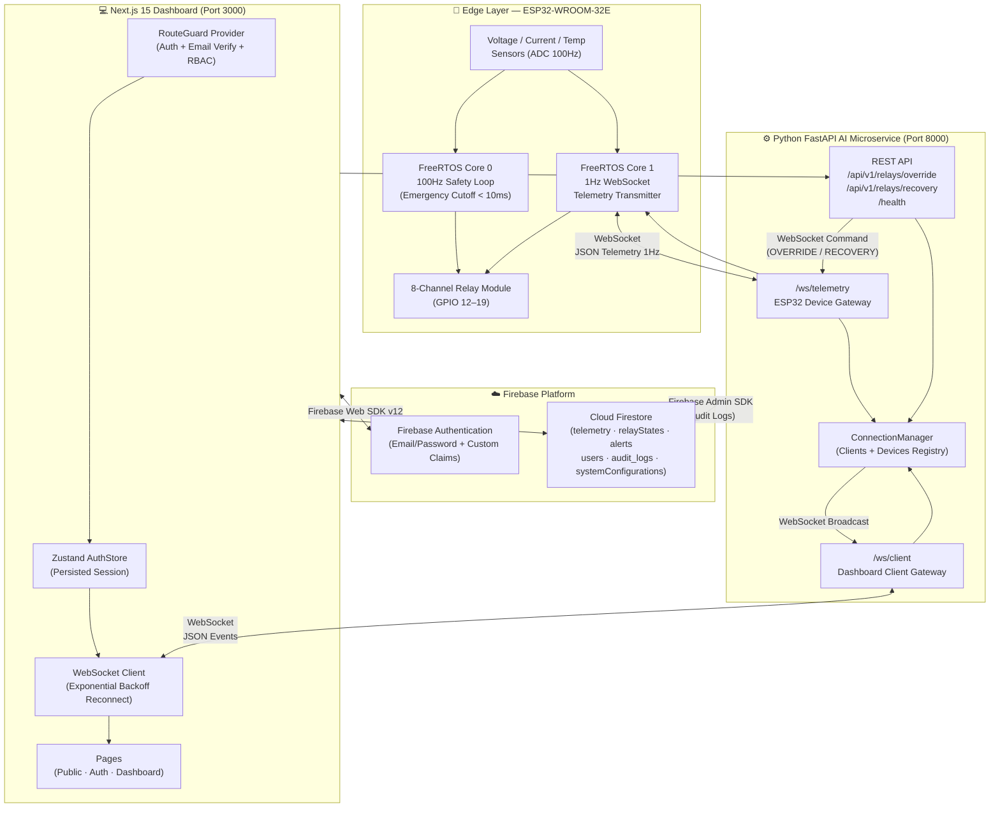
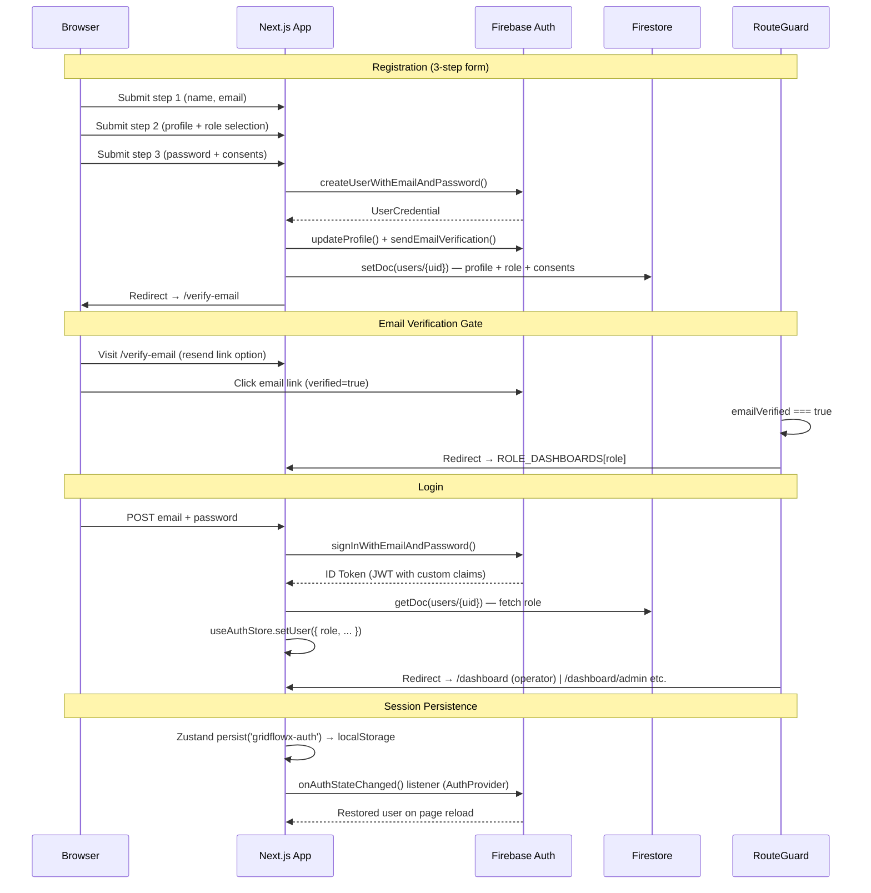

<p align="center">
  
</p>

<h1 align="center">⚡ GridFlowX</h1>

<p align="center">
  <strong>AI-Powered Microgrid Intelligence Platform</strong><br/>
  A cyber-physical system connecting ESP32 edge hardware, a Python FastAPI WebSocket service,<br/>
  and a glassmorphic Next.js 15 operator dashboard — unified in a single monorepo.
</p>

<p align="center">
  
  
  
  
  
  
  
  
  
  
  
  
  
</p>

---

## 📋 Table of Contents

- [Project Overview](#-project-overview)
- [Problem Statement](#-problem-statement)
- [Solution Overview](#-solution-overview)
- [Key Features](#-key-features)
- [System Architecture](#-system-architecture)
- [Application Architecture](#-application-architecture)
- [Authentication Flow](#-authentication-flow)
- [Role-Based Access Control](#-role-based-access-control)
- [Technology Stack](#-technology-stack)
- [Project Directory Structure](#-project-directory-structure)
- [Installation & Setup](#-installation--setup)
- [Environment Variables](#-environment-variables)
- [Firebase Configuration](#-firebase-configuration)
- [Running the Project](#-running-the-project)
- [npm Scripts](#-npm-scripts)
- [Pages & Routes](#-pages--routes)
- [Components](#-components)
- [Features & Services](#-features--services)
- [State Management](#-state-management)
- [API Endpoints](#-api-endpoints-fastapi-microservice)
- [Firmware](#-firmware-esp32)
- [AI Models](#-ai-models)
- [Docker Deployment](#-docker-deployment)
- [Testing](#-testing)
- [Security](#-security)
- [Performance Considerations](#-performance-considerations)
- [Roadmap](#-roadmap)
- [Contributing](#-contributing)
- [License](#-license)
- [Author](#-author)

---

## 🌟 Project Overview

**GridFlowX** is a full-stack, cyber-physical AI platform for intelligent microgrid energy management. It bridges the gap between embedded IoT hardware (ESP32 edge controllers), a real-time Python FastAPI backend (WebSocket relay + AI inference), and a modern web operator dashboard built with Next.js 15.

The platform is designed to give microgrid operators, engineers, and administrators a unified interface to monitor live telemetry, execute relay overrides, authorize emergency recovery, and view AI-driven energy forecasts — all with fine-grained role-based access control.

**Target Users:** Energy system operators, facility managers, grid engineers, compliance auditors, and system administrators managing small-to-medium microgrid installations.

**Business Value:**
- Reduces manual intervention through AI-driven relay routing decisions
- Prevents equipment damage via real-time hardware safety envelopes (ESP32 Core 0)
- Enables data-driven energy cost optimization through solar/load forecasting
- Provides a complete audit trail for regulatory compliance

---

## ❓ Problem Statement

Modern microgrids — combining solar PV, battery storage, and grid fallback — require constant monitoring and rapid decision-making. Traditional approaches are:

- ❌ **Manual and error-prone** — human operators cannot react fast enough to sub-second fault events
- ❌ **Opaque** — there is no unified interface to see sensor readings, relay states, and AI decisions simultaneously
- ❌ **Unsafe** — without deterministic hardware safety loops, software failures can cause equipment damage or fires
- ❌ **Inaccessible** — industrial SCADA systems are expensive and require on-premise installation

---

## 💡 Solution Overview

GridFlowX solves these challenges through a three-layer cyber-physical architecture:

- 🔌 **Edge Layer** — ESP32-WROOM-32 firmware runs a deterministic 100Hz FreeRTOS safety loop (Core 0) alongside a 1Hz WebSocket telemetry loop (Core 1), ensuring hardware protection is never blocked by software
- ⚙️ **Backend Layer** — Python FastAPI service acts as a real-time WebSocket relay between edge devices and the dashboard, plus an HTTP REST API for relay overrides, battery analytics, forecasting, and report generation
- 💻 **Dashboard Layer** — Next.js 15 operator console with glassmorphic dark-mode UI, Firebase Authentication with custom RBAC claims, and real-time WebSocket telemetry display

---

## ✨ Key Features

| Feature | Status | Description |
|---|---|---|
| 🌐 **Public Landing Page** | ✅ Implemented | Multi-section marketing site (Hero, Features, How It Works, Infrastructure, Metrics, Integrations, Security, Developers, Testimonials, CTA) |
| 🔐 **Firebase Authentication** | ✅ Implemented | Email/password login with ID token management via Firebase Web SDK v12 |
| 📝 **Multi-Step Registration** | ✅ Implemented | 3-step form (personal info → profile details → password + consents) with Zod validation and password strength meter |
| ✉️ **Email Verification** | ✅ Implemented | Firebase `sendEmailVerification` with redirect handling; unverified users are gated to `/verify-email` |
| 🔑 **Forgot Password** | ✅ Implemented | Firebase `sendPasswordResetEmail` flow |
| 🔄 **Reset Password** | ✅ Implemented | Firebase OOB code-based password reset page |
| 🛡️ **Role-Based Access Control** | ✅ Implemented | 4 roles (`admin`, `supervisor`, `operator`, `auditor`) enforced via Firebase Custom Claims and client-side `RouteGuard` |
| 🚧 **Protected Route Guard** | ✅ Implemented | `RouteGuard` provider enforces auth state, email verification, and role-based dashboard redirects |
| 📊 **Operator Dashboard** | ✅ Implemented | Sidebar layout with `AppSidebar`, `SectionCards`, interactive area chart (`ChartAreaInteractive`), and `DataTable` |
| 🌗 **Dark / Light Theme** | ✅ Implemented | `next-themes` with system default; toggleable via `ThemeToggle` in Navbar and Auth pages |
| 📡 **WebSocket Telemetry Client** | ✅ Implemented | `initializeWebSocket()` with exponential backoff reconnection (1s → 30s) |
| 🔌 **Relay Override Service** | ✅ Implemented | `toggleRelayOverride()` and `triggerEmergencyRecovery()` POST to FastAPI `/api/v1/relays/*` |
| 🔋 **Battery Health Service** | ✅ Implemented | `fetchBatteryHealthAnalysis()` fetches SoH, temperature, voltage, internal resistance from AI service |
| ☀️ **Solar/Load Forecast Service** | ✅ Implemented | `fetchSolarAndLoadForecasts()` returns 4-step ahead predictions per device |
| ⚙️ **Optimization Parameters** | ✅ Implemented | `updateOptimizationParameters()` posts peak hour + SoC constraints to AI service |
| 📋 **Report Generation Service** | ✅ Implemented | `requestOperationalReport()` triggers async PDF/CSV report generation |
| 📜 **Firestore Telemetry Query** | ✅ Implemented | `fetchHistoricalTelemetry()` queries Firestore `telemetry` collection with ordering and limit |
| 🤖 **FastAPI AI Microservice** | ✅ Implemented | WebSocket relay (`/ws/telemetry`, `/ws/client`), relay override REST, and health check endpoints |
| 🔧 **ESP32 Firmware** | ✅ Implemented | Dual-core FreeRTOS: 100Hz safety loop (Core 0) + 1Hz WebSocket telemetry/command loop (Core 1) |
| 🐳 **Docker Compose** | ✅ Implemented | Nginx proxy + FastAPI container with health check, resource limits, and restart policy |
| 🧭 **Responsive Navbar** | ✅ Implemented | Megamenu, mobile menu, notifications dropdown, search modal, theme toggle |
| 🎨 **3D Animations** | ✅ Implemented | `react-three-fiber` + `@react-three/drei` animated sphere, tetrahedron, and wave scenes |
| 🔔 **Toast Notifications** | ✅ Implemented | `sonner` toast library integrated via `<Toaster />` |
| **Admin Dashboard** | ⏳ Not yet implemented | `/admin` route reserved; `.gitkeep` placeholder |
| **Supervisor Dashboard** | ⏳ Not yet implemented | `/supervisor` route reserved; `.gitkeep` placeholder |
| **Alerts Feature** | ⏳ Not yet implemented | `src/features/alerts/` scaffolded; `.gitkeep` placeholder |
| **Settings Feature** | ⏳ Not yet implemented | `src/features/settings/` scaffolded; `.gitkeep` placeholder |
| **Next.js API Routes** | ⏳ Not yet implemented | `src/app/api/` directories scaffolded with `.gitkeep` placeholders; backend handled by FastAPI |

---

## 🏗️ System Architecture

GridFlowX consists of three physical layers communicating through well-defined protocols:



---

## 🧩 Application Architecture

### Folder-Based Role Separation

The Next.js App Router separates concerns using route groups:

| Route Group | Purpose | Auth Required |
|---|---|---|
| `(public)` | Marketing site + landing page | ❌ No |
| `(auth)` | Login, register, forgot/reset password, verify email | ❌ No (guest-only redirect if authenticated) |
| `dashboard` | Operator console | ✅ Yes + email verified |
| `admin` | Admin panel *(scaffolded, not yet implemented)* | ✅ Admin role |
| `supervisor` | Supervisor panel *(scaffolded, not yet implemented)* | ✅ Supervisor role |
| `operator` | Operator panel *(scaffolded, not yet implemented)* | ✅ Operator role |
| `api/*` | Next.js API routes *(scaffolded, not yet implemented)* | — |

### Provider Hierarchy

```
RootLayout
└── ThemeProvider (next-themes)
    └── AuthProvider (Firebase onAuthStateChanged → Zustand)
        └── RouteGuard (RBAC + email verification enforcer)
            └── Page Content
```

---

## 🔐 Authentication Flow



### Route Guard Logic

The `RouteGuard` component enforces these rules on every navigation:

1. **Unauthenticated + protected path** → redirect to `/login?redirectTo=<path>`
2. **Authenticated + unverified email** → redirect to `/verify-email` (except public paths)
3. **Authenticated + verified + guest-only path** (login/register) → redirect to role dashboard
4. **Authenticated + wrong-role dashboard** → redirect to own role's dashboard
5. **Authenticated + verified + verify-email page** → redirect to role dashboard

---

## 🔒 Role-Based Access Control

GridFlowX implements RBAC at three layers: Firebase Custom Claims (cryptographic), Firestore Security Rules (database-level), and the client-side `RouteGuard` (UX-level).

### Role Definitions

```typescript
// src/lib/constants.ts
export enum UserRole {
  ADMIN      = 'admin',
  SUPERVISOR = 'supervisor',
  OPERATOR   = 'operator',
  AUDITOR    = 'auditor',
}
```

### Role → Dashboard Mapping

| Role | Default Dashboard Route |
|---|---|
| `admin` | `/dashboard/admin` *(not yet implemented)* |
| `supervisor` | `/dashboard/supervisor` *(not yet implemented)* |
| `operator` | `/dashboard` |
| `auditor` | `/dashboard/audit` *(not yet implemented)* |

### Firestore Collection Permissions

| Collection | Read | Write | Notes |
|---|---|---|---|
| `telemetry` | All roles | Backend Admin SDK only | ESP32 → FastAPI → Firestore |
| `relayStates` | All roles | `admin`, `supervisor`, `operator` | Manual overrides |
| `alerts` | All roles | `admin`, `supervisor` (update) | Create/delete: Admin SDK only |
| `audit_logs` | `admin`, `supervisor`, `auditor` | Admin SDK only | Immutable |
| `systemConfigurations` | `admin`, `supervisor`, `operator` | `admin` only | Thresholds, calibration |
| `users` | Own doc or `admin` | `admin` only | Profile management |

### Registration Role Selection

During registration (Step 2), users self-select one of three roles from `register.schema.ts`:

```typescript
role: z.enum(['operator', 'supervisor', 'admin'])
```

> **Note:** The `auditor` role is not available via self-registration in the current implementation. It must be assigned via Firebase Admin SDK or Admin panel (not yet implemented).

---

## 🧪 Technology Stack

### Frontend

| Technology | Version | Purpose |
|---|---|---|
| Next.js | 15.1.11 | React framework with App Router, RSC, Turbopack |
| React | 19.0.0 | UI library |
| TypeScript | 5.7.x | Type safety |
| Tailwind CSS | 4.0.0-alpha | Utility-first styling with PostCSS pipeline |
| shadcn/ui | new-york | Component system built on Radix UI primitives |
| Radix UI | Various | Accessible headless UI primitives (full suite) |
| Framer Motion | 12.x | Animations and page transitions |
| GSAP | 3.15 | Advanced timeline-based animations |
| React Three Fiber | 9.x | Three.js declarative React binding |
| @react-three/drei | 10.x | R3F helpers (OrbitControls, environment, etc.) |
| Three.js | 0.185 | 3D graphics engine |
| Recharts | 3.x | Chart components (area, line, bar) |
| TanStack React Query | 5.x | Server state management and caching |
| TanStack React Table | 8.x | Headless data table |
| Zustand | 5.x | Global client state management |
| next-themes | 0.4.6 | Dark / light theme provider |
| React Hook Form | 7.x | Form state management |
| Zod | 3.x | Schema validation |
| @dnd-kit | 6–10.x | Drag and drop primitives |
| date-fns | 4.x | Date utilities |
| Sonner | 2.x | Toast notifications |
| Lucide React | 1.x | Icon library |
| @tabler/icons-react | 3.x | Additional icon library |
| embla-carousel-react | 8.x | Carousel component |
| cmdk | 1.x | Command palette |
| vaul | 1.x | Drawer (bottom sheet) |
| Geist | 1.x | Vercel Geist font |
| @vercel/analytics | 2.x | Vercel Analytics integration |

### Backend (Python AI Microservice)

| Technology | Version | Purpose |
|---|---|---|
| FastAPI | ≥ 0.111.0 | Async HTTP + WebSocket server |
| Uvicorn | ≥ 0.30.0 | ASGI server (standard extras) |
| Pydantic | ≥ 2.7.0 | Request/response schema validation |
| firebase-admin | ≥ 6.5.0 | Firestore Admin SDK access |
| onnxruntime | ≥ 1.17.0 | ONNX model inference (AI forecasting) |
| NumPy | ≥ 1.24.0 | Numerical computation |
| pytest | ≥ 8.0.0 | Backend testing framework |
| httpx | ≥ 0.27.0 | Async HTTP client for testing |
| Docker | — | Containerized multi-stage build |
| Nginx | 1.25 Alpine | Reverse proxy / TLS termination |

### Authentication & Database

| Technology | Version | Purpose |
|---|---|---|
| Firebase Authentication | 12.x (Web SDK) | Email/password auth + Custom Claims |
| Firebase Admin SDK | ≥ 6.5.0 (Python) | Server-side Firestore access |
| Cloud Firestore | — | NoSQL real-time database |

### Edge Firmware

| Technology | Purpose |
|---|---|
| Arduino Framework + ESP-IDF | ESP32-WROOM-32E hardware abstraction |
| PlatformIO | Build system and dependency management |
| FreeRTOS | Dual-core task scheduling |
| ArduinoJson v7 | JSON serialization/deserialization |
| WebSockets (links2004) | WebSocket client library |

### Fonts

| Font | Variable | Usage |
|---|---|---|
| Instrument Sans | `--font-instrument` | Primary sans-serif body/UI |
| Instrument Serif | `--font-instrument-serif` | Display headings |
| JetBrains Mono | `--font-jetbrains` | Code blocks, monospace |
| Material Symbols Outlined | — | Material icon set (CDN) |

### Tooling

| Tool | Purpose |
|---|---|
| PostCSS + @tailwindcss/postcss | CSS processing pipeline |
| ESLint (Next.js preset) | Code linting |
| Docker Compose | Service orchestration |

---

## 📁 Project Directory Structure

```
gridflowx/
├── ai/                              # Python FastAPI AI microservice
│   ├── app/
│   │   ├── api/                     # API route handlers (scaffolded)
│   │   ├── models/                  # Pydantic model schemas (scaffolded)
│   │   ├── services/                # Business logic services (scaffolded)
│   │   ├── utils/                   # Utilities and helpers (scaffolded)
│   │   └── main.py                  # FastAPI app: WebSocket relay + REST endpoints
│   ├── checkpoints/                 # ML training checkpoints
│   ├── datasets/                    # Training datasets
│   ├── Dockerfile                   # Multi-stage Python 3.11 production image
│   └── requirements.txt             # Python dependencies
│
├── Docs/                            # Engineering documentation (21 docs)
│   ├── 01_Project_Overview.md
│   ├── 02_Features_and_Functionality.md
│   ├── 03_Tech_Stack.md
│   ├── 04_System_Architecture.md
│   ├── 05_Agentic_AI_Model.md
│   ├── 06_Data_Collection_and_Preprocessing.md
│   ├── 07_Model_Training_and_FineTuning.md
│   ├── 08_Agent_Workflows.md
│   ├── 09_AI_Ethics_and_Governance.md
│   ├── 10_Authentication.md ... 23_Future_Roadmap.md
│   ├── API_Contract.md
│   ├── Database_Schema.md
│   ├── Hardware_Spec.md
│   ├── ProjectStructure.md
│   ├── Pages/                       # Page-level documentation
│   ├── Report/                      # Reports and analysis
│   ├── figma/                       # Design assets
│   └── hardware/                    # Hardware documentation
│
├── firebase/                        # Firebase project configuration
│   ├── firebase.json                # Firestore + Storage rules config
│   ├── firestore.rules              # Firestore Security Rules (RBAC)
│   ├── indexes.json                 # Composite Firestore indexes
│   └── storage.rules                # Firebase Storage Security Rules
│
├── firmware/                        # ESP32 embedded C++ firmware
│   ├── include/                     # Header files
│   ├── lib/                         # Local libraries
│   ├── src/
│   │   └── main.cpp                 # Dual-core FreeRTOS firmware entry point
│   ├── test/                        # PlatformIO unit tests
│   └── platformio.ini               # PlatformIO build configuration
│
├── models/                          # AI model weights directory
│   ├── anomaly/                     # Anomaly detection model (scaffolded)
│   ├── battery/                     # Battery health model (scaffolded)
│   ├── forecasting/                 # Solar/load forecast model (scaffolded)
│   └── optimization/                # Energy optimization model (scaffolded)
│
├── public/                          # Next.js public static assets
│   ├── video/                       # Video assets
│   └── favicon.svg
│
├── scripts/                         # Utility scripts (scaffolded)
│
└── src/                             # Next.js application source
    ├── 3d/                          # Three.js / R3F 3D assets
    │   ├── components/              # 3D scene components
    │   ├── materials/               # Custom Three.js materials
    │   ├── models/                  # 3D model files
    │   ├── scenes/                  # Full 3D scene compositions
    │   ├── shaders/                 # GLSL shader files
    │   └── utils/                   # 3D utility functions
    │
    ├── animations/                  # Reusable animation components
    │   ├── animated-sphere.tsx
    │   ├── animated-tetrahedron.tsx
    │   └── animated-wave.tsx
    │
    ├── app/                         # Next.js App Router
    │   ├── (auth)/                  # Authentication route group
    │   │   ├── layout.tsx
    │   │   ├── login/
    │   │   ├── register/
    │   │   ├── forgot-password/
    │   │   ├── reset-password/
    │   │   └── verify-email/
    │   ├── (public)/                # Public marketing route group
    │   │   ├── layout.tsx
    │   │   ├── page.tsx             # Landing page (home)
    │   │   ├── about/
    │   │   ├── contact/
    │   │   ├── developers/
    │   │   ├── explorer/
    │   │   ├── features/
    │   │   └── how-it-works/
    │   ├── admin/                   # Admin dashboard (scaffolded)
    │   ├── operator/                # Operator panel (scaffolded)
    │   ├── supervisor/              # Supervisor panel (scaffolded)
    │   ├── dashboard/               # Main operator dashboard
    │   │   ├── page.tsx
    │   │   └── data.json            # Dashboard mock data
    │   ├── api/                     # Next.js API routes (scaffolded)
    │   │   ├── auth/
    │   │   ├── battery/
    │   │   ├── forecast/
    │   │   ├── optimization/
    │   │   ├── relay/
    │   │   ├── reports/
    │   │   └── telemetry/
    │   ├── globals.css              # Global styles + Tailwind CSS v4 imports
    │   └── layout.tsx               # Root layout with providers
    │
    ├── components/                  # Shared UI components
    │   ├── ui/                      # shadcn/ui generated components (50+ primitives)
    │   ├── layout/
    │   │   ├── Navbar/              # Megamenu, MobileMenu, Notifications, Search
    │   │   ├── ConsoleLayout.tsx
    │   │   ├── PublicLayout.tsx
    │   │   ├── footer.tsx
    │   │   └── navigation.tsx
    │   ├── providers/
    │   │   ├── auth-provider.tsx    # Firebase onAuthStateChanged + Zustand sync
    │   │   └── route-guard.tsx      # RBAC + email verification enforcer
    │   ├── shared/
    │   │   ├── container.tsx
    │   │   ├── section-header.tsx
    │   │   └── theme-toggle.tsx
    │   ├── app-sidebar.tsx          # Dashboard sidebar navigation
    │   ├── chart-area-interactive.tsx
    │   ├── data-table.tsx
    │   ├── nav-documents.tsx
    │   ├── nav-main.tsx
    │   ├── nav-secondary.tsx
    │   ├── nav-user.tsx
    │   ├── section-cards.tsx
    │   └── site-header.tsx
    │
    ├── config/
    │   └── site.ts                  # Site metadata (name, description, URLs)
    │
    ├── features/                    # Feature-scoped modules
    │   ├── auth/                    # Authentication feature
    │   │   ├── components/          # AuthFormInput, PasswordStrengthMeter, RoleSelector, etc.
    │   │   ├── hooks/               # useLogin, useForgotPassword, useResetPassword
    │   │   ├── schemas/             # register.schema.ts (Zod, multi-step)
    │   │   ├── services/            # auth.service.ts (login/logout), authService.ts (register)
    │   │   ├── types/               # auth.types.ts
    │   │   └── constants.ts         # Promo panel configs per auth page
    │   ├── alerts/                  # Alerts feature (scaffolded)
    │   ├── battery/services/
    │   │   └── battery.service.ts   # fetchBatteryHealthAnalysis()
    │   ├── forecasting/services/
    │   │   └── forecast.service.ts  # fetchSolarAndLoadForecasts()
    │   ├── optimization/services/
    │   │   └── optimization.service.ts  # updateOptimizationParameters()
    │   ├── relay/services/
    │   │   └── relay.service.ts     # toggleRelayOverride(), triggerEmergencyRecovery()
    │   ├── reports/services/
    │   │   └── report.service.ts    # requestOperationalReport()
    │   ├── settings/                # Settings feature (scaffolded)
    │   └── telemetry/
    │       ├── components/          # Telemetry UI components
    │       ├── hooks/               # Telemetry hooks (scaffolded)
    │       ├── services/
    │       │   └── telemetry.service.ts  # fetchHistoricalTelemetry() (Firestore)
    │       ├── store/               # Telemetry Zustand store (scaffolded)
    │       └── types/               # TelemetryRecord, etc.
    │
    ├── hooks/                       # Global custom hooks
    │   ├── use-auth.ts              # useAuth() — user, role, logout, resendVerification
    │   ├── use-mobile.ts            # Responsive breakpoint detection
    │   ├── use-motion-config.ts     # Framer Motion configuration hook
    │   └── use-toast.ts             # Toast trigger hook
    │
    ├── lib/                         # Core library modules
    │   ├── ai.ts                    # fetchFromAIService() — typed HTTP client for FastAPI
    │   ├── auth.ts                  # getUserCustomClaims() — Firebase token decoder
    │   ├── constants.ts             # UserRole enum, TELEMETRY_LIMITS, API_ROUTES
    │   ├── firebase.ts              # Firebase app/auth/db initialization
    │   ├── logger.ts                # Application logger
    │   ├── utils.ts                 # cn() and shared utilities
    │   └── websocket.ts             # initializeWebSocket() + disconnectWebSocket()
    │
    ├── routes/
    │   └── routes.config.ts         # ROLE_DASHBOARDS mapping (role → route)
    │
    ├── sections/                    # Landing page section components
    │   ├── common/                  # Shared section elements
    │   └── landing/                 # 10 landing page sections
    │       ├── hero-section.tsx
    │       ├── features-section.tsx
    │       ├── how-it-works-section.tsx
    │       ├── infrastructure-section.tsx
    │       ├── metrics-section.tsx
    │       ├── integrations-section.tsx
    │       ├── security-section.tsx
    │       ├── developers-section.tsx
    │       ├── testimonials-section.tsx
    │       └── cta-section.tsx
    │
    └── store/
        └── zustand/
            └── stores.ts            # useAuthStore (persisted), useThemeStore
```

---

## 🛠️ Installation & Setup

### Prerequisites

| Requirement | Version | Notes |
|---|---|---|
| Node.js | 20+ | LTS recommended |
| Python | 3.11 | Required for FastAPI AI service |
| npm | 10+ | Included with Node.js 20 |
| pip | Latest | Python package manager |
| Git | Latest | Version control |
| Firebase Project | — | Firestore + Authentication enabled |
| PlatformIO | Latest | Only needed for firmware development |
| Docker + Compose | Latest | Only needed for production deployment |

### 1. Clone the Repository

```bash
git clone https://github.com/Mekesh-Engineer/gridflowx.git
cd gridflowx
```

### 2. Install Frontend Dependencies

```bash
npm install
```

### 3. Install AI Service Dependencies

```bash
cd ai
pip install -r requirements.txt
cd ..
```

### 4. Configure Environment Variables

```bash
cp .env.example .env.local
```

Open `.env.local` and fill in your Firebase project credentials (see [Environment Variables](#-environment-variables) below).

### 5. Deploy Firestore Security Rules

```bash
cd firebase
firebase deploy --only firestore:rules --project <your-project-id>
firebase deploy --only firestore:indexes --project <your-project-id>
cd ..
```

---

## 🔑 Environment Variables

Create a `.env.local` file in the project root based on `.env.example`:

```bash
# ── Application Ports ──
PORT=5000
FRONTEND_PORT=3000
AI_SERVICE_PORT=8000

# ── Firebase Web SDK (Next.js Client) ──
# All NEXT_PUBLIC_ variables are exposed to the browser
NEXT_PUBLIC_FIREBASE_API_KEY="your-firebase-api-key"
NEXT_PUBLIC_FIREBASE_AUTH_DOMAIN="your-project.firebaseapp.com"
NEXT_PUBLIC_FIREBASE_PROJECT_ID="your-project-id"
NEXT_PUBLIC_FIREBASE_STORAGE_BUCKET="your-project.firebasestorage.app"
NEXT_PUBLIC_FIREBASE_MESSAGING_SENDER_ID="your-sender-id"
NEXT_PUBLIC_FIREBASE_APP_ID="your-app-id"
NEXT_PUBLIC_FIREBASE_MEASUREMENT_ID="G-XXXXXXXXXX"

# ── FastAPI AI Service URL ──
NEXT_PUBLIC_AI_SERVICE_URL="http://localhost:8000"

# ── WebSocket URL (optional — defaults to ws://localhost:8000) ──
NEXT_PUBLIC_WS_URL="ws://localhost:8000"
```

**For the FastAPI AI service** (Docker / production), set these as container environment variables:

```bash
FIREBASE_SERVICE_ACCOUNT_JSON=<base64-encoded-or-path-to-service-account-key.json>
OPENWEATHER_API_KEY=<your-openweathermap-api-key>
DEVICE_WS_TOKEN=<secure-token-for-esp32-handshake>
```

> **Never commit `.env.local` or any service account JSON to version control.** Both are listed in `.gitignore`.

---

## 🔥 Firebase Configuration

### 1. Create a Firebase Project

1. Go to the [Firebase Console](https://console.firebase.google.com/)
2. Create a new project named `gridflowx` (or any name)
3. Enable **Authentication** → Email/Password provider
4. Enable **Cloud Firestore** → Start in production mode
5. Register a Web App → copy the config values to `.env.local`

### 2. Generate a Service Account Key (Backend)

1. Firebase Console → Project Settings → Service Accounts
2. Click **Generate new private key** → download JSON
3. Pass as `FIREBASE_SERVICE_ACCOUNT_JSON` environment variable to the FastAPI container

### 3. Deploy Security Rules

The Firestore Security Rules in `firebase/firestore.rules` enforce RBAC at the database level using Firebase Custom Claims:

```javascript
// firebase/firestore.rules (excerpt)
rules_version = '2';
service cloud.firestore {
  match /databases/{database}/documents {
    function getUserRole() {
      return request.auth.token.role;
    }

    match /telemetry/{document} {
      allow read: if hasRole(['admin', 'supervisor', 'operator', 'auditor']);
      allow write: if false; // Backend Admin SDK only
    }

    match /audit_logs/{document} {
      allow read: if hasRole(['admin', 'supervisor', 'auditor']);
      allow write: if false; // Immutable — Admin SDK only
    }
    // ... (see firebase/firestore.rules for full rules)
  }
}
```

Deploy rules and indexes:

```bash
firebase deploy --only firestore:rules,firestore:indexes --project <your-project-id>
```

### 4. Set Custom Claims for Roles

Firebase Custom Claims must be set server-side via the Admin SDK. In the AI service (or a separate admin script):

```python
from firebase_admin import auth

auth.set_custom_user_claims(uid, {"role": "operator"})
```

> The registration flow writes the role to Firestore, but Custom Claims for Firestore Security Rules must be set via the Admin SDK — this is a planned Admin panel feature.

---

## ▶️ Running the Project

### Development Mode

**Terminal 1 — Frontend (Next.js):**

```bash
npm run dev
# → http://localhost:3000
```

**Terminal 2 — AI Microservice (FastAPI + Uvicorn):**

```bash
npm run ai:dev
# → http://localhost:8000
# → Docs: http://localhost:8000/docs (Swagger UI)
```

**Terminal 3 — Firmware (optional, requires PlatformIO):**

```bash
cd firmware
pio run --target upload
pio device monitor --baud 115200
```

### Production Build (Next.js)

```bash
npm run build
npm run start
```

---

## 📜 npm Scripts

All scripts are defined in `package.json`:

| Script | Command | Description |
|---|---|---|
| `dev` | `next dev` | Start Next.js development server with Turbopack |
| `build` | `next build` | Build Next.js for production |
| `start` | `next start` | Start Next.js production server |
| `lint` | `next lint` | Run ESLint with Next.js rules |
| `ai:dev` | `uvicorn ai.app.main:app --reload --port 8000` | Start FastAPI with hot reload |
| `ai:start` | `uvicorn ai.app.main:app --host 0.0.0.0 --port 8000` | Start FastAPI in production mode |

---

## 🗺️ Pages & Routes

### Public Pages (No authentication required)

| Route | Page | Description |
|---|---|---|
| `/` | Landing / Home | Full marketing site with 10 sections |
| `/about` | About | About GridFlowX |
| `/contact` | Contact | Contact form |
| `/developers` | Developers | API documentation for developers |
| `/explorer` | Explorer | Public data explorer |
| `/features` | Features | Platform features overview |
| `/how-it-works` | How It Works | Architecture walkthrough |

### Authentication Pages (Redirect to dashboard if authenticated)

| Route | Page | Description |
|---|---|---|
| `/login` | Login | Email + password sign-in |
| `/register` | Register | 3-step multi-part registration with role selection |
| `/forgot-password` | Forgot Password | Send password reset email |
| `/reset-password` | Reset Password | OOB code-based new password form |
| `/verify-email` | Verify Email | Email verification gate with resend option |

### Protected Dashboard Pages

| Route | Page | Role | Status |
|---|---|---|---|
| `/dashboard` | Operator Console | All authenticated + verified | ✅ Implemented |
| `/dashboard/admin` | Admin Panel | `admin` only | ⏳ Not yet implemented |
| `/dashboard/supervisor` | Supervisor Panel | `supervisor`, `admin` | ⏳ Not yet implemented |
| `/dashboard/audit` | Audit Trail | `auditor`, `admin` | ⏳ Not yet implemented |

---

## 🧩 Components

### Providers

| Component | File | Purpose |
|---|---|---|
| `AuthProvider` | `components/providers/auth-provider.tsx` | Listens to `onAuthStateChanged`, syncs to Zustand, creates Firestore doc for new users |
| `RouteGuard` | `components/providers/route-guard.tsx` | Enforces auth state, email verification, and role-based route access |
| `ThemeProvider` | `components/layout/Navbar/theme-provider.tsx` | next-themes wrapper with system default |

### Dashboard Components

| Component | File | Purpose |
|---|---|---|
| `AppSidebar` | `components/app-sidebar.tsx` | Collapsible sidebar with nav groups, user menu |
| `SiteHeader` | `components/site-header.tsx` | Dashboard top bar with sidebar trigger |
| `SectionCards` | `components/section-cards.tsx` | KPI summary cards grid (gradient variant) |
| `ChartAreaInteractive` | `components/chart-area-interactive.tsx` | Interactive area chart (Recharts) |
| `DataTable` | `components/data-table.tsx` | Feature-rich sortable data table (TanStack Table) |
| `NavMain` | `components/nav-main.tsx` | Primary sidebar navigation links |
| `NavDocuments` | `components/nav-documents.tsx` | Document-type sidebar navigation |
| `NavSecondary` | `components/nav-secondary.tsx` | Secondary/utility sidebar navigation |
| `NavUser` | `components/nav-user.tsx` | User avatar menu (profile, notifications, logout) |

### Navbar Components

| Component | File | Purpose |
|---|---|---|
| `Megamenu` | `components/layout/Navbar/Megamenu.tsx` | Desktop dropdown megamenu |
| `MobileMenu` | `components/layout/Navbar/MobileMenu.tsx` | Mobile navigation drawer |
| `NotificationsDropdown` | `components/layout/Navbar/NotificationsDropdown.tsx` | Notification bell popover |
| `SearchModal` | `components/layout/Navbar/SearchModal.tsx` | Global search command palette |
| `ThemeToggle` | `components/layout/Navbar/ThemeToggle.tsx` | Dark/light mode switch |

### Auth Feature Components

| Component | File | Purpose |
|---|---|---|
| `AuthFormInput` | `features/auth/components/AuthFormInput.tsx` | Styled form input with validation |
| `AuthErrorAlert` | `features/auth/components/AuthErrorAlert.tsx` | Firebase error message display |
| `AuthLogoMark` | `features/auth/components/AuthLogoMark.tsx` | GridFlowX logo for auth pages |
| `AuthPromoPanel` | `features/auth/components/AuthPromoPanel.tsx` | Right-side promotional panel |
| `AuthThemeToggle` | `features/auth/components/AuthThemeToggle.tsx` | Theme toggle for auth pages |
| `PasswordStrengthMeter` | `features/auth/components/PasswordStrengthMeter.tsx` | Visual password strength indicator |
| `RoleSelector` | `features/auth/components/RoleSelector.tsx` | Role picker (operator/supervisor/admin) |

### Shared Components

| Component | File | Purpose |
|---|---|---|
| `Container` | `components/shared/container.tsx` | Responsive max-width wrapper |
| `SectionHeader` | `components/shared/section-header.tsx` | Reusable section title + description |
| `ThemeToggle` | `components/shared/theme-toggle.tsx` | Reusable theme toggle button |

### Animation Components

| Component | File | Purpose |
|---|---|---|
| `AnimatedSphere` | `animations/animated-sphere.tsx` | Three.js animated 3D sphere |
| `AnimatedTetrahedron` | `animations/animated-tetrahedron.tsx` | Three.js animated 3D tetrahedron |
| `AnimatedWave` | `animations/animated-wave.tsx` | Three.js animated wave plane |

### UI Primitives (shadcn/ui — `components/ui/`)

50+ generated shadcn/ui components including: `accordion`, `alert-dialog`, `alert`, `avatar`, `badge`, `breadcrumb`, `button`, `calendar`, `card`, `carousel`, `chart`, `checkbox`, `command`, `dialog`, `drawer`, `dropdown-menu`, `form`, `input`, `label`, `navigation-menu`, `pagination`, `popover`, `progress`, `radio-group`, `resizable`, `scroll-area`, `select`, `separator`, `sheet`, `sidebar`, `skeleton`, `slider`, `sonner`, `spinner`, `switch`, `table`, `tabs`, `textarea`, `toast`, `tooltip`, and more.

---

## ⚙️ Features & Services

### Auth Feature (`src/features/auth/`)

#### Services

**`auth.service.ts`** — Login and logout:

```typescript
loginWithCredentials(email: string, password: string): Promise<UserCredential>
logout(): Promise<void>
```

**`authService.ts`** — Registration with Firestore profile creation:

```typescript
registerWithEmail(payload: RegisterPayload): Promise<User>
// Creates Firebase Auth user → updates profile → sends email verification
// → writes user doc to Firestore (users/{uid})
```

#### Hooks

| Hook | File | Purpose |
|---|---|---|
| `useLogin` | `features/auth/hooks/useLogin.ts` | Login form logic |
| `useForgotPassword` | `features/auth/hooks/useForgotPassword.ts` | Password reset email |
| `useResetPassword` | `features/auth/hooks/useResetPassword.ts` | New password submission |
| `useAuth` | `hooks/use-auth.ts` | Global auth state + logout + resend verification |

#### Registration Schema (Zod, 3-step)

```
Step 1: firstName, lastName, email
Step 2: gender, dob (age ≥ 13), country, city, role
Step 3: password (8+ chars, uppercase, lowercase, number, special char), confirmPassword, terms
```

### Telemetry Feature (`src/features/telemetry/`)

**`telemetry.service.ts`** — Firestore historical query:

```typescript
fetchHistoricalTelemetry(deviceId: string, limitCount?: number): Promise<TelemetryRecord[]>
// Queries: telemetry collection, filtered by deviceId, ordered by timestamp desc
```

**`TelemetryRecord` interface:**

```typescript
interface TelemetryRecord {
  id: string;
  deviceId: string;
  timestamp: string;
  solarPowerW: number;
  batteryCurrentA: number;
  batterySoc: number;
  gridPowerW: number;
  busVoltageV: number;
  relayStates: boolean[];
}
```

### Relay Feature (`src/features/relay/`)

```typescript
toggleRelayOverride(relayIndex, newState, reason, token?): Promise<OverrideResponse>
// POST /api/v1/relays/override → FastAPI → WebSocket → ESP32

triggerEmergencyRecovery(reason, token?): Promise<OverrideResponse>
// POST /api/v1/relays/recovery → FastAPI → WebSocket → ESP32
```

### Battery Feature (`src/features/battery/`)

```typescript
fetchBatteryHealthAnalysis(deviceId, token?): Promise<BatteryStateAnalysis>
// GET /api/v1/battery/{deviceId}/health
// Returns: stateOfHealth, temperatureC, voltageV, currentA,
//          internalResistance, cyclesCompleted, recommendedMaxChargeCurrent
```

### Forecasting Feature (`src/features/forecasting/`)

```typescript
fetchSolarAndLoadForecasts(deviceId, token?): Promise<ForecastDataPoint[]>
// GET /api/v1/forecast/{deviceId}
// Returns array of: { timestamp, predictedSolarYieldW, predictedLoadDemandW }
```

### Optimization Feature (`src/features/optimization/`)

```typescript
updateOptimizationParameters(params, token?): Promise<OptimizationResponse>
// POST /api/v1/optimization/parameters
// params: { peakStartHour, peakEndHour, minChargeSoC, maxDischargeSoC }
```

### Reports Feature (`src/features/reports/`)

```typescript
requestOperationalReport(startDate, endDate, token?): Promise<ReportMeta>
// POST /api/v1/reports/request
// Returns: { reportId, generatedAt, status, downloadUrl? }
```

### WebSocket Client (`src/lib/websocket.ts`)

```typescript
initializeWebSocket(token: string, callbacks: WebSocketCallbacks): void
// Connects to NEXT_PUBLIC_WS_URL/ws/client?token=<token>
// Handles: onMessage(type, payload), onStatusChange(online)
// Auto-reconnects with exponential backoff: 1s → 2s → 4s → ... → 30s max

disconnectWebSocket(): void
// Removes event listeners, closes socket, clears reconnect timer
```

### AI HTTP Client (`src/lib/ai.ts`)

```typescript
fetchFromAIService<T>(endpoint: string, options?: AIRequestOptions): Promise<T>
// Base URL: NEXT_PUBLIC_AI_SERVICE_URL (default: http://localhost:8000)
// Handles: Authorization Bearer token, JSON body serialization, error throwing
```

---

## 📦 State Management

GridFlowX uses **Zustand 5** for global client state with two stores in `src/store/zustand/stores.ts`:

### `useAuthStore` (Persisted)

```typescript
// Persisted to localStorage under key 'gridflowx-auth'
interface AuthStoreState {
  user: AuthUser | null;     // Full user profile including role
  isAuthenticated: boolean;
  setUser: (user: AuthUser | null) => void;
  clearUser: () => void;
}
```

**`AuthUser` shape:**

```typescript
interface AuthUser {
  uid: string;
  email: string | null;
  displayName: string | null;
  firstName: string | null;
  lastName: string | null;
  photoURL: string | null;
  phoneNumber: string | null;
  role: UserRole;             // 'admin' | 'supervisor' | 'operator' | 'auditor'
  emailVerified: boolean;
  dob?: string | null;
  gender?: string | null;
  consents?: { terms, marketing, whatsapp, liveLocation };
}
```

### `useThemeStore` (Thin Wrapper)

```typescript
function useThemeStore() {
  // Wraps next-themes useTheme()
  return { isDarkMode: boolean, toggleTheme: () => void };
}
```

### `useAuth()` Hook

The primary hook for consuming auth state across the app:

```typescript
const { user, isAuthenticated, role, isInitialized, logout, resendVerification } = useAuth();
```

---

## 🔌 API Endpoints (FastAPI Microservice)

The FastAPI service (`ai/app/main.py`) exposes the following endpoints at `http://localhost:8000`:

### REST Endpoints

| Method | Endpoint | Auth | Description |
|---|---|---|---|
| `GET` | `/health` | None | Health check → `{ status, service, version }` |
| `POST` | `/api/v1/relays/override` | Bearer token | Toggle a relay channel; broadcasts `OVERRIDE` command to all connected ESP32s |
| `POST` | `/api/v1/relays/recovery` | Bearer token | Authorize emergency recovery; broadcasts `RECOVERY_AUTHORIZED` to ESP32s |

**`POST /api/v1/relays/override` Request Body:**

```json
{
  "relayIndex": 3,
  "newState": true,
  "reason": "Manual maintenance override"
}
```

**Response:**

```json
{
  "success": true,
  "message": "Relay override sent for index 3",
  "relayStates": [false, false, false, true, false, false, false, false]
}
```

### WebSocket Endpoints

| Endpoint | Client Type | Description |
|---|---|---|
| `ws://host:8000/ws/telemetry` | ESP32 firmware | Device gateway; receives JSON telemetry frames and broadcasts to all dashboard clients |
| `ws://host:8000/ws/client?token=<id_token>` | Next.js dashboard | Dashboard client gateway; receives broadcasts from ESP32 telemetry |

**Telemetry Frame (ESP32 → FastAPI → Dashboard):**

```json
{
  "type": "telemetry_update",
  "payload": {
    "deviceId": "esp32-node-01",
    "solarPowerW": 342.5,
    "batteryCurrentA": 2.1,
    "batterySoc": 78.3,
    "busVoltageV": 12.6,
    "relayStates": [true, true, true, false, false, false, false, false]
  }
}
```

**Override Command (FastAPI → ESP32):**

```json
{
  "type": "OVERRIDE",
  "payload": { "channel": 3, "state": true }
}
```

**Recovery Command (FastAPI → ESP32):**

```json
{
  "type": "RECOVERY_AUTHORIZED",
  "payload": { "reason": "Admin authorized restart" }
}
```

### Planned API Routes (Next.js `src/app/api/` — Not yet implemented)

The following Next.js API route directories are scaffolded with `.gitkeep` placeholders and are **not yet implemented**:

- `GET/POST /api/auth` — Authentication helpers
- `GET /api/battery` — Battery state proxy
- `GET /api/forecast` — Forecast data proxy
- `GET/POST /api/optimization` — Optimization parameters proxy
- `POST /api/relay` — Relay override proxy
- `GET/POST /api/reports` — Report generation proxy
- `GET /api/telemetry` — Telemetry query proxy

> **Current behavior:** All AI service calls go directly from the Next.js client to the FastAPI service at `NEXT_PUBLIC_AI_SERVICE_URL`. The planned Next.js API routes would proxy these calls server-side for improved security and token handling.

---

## 🔧 Firmware (ESP32)

The firmware in `firmware/src/main.cpp` runs on an **ESP32-WROOM-32E** using PlatformIO with the Arduino framework.

### Dual-Core Architecture

| Core | Task | Rate | Responsibility |
|---|---|---|---|
| **Core 0** | `safetyLoop` | 100Hz (10ms) | Read ADC sensors, execute emergency cutoff (SoC < 5% OR Temp > 90°C → all relays OFF) |
| **Core 1** | `commsLoop` | 1Hz (1000ms) | WiFi connection, WebSocket connection to FastAPI, JSON telemetry transmit, command receive |

### Relay Pin Mapping

```cpp
const int RELAY_PINS[8] = {12, 13, 14, 15, 16, 17, 18, 19};
```

### WebSocket Event Handling

The firmware responds to two command types from FastAPI:

| Command Type | Action |
|---|---|
| `OVERRIDE` | Sets the specified relay GPIO HIGH/LOW immediately |
| `RECOVERY_AUTHORIZED` | Logs recovery authorization and re-initializes modules |

### Build & Flash

```bash
# Install PlatformIO CLI (if not installed)
pip install platformio

# Build firmware
cd firmware
pio run

# Flash to connected ESP32
pio run --target upload

# Open serial monitor (115200 baud)
pio device monitor --baud 115200
```

### PlatformIO Configuration (`firmware/platformio.ini`)

```ini
[env:esp32dev]
platform  = espressif32
board     = esp32dev
framework = arduino
monitor_speed = 115200
lib_deps =
    bblanchon/ArduinoJson @ ^7.0.0
    links2004/WebSockets  @ ^2.4.1
```

---

## 🤖 AI Models

The `models/` directory contains subdirectories for four planned AI model categories. **All subdirectories are currently scaffolded with `.gitkeep` placeholders** — model weights are not yet included in the repository.

| Directory | Model Type | Purpose |
|---|---|---|
| `models/forecasting/` | LSTM / Transformer | Solar yield and load demand forecasting (1-hour horizon, 15-min resolution) |
| `models/anomaly/` | Isolation Forest / Autoencoder | Component fault detection and anomaly classification |
| `models/battery/` | Physics-informed regression | Battery state-of-health analysis |
| `models/optimization/` | PPO / SAC (RL) | Energy routing optimization (relay configuration) |

The FastAPI service includes `onnxruntime` in its requirements, indicating model inference is planned via ONNX Runtime. Refer to `Docs/05_Agentic_AI_Model.md` and `Docs/07_Model_Training_and_FineTuning.md` for full architectural specifications.

---

## 🐳 Docker Deployment

The `docker-compose.yml` defines two services behind an Nginx reverse proxy:

```yaml
services:
  nginx:             # SSL/TLS termination, reverse proxy
  fastapi-backend:   # GridFlowX AI Microservice (Port 8000)
```

### Build and Run

```bash
# Build and start all services
docker compose up --build -d

# View logs
docker compose logs -f fastapi-backend

# Stop all services
docker compose down
```

### FastAPI Container Details

| Property | Value |
|---|---|
| Base Image | `python:3.11-slim` (multi-stage) |
| Exposed Port | 8000 |
| Health Check | `GET /health` every 30s, 3 retries |
| CPU Limit | 2.0 vCPUs |
| Memory Limit | 2GB |
| Restart Policy | `unless-stopped` |

### Environment Variables for Docker

Pass these as container environment variables or via a `.env` file:

```bash
FIREBASE_SERVICE_ACCOUNT_JSON=<service-account-json-content>
OPENWEATHER_API_KEY=<your-key>
DEVICE_WS_TOKEN=<secure-token>
TAG=latest  # Docker image tag
```

---

## 🧪 Testing

### Backend Testing (pytest)

The FastAPI service includes `pytest` and `httpx` in `ai/requirements.txt` for async API testing.

```bash
cd ai
pytest
```

> Test files and coverage configuration are **not yet implemented** in the current repository state (`ai/` sub-directories are `.gitkeep` scaffolds). The testing infrastructure is planned per `Docs/17_Testing.md`.

### Firmware Testing (PlatformIO)

```bash
cd firmware
pio test
```

> `firmware/test/` directory is present but test files are **not yet implemented**.

### Frontend Testing

> Frontend testing (Vitest / React Testing Library / Cypress) is **not yet implemented** in the current repository. No testing configuration or test files are present in `src/`.

---

## 🔒 Security

### Implemented Security Measures

| Layer | Measure | Implementation |
|---|---|---|
| **Authentication** | Firebase Auth (Email/Password) | ID tokens signed by Google; auto-refreshed by Firebase SDK |
| **Authorization** | Firebase Custom Claims (RBAC) | Cryptographically signed role claims embedded in JWT |
| **Database Rules** | Firestore Security Rules | Role-gated read/write per collection; Admin SDK bypasses for backend writes |
| **Route Protection** | Client-side `RouteGuard` | Redirects unauthenticated/wrong-role users on every navigation |
| **Email Verification** | Firebase `sendEmailVerification` | Unverified users cannot access any protected route |
| **Input Validation** | Zod schemas (frontend) + Pydantic (backend) | Multi-step registration validated client-side; FastAPI validates all POST bodies |
| **Transport Security** | HTTPS/WSS (via Nginx in Docker) | Nginx configured for SSL/TLS termination |
| **Secret Management** | Environment variables | Firebase credentials and service account never committed to version control |
| **Audit Trail** | Firestore `audit_logs` collection | Immutable — write-only via Admin SDK |

### Hardware Safety

The ESP32 firmware implements a hardware-level safety envelope on Core 0 (100Hz, independent of network):

- **Emergency Cutoff:** All 8 relays de-energized immediately if `batterySoc < 5.0` OR `batteryTempC > 90.0`
- **Independent of software:** Core 0 safety loop cannot be blocked by WebSocket communication on Core 1

---

## ⚡ Performance Considerations

### Frontend

- **React Server Components (RSC):** Next.js 15 App Router enables per-page RSC vs. client component splits
- **Code Splitting:** Next.js automatic route-level code splitting
- **Font Optimization:** `next/font/google` with `display: swap` for Instrument Sans/Serif and JetBrains Mono
- **Vercel Analytics:** `@vercel/analytics` integrated in root layout for Core Web Vitals tracking
- **Tailwind v4 CSS:** PostCSS pipeline with automatic tree-shaking of unused utility classes
- **Image Optimization:** Next.js `<Image>` component (used where applicable in public pages)

### Backend

- **Async throughout:** FastAPI + Uvicorn ASGI stack with async WebSocket handlers
- **ONNX Runtime:** Planned model inference via ONNX (faster than PyTorch at runtime, no GPU required)
- **WebSocket Broadcasting:** In-memory connection registry — no Redis/broker required for single-instance deployment
- **Docker health check:** `/health` endpoint ensures container is replaced before traffic routing during restarts

---

## 🔮 Roadmap

The following features are planned or documented in `Docs/23_Future_Roadmap.md` but **not yet implemented** in the codebase:

| Priority | Feature | Notes |
|---|---|---|
| High | **Admin Dashboard** (`/admin`) | User management, threshold configuration, audit log viewer |
| High | **Supervisor Dashboard** (`/dashboard/supervisor`) | Alert acknowledgement, operational oversight |
| High | **Auditor Dashboard** (`/dashboard/audit`) | Read-only telemetry + compliance report viewer |
| High | **Next.js API Route Proxies** | Server-side proxying of FastAPI calls for improved security |
| High | **AI Model Inference** | ONNX Runtime inference in FastAPI for solar/load forecasting and anomaly detection |
| Medium | **Alerts Feature** | Real-time alert panel with severity levels and acknowledgement |
| Medium | **Settings Feature** | Threshold configuration UI (SoC limits, temperature limits) |
| Medium | **Firebase Custom Claims Admin Panel** | Role assignment UI for admin users |
| Medium | **Frontend Testing** | Vitest unit tests + Cypress E2E |
| Medium | **Model Drift Monitoring** | Daily bias checks and automated retraining triggers (see `Docs/19_Model_Drift_Monitoring.md`) |
| Low | **Telemetry Store** | Zustand telemetry store for real-time dashboard state |
| Low | **Monitoring & Logging** | Prometheus + Grafana integration (see `Docs/21_Monitoring_and_Logging.md`) |
| Low | **Multi-Site / Fleet** | Multi-ESP32 device management across installations |
| Low | **PWA** | Offline capability and installability |

---

## 🤝 Contributing

Contributions are welcome. To contribute:

1. **Fork** the repository on GitHub.
2. **Create** a feature branch:
   ```bash
   git checkout -b feature/your-feature-name
   ```
3. **Commit** your changes using Conventional Commits:
   ```bash
   git commit -m "feat: add telemetry Zustand store"
   ```
4. **Push** to your fork:
   ```bash
   git push origin feature/your-feature-name
   ```
5. **Open a Pull Request** with a clear description of the change and why.

### Development Guidelines

- Follow the existing TypeScript strict mode configuration (`tsconfig.json`)
- Use `shadcn/ui` component patterns and the `new-york` style for new UI components
- Place feature-specific logic in the appropriate `src/features/<feature>/` directory
- Use Zod schemas for all form validation
- Run `npm run lint` before committing
- Do not commit `.env.local`, service account keys, or model weights
- Backend Python changes must maintain compatibility with `requirements.txt` versions

---

## 📄 License

This project is licensed under the **MIT License**.

```
MIT License © 2026 Mekesh Engineer
```

---

## 👤 Author

**Mekesh Engineer**
B.E. Electrical & Electronics Engineering — Kongu Engineering College, Tamil Nadu
Embedded Systems · IoT · Computer Vision · Full-Stack Development · AI/ML

- GitHub: [@Mekesh-Engineer](https://github.com/Mekesh-Engineer)

---

<p align="center">
  <strong>Built by <a href="https://github.com/Mekesh-Engineer">Mekesh Engineer</a></strong><br/>
  <em>Edge intelligence meets cloud-scale observability.</em>
</p>
