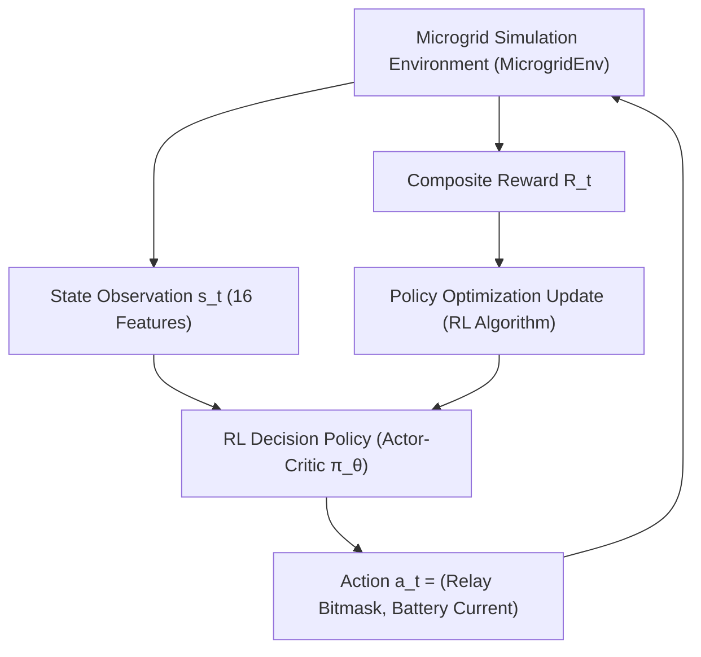

# ⚡ Agent 05: Energy Management & Decision Agent Specification & Implementation Guide

**Document ID:** `GFX-AI-SPEC-05`  
**Agent Name:** `energy_management_decision_agent`  
**Classification:** Specialized Domain AI Agent · Autonomous Reinforcement Learning Dispatch Engine  
**Version:** `2.0.0-PROD`  
**Primary Algorithm:** **Reinforcement Learning (RL)**  
**Candidate RL Implementations:** Proximal Policy Optimization (PPO), Soft Actor-Critic (SAC), TD3, DQN  
**Target Repository:** `gridflow-agentic-ai/src/agents/energy_agent.py`  
**Runtime:** Stable-Baselines3 / PyTorch / Gymnasium / ONNX Runtime / FastAPI  

---

## 1. Agent Overview
The **Energy Management & Decision Agent** (also designated as the **UAEO Decision Core**) is the central optimization intelligence of the GridFlowX platform. Formulated as a continuous-discrete Markov Decision Process (MDP), it leverages **Reinforcement Learning (RL)** to learn and execute optimal closed-loop power routing policies across solar PV generation, battery energy storage, AC utility grid fallback, and multi-tiered physical loads.

---

## 2. Purpose
Heuristic rule engines and static lookup tables cannot simultaneously balance stochastic solar intermittency, fluctuating time-of-use tariffs, non-linear electrochemical battery degradation, and multi-tier load priorities across variable seasonal conditions. The Energy Management Agent uses Reinforcement Learning to continuously optimize microgrid operating policies—maximizing renewable self-consumption, minimizing electricity costs, extending battery lifespan, and strictly protecting critical Tier 1 loads.

---

## 3. Markov Decision Process (MDP) Formulation
The microgrid energy management problem is formulated as an infinite-horizon discounted Markov Decision Process tuple $\mathcal{M} = \langle \mathcal{S}, \mathcal{A}, \mathcal{P}, \mathcal{R}, \gamma \rangle$:

### 3.1. State Space $\mathcal{S} \in \mathbb{R}^{16}$
$$s_t = \Big[ P_{\text{solar}}, P_{\text{load}}, \text{SoC}, V_{\text{bus}}, T_{\text{heatsink}}, T_{\text{ambient}}, \text{Grid}_{\text{status}}, \text{Tariff}(t), \hat{P}_{\text{solar}, t+15..60}, \hat{P}_{\text{load}, t+15..60}, \text{Overrides} \Big]$$

### 3.2. Action Space $\mathcal{A}$
The action space spans discrete relay configurations and continuous battery current setpoints:
$$\mathcal{A} = \mathcal{A}_{\text{discrete}} \times \mathcal{A}_{\text{continuous}}$$
1. **Discrete Action $a_{\text{discrete}} \in \{0, 1, \dots, 15\}$ (4-bit bitmask):**
   - Bit 0: Relay 5 (Tier 2 High-Priority Load).
   - Bit 1: Relay 6 (Tier 3 Medium-Priority Load).
   - Bit 2: Relay 7 (Tier 4 Low-Priority / Discretionary Load).
   - Bit 3: Relay 2 (AC Utility Grid Fallback Contactor).
   *(Note: Relay 4 [Tier 1 Critical Load] is hardwired to ALWAYS ON; Relay 8 is Emergency NC).*
2. **Continuous Action $a_{\text{continuous}} \in [-1.0, 1.0]$:**
   - Scaled to Battery Target Current $I_{\text{target}} \in [-5.0\,A, +5.0\,A]$ ($+ =$ Charge, $- =$ Discharge).

### 3.3. Multi-Objective Composite Reward Function
$$\mathcal{R}_t = w_{\text{cost}} R_{\text{cost}} + w_{\text{health}} R_{\text{health}} + w_{\text{load}} R_{\text{load}} + w_{\text{safety}} R_{\text{safety}}$$

```python
def calculate_composite_reward(state, action, next_state, tariff_usd_kwh):
    # 1. Economic Grid Cost Avoidance
    p_grid = max(0.0, next_state['p_load'] - next_state['p_solar'] - next_state['p_batt_discharge'])
    r_cost = -1.0 * (p_grid / 1000.0) * tariff_usd_kwh
    
    # 2. Battery Health & Degradation Penalty
    soc = next_state['battery_soc']
    i_batt = abs(next_state['battery_current'])
    deg_penalty = 1.0 if (soc < 20.0 or soc > 90.0) else 0.0
    r_health = -2.0 * deg_penalty * (i_batt / 5.0)
    
    # 3. Load Satisfaction Reward
    r_load = 100.0 + \
             (10.0 if action['tier2_on'] else -20.0) + \
             (3.0 if action['tier3_on'] else -5.0) + \
             (1.0 if action['tier4_on'] else -1.0)
             
    # 4. Safety Constraints & Penalties
    r_safety = 0.0
    if next_state['heatsink_temp'] > 85.0:
        r_safety -= 500.0
    if next_state['battery_soc'] < 5.0:
        r_safety -= 1000.0
        
    return (1.0 * r_cost) + (2.0 * r_health) + (1.0 * r_load) + (5.0 * r_safety)
```

---

## 4. Gymnasium Simulation Environment (`MicrogridEnv`)

```python
import gymnasium as gym
from gymnasium import spaces
import numpy as np

class MicrogridEnv(gym.Env):
    """
    OpenAI Gymnasium-compliant Digital Twin Simulation Environment for RL Policy Training.
    Simulates physical battery Equivalent Circuit Models (ECM), solar yield, and load tiers.
    """
    metadata = {'render_modes': ['human']}

    def __init__(self, telemetry_data, tariff_schedule):
        super().__init__()
        self.telemetry = telemetry_data
        self.tariff_schedule = tariff_schedule
        self.current_step = 0
        
        # State: 16 continuous telemetry and forecast features
        self.observation_space = spaces.Box(low=-np.inf, high=np.inf, shape=(16,), dtype=np.float32)
        
        # Action: Tuple(Discrete(16), Box(-1.0, 1.0, shape=(1,)))
        self.action_space = spaces.Tuple((
            spaces.Discrete(16),
            spaces.Box(low=-1.0, high=1.0, shape=(1,), dtype=np.float32)
        ))

    def step(self, action):
        discrete_act, continuous_act = action
        # Physical microgrid power flow transitions
        next_state = self._transition_dynamics(discrete_act, continuous_act)
        reward = calculate_composite_reward(self.state, action, next_state, self.tariff_schedule[self.current_step])
        self.current_step += 1
        done = self.current_step >= len(self.telemetry) - 1
        return next_state, reward, done, False, {}
```

---

### 4.1. Authoritative Kaggle Training Dataset & Time-of-Use Market Environment
- **Dataset Name:** [Energy Consumption, Generation, Prices and Weather](https://www.kaggle.com/datasets/nicholasjhana/energy-consumption-generation-prices-and-weather)
- **Kaggle Link:** `https://www.kaggle.com/datasets/nicholasjhana/energy-consumption-generation-prices-and-weather`
- **Origin & Temporal Scope:** ENTSO-E (European Network of Transmission System Operators for Electricity) & Open-Meteo API; 4 years (35,064 continuous hourly records from 2015 to 2018) of electrical consumption, generation, day-ahead spot pricing, and hourly weather data across 5 metropolitan areas in Spain.
- **Relevant Input Features:**
  - `price actual`: Realized hourly electricity spot market price ($/kWh or €/MWh).
  - `price day ahead`: Day-ahead published clearing price for economic lookahead.
  - `generation solar`: Real solar PV production curves under changing solar geometries and cloud cover.
  - `total load actual`: Empirical electrical demand tracking industrial and residential patterns.
  - *Meteorological Attributes:* `temp`, `pressure`, `humidity`, `wind_speed`, `rain_1h`, `clouds_all`.
- **Target Variables:**
  - State-Action-Reward Transition Tuples $\langle s_t, a_t, r_t, s_{t+1}, d_t \rangle$ that instantiate the Gymnasium `MicrogridEnv` environment.
  - Optimal Dispatch Policy Output:
    - Discrete relay configuration bitmask $[R_1, \dots, R_8]$ (Relay 1: Solar, Relay 2: Grid Fallback, Relay 3: Battery, Relays 4–7: Load Tiers 1–4, Relay 8: Master Contactor).
    - Continuous battery current setpoint $I_{\text{target}} \in [-5.0A, +5.0A]$ (positive = charging, negative = discharging).
  - Multi-objective composite reward optimization maximizing:
    $$r_t = \alpha \cdot r_{\text{cost}} + \beta \cdot r_{\text{health}} + \gamma \cdot r_{\text{load}} + \delta \cdot r_{\text{safety}}$$
- **Why Best Suited for the Energy Management & Decision Agent:**
  1. *Authentic Dynamic Tariff Volatility:* Reinforcement learning policies (PPO / SAC / DQN) cannot learn robust economic arbitrage from static flat-rate tariffs. This dataset supplies 4 years of volatile market pricing—including negative pricing events and acute peak tariff surges—forcing the policy to master battery pre-charging during inexpensive periods and shaving demand during peak tariff windows.
  2. *Correlated Solar, Load, and Weather Dynamics:* Solar generation, ambient temperature, and electrical loads are physically coupled. This dataset ensures the Gymnasium environment models genuine physical correlations (e.g. air-conditioning demand rising simultaneously with solar insolation during heatwaves).
  3. *Empirical Verification of Peak Shaving:* Provides real-world ground truth to prove that the trained RL policy outperforms static rule-based threshold algorithms by $>20\%$ in utility bill cost reduction while adhering to zero Tier 1 load shedding and battery health constraints.

---

## 5. Candidate Reinforcement Learning Algorithms
The GridFlowX decision architecture supports policy training across leading RL paradigms:

1. **Proximal Policy Optimization (PPO):** On-policy actor-critic algorithm offering stable policy updates via clipped surrogate objective $\mathcal{L}_{\text{CLIP}}(\theta)$.
2. **Soft Actor-Critic (SAC):** Off-policy maximum entropy actor-critic algorithm providing superior sample efficiency and exploration in continuous action spaces.
3. **Twin Delayed DDPG (TD3):** Deterministic actor-critic with clipped double Q-learning to reduce overestimation bias.
4. **Deep Q-Networks (DQN):** Standard baseline for purely discrete action discretization.



---

## 6. Output Contract

```json
{
  "agent": "energy_management_decision_agent",
  "policy_version": "v1.0.0-rl-policy",
  "methodology": "Reinforcement Learning",
  "timestamp": "2026-06-19T14:15:00.045Z",
  "device_id": "GFX-ESP32-01",
  "recommended_dispatch": {
    "relay_bitmask": "0b10111101",
    "relay_channel_states": {
      "relay1_solar": true,
      "relay2_grid": false,
      "relay3_battery": true,
      "relay4_tier1": true,
      "relay5_tier2": true,
      "relay6_tier3": true,
      "relay7_tier4": false,
      "relay8_emergency": true
    },
    "battery_target_current_amps": -2.40,
    "battery_mode": "DISCHARGING"
  },
  "rationale": {
    "primary_objective": "PEAK_SHAVING",
    "cost_saving_estimate_usd": 0.42,
    "tier4_shedding_reason": "Low solar forecast + Peak tariff window ($0.35/kWh)"
  },
  "safety_status": "VALIDATED_PASS",
  "status": "READY_FOR_EXECUTION"
}
```

---

## 7. Google Colab Training & Persistence
- **Colab Notebook:** `notebooks/12_RL_Energy_Management_Training.ipynb`
- **Training Steps:** 1,000,000 timesteps in simulated Gymnasium environment.
- **Model Checkpoint:** `models/energy/energy_rl_policy_v1.zip` (PyTorch state_dict).

```python
from stable_baselines3 import PPO
from stable_baselines3.common.vec_env import DummyVecEnv

env = DummyVecEnv([lambda: MicrogridEnv(train_telemetry, tariff_data)])
model = PPO("MlpPolicy", env, learning_rate=3e-4, n_steps=2048, batch_size=64, gamma=0.99, verbose=1)
model.learn(total_timesteps=1_000_000)
model.save("models/energy/energy_rl_policy_v1")
```

---

## 8. Tool Integration (`evaluate_energy_dispatch`)
```python
# src/tools/relay_tools.py
from src.tools.registry import register_tool
from src.models_serving.energy_service import energy_service

@register_tool(
    name="evaluate_energy_dispatch",
    description="Executes the trained Reinforcement Learning policy to determine optimal relay states and battery charge setpoints.",
    risk_level="MEDIUM",
    required_role="Operator"
)
async def evaluate_energy_dispatch(device_id: str = "GFX-ESP32-01"):
    decision = energy_service.evaluate_current_state(device_id)
    return decision
```

---

## 9. Orchestrator & Deterministic Safety Integration
1. **Decision Layer Integration:** The Agent Controller executes the RL policy to generate dispatch recommendations based on real-time telemetry, LSTM solar predictions, and ARIMA load forecasts.
2. **Safety Override Authority:** Proposed actions are submitted to the Hardware Failsafe Gatekeeper before transmission to the ESP32. The deterministic safety envelope unconditionally rejects any RL action violating physical voltage, current, or thermal limits ($\boxed{\text{AI Proposes} \neq \text{Hardware Executes}}$).

---

## 10. Implementation Checklist
- [x] Establish Reinforcement Learning (RL) as the authoritative decision-making paradigm.
- [ ] Construct Gymnasium `MicrogridEnv` digital twin environment.
- [ ] Train RL dispatch policy in Colab Notebook `12_RL_Energy_Management_Training.ipynb`.
- [ ] Validate zero safety boundary violations across 500 test episodes.
- [ ] Integrate `EnergyInferenceService` with FastAPI.
- [ ] Connect action recommendations to the Hardware Failsafe Gatekeeper.
