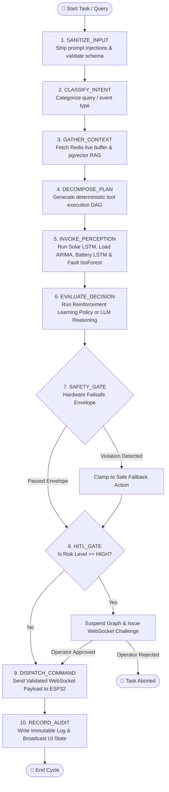

# 🎛️ Agent 06: Agent Controller / Orchestrator Specification & Implementation Guide

**Document ID:** `GFX-AI-SPEC-06`  
**Agent Name:** `agent_controller_orchestrator`  
**Classification:** Platform Core · Supervisory State Graph Orchestrator  
**Version:** `2.0.0-PROD`  
**Target Repository:** `gridflow-agentic-ai/src/agents/orchestrator.py`  
**Runtime:** LangGraph / PydanticAI / FastAPI / Redis / PostgreSQL  

---

## 1. Overview & Architectural Role
The **Agent Controller / Orchestrator** is the central coordinating intelligence of the GridFlowX Agentic AI system. Built upon **LangGraph**, it executes as a deterministic, stateful directed acyclic graph (DAG) that decomposes complex user intents or automation triggers into structured sub-tasks, queries specialized domain models (Solar LSTM, Load ARIMA, Battery LSTM, Fault Isolation Forest, Energy RL Policy), invokes safe tools, enforces hardware safety policies, and coordinates Human-in-the-Loop (HITL) authorization gates.



---

## 2. Orchestrator State Schema (`AgentState`)

```python
from typing import TypedDict, List, Dict, Any, Optional
from datetime import datetime

class AgentState(TypedDict):
    # Session & Security Context
    session_id: str
    user_id: str
    user_role: str  # Admin, Supervisor, Operator, Auditor
    trace_id: str
    
    # Input Data
    raw_query: Optional[str]
    sanitized_query: Optional[str]
    trigger_event: Optional[Dict[str, Any]]
    intent: str  # TELEMETRY_QUERY, ENERGY_DISPATCH, FAULT_DIAGNOSIS, SYSTEM_OVERRIDE
    
    # Retrieved Multi-Tier Context
    telemetry_window: Optional[List[List[float]]] # [96, 10]
    current_state: Dict[str, Any]
    rag_context_chunks: List[Dict[str, Any]]
    
    # Predictive & Diagnostic Perceptions
    predictions: Dict[str, Any] # Solar LSTM, Load ARIMA, Battery LSTM, Fault IsoForest
    
    # Planning & Tool Calling
    execution_plan: List[str]
    selected_tools: List[Dict[str, Any]]
    tool_results: List[Dict[str, Any]]
    
    # Safety & HITL
    candidate_action: Optional[Dict[str, Any]]
    safety_evaluation: Dict[str, Any]
    hitl_required: bool
    hitl_token: Optional[str]
    hitl_approved: bool
    
    # Final Output & Auditing
    final_response: str
    audit_record_id: Optional[str]
    execution_latency_ms: float
```

---

## 3. LangGraph State Machine Implementation

```python
# src/agents/orchestrator.py
from langgraph.graph import StateGraph, END
from src.agents.state import AgentState
from src.safety.failsafe_envelope import evaluate_safety_envelope
from src.tools.registry import execute_registered_tool

def node_sanitize_input(state: AgentState) -> AgentState:
    query = state.get("raw_query", "")
    state["sanitized_query"] = query.strip()
    return state

def node_classify_intent(state: AgentState) -> AgentState:
    state["intent"] = "ENERGY_DISPATCH" if "dispatch" in state.get("sanitized_query", "").lower() else "TELEMETRY_QUERY"
    return state

def node_gather_context(state: AgentState) -> AgentState:
    # Retrieve 96-step sliding window from Redis and SOPs from pgvector
    state["telemetry_window"] = [] # Fetched from Redis
    return state

def node_invoke_perception(state: AgentState) -> AgentState:
    # Run parallel inference: Solar LSTM + Load ARIMA + Battery LSTM + Fault Isolation Forest
    state["predictions"] = {
        "solar_forecast_lstm": [342.0, 310.0, 265.0, 198.0],
        "load_forecast_arima": [142.0, 168.0, 155.0, 130.0],
        "battery_health_lstm": {"soh_pct": 94.8, "esr_mohm": 38.2},
        "fault_isoforest": {"is_anomaly": False, "score": 0.24}
    }
    return state

def node_evaluate_decision(state: AgentState) -> AgentState:
    # Execute Reinforcement Learning Policy or LLM Reasoning
    state["candidate_action"] = {
        "relays": [True, False, True, True, True, True, False, True],
        "battery_current_setpoint": -2.4
    }
    return state

def node_safety_gate(state: AgentState) -> AgentState:
    is_safe, modified_action, violations = evaluate_safety_envelope(
        state["candidate_action"], state["current_state"]
    )
    state["safety_evaluation"] = {"is_safe": is_safe, "violations": violations}
    state["candidate_action"] = modified_action
    state["hitl_required"] = not is_safe or any(v["severity"] == "HIGH" for v in violations)
    return state

def node_dispatch_command(state: AgentState) -> AgentState:
    # Send WebSocket payload to ESP32
    return state

def node_record_audit(state: AgentState) -> AgentState:
    # Write immutable log to PostgreSQL
    return state

# Construct State Graph
workflow = StateGraph(AgentState)
workflow.add_node("sanitize", node_sanitize_input)
workflow.add_node("intent", node_classify_intent)
workflow.add_node("context", node_gather_context)
workflow.add_node("perception", node_invoke_perception)
workflow.add_node("decision", node_evaluate_decision)
workflow.add_node("safety", node_safety_gate)
workflow.add_node("dispatch", node_dispatch_command)
workflow.add_node("audit", node_record_audit)

workflow.set_entry_point("sanitize")
workflow.add_edge("sanitize", "intent")
workflow.add_edge("intent", "context")
workflow.add_edge("context", "perception")
workflow.add_edge("perception", "decision")
workflow.add_edge("decision", "safety")
workflow.add_edge("safety", "dispatch")
workflow.add_edge("dispatch", "audit")
workflow.add_edge("audit", END)

orchestrator_app = workflow.compile()
```

---

## 4. Conflict Resolution Matrix
When multiple specialized agents generate competing goals, the Orchestrator applies the following strict priority resolution:
1. **P0 (Absolute Safety):** Hardware Failsafe Envelope & ESP32 Core 0 Interlocks.
2. **P1 (Electrochemical Health):** Battery thermal cutoff and low SoC discharge inhibition (LSTM monitored).
3. **P2 (Critical Load Reliability):** Tier 1 power uninterrupted under all operational modes.
4. **P3 (Economic Tariff Optimization):** Peak shaving and ToU arbitrage (RL policy).
5. **P4 (Discretionary User Request):** Manual comfort overrides.

---

## 5. Implementation Checklist
- [x] Align Orchestrator perception and decision nodes with the 5 revised primary models.
- [ ] Implement `AgentState` Pydantic models.
- [ ] Build 10-node LangGraph state machine in `src/agents/orchestrator.py`.
- [ ] Implement Redis lock-based concurrency to prevent race conditions during simultaneous dispatch triggers.
- [ ] Connect Orchestrator to FastAPI `/api/v1/agent/` route.
- [ ] Add unit tests simulating full 10-node execution traces.
