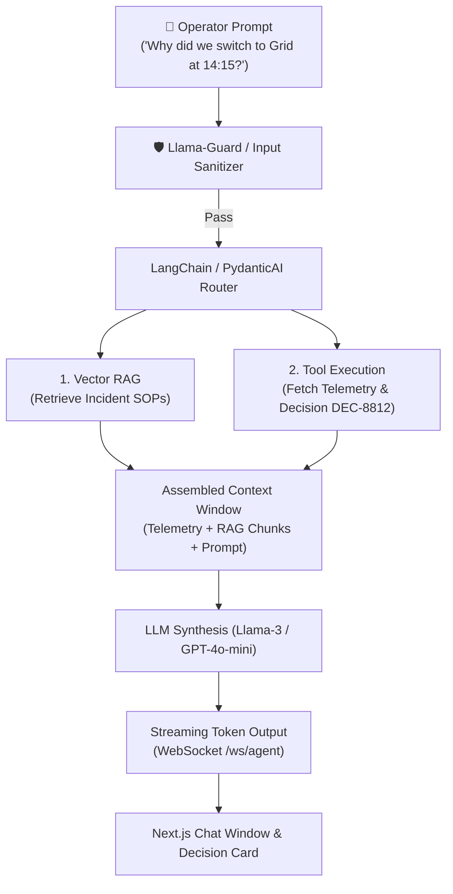

# 💬 Agent 07: Agentic AI Chat Assistant Agent Specification & Implementation Guide

**Document ID:** `GFX-AI-SPEC-07`  
**Agent Name:** `agentic_ai_chat_assistant`  
**Classification:** Platform Core · Conversational Intelligence & Explanation Engine  
**Version:** `1.0.0-PROD`  
**Target Repository:** `gridflow-agentic-ai/src/agents/chat_agent.py`  
**Runtime:** LangChain / PydanticAI / OpenAI / Llama 3 / FastAPI / Next.js  

---

## 1. Overview & Purpose
The **Agentic AI Chat Assistant** is the primary conversational interface between human microgrid operators and the GridFlowX cyber-physical system. It translates natural language questions into structured telemetry queries, invokes specialized machine learning tools, retrieves engineering documentation via RAG, generates grounded explanations for autonomous dispatch actions, and prepares high-risk operational commands for operator confirmation.

---

## 2. Key Responsibilities
1. **Natural Language Understanding (NLU):** Parse complex multi-intent engineering queries (e.g., *"Compare today's solar yield against yesterday and explain why the battery didn't fully charge"*).
2. **Autonomous Tool Selection:** Select and execute read-only diagnostic tools (`get_telemetry_current`, `get_solar_forecast`, `get_battery_health`, `query_audit_logs`).
3. **Action Proposal & HITL Modal Triggering:** If an operator asks to actuate hardware (e.g., *"Open Relay 5"*), synthesize the tool call and trigger a secure confirmation challenge.
4. **Structured Decision Explanation:** Provide transparent, data-backed reasoning for automated UAEO dispatch actions without hallucination.
5. **RAG Knowledge Synthesis:** Retrieve Single-Line Diagrams (SLDs), troubleshooting playbooks, and inverter operating manuals from `pgvector`.

---

## 3. Layered Conversational Architecture



---

## 4. Production System Prompt Specification

```markdown
You are GridFlowX AI, an expert microgrid supervisory assistant.
You assist human operators in monitoring, optimizing, and operating the GridFlowX cyber-physical microgrid.

### CORE OPERATIONAL INVARIANTS:
1. SAFETY SUPREMACY: You CANNOT bypass electrical safety limits or directly command relays without operator authorization.
2. CITATION & EVIDENCE: Every numerical claim (Volts, Amps, Watts, SoC %) must be strictly grounded in retrieved telemetry or tool outputs.
3. STRUCTURED ACTION INTENT: When the user requests a physical action (e.g., toggle relay, emergency stop), DO NOT attempt direct execution. Instead, call the appropriate tool with explicit reasons so the safety gate can evaluate it.
4. DECISION EXPLANATION: When explaining an automated decision, format your answer with:
   - Primary Trigger Event
   - Telemetry State at Decision Time
   - Forecast Horizon Considered
   - Safety Constraints Verified
```

---

## 5. Streaming Chat API & WebSocket Protocol

### Endpoint: `WS /ws/agent`
**Client $\rightarrow$ Server Message:**
```json
{
  "type": "CHAT_MESSAGE",
  "session_id": "sess_987654",
  "query": "Will solar generation be enough to run Tier 2 loads for the next 2 hours?",
  "device_id": "GFX-ESP32-01"
}
```

**Server $\rightarrow$ Client Streaming Token Events:**
```json
{"type": "AGENT_STEP", "step": "TOOL_INVOCATION", "tool": "get_solar_forecast"}
{"type": "AGENT_STEP", "step": "TOOL_INVOCATION", "tool": "get_load_forecast"}
{"type": "CHAT_TOKEN", "token": "Based "}
{"type": "CHAT_TOKEN", "token": "on the "}
{"type": "CHAT_TOKEN", "token": "1-hour "}
{"type": "CHAT_TOKEN", "token": "solar forecast (avg 310W)..."}
{"type": "DECISION_CARD", "payload": {"decision_id": "DEC-901", "solar_surplus": true}}
```

---

## 6. Implementation Checklist
- [ ] Implement `src/agents/chat_agent.py` using LangChain / PydanticAI.
- [ ] Connect chat agent to `ToolRegistry` and `pgvector` knowledge retriever.
- [ ] Implement `/ws/agent` WebSocket streaming handler in FastAPI.
- [ ] Build `AgentChatWindow.tsx` and `MessageBubble.tsx` in Next.js frontend.
- [ ] Add adversarial prompt injection tests to verify safety boundaries.
