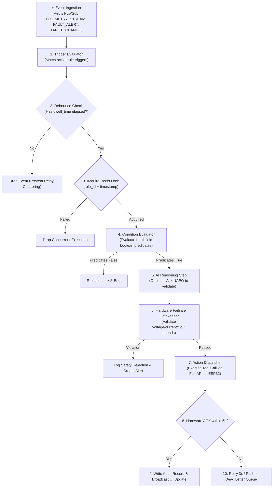

# ⚙️ Agent 08: Automation Engine Agent Specification & Implementation Guide

**Document ID:** `GFX-AI-SPEC-08`  
**Agent Name:** `automation_engine_agent`  
**Classification:** Platform Core · Event-Driven Automation Daemon  
**Version:** `1.0.0-PROD`  
**Target Repository:** `gridflow-agentic-ai/src/agents/automation_agent.py`  
**Runtime:** Redis Pub/Sub / AsyncIO / FastAPI / PostgreSQL  

---

## 1. Overview & Purpose
The **Automation Engine Agent** is an asynchronous background service that continuously evaluates incoming telemetry events, schedule timers, and external market signals against active automation workflows. It executes deterministic **Trigger $\rightarrow$ Condition $\rightarrow$ Action** pipelines with built-in anti-chatter debounce timers, distributed idempotency locks, and automated dead-letter-queue (DLQ) retry policies.

---

## 2. Event-Driven Automation Lifecycle



---

## 3. Automation Rule Schema & JSON Representation

```json
{
  "rule_id": "rule_peak_tariff_load_shed_01",
  "name": "ToU Peak Tariff Tier 4 Load Shedding",
  "description": "Automatically disconnects Tier 4 discretionary loads during peak tariff hours if battery SoC is below 45%.",
  "enabled": true,
  "created_by": "auth_uid_admin_01",
  "trigger": {
    "event_type": "TARIFF_WINDOW_CHANGE",
    "condition_field": "tariff_rate_usd",
    "operator": "gte",
    "threshold": 0.30
  },
  "conditions": [
    {"field": "battery_soc", "operator": "lt", "value": 45.0},
    {"field": "solar_power", "operator": "lt", "value": 200.0},
    {"field": "grid_status", "operator": "eq", "value": 1}
  ],
  "actions": [
    {
      "tool": "control_relay",
      "params": {
        "channel": 7,
        "state": false,
        "reason": "Automated peak tariff load shaving"
      }
    },
    {
      "tool": "create_alert",
      "params": {
        "severity": "INFO",
        "message": "Tier 4 load shed automatically due to peak tariff."
      }
    }
  ],
  "dwell_time_seconds": 600,
  "requires_approval": false,
  "max_retries": 3
}
```

---

## 4. Anti-Chatter Dwell Time & Debounce Implementation
Frequent switching of high-power contactors and electromechanical relays induces electrical arcing and accelerates contact wear. The Automation Engine enforces a **minimum dwell time** (default $600\,\text{seconds} = 10\,\text{minutes}$) on every controllable channel before state reversal is permitted.

```python
# src/agents/automation_agent.py
import redis.asyncio as redis
import time

async def check_channel_dwell_time(redis_client: redis.Redis, channel: int, min_dwell_sec: int = 600) -> bool:
    key = f"relay_last_switched:{channel}"
    last_switched = await redis_client.get(key)
    now = time.time()
    if last_switched and (now - float(last_switched)) < min_dwell_sec:
        return False # Dwell time violation: inhibit switching
    await redis_client.set(key, str(now))
    return True
```

---

## 5. Implementation Checklist
- [ ] Implement `AutomationEngine` background service in `src/agents/automation_agent.py`.
- [ ] Connect Redis Pub/Sub consumer for real-time telemetry events.
- [ ] Implement distributed Redis locking for rule idempotency.
- [ ] Implement Dwell Time relay protection module.
- [ ] Create REST endpoints for creating, updating, enabling, and disabling automation rules (`/api/v1/automations/`).
- [ ] Build `AutomationRuleBuilder.tsx` in Next.js web application.
