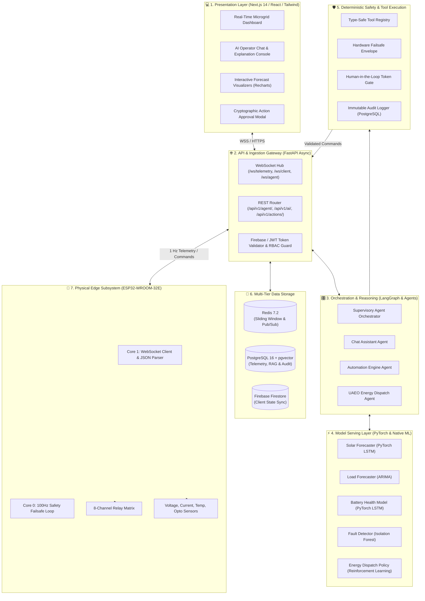

# 🏗️ Architecture 09: Agentic AI System Architecture

**Document ID:** `GFX-AI-SPEC-09`  
**Classification:** Master System Architecture Document (SAD)  
**Version:** `2.0.0-PROD`  
**Target Subsystems:** Edge Hardware · FastAPI Backend · AI Model Services · Next.js Frontend · PostgreSQL · Redis  

---

## 1. Executive Summary & Core Architectural Tenets
The **GridFlowX Agentic AI System Architecture** defines the complete cyber-physical integration between physical microgrid hardware (Solar PV, Battery Storage, Grid Fallback, Tiered Loads), the dual-core ESP32 edge controller, a high-throughput asynchronous FastAPI gateway, specialized machine learning perception models (Solar LSTM, Load ARIMA, Battery LSTM, Fault Isolation Forest, Energy RL), a LangGraph supervisory state graph orchestrator, and a real-time Next.js web console.

```
Key Architectural Separation:
┌─────────────────────────────────────────────────────────────┐
│ 🧠 Agentic Reasoning Layer (LangGraph + LLM + RAG)          │
│ - Goal decomposition, multi-step planning, explanation      │
└──────────────────────────────┬──────────────────────────────┘
                               ▼
┌─────────────────────────────────────────────────────────────┐
│ ⚡ Numerical ML Model Serving (PyTorch & Scikit/Statsmodels) │
│ - Sub-15ms inference for Solar, Load, Battery, Fault, Energy│
└──────────────────────────────┬──────────────────────────────┘
                               ▼
┌─────────────────────────────────────────────────────────────┐
│ 🛡️ Deterministic Safety Gatekeeper (Software Interlocks)    │
│ - Hardware Failsafe Envelope (Voltage, Current, SoC bounds) │
└──────────────────────────────┬──────────────────────────────┘
                               ▼
┌─────────────────────────────────────────────────────────────┐
│ 🔌 Physical Edge Firmware (ESP32 Core 0 100Hz Loop)         │
│ - Hardware interlocks, optocoupled relays, fail-safe drop   │
└─────────────────────────────────────────────────────────────┘
```

---

## 2. Layered System Architecture



---

## 3. Communication Protocols & Interfaces
1. **Edge-to-Cloud (`ESP32 <-> FastAPI`):** Secure WebSockets (`wss://api.gridflowx.local/ws/telemetry`) streaming 1 Hz JSON payloads with cryptographic sequence nonces.
2. **Cloud-to-Browser (`FastAPI <-> Next.js`):** Bi-directional WebSockets (`/ws/client` for telemetry streams and `/ws/agent` for streaming LLM tokens and HITL challenges).
3. **Inter-Service Event Bus:** Redis 7.2 Pub/Sub broker for sub-millisecond decoupled event routing between telemetry workers, the automation engine, and the model server.
4. **Vector Retrieval (`Orchestrator <-> pgvector`):** PostgreSQL `vector_cosine_ops` querying 384-dimensional dense embeddings in $<10\,\text{ms}$.

---

## 4. Hardware Interaction Boundaries & Invariants
- **Zero Raw Access:** No AI model or LLM agent possesses direct write access to ESP32 GPIO registers.
- **Fail-Safe Default:** In the event of network disconnection, power brownout, or server crash, ESP32 Relay 8 (Normally Closed emergency relay) automatically trips to safe hardware configuration.
- **Tier 1 Immutability:** Relay 4 (Tier 1 Critical Load) cannot be turned off programmatically by software dispatch.
- **Deterministic Safety Supremacy:** $\boxed{\text{AI Proposes} \neq \text{Hardware Executes}}$.

---

## 5. Implementation & Verification Checklist
- [x] Align system architecture with 5 authoritative primary models and 9-block Agentic workflow.
- [ ] Deploy multi-container Docker topology (Next.js, FastAPI, PostgreSQL, Redis).
- [ ] Validate end-to-end WebSocket round-trip propagation latency ($<50\,\text{ms}$).
- [ ] Verify database schema migration scripts and HNSW vector index creation.
- [ ] Execute hardware loopback test to verify command ACK verification.
