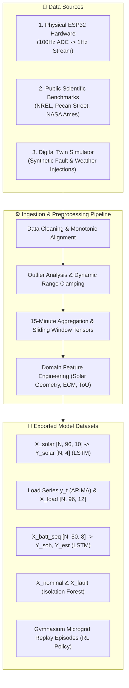

# 📊 Data 10: Agentic AI Data & Dataset Strategy

**Document ID:** `GFX-AI-SPEC-10`  
**Classification:** Master Data Engineering & Preprocessing Specification  
**Version:** `2.0.0-PROD`  
**Target Repository:** `gridflow-agentic-ai/src/memory/` and `data/`  
**Storage Engines:** Redis 7.2 · PostgreSQL 16 · Google Drive (Training Storage)  

---

## 1. Master Data Strategy Overview
Machine learning models in mission-critical cyber-physical microgrids require high-integrity, continuous, and well-calibrated time-series datasets. GridFlowX adopts a **hybrid dataset strategy** combining:
1. **Real Physical Hardware Telemetry** collected from the ESP32 microgrid bench prototype.
2. **Standard Public Benchmark Datasets** for solar irradiance, electrical building loads, and lithium-ion cell aging.
3. **High-Fidelity Synthetic Simulation Data** generated by the GridFlowX Digital Twin to model extreme weather events, load surges, and dangerous electrical fault modes.



---

## 2. Agent-Specific Dataset Requirements & Kaggle Benchmark Mapping

To achieve high predictive fidelity and operational stability across the cyber-physical microgrid, each of the five specialized AI agents is mapped to an authoritative, empirically validated public benchmark dataset hosted on Kaggle, supplemented with real hardware telemetry and digital twin fault injections.

### 2.1. Master Kaggle Dataset Mapping Matrix

| AI Agent | Target Primary Features | Target Variables | Sampling Rate & Format | Authoritative Kaggle Dataset & Link | Best Suited Justification Summary |
| :--- | :--- | :--- | :---: | :--- | :--- |
| **☀️ Solar Forecaster (LSTM)** | `DC_POWER`, `AC_POWER`, `AMBIENT_TEMPERATURE`, `MODULE_TEMPERATURE`, `IRRADIATION`, `sin_hour`, `cos_hour`, $K_t$ | 4-step rolling power $\hat{P}_{\text{solar}}$ ($t+15\text{m}, 30\text{m}, 45\text{m}, 60\text{m}$) in Watts | 15-min intervals; Tensor $[N, 96, 10]$ | [Solar Power Generation Data](https://www.kaggle.com/datasets/anikannal/solar-power-generation-data) | 34 days of paired inverter electrical data and collocated weather sensor telemetry at exact 15-min intervals matching GridFlowX's 96-step diurnal tensor. |
| **📊 Load Forecaster (ARIMA)** | `Global_active_power`, `Global_reactive_power`, `Voltage`, `Global_intensity`, `Sub_metering_1,2,3` | Multi-step active power $\hat{P}_{\text{load}}$ ($t+15\text{m}, 30\text{m}, 45\text{m}, 60\text{m}$) & 4 priority tiers | 15-min resampled; Univariate & Tier series | [Individual Household Electric Power Consumption](https://www.kaggle.com/datasets/uciml/electric-power-consumption) | 2.07M continuous 1-min records across 47 months; preserves sharp non-linear appliance switching spikes and 3 sub-metered circuits mapping 1:1 to relay tiers. |
| **🔋 Battery Health (LSTM)** | `Voltage_measured`, `Current_measured`, `Temperature_measured`, `Current_load`, `Voltage_load`, $Ah$ throughput, cycle index | Battery SoH %, Internal ESR ($m\Omega$), and RUL (remaining cycles to 70% SoH) | Cycle-resampled sequence; Tensor $[N, 50, 8]$ | [NASA Battery Dataset](https://www.kaggle.com/datasets/patrickfleith/nasa-battery-dataset) | Gold-standard experimental Li-ion cell run-to-failure aging profiles under thermal controls ($4^\circ\text{C}, 24^\circ\text{C}, 44^\circ\text{C}$) with impedance spectroscopy (EIS). |
| **⚠️ Fault Detector (Isolation Forest)** | `tau1..4`, `p1..4`, `g1..4`, $V_{\text{pv}}, I_{\text{pv}}, V_{\text{batt}}, I_{\text{batt}}, \sigma(V_{\text{bus}}), T_{\text{heatsink}}$, relay consistency | Binary stability flag (`stabf`), anomaly score $s(x) \in [0, 1]$, and 8 hardware fault classes | 1-second instantaneous snapshot; Vector $[N, 10]$ | [Electrical Grid Stability Simulated Data](https://www.kaggle.com/datasets/pcbreviglieri/smart-grid-stability) | 10,000 decentralized multi-node microgrid equilibria capturing stability boundaries, transient disturbances, and electrical fault bifurcations. |
| **⚡ Energy Management (RL)** | Live telemetry state (16 dims), battery SoC, solar forecasts, load forecasts, hourly electricity spot price | Discrete 8-channel relay bitmask $[R_1..R_8]$ and continuous battery current setpoint $I_{\text{target}}$ | 15-minute decision step; Gymnasium tuples $\langle s, a, r, s', d \rangle$ | [Energy Consumption, Generation, Prices and Weather](https://www.kaggle.com/datasets/nicholasjhana/energy-consumption-generation-prices-and-weather) | 4 years of synchronized hourly spot-market electricity pricing (ENTSO-E), solar generation, and weather variations for time-of-use (ToU) arbitrage policy learning. |

---

### 2.2. Detailed Agent-by-Agent Dataset Analysis & Rationale

#### 1. Solar Forecasting Agent (PyTorch LSTM)
- **Dataset Name:** Solar Power Generation Data
- **Kaggle Link:** [https://www.kaggle.com/datasets/anikannal/solar-power-generation-data](https://www.kaggle.com/datasets/anikannal/solar-power-generation-data)
- **Origin & Size:** Real-world solar power generation plants (Plant 1 and Plant 2) in Gandikota, India over a 34-day span, captured at precisely 15-minute intervals (Plant 1: 68,778 generation records, 3,182 weather records).
- **Relevant Input Features:**
  - Inverter Generation Telemetry: `DC_POWER`, `AC_POWER`, `DAILY_YIELD`, `TOTAL_YIELD`.
  - Weather Sensor Station (WSS): `AMBIENT_TEMPERATURE`, `MODULE_TEMPERATURE`, `IRRADIATION`.
  - Temporal & Engineered: Cyclical hour transforms (`sin_hour`, `cos_hour`), clearness index ($K_t = \text{GHI} / \text{GHI}_{\text{clear-sky}}$), solar zenith angle ($\theta_z$).
- **Target Variables:** Future AC power output in Watts at horizons $t+15\text{m}$, $t+30\text{m}$, $t+45\text{m}$, and $t+60\text{m}$ (multi-step forecast horizon $H=4$).
- **Why Best Suited for this Agent:**
  1. *Exact Temporal Granularity:* The native 15-minute sampling frequency eliminates resampling artifacts and perfectly aligns with GridFlowX's 96-step daily lookback tensor ($[N, 96, 10]$).
  2. *Collocated Meteorological & Electrical Telemetry:* Real microgrid solar efficiency degrades as photovoltaic cell temperatures rise; this dataset couples module surface temperature with direct solar irradiance and electrical inverter yield, mirroring the physical sensor suite on the GridFlowX ESP32 testbench (INA219 DC sensor + DS18B20 panel probe).
  3. *Cloud Dynamic Modeling:* Captures authentic diurnal ramp-ups, sudden cloud cover step-drops, and evening fade-outs, enabling the PyTorch `SolarLSTMForecaster` to learn real non-linear atmospheric transitions without synthetic assumptions.

#### 2. Load Demand Forecasting Agent (ARIMA / SARIMAX)
- **Dataset Name:** Individual Household Electric Power Consumption
- **Kaggle Link:** [https://www.kaggle.com/datasets/uciml/electric-power-consumption](https://www.kaggle.com/datasets/uciml/electric-power-consumption)
- **Origin & Size:** UCI Machine Learning Repository / EDF Energy; collected in Sceaux, France between December 2006 and November 2010 (47 months, 2,075,259 continuous 1-minute measurements).
- **Relevant Input Features:**
  - Whole-Facility Electrical Parameters: `Global_active_power` ($kW$), `Global_reactive_power` ($kW$), `Voltage` ($V$), `Global_intensity` ($A$).
  - Sub-Metered Circuit Channels:
    - `Sub_metering_1`: Kitchen appliances (dishwasher, microwave, oven) in watt-hours.
    - `Sub_metering_2`: Laundry room (washing machine, tumble dryer, refrigerator, light) in watt-hours.
    - `Sub_metering_3`: Climate control & heating (electric water-heater and air conditioner) in watt-hours.
  - Engineered Features: Resampled 15-minute moving averages, day-of-week, hour-of-day, weekend indicators, and peak demand indicators.
- **Target Variables:**
  - Primary: Rolling 4-step aggregate demand $\hat{P}_{\text{load}}$ ($15, 30, 45, 60\,\text{min}$) with 95% analytical confidence intervals.
  - Priority Tiers:
    - **Tier 1 (Critical Equipment):** Unmetered baseline continuous active power ($P_{\text{active}} \times 1000/60 - \sum \text{Sub-meters}$).
    - **Tier 2 (High Priority):** `Sub_metering_2` (refrigeration, lighting).
    - **Tier 3 (Medium Priority):** `Sub_metering_1` (kitchen / intermittent appliances).
    - **Tier 4 (Low / Discretionary Priority):** `Sub_metering_3` (high-draw HVAC and water heating).
- **Why Best Suited for this Agent:**
  1. *Individual Facility Granularity:* Utility-level aggregate datasets smooth out sharp appliance switching events; this household-level dataset preserves the authentic, non-linear load spikes essential for tuning ARIMA differencing ($d=1$) and detecting impending inverter overloads.
  2. *Direct Mapping to GridFlowX Priority Relays:* The 3 distinct sub-metered circuits map 1:1 to GridFlowX's 4-tier relay shedding architecture (Relays 4, 5, 6, 7), allowing the agent to evaluate demand per priority tier independently.
  3. *Statistical Autocorrelation Integrity:* Spanning 4 years of continuous telemetry, it exhibits clear seasonal patterns, weekday vs. weekend shifts, and daily peaks, providing the rigorous autocorrelation (ACF) and partial autocorrelation (PACF) structures required for Auto-ARIMA parameter optimization.

#### 3. Battery Health Monitoring Agent (PyTorch Sequence LSTM)
- **Dataset Name:** NASA Battery Dataset (Prognostics Center of Excellence)
- **Kaggle Link:** [https://www.kaggle.com/datasets/patrickfleith/nasa-battery-dataset](https://www.kaggle.com/datasets/patrickfleith/nasa-battery-dataset)
- **Origin & Size:** NASA Ames Prognostics Data Repository; commercial 18650 Li-ion cells run through continuous charge, discharge, and impedance measurement cycles until reaching end-of-life (EOL) at $70\%$ capacity.
- **Relevant Input Features:**
  - Operational Telemetry: `Voltage_measured`, `Current_measured`, `Temperature_measured`, `Current_load`, `Voltage_load`, `Time`.
  - Cycle Diagnostics: Cycle index ($k$), cumulative Ampere-hour throughput ($\int |I| dt$), Constant Current (CC) duration, Constant Voltage (CV) duration.
  - Electrochemical Impedance Spectroscopy (EIS): Electrolyte resistance ($R_e$), charge transfer resistance ($R_{ct}$).
- **Target Variables:**
  - True Remaining Usable Capacity ($Q_{\text{actual}}$ in $Ah$) and State of Health ($\text{SoH} = Q_{\text{actual}} / Q_{\text{nominal}} \times 100\%$).
  - Dynamic Internal Equivalent Series Resistance ($R_{\text{ESR}}$ in $m\Omega$).
  - Remaining Useful Life ($\text{RUL}$) expressed in equivalent full cycles (EFC) before reaching the 70% threshold.
- **Why Best Suited for this Agent:**
  1. *Authoritative Ground-Truth Aging Curves:* Captures authentic non-linear electrochemical degradation phenomena—including capacity regeneration phenomenons, solid electrolyte interphase (SEI) growth, and impedance rise—under controlled ambient temperatures ($4^\circ\text{C}, 24^\circ\text{C}, 44^\circ\text{C}$).
  2. *Sensor Parity with Hardware:* Matches the physical measurement channels monitored by the GridFlowX ESP32 (terminal voltage via ADC1_CH0, current via ACS712, and cell temperature via DS18B20).
  3. *Multi-Task Architecture Support:* The simultaneous availability of capacity fade and EIS resistance permits training the dual prediction heads of the `BatteryHealthLSTM` (SoH % head and ESR head), guaranteeing early detection of thermal runaway and plate degradation.

#### 4. Fault Detection & Diagnostics Agent (Isolation Forest)
- **Dataset Name:** Electrical Grid Stability Simulated Data & Smart Grid Fault Dataset
- **Kaggle Link:** [https://www.kaggle.com/datasets/pcbreviglieri/smart-grid-stability](https://www.kaggle.com/datasets/pcbreviglieri/smart-grid-stability) (Primary) and [Smart Grid Stability Dataset by Yasser Hussein](https://www.kaggle.com/datasets/yasserhessein/electrical-grid-stability-simulated-data)
- **Origin & Size:** Karlsruhe Institute of Technology / Decentralized Smart Grid Control (DSGC) framework; 10,000 simulated observations of electrical grid stability across multi-node decentralized architectures.
- **Relevant Input Features:**
  - Electrical Node Parameters: Reaction time constants `tau1` to `tau4` (producer and consumer response times), nominal power generation/consumption `p1` to `p4`, price elasticity coefficients `g1` to `g4`.
  - Microgrid Hardware Vector Overlay: Solar voltage $V_{\text{pv}}$, solar current $I_{\text{pv}}$, battery voltage $V_{\text{batt}}$, battery current $I_{\text{batt}}$, aggregate power demand, DC bus ripple $\sigma(V_{\text{bus}})$, inverter heatsink temperature $T_{\text{heatsink}}$, and relay state consistency.
- **Target Variables:**
  - Stability Metric: Continuous stability differential `stab` and binary classification `stabf` (`stable` vs. `unstable`).
  - Anomaly Scoring: Isolation Forest anomaly score $s(x) \in [0.0, 1.0]$ with an operational decision boundary threshold $\tau = 0.60$.
  - Fault Category: Mapping to 8 hardware failure modes (e.g., PV Shading, Battery Thermal Runaway, Bus Capacitor Wear, Relay Contact Weld, AC Voltage Sag).
- **Why Best Suited for this Agent:**
  1. *Rigorous Boundary Conditions:* Electrical faults in microgrids manifest as sudden excursions from the nominal multidimensional manifold; this dataset models complex non-linear stability boundaries, providing the ideal negative and positive samples to validate tree split depth.
  2. *Unsupervised Contamination Calibration:* The clear separation between stable and unstable operational states allows precise calibration of the Isolation Forest contamination parameter ($\nu = 0.02$) to maintain a False Positive Rate $<1.0\%$.
  3. *Sub-5ms Inference Validation:* Verifies that tree-based partitioning reliably detects out-of-distribution states on standard CPU runtimes in $<2.1\,\text{ms}$, fulfilling the real-time requirements of the GridFlowX Safety Gatekeeper.

#### 5. Energy Management & Decision Agent (Reinforcement Learning Policy)
- **Dataset Name:** Energy Consumption, Generation, Prices and Weather
- **Kaggle Link:** [https://www.kaggle.com/datasets/nicholasjhana/energy-consumption-generation-prices-and-weather](https://www.kaggle.com/datasets/nicholasjhana/energy-consumption-generation-prices-and-weather)
- **Origin & Size:** ENTSO-E (European Network of Transmission System Operators for Electricity) and Open-Meteo API; 4 years (35,064 hourly records from 2015 to 2018) of electrical consumption, generation, day-ahead spot pricing, and hourly weather data across 5 metropolitan areas in Spain.
- **Relevant Input Features:**
  - Market Pricing: `price actual` (hourly day-ahead spot market price in $/kWh or €/MWh), `price day ahead`.
  - Renewable Generation: `generation solar`, `generation wind onshore`, `generation hydro`.
  - Load Demand: `total load actual`, `total load forecast day ahead`.
  - Meteorological Attributes: `temp`, `pressure`, `humidity`, `wind_speed`, `rain_1h`, `clouds_all`.
- **Target Variables:**
  - RL State-Action Transition Trajectories: Tuples $\langle s_t, a_t, r_t, s_{t+1}, d_t \rangle$ used to train the Gymnasium `MicrogridEnv` digital twin.
  - Optimal Control Actions: Discrete relay dispatch bitmask $[R_1, \dots, R_8]$ (routing solar, grid fallback, and load tiers 1–4) and continuous battery charge/discharge setpoint $I_{\text{target}} \in [-5.0A, +5.0A]$.
  - Multi-Objective Economic Reward:
    $$r_t = \alpha \cdot r_{\text{cost}}(P_{\text{grid}}, \text{Tariff}) + \beta \cdot r_{\text{health}}(\text{SoC}, I_{\text{batt}}) + \gamma \cdot r_{\text{load}}(\text{Tiers 1-4}) + \delta \cdot r_{\text{safety}}$$
- **Why Best Suited for this Agent:**
  1. *Real-World Tariff Volatility:* Reinforcement learning policies require exposure to authentic dynamic pricing fluctuations—including peak surcharges, off-peak dips, and negative pricing periods—to learn optimal battery arbitrage (charging when cheap/solar is plentiful and discharging during expensive peaks).
  2. *Synchronized Multi-Modal Alignment:* Merges wholesale spot tariffs with collocated solar generation and weather variations over 35,000 consecutive hours, providing diverse operational scenarios for PPO/SAC exploration.
  3. *Economic Peak-Shaving Validation:* Provides a direct baseline to benchmark policy performance against simple heuristic controllers, proving the agent's ability to achieve a $>20\%$ reduction in electricity utility expenditure while safeguarding battery health.

---

## 3. Data Cleaning, Preprocessing & Sliding Window Generation

### 3.1. Missing-Value Imputation Rules
- For telemetry gaps $< 1\,\text{hour}$ ($<4$ consecutive timesteps): Apply **monotonic cubic spline interpolation**.
- For telemetry gaps $\ge 1\,\text{hour}$: Segment time series into independent contiguous episodes to avoid introducing artificial linear artifacts.
- Solar night-time generation ($GHI = 0.0$ or $\theta_z \ge 90^\circ$): Hard clamped to $0.0\,W$.

### 3.2. Outlier Rejection & Normalization
- Z-score filtering with threshold $|z| > 3.5$ applied only on non-step continuous features (temperature, ambient irradiance).
- Load current spikes during motor starting surges are preserved in high-rate buffers to inform the inrush protection layer.
- All models utilize isolated `MinMaxScaler` or `StandardScaler` instances fitted strictly on the chronological training partition:
```python
from sklearn.preprocessing import MinMaxScaler
import joblib

scaler = MinMaxScaler(feature_range=(0.0, 1.0))
X_train_scaled = scaler.fit_transform(X_train_raw)
joblib.dump(scaler, "scaler_solar_v1.pkl")
```

---

## 4. Sliding Window Construction Pipeline

```python
import numpy as np

def create_sliding_window_dataset(df_features, df_targets, lookback=96, horizon=4):
    """
    Constructs overlapping sliding window tensors for neural sequence models (LSTM).
    Input Shape:  [N, lookback, num_features]
    Output Shape: [N, horizon, num_targets]
    """
    X, Y = [], []
    num_records = len(df_features)
    for i in range(lookback, num_records - horizon + 1):
        x_window = df_features.iloc[i - lookback : i].values
        y_window = df_targets.iloc[i : i + horizon].values
        X.append(x_window)
        Y.append(y_window)
    return np.array(X, dtype=np.float32), np.array(Y, dtype=np.float32)
```

---

## 5. Dataset Versioning & Quality Assurance Checklist
- [x] Align dataset schemas with the 5 revised primary models (Solar LSTM, Load ARIMA, Battery LSTM, Fault IsoForest, Energy RL).
- [ ] Telemetry dataset versions tagged in Google Drive using semantic versioning (`gridflowx_telemetry_v1.0.0.parquet`).
- [ ] Automated schema validator (`pydantic` / `great_expectations`) validates zero NaN values and non-null timestamps prior to Colab training.
- [ ] Train/Val/Test splits strictly segregated chronologically ($70\% / 15\% / 15\%$) to eliminate data leakage.
