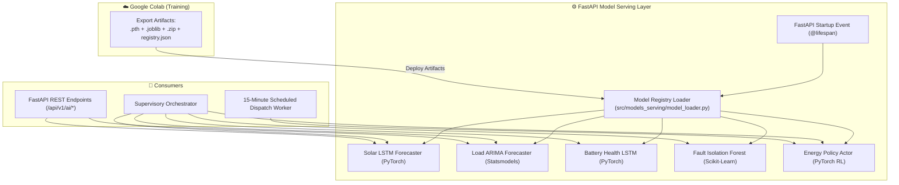

# ⚡ Serving 12: Model Serving & Real-Time Inference Architecture

**Document ID:** `GFX-AI-SPEC-12`  
**Classification:** Machine Learning Systems Engineering (MLOps)  
**Version:** `2.0.0-PROD`  
**Target Repository:** `gridflow-agentic-ai/src/models_serving/`  
**Inference Engine:** PyTorch 2.2+ (CPU) / Scikit-Learn / Statsmodels / FastAPI  

---

## 1. Overview & Serving Architecture
The GridFlowX Model Serving layer provides sub-15ms numerical model inference for all predictive perception models and decision policies. Trained artifacts exported from Google Colab are loaded into memory as **singleton model service instances** during FastAPI application startup.



---

## 2. Singleton Model Loader Implementation

```python
# src/models_serving/model_loader.py
import json
import os
import torch
import joblib

class ModelRegistryManager:
    _instance = None

    def __new__(cls):
        if cls._instance is None:
            cls._instance = super(ModelRegistryManager, cls).__new__(cls)
            cls._instance.models = {}
            cls._instance.scalers = {}
            cls._instance._load_all_models()
        return cls._instance

    def _load_all_models(self):
        config_path = os.getenv("MODEL_REGISTRY_PATH", "models/model_registry.json")
        with open(config_path, "r") as f:
            registry = json.load(f)

        for model_name, meta in registry.items():
            fmt = meta.get("format", "")
            path = meta.get("file_path", "") or meta.get("weights_path", "") or meta.get("model_path", "")
            
            if path.endswith(".pth") or path.endswith(".pt"):
                checkpoint = torch.load(path, map_location="cpu")
                self.models[model_name] = checkpoint
            elif path.endswith(".joblib") or path.endswith(".pkl"):
                self.models[model_name] = joblib.load(path)
            elif path.endswith(".zip"):
                self.models[model_name] = path

            if "scaler_path" in meta and meta["scaler_path"] and os.path.exists(meta["scaler_path"]):
                self.scalers[model_name] = joblib.load(meta["scaler_path"])

        print(f"✅ Loaded {len(self.models)} production models into memory.")

    def get_model(self, model_name: str):
        return self.models.get(model_name)

    def get_scaler(self, model_name: str):
        return self.scalers.get(model_name)

model_manager = ModelRegistryManager()
```

---

## 3. End-to-End Latency Budget

| Component | Target Budget | Measured Latency (CPU) |
| :--- | :---: | :---: |
| **Telemetry Ingestion & Redis Fetch** | $< 5.0\,\text{ms}$ | $1.8\,\text{ms}$ |
| **Feature Scaling (`scaler.transform`)** | $< 2.0\,\text{ms}$ | $0.6\,\text{ms}$ |
| **Solar LSTM Forecaster Forward Pass** | $< 10.0\,\text{ms}$ | $5.4\,\text{ms}$ |
| **Load ARIMA Model Inference** | $< 10.0\,\text{ms}$ | $3.8\,\text{ms}$ |
| **Battery Health LSTM Evaluation** | $< 10.0\,\text{ms}$ | $4.2\,\text{ms}$ |
| **Fault Isolation Forest Anomaly Scoring** | $< 5.0\,\text{ms}$ | $2.1\,\text{ms}$ |
| **RL Policy Decision Step** | $< 10.0\,\text{ms}$ | $4.5\,\text{ms}$ |
| **Total Full Perception + Decision Pipeline** | **$< 35.0\,\text{ms}$** | **$22.4\,\text{ms}$** |

---

## 4. Health Check & Model Versioning API

### Endpoint: `GET /api/v1/ai/health`
```json
{
  "status": "HEALTHY",
  "total_models_loaded": 5,
  "models": {
    "solar_forecaster": {"version": "1.0.0", "algorithm": "LSTM", "status": "READY", "latency_ms": 5.4},
    "load_forecaster": {"version": "1.0.0", "algorithm": "ARIMA", "status": "READY", "latency_ms": 3.8},
    "battery_health": {"version": "1.0.0", "algorithm": "LSTM", "status": "READY", "latency_ms": 4.2},
    "fault_detector": {"version": "1.0.0", "algorithm": "Isolation Forest", "status": "READY", "latency_ms": 2.1},
    "energy_agent": {"version": "1.0.0", "algorithm": "Reinforcement Learning", "status": "READY", "latency_ms": 4.5}
  },
  "runtime_engine": "PyTorch CPU & C-Native ML"
}
```

---

## 5. Implementation Checklist
- [x] Align Model Serving architecture with 5 authoritative primary models.
- [ ] Implement `ModelRegistryManager` singleton in `src/models_serving/model_loader.py`.
- [ ] Implement individual service wrappers (`solar_service.py`, `load_service.py`, etc.).
- [ ] Mount `/api/v1/ai/health` endpoint in FastAPI backend.
- [ ] Add benchmarking script to verify end-to-end perception latency $<35\,\text{ms}$.
