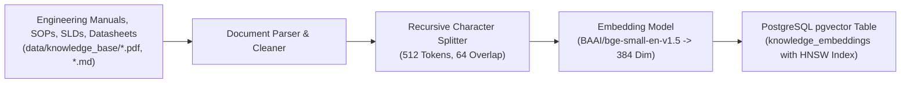

# 🧠 Memory 13: RAG, Memory & Knowledge Base System Specification

**Document ID:** `GFX-AI-SPEC-13`  
**Classification:** Information Architecture & Semantic Intelligence Specification  
**Version:** `1.0.0-PROD`  
**Target Repository:** `gridflow-agentic-ai/src/memory/`  
**Storage Stack:** Redis 7.2 (Working Memory) · PostgreSQL 16 + `pgvector` (Vector & Long-Term Memory)  

---

## 1. Overview & Four-Tier Memory Architecture
The GridFlowX Agentic AI system employs a structured, **four-tier memory architecture** that separates transient sensor buffers from permanent engineering documentation and immutable audit trails.

```
┌─────────────────────────────────────────────────────────────┐
│ Tier 1: Short-Term Working Memory (Redis 7.2)               │
│ - 96-step sliding window telemetry buffer [96, 10]          │
│ - Active chat session dialog turns (last 10 messages)       │
│ - Distributed locks for automation idempotency              │
└──────────────────────────────┬──────────────────────────────┘
                               ▼
┌─────────────────────────────────────────────────────────────┐
│ Tier 2: Episodic Memory (PostgreSQL)                        │
│ - Historical AI dispatch decisions (DEC-xxxx)               │
│ - Tool call parameters and execution results                │
│ - Operator overrides and manual intervention history        │
└──────────────────────────────┬──────────────────────────────┘
                               ▼
┌─────────────────────────────────────────────────────────────┐
│ Tier 3: Semantic Vector Memory (pgvector HNSW)              │
│ - Hardware Datasheets, Single-Line Diagrams (SLDs)          │
│ - Standard Operating Procedures (SOPs) & Incident Playbooks │
│ - Dense 384-dimensional BGE-small-en-v1.5 embeddings        │
└──────────────────────────────┬──────────────────────────────┘
                               ▼
┌─────────────────────────────────────────────────────────────┐
│ Tier 4: Permanent Audit Logs (PostgreSQL Timescale / JSONB) │
│ - Cryptographically linked hardware event logs              │
│ - Safety violation alerts and emergency trips               │
└─────────────────────────────────────────────────────────────┘
```

---

## 2. Knowledge Base Ingestion Pipeline (`src/memory/vector_store.py`)



### PostgreSQL Vector Store Schema
```sql
CREATE EXTENSION IF NOT EXISTS vector;

CREATE TABLE knowledge_embeddings (
    doc_id BIGSERIAL PRIMARY KEY,
    document_name VARCHAR(128) NOT NULL,
    category VARCHAR(64) NOT NULL, -- SOP, MANUAL, HARDWARE_SPEC, INCIDENT_PLAYBOOK
    chunk_index INT NOT NULL,
    content_text TEXT NOT NULL,
    embedding vector(384),
    metadata JSONB,
    created_at TIMESTAMPTZ DEFAULT NOW()
);

CREATE INDEX idx_knowledge_hnsw 
ON knowledge_embeddings 
USING hnsw (embedding vector_cosine_ops)
WITH (m = 16, ef_construction = 64);
```

---

## 3. Semantic Retrieval & Context Construction

```python
# src/memory/context_builder.py
import asyncpg
import numpy as np

async def retrieve_semantic_context(pool: asyncpg.Pool, query_embedding: list[float], category: str = None, top_k: int = 3) -> list[str]:
    async with pool.acquire() as conn:
        if category:
            rows = await conn.fetch("""
                SELECT content_text, 1 - (embedding <=> $1::vector) AS similarity
                FROM knowledge_embeddings
                WHERE category = $2
                ORDER BY embedding <=> $1::vector
                LIMIT $3;
            """, query_embedding, category, top_k)
        else:
            rows = await conn.fetch("""
                SELECT content_text, 1 - (embedding <=> $1::vector) AS similarity
                FROM knowledge_embeddings
                ORDER BY embedding <=> $1::vector
                LIMIT $2;
            """, query_embedding, top_k)
        return [row["content_text"] for row in rows]
```

---

## 4. RAG Security & Prompt Injection Defense
- **Delimited Context Isolation:** Retrieved chunks are injected inside explicit XML delimiter tags (`<retrieved_engineering_context>...</retrieved_engineering_context>`).
- **Prompt Guard Classification:** Queries are checked for jailbreak phrases (e.g., *"ignore previous rules"*, *"grant admin access"*) and rejected with HTTP 403.

---

## 5. Implementation Checklist
- [ ] Initialize PostgreSQL with `pgvector` extension.
- [ ] Build document chunking and embedding ingest script in `src/memory/ingest_docs.py`.
- [ ] Ingest GridFlowX hardware manuals and SOPs into `knowledge_embeddings`.
- [ ] Implement `retrieve_semantic_context` in `src/memory/context_builder.py`.
- [ ] Connect RAG context retrieval to Chat Assistant Agent.
