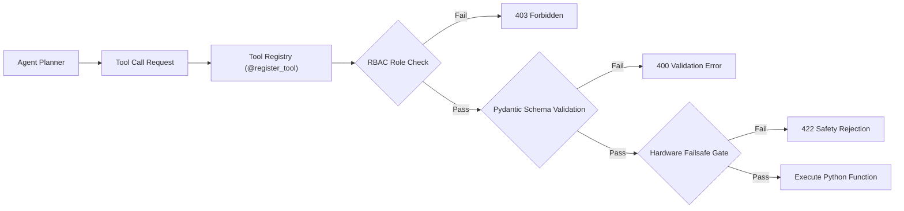

# 🛠️ Tools 14: Tools, APIs & Function Calling Specification

**Document ID:** `GFX-AI-SPEC-14`  
**Classification:** Interface Specification & Tool Engineering Standard  
**Version:** `1.0.0-PROD`  
**Target Repository:** `gridflow-agentic-ai/src/tools/`  
**Framework:** Pydantic v2 / Python 3.11+ / FastAPI  

---

## 1. Tool Registry Architecture
All capabilities callable by LLM agents or the Supervisory Orchestrator are registered in a centralized, type-safe **Tool Registry**. The registry enforces:
1. **Schema Validation:** Strict Pydantic parsing of input arguments.
2. **Role-Based Access Control (RBAC):** Token authorization against user custom claims (`Auditor`, `Operator`, `Supervisor`, `Admin`).
3. **Risk Categorization:** Tools are tagged as `READ_ONLY` (LOW risk) or `ACTION_EXECUTION` (HIGH/CRITICAL risk).
4. **Safety Interlocking:** High-risk actions must pass the Hardware Failsafe Envelope before execution.



---

## 2. Complete Tool Catalog Specification

### Tool 1: `get_live_telemetry`
- **Purpose:** Retrieve instantaneous sensor readings from the microgrid.
- **Risk:** `LOW` | **Role:** `Auditor+`
- **Input:** `{"device_id": str}`
- **Output:** `{"solar_power": float, "load_power": float, "battery_soc": float, "grid_status": int, "heatsink_temp": float, "bus_voltage": float}`

### Tool 2: `get_historical_telemetry`
- **Purpose:** Query historical time-series logs.
- **Risk:** `LOW` | **Role:** `Auditor+`
- **Input:** `{"device_id": str, "range": str, "limit": int}`
- **Output:** `{"count": int, "records": list[dict]}`

### Tool 3: `get_solar_forecast`
- **Purpose:** Fetch rolling 1-hour solar yield prediction.
- **Risk:** `LOW` | **Role:** `Auditor+`
- **Input:** `{"device_id": str, "horizon_steps": int}`
- **Output:** `{"horizon_minutes": list[int], "predicted_watts": list[float]}`

### Tool 4: `get_load_forecast`
- **Purpose:** Fetch multi-tier load consumption forecast.
- **Risk:** `LOW` | **Role:** `Auditor+`
- **Input:** `{"device_id": str, "horizon_steps": int}`
- **Output:** `{"total_demand_watts": list[float], "tier_breakdown": dict}`

### Tool 5: `get_battery_status`
- **Purpose:** Fetch instantaneous SoC, terminal voltage, current, and temperature.
- **Risk:** `LOW` | **Role:** `Auditor+`
- **Input:** `{"device_id": str}`
- **Output:** `{"soc_percent": float, "voltage_v": float, "current_a": float, "temp_c": float}`

### Tool 6: `get_battery_health`
- **Purpose:** Query battery State of Health (SoH %) and ESR ($m\Omega$).
- **Risk:** `LOW` | **Role:** `Auditor+`
- **Input:** `{"device_id": str}`
- **Output:** `{"soh_percent": float, "esr_milliohms": float, "cycle_count": int}`

### Tool 7: `get_fault_status`
- **Purpose:** Inspect microgrid for electrical/thermal anomalies.
- **Risk:** `LOW` | **Role:** `Auditor+`
- **Input:** `{"device_id": str}`
- **Output:** `{"anomaly_detected": bool, "fault_type": str, "severity": str}`

### Tool 8: `get_energy_recommendation`
- **Purpose:** Query Reinforcement Learning (RL) policy for optimal dispatch actions.
- **Risk:** `LOW` | **Role:** `Operator+`
- **Input:** `{"device_id": str}`
- **Output:** `{"recommended_relays": list[bool], "battery_setpoint_amps": float}`

### Tool 9: `request_source_switch`
- **Purpose:** Switch primary energy source between Solar, Battery, and Grid.
- **Risk:** `HIGH` | **Role:** `Operator+`
- **Input:** `{"source": str, "reason": str}`
- **Output:** `{"status": "DISPATCHED", "source": str}`
- **Safety Restriction:** Hardware interlock enforces contactor break-before-make delay.

### Tool 10: `request_battery_charge`
- **Purpose:** Set battery charging target current.
- **Risk:** `HIGH` | **Role:** `Operator+`
- **Input:** `{"target_amps": float, "reason": str}`
- **Output:** `{"status": "DISPATCHED", "target_amps": float}`
- **Safety Restriction:** Clamped to max $5.0\,A$; inhibited if $T_{\text{batt}} > 50^\circ C$.

### Tool 11: `request_battery_discharge`
- **Purpose:** Discharge battery to supply loads.
- **Risk:** `HIGH` | **Role:** `Operator+`
- **Input:** `{"target_amps": float, "reason": str}`
- **Output:** `{"status": "DISPATCHED", "target_amps": float}`
- **Safety Restriction:** Inhibited if $\text{SoC} < 20.0\%$.

### Tool 12: `request_load_shedding`
- **Purpose:** Shed non-critical load tiers (Tiers 2, 3, or 4).
- **Risk:** `HIGH` | **Role:** `Operator+`
- **Input:** `{"tier": int, "state": bool, "reason": str}`
- **Output:** `{"tier": int, "state": bool, "status": "DISPATCHED"}`
- **Safety Restriction:** Tier 1 (Relay 4) CANNOT be commanded to `false`.

### Tool 13: `get_tariff_information`
- **Purpose:** Fetch current and upcoming Time-of-Use electricity tariffs.
- **Risk:** `LOW` | **Role:** `Auditor+`
- **Input:** `{}`
- **Output:** `{"current_rate_usd": float, "peak_window_active": bool}`

### Tool 14: `create_alert`
- **Purpose:** Post an operator alert to the dashboard and database.
- **Risk:** `LOW` | **Role:** `Operator+`
- **Input:** `{"severity": str, "message": str, "details": dict}`
- **Output:** `{"alert_id": str, "status": "CREATED"}`

### Tool 15: `write_audit_log`
- **Purpose:** Write an immutable audit log entry.
- **Risk:** `LOW` | **Role:** `System`
- **Input:** `{"action": str, "details": dict, "user_id": str}`
- **Output:** `{"audit_id": str, "status": "PERSISTED"}`

---

## 3. Tool Registry Implementation (`src/tools/registry.py`)

```python
from typing import Callable, Dict, Any
from pydantic import BaseModel

class ToolDefinition(BaseModel):
    name: str
    description: str
    risk_level: str # LOW, MEDIUM, HIGH, CRITICAL
    required_role: str # Auditor, Operator, Supervisor, Admin
    func: Callable

class ToolRegistry:
    def __init__(self):
        self.tools: Dict[str, ToolDefinition] = {}

    def register(self, name: str, description: str, risk_level: str, required_role: str):
        def decorator(func: Callable):
            self.tools[name] = ToolDefinition(
                name=name, description=description, risk_level=risk_level, required_role=required_role, func=func
            )
            return func
        return decorator

    async def execute(self, tool_name: str, user_role: str, **kwargs) -> Any:
        if tool_name not in self.tools:
            raise ValueError(f"Tool {tool_name} not found.")
        tool = self.tools[tool_name]
        # Verify RBAC Role
        # ... Role check logic ...
        return await tool.func(**kwargs)

registry = ToolRegistry()
register_tool = registry.register
```

---

## 4. Implementation Checklist
- [ ] Implement `ToolRegistry` in `src/tools/registry.py`.
- [ ] Implement all 15 tool functions with Pydantic validation.
- [ ] Unit test RBAC permission rejection for unauthorized roles.
- [ ] Connect tools to LangGraph Orchestrator and Chat Assistant Agent.
