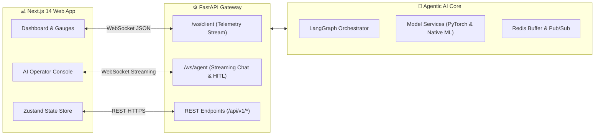

# 🌐 Integration 16: Backend & Frontend Integration Specification

**Document ID:** `GFX-AI-SPEC-16`  
**Classification:** Full-Stack Web & AI Gateway Integration Standard  
**Version:** `1.0.0-PROD`  
**Target Repositories:** `gridflow-agentic-ai/` (FastAPI) & `gridflowx-app/` (Next.js 14)  

---

## 1. Overview
This specification details the end-to-end integration contracts connecting the **FastAPI Backend Gateway** with the **Next.js 14 Web Application**. It establishes the REST APIs, WebSocket streaming topics, Zustand state management bindings, and React UI components required to present real-time telemetry, model forecasts, AI chat dialogues, and operator approval challenges.



---

## 2. API Contract Catalog

### 2.1. AI & Agent Endpoints (`/api/v1/agent/`)
- `POST /api/v1/agent/chat` — Submit query; returns session ID and initial intent summary.
- `GET /api/v1/agent/status` — Live status of Orchestrator and specialized agent health.
- `POST /api/v1/agent/plan` — Generate an explicit multi-step energy plan for a specified horizon.

### 2.2. Predictive Forecast Endpoints (`/api/v1/ai/`)
- `GET /api/v1/ai/solar-forecast` — Returns 4-step rolling solar generation forecast ($W$).
- `GET /api/v1/ai/load-forecast` — Returns 4-step tier-segregated load forecast ($W$).
- `GET /api/v1/ai/battery-health` — Returns real-time SoH %, ESR ($m\Omega$), and cycle statistics.
- `POST /api/v1/ai/fault-diagnose` — Triggers Isolation Forest anomaly inspection on current telemetry.

### 2.3. Control & Approval Endpoints (`/api/v1/actions/`)
- `POST /api/v1/actions/{action_id}/approve` — Authorize pending high-risk action with JWT token.
- `POST /api/v1/actions/{action_id}/reject` — Abort action and log operator rationale.

---

## 3. Frontend Component Structure (`gridflowx-app/src/components/Agent/`)

```
src/components/Agent/
│
├── AgentConsole.tsx            # Master layout container for AI cockpit
├── AgentChatWindow.tsx         # Streaming conversational assistant
├── MessageBubble.tsx           # Formatted markdown messages + tool chips
├── DecisionHistoryCard.tsx     # Collapsible card showing triggers, forecasts & safety checks
├── ForecastOverlayChart.tsx    # Recharts comparison of actual vs predicted curves
├── BatteryHealthGauge.tsx      # SVG dial showing SoH % and ESR status
├── AnomalyAlertBanner.tsx      # High-visibility fault notification card
└── ApprovalModal.tsx           # Cryptographic confirmation dialog for high-risk actions
```

---

## 4. Zustand Real-Time State Store (`src/store/useAgentStore.ts`)

```typescript
import { create } from 'zustand';

interface AgentState {
  isAgentActive: boolean;
  activeSessionId: string | null;
  messages: Array<{ id: string; sender: 'user' | 'agent'; text: string; timestamp: string }>;
  solarForecast: number[];
  loadForecast: number[];
  batteryHealth: { soh: number; esr: number; cycles: number };
  pendingApproval: { actionId: string; description: string; risk: string } | null;
  
  addMessage: (msg: { id: string; sender: 'user' | 'agent'; text: string }) => void;
  setForecasts: (solar: number[], load: number[]) => void;
  setPendingApproval: (approval: any) => void;
}

export const useAgentStore = create<AgentState>((set) => ({
  isAgentActive: true,
  activeSessionId: null,
  messages: [],
  solarForecast: [],
  loadForecast: [],
  batteryHealth: { soh: 100, esr: 25, cycles: 0 },
  pendingApproval: null,

  addMessage: (msg) =>
    set((state) => ({
      messages: [...state.messages, { ...msg, timestamp: new Date().toISOString() }],
    })),
  setForecasts: (solar, load) => set({ solarForecast: solar, loadForecast: load }),
  setPendingApproval: (approval) => set({ pendingApproval: approval }),
}));
```

---

## 5. Implementation Checklist
- [ ] Mount AI router endpoints in FastAPI `src/main.py`.
- [ ] Implement WebSocket connection manager in `src/api/websockets/agent_ws.py`.
- [ ] Create Zustand store in `gridflowx-app/src/store/useAgentStore.ts`.
- [ ] Build React UI components in `gridflowx-app/src/components/Agent/`.
- [ ] Test end-to-end chat query and verify live Recharts forecast visualization.
