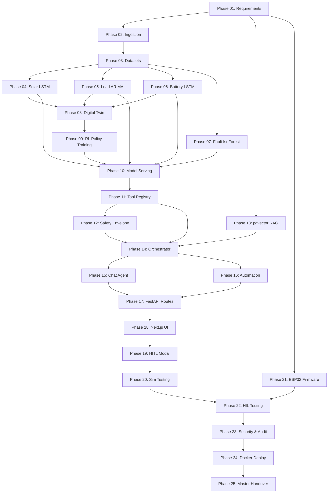

# 🗺️ Roadmap 19: End-to-End Implementation Roadmap & Actionable Development Tasks

**Document ID:** `GFX-AI-SPEC-19`  
**Classification:** Master Project Management & Engineering Execution Plan  
**Version:** `2.0.0-PROD`  
**Scope:** Complete Agentic AI System Lifecycle (Phases 1 through 25)  

---

## 1. Phased Development Progression

```
┌─────────────────────────────────────────────────────────────┐
│ 🟢 Level 1: Core Perception & Deterministic MVP (Weeks 1-4) │
│ - Telemetry streaming to Redis sliding window buffer        │
│ - Colab model training: Solar LSTM, Load ARIMA, Batt LSTM,  │
│   Fault Isolation Forest                                    │
│ - Model export & FastAPI singleton model serving            │
│ - Hardware Failsafe Envelope & ESP32 Core 0 safety loop     │
└──────────────────────────────┬──────────────────────────────┘
                               ▼
┌─────────────────────────────────────────────────────────────┐
│ 🟡 Level 2: Agentic Reasoning & Interactive Platform (Wk 5-8│
│ - LangGraph 10-node Supervisory Orchestrator               │
│ - Type-safe Tool Registry with RBAC enforcement             │
│ - pgvector Semantic Knowledge Base (RAG)                    │
│ - Conversational Chat Assistant with decision explanations  │
│ - Next.js AI Console & Forecast Overlays                   │
└──────────────────────────────┬──────────────────────────────┘
                               ▼
┌─────────────────────────────────────────────────────────────┐
│ 🔴 Level 3: Advanced Optimization & HIL Production (Wk 9-14)│
│ - Gymnasium MicrogridEnv & Reinforcement Learning Dispatch  │
│ - Event-driven Automation Engine with anti-chatter locks    │
│ - Hardware-in-the-Loop (HIL) bench validation with ESP32    │
│ - Multi-container Docker Compose staging deployment         │
└─────────────────────────────────────────────────────────────┘
```

---

## 2. 25-Stage Master Execution Matrix

| Phase # | Phase Name | Key Deliverables | Dependencies | Validation Milestone |
| :---: | :--- | :--- | :---: | :--- |
| **01** | **Requirements Baseline** | Finalize architecture specs & safety bounds. | None | `09-agentic-ai-system-architecture.md` approved. |
| **02** | **Data Ingestion Pipeline** | 1 Hz telemetry push $\to$ Redis $96 \times 10$ buffer. | Phase 01 | Zero missing values in rolling buffer. |
| **03** | **Dataset Preparation** | Master Parquet dataset + Colab drive setup. | Phase 02 | `X_train.npy`, `Y_train.npy` generated. |
| **04** | **Solar Model Training** | PyTorch Stacked LSTM in Colab. | Phase 03 | Solar $\text{MAE} < 20\,W$; exported to `.pth`. |
| **05** | **Load Model Training** | Auto-ARIMA parameter optimization in Colab. | Phase 03 | Load $\text{RMSE} < 25\,W$; exported to `.joblib`. |
| **06** | **Battery Health Model** | PyTorch Sequence LSTM in Colab. | Phase 03 | SoH $\text{RMSE} < 1.2\,\%$; exported to `.pth`. |
| **07** | **Fault Detection Model** | Scikit-Learn Isolation Forest Ensemble. | Phase 03 | Fault Recall $\ge 98\,\%$; exported to `.joblib`. |
| **08** | **Microgrid Digital Twin** | Gymnasium `MicrogridEnv` environment. | Phase 04-06 | 1000 random test steps execute without error. |
| **09** | **RL Policy Training** | Train Reinforcement Learning policy in Colab.| Phase 08 | Zero safety violations in evaluation episodes. |
| **10** | **Model Serving Layer** | FastAPI singleton PyTorch & ML runtime loader.| Phase 04-09 | All models respond in $<35\,\text{ms}$ total. |
| **11** | **Tool Registry Engine** | Pydantic type-safe tool implementations. | Phase 10 | 15 tools pass unit tests. |
| **12** | **Safety Envelope Gate** | Deterministic software safety gatekeeper. | Phase 11 | Tier 1 shed attempts $100\%$ rejected. |
| **13** | **RAG Knowledge Base** | Ingest SOPs into PostgreSQL `pgvector`. | Phase 01 | Top-3 cosine similarity retrieval $<10\,\text{ms}$. |
| **14** | **LangGraph Orchestrator**| 10-node supervisory state graph. | Phase 11-13 | End-to-end plan decomposes correctly. |
| **15** | **Chat Assistant Agent** | Streaming LLM assistant with tool calling. | Phase 14 | Explains decisions citing real telemetry. |
| **16** | **Automation Engine** | Event-driven rule background daemon. | Phase 11-12 | Debounce dwell timer prevents relay chatter. |
| **17** | **FastAPI AI Routes** | REST & WebSocket routes (`/api/v1/agent/*`).| Phase 14-16 | `/ws/agent` streams token chunks reliably. |
| **18** | **Next.js AI Console** | React dashboard, chat, and forecast cards. | Phase 17 | UI renders live AI state and decision cards. |
| **19** | **HITL Confirmation UI** | Cryptographic approval modal in Next.js. | Phase 18 | High-risk overrides require operator click. |
| **20** | **Simulation Testing** | 8 standard operational benchmark scenarios. | Phase 18 | Passes high solar, blackout, and tariff tests. |
| **21** | **ESP32 Firmware Safety**| 100 Hz Core 0 FreeRTOS loop + Core 1 comms. | Phase 01 | Emergency shutdown trips in $<10\,\text{ms}$. |
| **22** | **Hardware-in-the-Loop** | ESP32 relay bench test with physical loads. | Phase 20-21 | 24-hour burn-in test passes with zero drops. |
| **23** | **Security & Auditability**| Prompt Guard filters + PostgreSQL audit log. | Phase 18 | Adversarial prompt injections blocked. |
| **24** | **Docker Deployment** | Multi-container Docker Compose staging pod. | Phase 22-23 | All 4 containers start and health-check pass. |
| **25** | **Documentation & Handover**| Master documentation suite finalized. | Phase 01-24 | All 20 specification documents validated. |

---

## 3. Implementation Task Dependency Graph



---

## 4. Master Engineering Sign-Off Checklist
- [x] Align Roadmap with the 5 authoritative primary models.
- [ ] **Data Pipeline:** Telemetry flows seamlessly from ESP32 to Redis sliding buffer.
- [ ] **Models:** 5 ML/RL models trained in Colab, exported, and validated locally.
- [ ] **Inference:** Singleton model inference execution in $<35\,\text{ms}$.
- [ ] **Safety:** Deterministic Hardware Failsafe Envelope intercepts all unsafe proposals.
- [ ] **Orchestration:** LangGraph state machine decomposes intents and invokes tools correctly.
- [ ] **Conversational AI:** Chat Assistant streams grounded explanations over WebSockets.
- [ ] **UI:** Next.js Dashboard renders live forecast curves and decision cards.
- [ ] **Hardware:** ESP32 Core 0 safety loop validated on hardware test bench.
- [ ] **Production:** Containerized deployment active with zero-downtime model reloading.
